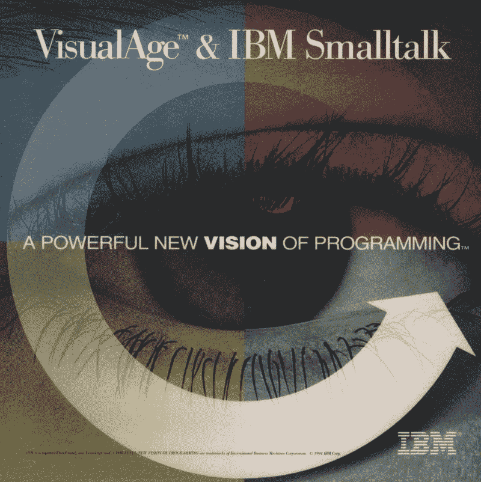

# Smalltalk 的复兴如何像 e 车的复兴？

> 原文：<https://levelup.gitconnected.com/how-is-smalltalks-revival-like-the-e-car-s-revival-128534792a9a>

特斯拉跑车

这不是谜语。我给你答案。

电动汽车的发展和 Smalltalk 的发展有几个有趣的相似之处。先来看电动车。

电动汽车是 19 世纪 30 年代首创的。到 1900 年，它们的受欢迎程度达到顶峰，美国生产的汽车中有三分之一是电动的。

到 1920 年，内燃机的成熟和普及使得电动汽车不再可行。所以电动车逐渐消失了。

然而，到了 20 世纪 60 年代，油价上涨和对污染的担忧促使人们重新审视电动汽车。但是，再过 30 年，丰田普锐斯(Toyota Prius)才能让电动汽车再次成为可能，哪怕只是以混合动力车的形式。

真正的电动汽车的重大突破出现在 2006 年埃隆·马斯克的特斯拉跑车。每个人都想要一个。

今天，特斯拉仍然是每个人都想要的电动汽车。

现在，让我们看看 Smalltalk。Smalltalk 是 20 世纪 70 年代首创的。(第一个官方语言版本是 1980 年的 Smalltalk-80。)

Smalltalk 在 20 世纪 90 年代早期达到了受欢迎的顶峰，当时[它成为了世界上第二流行的面向对象语言](http://jeffsutherland.org/news0196.html) (C++是第一)。甚至 IBM 也选择它作为其 VisualAge 企业计划的核心。

到 1995 年，这种情况开始改变。太阳微系统公司的 Java 语言突然出现，吸走了房间里所有的氧气。Smalltalk 是受害者之一。

然而，到 2007 年，一种被称为 Pharo 的 Smalltalk 的现代变体诞生了。它来得正是时候，因为这个世界正遭受着程序员生产率低下和软件应用程序积压的困扰。这个世界还饱受过多过于复杂的编程语言的困扰，比如 C++、Java、C#、D、Groovy 和 Scala。后来，JavaScript、Kotlin、Rust、Swift 和 TypeScript 也加入了这个团队。

人们吵着要新鲜空气。他们想要更简单的语言。这是 Python 复兴的一个原因(尽管称 Python 为“简单”语言是相当可疑的)。

这也是 Golang 起飞的原因，也是 Dart，Elixir，Lua 和 Nim 受人喜爱的原因。

今天，Pharo 是一种非常令人兴奋的语言。过去十年，它一直在突飞猛进地创新。最引人注目的发展之一是[迷人的工具包](https://gtoolkit.com/)。

但是 Smalltalk 是一个语言家族，所以我们也应该为其他优秀的 Smalltalk 风格欢呼，例如 GemTalk Systems 的 GemStone/S、Instantiations 的 VA Smalltalk 和 Cincom 的 VisualWorks。不可忽视的是 Amber (transpiles to JS)、Cuis Smalltalk、Dolphin Smalltalk(针对 Windows 优化)、GNU Smalltalk(针对命令行爱好者)、Hoot Smalltalk (JVM 支持)和 Squeak。

Pharo 也非常通用，这在本文中有很好的解释，“Smalltalk:它不是你祖父辈的编程语言”

最后，让我指出另一个有趣的相似之处。在电动车的早期，技术障碍限制了它的普及。电动车的行驶里程非常有限。他们无法与低成本的天然气竞争。他们马力有限。

在 Smalltalk 的早期，它需要昂贵的硬件来运行(处理器和内存)。它需要高分辨率的图形显示。它无法与 C/C++和 FORTRAN 以及 BASIC 和 Pascal 竞争。

如今，两者都在经历复兴。电动车比以往任何时候都更经济。Smalltalk 可以在像 Raspberry Pi 这样小的设备上运行，并且运行良好！

电动汽车的缩影是特斯拉。这是世界上最令人向往的电动汽车。

Pharo/Smalltalk 是生产率和易用性编程语言的缩影。这也是令人向往的。有没有活着的程序员不想用一半的时间快速轻松地编写他们的应用程序？我不知道你怎么想，但是我不想工作得太辛苦。