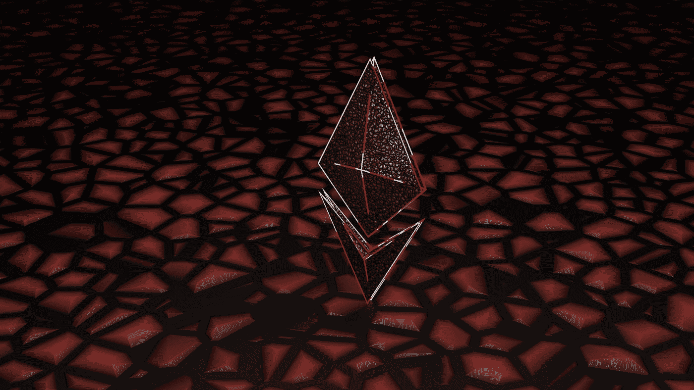
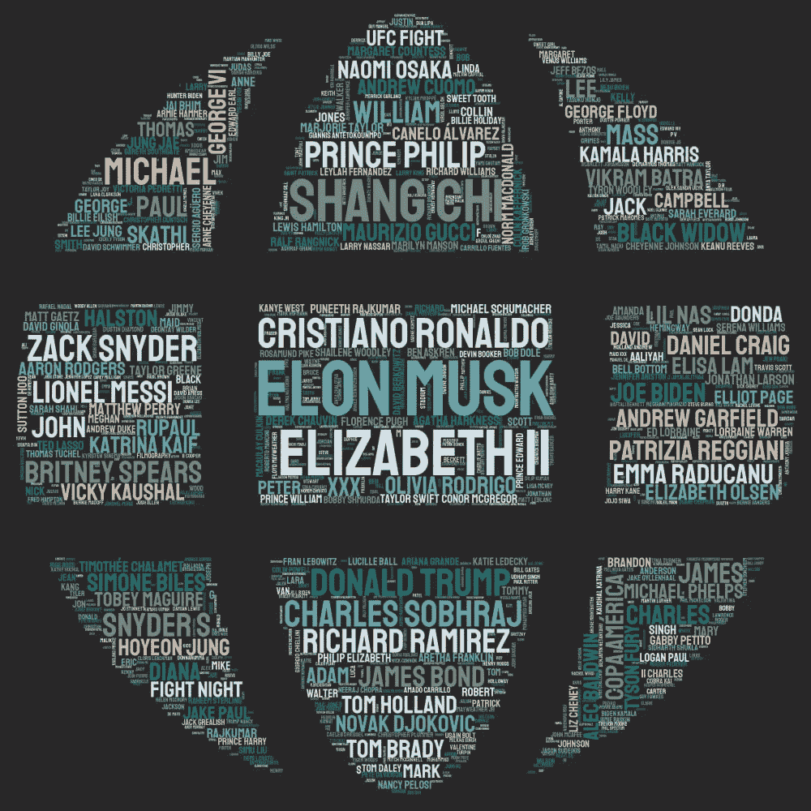

# 我是如何在不到两个小时的时间里创造出我的前两个 NFT 的

> 原文：<https://levelup.gitconnected.com/how-ive-created-my-first-two-nft-s-in-under-2-hours-e498747f50a0>

一个关于圣诞假期美好时光的故事

由 [Unsplash](https://unsplash.com?utm_source=medium&utm_medium=referral) 上的 [Shubham Dhage](https://unsplash.com/@theshubhamdhage?utm_source=medium&utm_medium=referral) 拍摄的照片

即使你对互联网趋势的了解非常有限，你也可能知道 NFT 这个术语。它已经存在了几年，在艺术家、It 爱好者以及在正确的时间和正确的地点出现的幸运儿中，它带来了许多成功的故事。这让我想知道我是否可以加入炒作…

年末提供了许多创造的机会。试图将一年总结成一个小的但有意义的数据部分是人类的天性。毕竟，我们中的许多人在为来年制定计划之前，会在社交网络上分享他们去年的成就。这个总结在更大的范围内会是什么样子？比方说，为整个人类而不是一个人？

我的想法是使用评论最多的维基标题，创建一个单词云 NLP 中常见的可视化。

首先，我必须下载准确的标题。当抓取一些东西时，使用 API 总是更可取的，Wiki 实际上提供了一个 API。数据可以通过 https://www.wikimedia.org/api/rest_v1[和](https://www.wikimedia.org/api/rest_v1)进行一些操作。因为我试图快速移动，我愿意重用一些现有的代码，这里是一个不错的中型职位找到[。](https://towardsdatascience.com/scraping-wikipedia-page-views-to-make-a-2020-rewind-c9bcac97fa38)

在采用了这些代码之后，我每天能够获得 25 个被浏览次数最多的维基标题:

不是艺术家不应该成为提供一些创造力的借口。带着这个想法，我开始寻找更好的解决方案，而不仅仅是常规的方形单词云来可视化我的维基足迹。那时我发现了 stylecloud。它允许你生成不同形状的单词云，在颜色、字体、背景、渐变等方面非常灵活。

也挺好用的。例如，在我解析出我的所有书名之后，下面是我如何通过一次调用模块的函数就可以用它们创建一个云:

由于执行了上面的代码，我得到了这样一张图片:

我的第一个 NFT

作为一家商店，我决定[rarible.com](https://rarible.com/),因为它能让你与买家分担油费。作为一个不是很有野心的创造者，我决定用我的低投资来试水是更明智的。最终，这个短暂的圣诞节前项目的目标是学习，而不是赚钱。

附注:如果你想知道，这里的[就是由此产生的 NFT](https://rarible.com/token/0xc9154424B823b10579895cCBE442d41b9Abd96Ed:108035247576829780858629715261941502478635400875852721100676423621350510297089?tab=bids) 。等待它的买主；)