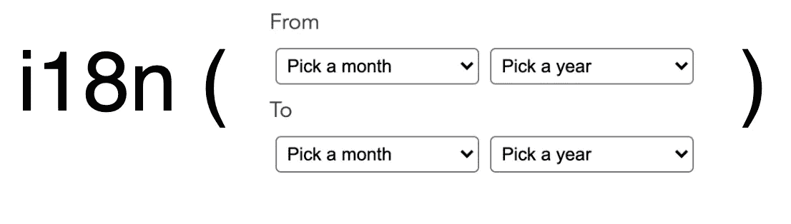
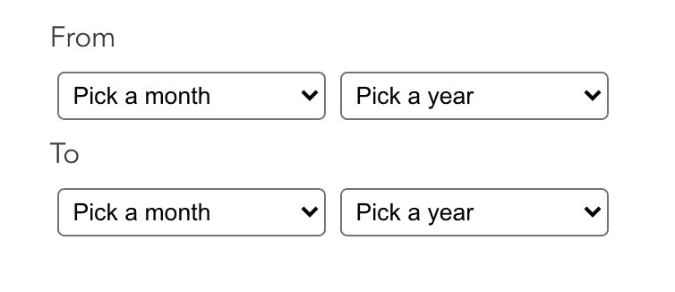
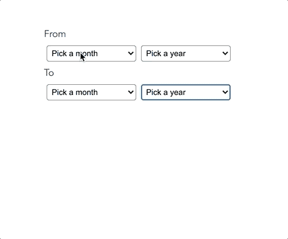
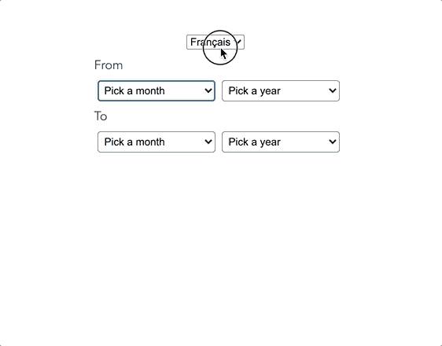

# 我如何轻松地创建了一个日期范围选择器

> 原文：<https://levelup.gitconnected.com/how-ive-easily-created-an-i18ned-dates-range-picker-28d0904208ee>

## VUE

## 利用 moment.js 的力量将 i18n 带到您的任何日期组件中

本周，我被要求创建一个日期范围选择器来过滤项目列表。嗯，这似乎很容易吧！？但是，由于应用程序是国际化的(i18n)，我不得不处理几种语言。这意味着月份必须根据当前的语言而改变。

> 对于这篇文章，我将使用 Vue 作为 JS 框架，但它是否是 Angular、React 或 Vue 并不重要。

Olga Khabarova 在 [Unsplash](https://unsplash.com?utm_source=medium&utm_medium=referral) 上拍摄的照片

# 创建 DateRangePicker 组件

首先，我们可以在不填充任何数据的情况下创建组件。

这里没什么复杂的。我使用 [Flexbox](https://css-tricks.com/snippets/css/a-guide-to-flexbox/) 进行布局。如果你想知道更多关于 CSS 的信息，我可以让你浏览回购(下面的链接)。

# 填充选择

现在就来介绍一下 [Moment.js](https://momentjs.com/) 在 app 中的应用吧！这个令人难以置信的库提供了许多关于数据的特性。我让您深入研究非常完整的文档。

## 几个月

为了填充月份，我将使用返回月份列表的`moment.months()`方法。然后，我可以通过调用一个`computed`属性在模板中使用这些月份:

## 那些年

我只是将它们模拟成一个`computed`，但是我们可以使用一个`prop`从条目中检索它们，以确保我们只获得条目的日期属性中包含的年份。

综上所述，我们得到:

# 涉及 i18n

根据您使用的框架，您有各种解决方案来处理国际化(或 i18n)。

`**Angular**` [棱角分明的 i18n 文档](https://angular.io/guide/i18n)

`**React**`**[react-i18 下一个](https://react.i18next.com/)**

**`**Vue**` [vue-i18n](https://kazupon.github.io/vue-i18n/)**

**事实上，这并不重要，因为我们将使用 [i18n 力矩功能](https://momentjs.com/docs/#/i18n/)。其实我们可以用`[localeData](https://momentjs.com/docs/#/i18n/locale-data/)`的方法。**

**最后，我们得到:**

****

# **更进一步**

**这太简单了…它避免了每个月添加国际化密钥，因此节省了大量时间。如前所述，我们可以添加一些额外的行为，例如:**

*   **从项目列表中检索年份**
*   **检查从和*到*的*日期属性，确保它们是正确的(用`moment.diff`方法)***
*   **当日期不正确时添加警告消息**

**你可以在我的 GitHub 上找到所有的源代码:**

** [## AvocadoVenom/日期范围-i18n-选取器

### 管理 i18n 的日期范围选择器。为 AvocadoVenom/date-range-i18n-picker 开发做出贡献，创建一个…

github.com](https://github.com/AvocadoVenom/date-range-i18n-picker)**