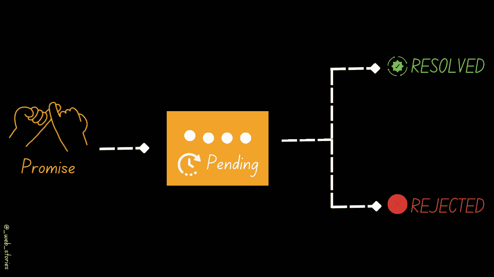
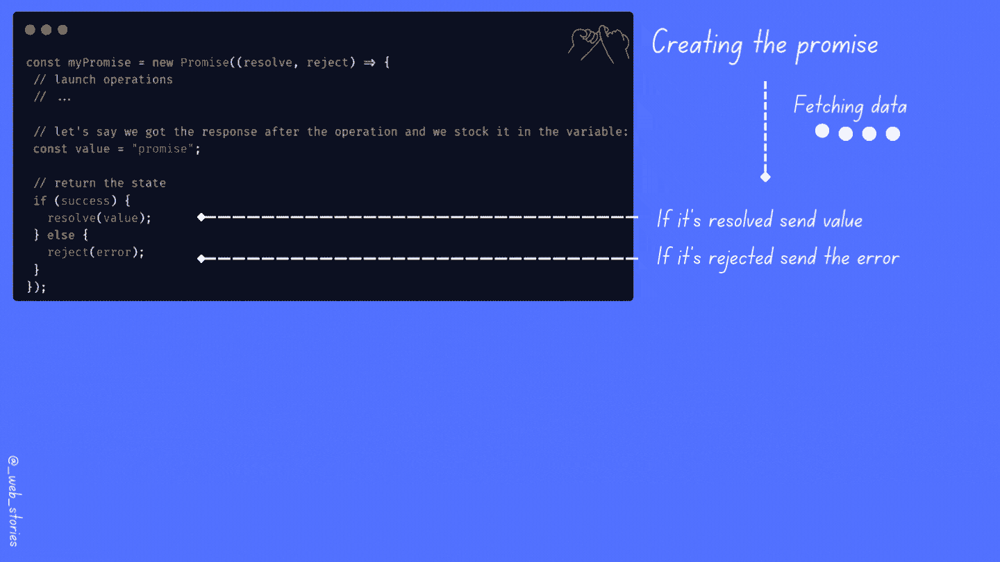

# JavaScript 如何向您承诺！

> 原文：<https://levelup.gitconnected.com/how-javascript-promises-you-e0039fe341ba>

## JavaScript 中的承诺

作者:FAM

## 你好👋

这篇文章是 [2022 网络计划](https://javascript.plainenglish.io/my-web-articles-roadmap-for-2022-20387cab9b07)中 JS 章节所有文章中最重要的一篇。**和 promise 是你需要掌握的关键词，因为你会在任何地方、任何应用和项目中用到它们。**

**所以，我们去拿吧！**

# **承诺**

> **我保证会回答你的！**

**JavaScript 中的承诺用于异步动作。女巫的意思是 ***没有马上完成。*** 给你回复还需要时间。**

## **1-何时使用承诺？**

**每当你有一个**异步操作**(比如你需要时间从服务器获取结果，操作是不同步的)。**

**`***Promise***`对于异步操作来说是一个很好的解决方案。因为承诺是一个**对象**,它可以封装结果并告诉您何时准备好，以便您可以将它传递给需要结果的其他操作。**

****

**承诺状态**

> **就像人类一样，我们给了一个承诺但我们不确定，我们会履行它。**

**当您调用 promise 时，它会启动异步操作。等到结果出来。例如，结果可以是从服务器返回的数据(成功=承诺解决)，也可以是从服务器返回的错误(失败=承诺拒绝)。**

## **promise 语法**

**promise 语法直观且对人友好😜**

*   **如何创造承诺:**

**`resolve`和`reject`是回调。要了解更多关于回访的信息:**

** [## 稍后用 JavaScript 给我回电！

### 理解 JS 中的回调

famzil.medium.com](https://famzil.medium.com/call-me-back-later-in-javascript-9cdb74aafca3) 

*   如何使用承诺:

*   说明

作者:FAM** 

# **💻例子**

****用例:**我们想要获取产品，并且只获取库存中可用的产品。**

*   ****例 1****

**在下面的例子中，我将使用`***setTimout()***`事件，以便模拟服务器调用和响应的延迟。**

**在现实生活任务中，您不使用`***setTimout()***`来获得请求的响应，您有其他方法，例如`***fetch***` API:**

*   ****例 2:****

**我们想要获取产品，并且只获取库存中可用的产品。**

**在这个例子中，我们使用的是`fetch` API，这已经是一个承诺，所以我们可以调用`then`函数。如果我们从后端得到了产品，承诺就解决了，我们得到了我们的产品。如果不是，那么拒绝承诺并给出错误。**

# **💡承诺有什么好！**

**一个承诺总是回报另一个承诺。这样就可以连锁`***.then()***`功能。当您需要将一个异步操作的结果用于另一个异步操作时，这非常有用，依此类推:**

**今天就到这里，看阿雅🙋**

**如果您有任何问题或反馈，请点击评论或通过 LinkedIn 联系我— **我洗耳恭听！****

**[**想请我喝杯咖啡吗？☕️**](https://www.buymeacoffee.com/fatimaamzil)**

> **让我们为 2022 年打造一个更好的‘我们’！**

## **了解有关 2022 年网络快车计划的更多信息:**

**I- [通用网络知识](https://medium.com/geekculture/2022-web-program-chapter-n-1-is-done-499fb0707220?source=your_stories_page----------------------------------------)**

**[II-网页框架:HTML](https://famzil.medium.com/your-html-essentials-69d9b2349355?source=your_stories_page----------------------------------------)**

**[三-网页样式:CSS](https://medium.com/geekculture/recap-of-the-css-chapter-ae388d51e564?source=your_stories_page----------------------------------------)**

## **IV- Web 交互:JavaScript**

*   **[异步代码](https://javascript.plainenglish.io/can-the-web-live-without-asynchronous-code-7f61fe2e862e?source=your_stories_page----------------------------------------)**
*   **[这个](https://medium.com/geekculture/this-for-developers-5dc91d499677?source=your_stories_page----------------------------------------)**
*   **[变量](https://medium.com/codex/js-variables-what-you-need-to-know-fb8994ed9d0d?source=your_stories_page-------------------------------------)**
*   **[范围&吊装](https://javascript.plainenglish.io/js-mechanism-you-should-know-12431e094103?source=your_stories_page-------------------------------------)**
*   **[操作员](https://javascript.plainenglish.io/js-operators-3511c8545719?source=your_stories_page-------------------------------------)**
*   **[关闭](https://famzil.medium.com/js-closures-99666fe36a6a?source=your_stories_page-------------------------------------)**
*   **[高阶函数](https://famzil.medium.com/whats-hof-in-javascript-9fb68a9c3f6f?source=your_stories_page-------------------------------------)**
*   **[对象&方法](https://famzil.medium.com/objects-in-javascript-64fa3e82765f?source=your_stories_page-------------------------------------)**
*   **[阵列，设置&地图](https://javascript.plainenglish.io/data-structures-in-js-9a13f7aa82b3?source=your_stories_page-------------------------------------)**
*   **[功能&箭头功能](https://famzil.medium.com/arrow-functions-in-js-235b5ade3958?source=your_stories_page-------------------------------------)**
*   **[超时&间隔](https://famzil.medium.com/timing-events-in-javascript-d44c24ed8641?source=your_stories_page-------------------------------------)**
*   **[破坏&蔓延](https://famzil.medium.com/destructuring-spread-syntax-in-js-d9260a725c99)**
*   **[回调](https://famzil.medium.com/call-me-back-later-in-javascript-9cdb74aafca3?source=your_stories_page-------------------------------------)**

> ****承诺****

*   **异步，等待**
*   **模块**
*   **班级**
*   **ES6+语法**

** [## 2022 网络计划启动！

### 改变来自心态和习惯

medium.com](https://medium.com/geekculture/2022-web-program-is-launched-f38a3280af1a) 

与想成为 web 开发人员的人分享该程序！这将有助于保持进步，并在旅途中互相帮助。

> 如果你喜欢我的文章， [**订阅**](https://famzil.medium.com/subscribe) 获取我的最新。如果你自己喜欢体验媒介，可以考虑通过[**注册会员**](https://famzil.medium.com/membership) 来支持我和其他成千上万的作家。它只需要每月 5 美元，它支持我们，作家，你也有机会用你的作品赚钱。当然，你可以随时取消会员资格。通过注册[这个链接](https://famzil.medium.com/membership)，你将直接用你的一部分费用来支持我，它不会花费你更多。如果你这样做了，万分感谢！

让我们在 [**上**取得联系****](https://medium.com/@famzil/)**[**Linkedin**](https://www.linkedin.com/in/fatima-amzil-9031ba95/)**[**脸书**](https://www.facebook.com/The-Front-End-World)**[**insta gram**](https://www.instagram.com/the_frontend_world/)**[**YouTube**](https://www.youtube.com/channel/UCaxr-f9r6P1u7Y7SKFHi12g)**或**********

****** [## 通过我的推荐链接——FAM 加入 Medium

### 作为一个媒体会员，你的会员费的一部分会给你阅读的作家，你可以完全接触到每一个故事…

famzil.medium.com](https://famzil.medium.com/membership)********