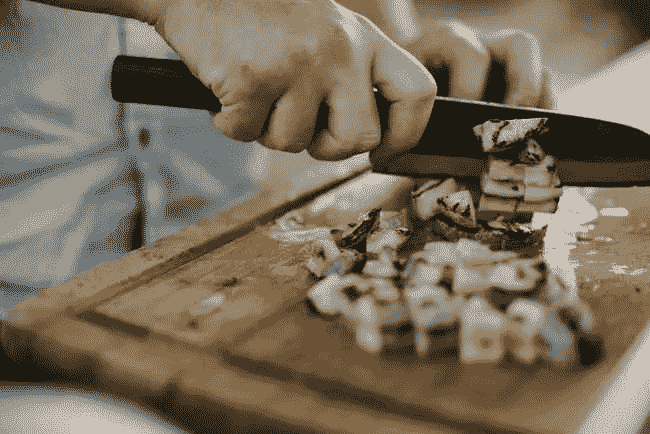
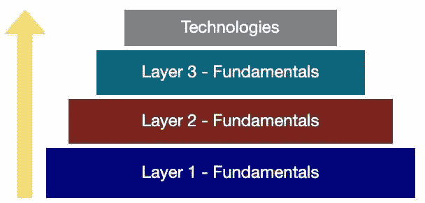

# 茱莉亚·切尔德如何掌握法式烹饪以及这对编程意味着什么

> 原文：<https://levelup.gitconnected.com/how-julia-child-mastered-french-cooking-and-what-it-means-for-programming-cb4c576bdc2b>

关于茱莉亚·切尔德的一些事情引起了我的注意。这位美国作家、教师和电视名人因将法国烹饪带到美国而闻名。的确，精通法国菜并拥有如此卓越的烹饪生涯令人印象深刻。

但同样令人印象深刻的是，当她 37 岁注册成为法国蓝带烹饪学校的学生时，她发现了自己的“人生使命”——法式烹饪。换句话说，蔡尔德不是法国烹饪神童。相反，她在晚年学习了法国烹饪的艺术和工艺。带着灵感和好奇，我拿起了她的自传《我在法国的生活》。

我追求的核心是这个问题:鉴于她起步较晚，她是如何学会法式烹饪并最终成为大师的？

我希望这些答案能帮助我成为一名更好的程序员。以下是孩子用来学习法式烹饪的三个策略，以及我们作为程序员如何将它们应用到我们的手艺中。

# 1.用正确的方法去做。

1949 年，她和丈夫保罗住在法国的蓝带学校。在那里，她接受了厨师班加德的指导，他是一个坚持以“正确的方式”做事的人。

孩子发现自己在学习法国烹饪的艺术，而不是记忆食谱。“Bugnard 开始教我们基本原理，”Child 解释道。“[他]用他谨慎的标准训练我们以‘正确的方式’做每件事。他分解了食谱的步骤，使之变得简单。他以一种不动声色的权威做到了这一点，坚持要我们彻底分析质地和味道。”

此外，厨师 Bugnard 强调了“适当技术”的重要性，Child 回忆道，“例如如何正确地‘翻转’蘑菇。”

这一课——关注基本面——非常及时。我们不应该通过学习最新技术来采用“自上而下”的编程方法，而应该以孩子为榜样，采用[的自下而上](https://programmerspyramid.com/approach/)的方法:专注于编程的[基础](https://programmerspyramid.com/)，比如数据结构、算法和计算机内存。

这一基本主题在《蓝带蓝带》之后的《儿童烹饪生涯》中有所体现。例如，当她和几个朋友开办烹饪学校时，他们“专注于法国菜……和古典技术，因为我们觉得，一旦学生掌握了基本工具，他们就可以适应俄罗斯、德国、中国或任何其他美食。”

孩子谈到了为什么基本面很重要的关键点:你会准备得更充分，适应性更强。一旦你有了交易的工具，你就可以在不同的环境中运用和重复运用它们。而在编程这样一个快速变化的领域，能够快速适应是必须具备的技能。

# 2.做有质量的工作。

正如蔡尔德正确指出的那样:“好的结果需要时间和细心。”她补充说，“如果一个人在开始烹饪前没有使用最新鲜的食材或阅读整个食谱，如果一个人匆匆忙忙地烹饪，结果将是劣质的味道和质地。”

简单来说:做有质量的工作，就是慢下来，关注细节，给自己定一个标准。当有人在工作中“花费时间和精力”时，这总是那么明显。

我们都有过这样的经历:销售人员让购物变得轻松甚至愉快。或者一家公司的老板在您最近的货物中附上了一张个性化的手写便条，感谢您的订单。或者作者在一篇“如何做”的文章中包含了一些额外的步骤，以便为读者清楚地提炼出这个过程。这些小动作需要一点时间。他们也表明他们在乎。

同样，你可能读过一个程序，发现这个过程毫不费力:变量名清晰而有意义；每个功能都有特定的用途；无用的代码行被删除；删除了几行“死代码”。这就是应用于编程的“时间和关心”。

好处是双重的:对接收端的人来说更好(通常那个人就是我们未来的自己)。就个人而言，创作出高质量的作品比平庸的作品更令人满意。

有几种简单的方法可以产生更高质量的代码:

*   **使用一张** [**检查表**](https://amymhaddad.com/why-you-need-a-programming-checklist) 。这是质量保证，你的工作是完整和准确的。
*   **写有意义的变量名**。史蒂夫·麦康奈尔(Steve McConnell)的书《代码完成》(Code Complete)提供了这样一个极好的命名建议:“用文字说明变量代表什么。通常该语句本身就是最好的变量名。”
*   **先了解问题，再打代码**。这似乎是显而易见的，但我很惊讶很少有人在打字前花时间思考。
*   **重构**。让你的代码更干净，更容易理解，更有意义。不是因为你必须这么做。而是因为你有能力做得更好。

# 3.从你的错误中学习。

“当然，我犯了很多错误，”蔡尔德反思道。“起初这让我很伤心，但后来我明白了，学会如何改正错误，或者接受错误，是成为一名厨师的重要组成部分。我开始感觉到 *la cuisine bourgeoise* 在我的手中，我的胃里，我的灵魂里。”

这句话强调了为什么从你的错误中学习——并找出如何改正它们——很重要的关键原因:这样做将有助于建立你的直觉。孩子没有使用“直觉”这个词，但是她对“美食在我的手中，我的胃里，我的灵魂里”这种感觉的描述确实暗示了这一点。

意识到自己的错误是这个过程的关键部分。有几种方法可以解决这个问题。

首先，解决一个问题，研究已经解决了相同问题的其他人的代码，并比较这些解决方案。这是将工具添加到您的编程工具箱、提高解决问题的技能以及发现新的(并且经常是)更好的做事方法的一种极好的方式。第二，就你解决的问题或你编写的程序寻求[反馈](https://amymhaddad.com/why-you-will-get-better-faster-with-feedback)。

这两种方法都提供了重要的东西:意识。我清楚地记得当一个程序员告诉我，我应该[写更好的变量名](https://amymhaddad.com/improve-your-code-by-writing-better-variable-names.mdx)。在那之前，我不知道我的变量名需要帮助。反馈让人们意识到了眼前的问题。

然而，意识只是战斗的一半。另一个是用它做一些事情。如果你在某个问题上寻求反馈，那么就应用它。用你收到的反馈更新你的程序，或者找到一种提高某项技能的方法。

当我了解到我糟糕的变量名时，我创建了一个变量名清单，并把它挂在我电脑显示器旁边的墙上。当一件事在你的视线之内时，你很难忘记它。

学会发现自己的错误同样重要。这个想法是你训练你的头脑和眼睛去发现错误；那就修好它们。

在这个特定的上下文中，我不严格地使用“错误”。你的代码也许可以工作，但是也许它可以更有效率或者可以写得更清楚。很多作品都在编辑中。类似地，大部分编码都在重构中:找出写出更好更干净代码的方法。

这也是清单有用的另一个原因。例如，在你认为一个程序“完成”之前，浏览一下你的清单以确保你的工作是准确和完整的。

# 激活它

我可以用一个词来概括孩子的学习过程:积极。她做了她想做得更好的事情:烹饪。

她做了饭。不只是作为一个初学者，而是在她的整个职业生涯中。

她试验了食谱和配料。她寻求他人的反馈和意见，并加以应用。她研究过。她不断地问“为什么”，以便抓住问题的核心。“我想知道为什么事情会发生在炉子上，什么时候发生的，我能做些什么来影响结果。”

结果不言自明:孩子是烹饪偶像。但对我来说，真正突出的是她是如何做到的。“没有人生来就是一个伟大的厨师，”她解释道，“一个人通过实践来学习。”

这些是下次你通过一系列编程教程学习巡航控制时要记住的好词。像孩子一样，我们必须做我们想做得更好的事情。作为程序员，我们需要编程。

*程序员和作家:*[*amymhaddad.com*](https://t.co/7bVIE3mzYN?amp=1)*|*[*programmerspyramid.com*](https://t.co/p9TJMZ7Fs1?amp=1)*|我关于编程、学习和生产力的推文*[*@ amymhaddad*](https://twitter.com/amymhaddad)

*原载于*[【amymhaddad.com】T21](https://amymhaddad.com/mastering-a-field)*。*