# C++程序员学 Java 需要多长时间？

> 原文：<https://levelup.gitconnected.com/how-long-does-it-take-to-learn-java-for-c-programmers-d4655772284f>

马文·迈耶在 [Unsplash](https://unsplash.com/s/photos/study?utm_source=unsplash&utm_medium=referral&utm_content=creditCopyText) 上的照片

在个人不断发展的时代，越来越多的软件工程师选择精通第二甚至第三编程语言，以获得更多的经验和更多的职业机会。如果你是一名 C++开发人员，正在寻找掌握第二种编程语言，将 Java 加入到你的技能云中是有意义的。接下来，我将向您解释 C++程序员学习 Java 需要多长时间，以及您为什么应该学习 Java。

# 提高 Java 技能对你有什么好处？

就像其他技术一样，Java 有得有失。所以，在选择第二种编程语言之前，让我们弄清楚 Java 有什么特别之处，你应该意识到哪些缺点。

# Java 优势:

*   架构和平台独立性。使用 Java 虚拟机(JVM ),您不应该考虑操作系统或处理器的细节，只需编写算法和实现业务逻辑。
*   内存管理。Java 以其集成的内存管理而闻名，它可以防止大多数内存泄漏，并允许在程序停止使用资源后立即释放所有资源。因此，开发人员不必为创建和销毁的每个对象控制内存。
*   安全。JVM 也不允许程序访问超出其权限的内容。因此，如果没有访问权限，任何 Java 程序都不能与其他应用程序通信，也不能读取没有为当前运行的应用程序分配的 ram。
*   企业编程。Java 通常用于构建企业应用程序。虽然这种语言结合了面向对象程序设计、内存管理和架构独立性，但它在希望构建可靠、稳定和可维护的应用程序的大公司中仍然有很高的需求。

# Java 的缺点

*   性能可以更好。C++是一种编译程序语言，所以它的计算机程序将源代码转换成机器语言。Java 缺少编译器，使用 JVM(应该先在电脑上启动)来执行 Java 代码。

C++开发人员学习 Java 还有什么好处？让我们找出答案。

# 更多知识

当你掌握了一种以上的编程语言时，你就能更灵活地创建复杂的应用程序。根据项目目标和您对最终结果的期望(效率、性能和可用性)，您可以找出哪种语言更适合，哪种语言将解决给定的问题。

# 更大的前景

掌握两种或两种以上的编程语言会极大地扩大你的就业机会，让你接触到更多的角色。很多公司都在找[通用程序员](https://www.glassdoor.com/Job/lead-polyglot-developer-jobs-SRCH_KO0,23.htm)，一旦学会用几种语言写代码，就不再局限于只有几个岗位了。

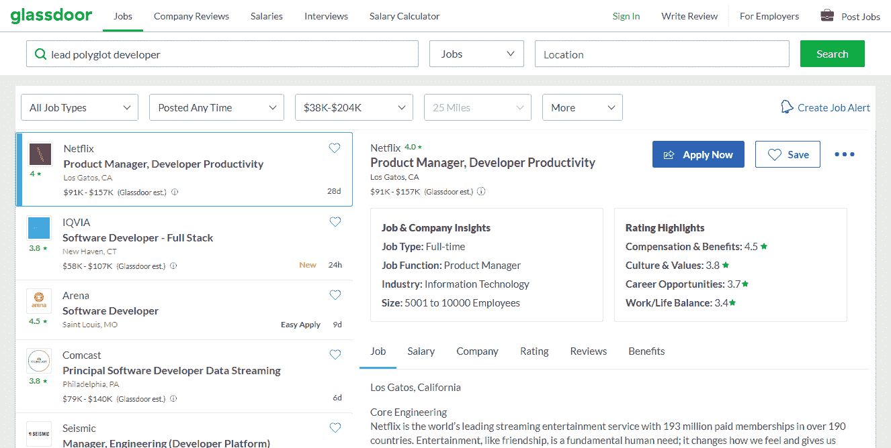

# 更高的收入

你知道的语言越多，你就越有可能成功。根据 ZipRecruiter 的数据，美国通晓多种语言的员工的平均年薪已经达到 12 万美元/年。而英国的 ITJobsWatch 报告的多语言开发人员的平均年薪为 85，000 英镑。

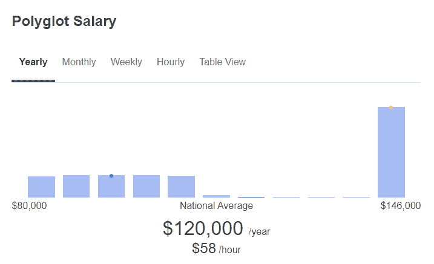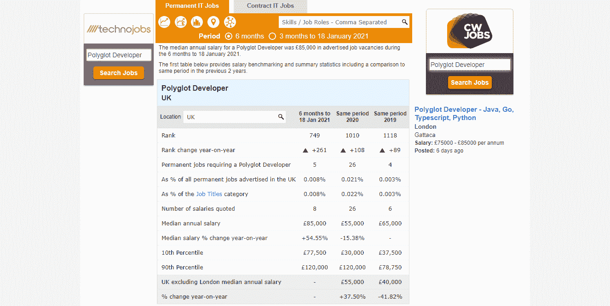

除此之外，软件开发不会一成不变——它在不断发展，一些技术变得比其他技术更受欢迎，许多新技术出现了。因此，了解多种编程语言可以让你掌握脉搏，快速适应不断变化的发展趋势，并在公司中步步高升。

此外，掌握几种语言可以让你有机会领导一个研究不同技术的专家团队，比只懂一种语言的程序员带来更多的价值。

# 留出多少时间学习 Java？

在已经掌握和磨练了 C++语言的情况下，你很快就能掌握 Java。当然，会有一些您不习惯的东西，比如垃圾收集(在 C++中，您必须手动管理内存分配)。缺少指针更有可能限制你，而 Java 层次结构的一致性、OOP 的干净实现和多线程将对你有利。

当您已经精通 C++并计划学习 Java 时，您可以熟悉这两种语言之间的基本差异，然后开始在两种最流行的 Java IDEs 之一上进行实践:IntelliJ IDEA 和 Eclipse。

那么，C++程序员学习 Java 需要多长时间？一些专家说这需要几周的时间。但是我会留出不少于 6 到 8 周的时间来掌握 Java 的概念。

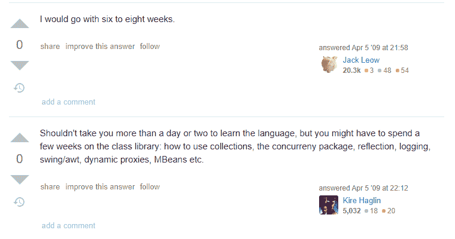

# 学习 Java 的资源

然而，如果你参加为提供实践经验而创建的互动在线课程，学习过程可能会更快、更有吸引力。接下来，你会发现我最喜欢的 Java 课程列表。

# 在线 Java 实践课程

## CodeGym

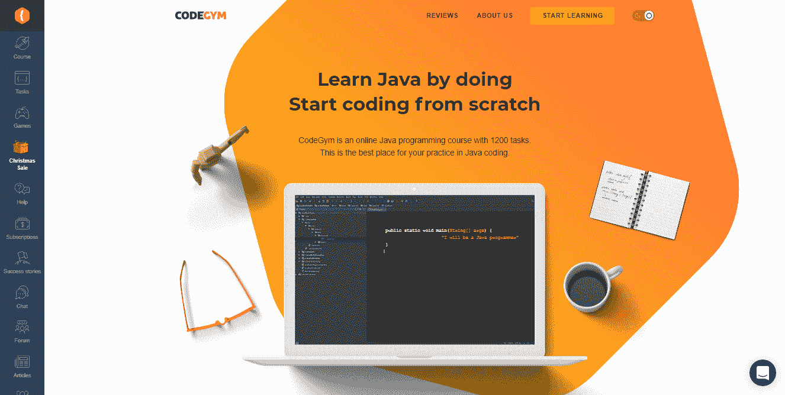

[CodeGym](https://codegym.cc) 是一门单语言编程课程，有超过 1200 个实际任务，你需要完成这些任务来掌握 Java 基础知识。通过任务后，您可以将您的解决方案提交给虚拟导师，并获得对您代码的反馈。此外，该平台以其游戏部分而闻名，允许你通过构建自己版本的经典视频游戏来提高你的技能。CodeGym 有一个友好的社区，这对初学者来说是一个很好的奖励。

## 代码战争

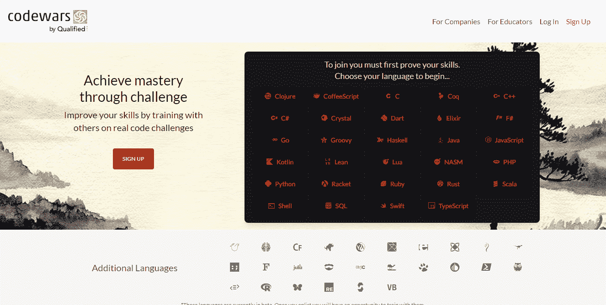

看编程相关的书是好的，但还是不如伴随实践的时候有效。这就是游戏化学习课程可以帮助你的地方。 [Codewars](https://www.codewars.com) 平台就是其中之一。它允许训练对称为形的挑战进行编码。在完成每一个下一个任务后，你获得荣誉和等级。你也可以创造自己的形，让你的同伴接受挑战训练。

## 赛博道场

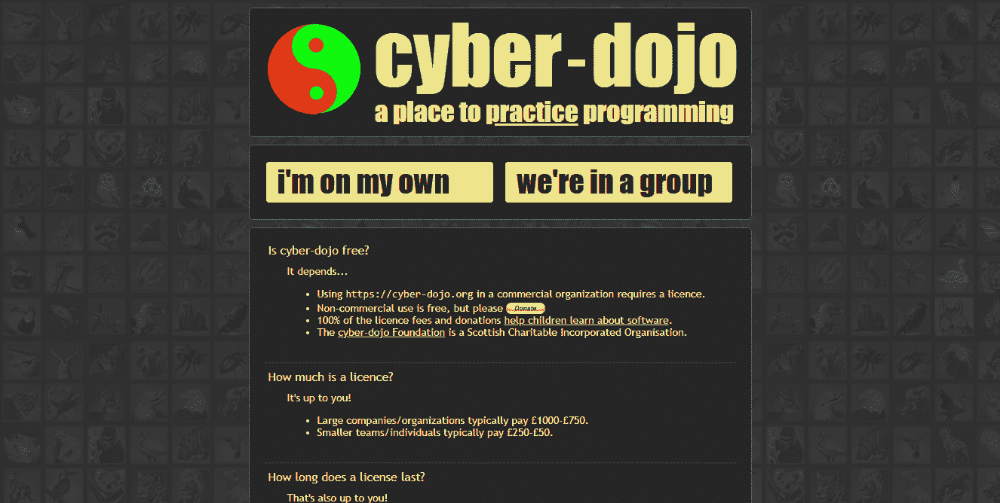

[赛博道场](https://cyber-dojo.org/creator/home)是一个不同的游戏化课程。它不会强迫你通过尽快达到最终等级来结束一场游戏。相反，它会鼓励你按照自己的速度提高技能。你可以选择掌握平台上列出的 30 种编程语言中的一种，单独或小组学习。你必须完成的每项任务都有明确的描述，并有最终结果应该是什么样子的插图。

## 厨师长

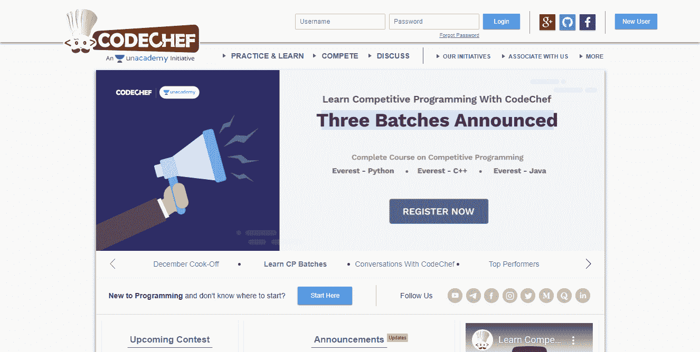

[CodeChef](https://www.codechef.com) 是一个让开发者通过参加编码挑战或竞赛来展示编程技能的地方。对于编程新手，该平台提供了与算法、二分搜索法、数组大小和其他技术主题相关的教程和论坛讨论。

# 视频课程:Java 从零开始

## 完整的 Java Masterclass

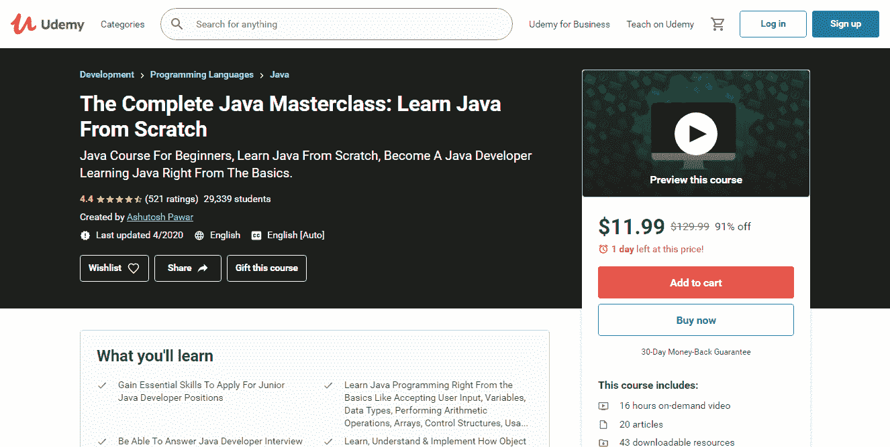

Udemy 是一个受开发者欢迎的学习平台。这门 [Java 课程](https://www.udemy.com/course/java-programming-course/?ranMID=39197&ranEAID=a1LgFw09t88&ranSiteID=a1LgFw09t88-GTQ8_3DV.cd6zFc8Neby9Q&LSNPUBID=a1LgFw09t88&utm_source=aff-campaign&utm_medium=udemyads)允许以前没有经验的学生学习语言基础，并逐步学习更高级的概念。

## 面向完全初学者的 Java 编程

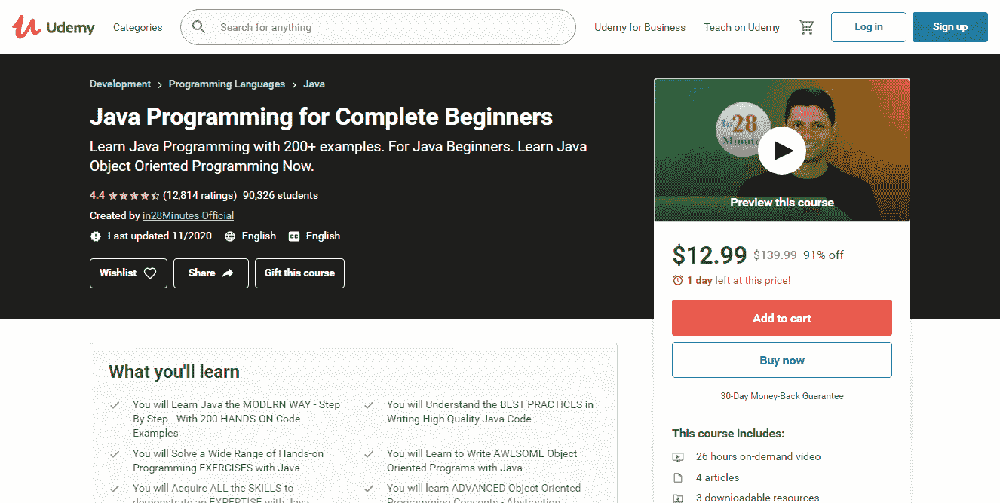

Udemy 的这个 [Java 编程课程](https://www.udemy.com/course/java-programming-tutorial-for-beginners/)确保你将在 250 多一点的步骤中掌握所有的 Java 概念和特性。您将从基础开始，然后学习 Java 中的函数式编程、并发性和异常处理。

## 杜克大学的 Java 认证

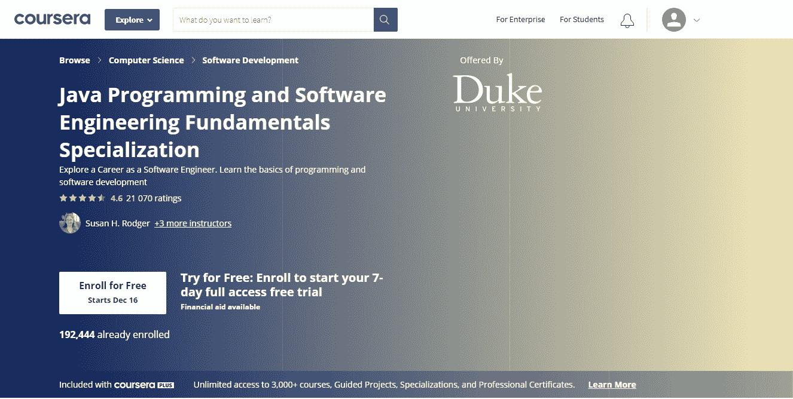

在 Coursera 的这个[课程中，你不仅会掌握 Java 编程，还会了解 JavaScript、HTML 和 CSS 的编程基础。](https://www.coursera.org/specializations/java-programming)

# Java 相关的 YouTube 频道

YouTube 在所有年龄段的人群中不断获得巨大的人气，他们不仅用它来听音乐和看视频剪辑，还用它来学习。所以学习过程跟着社会新趋势的出现而改变，与 Java 编程相关的 YouTube 频道也越来越多。有编程背景的初学者和专家可以在那里找到技巧、课程、视频教程和其他 Java 教育内容。

值得一提的一些频道和 Java 相关的 YouTubers 包括:

*   德里克·巴纳斯是一个广受欢迎的频道，每天都有视频教程，涵盖追随者要求的任何话题。
*   [用 Mosh](https://www.youtube.com/user/programmingwithmosh) YouTube 频道编程对初学者来说是完美的，它的作者设定了一个目标，培训公司愿意雇佣的程序员。
*   [Java](https://www.youtube.com/user/java) 是 Java 社区和 Oracle 的官方 YouTube 频道。
*   如果你想了解程序员会议和研讨会的最新消息，Devoxx 是完美的选择。

# Java 书籍

书籍是学习过程中不可分割的一部分，应该被添加到有益的教育资源列表中。我推荐你开始阅读的几本书包括:

*   对于每个认真学习 Java 的人来说,是一本完美的书。不管你是一个完全的初学者还是有经验的程序员，无论如何，这是一个能让你受益的资源。
*   [第三版的有效 Java](https://www.amazon.de/dp/0134685997?tag=hackr03c-21) 更新了 Java 7、8、9 中添加的新特性。这些新特性包括 lambda 表达式、菱形运算符、可选接口等。
*   [用 Java 思考](https://www.amazon.com/Thinking-Java-4th-Bruce-Eckel/dp/0131872486?language=en_US)是一本书，一旦你得到一个 Java 问题，就应该放在手边。它以其清晰、细致的结构和编程实例得到了全世界程序员的认可。
*   [Java —完整的参考资料](https://www.amazon.de/dp/1260440230?tag=hackr03c-21)这本书涵盖了 Java 语言的所有方面，从基本原理、语法、关键字到更高级的概念。

# 包装东西

即使您可能经常遇到这两种语言之间的许多差异，当您已经有了 C++编码背景时，学习 Java 也不会那么难。所以，今天就去掌握 Java 吧，记住掌握两三种编程语言不仅会让你变得更聪明，还会让你获得更多的工作机会。