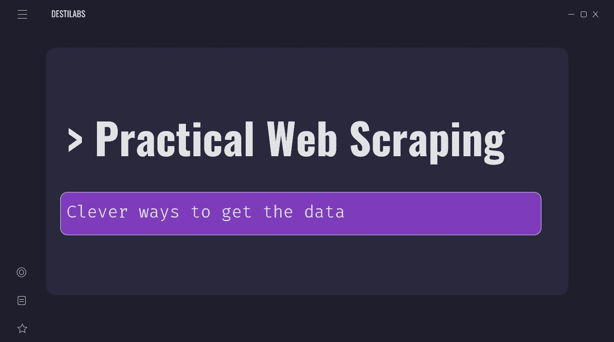
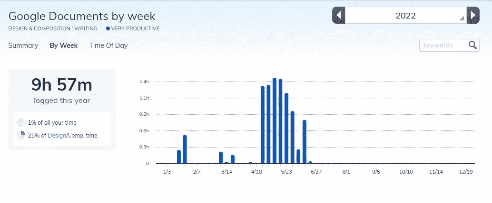
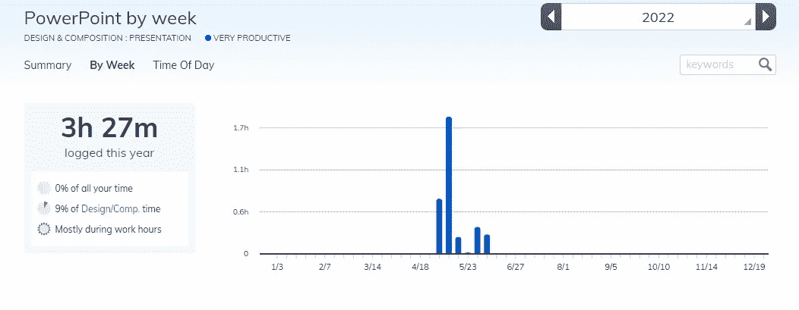
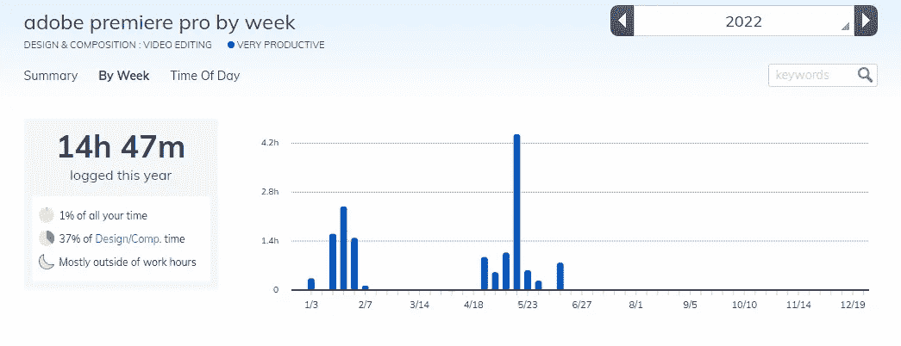
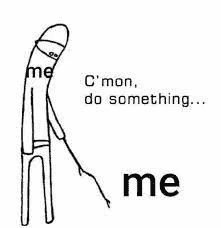

# 做一个 Udemy 课程需要多长时间？

> 原文：<https://levelup.gitconnected.com/how-long-does-it-take-to-make-a-udemy-course-6db85587b7af>

我有一个表白:我是一个时间追踪的瘾君子。

[Unsplash](https://unsplash.com?utm_source=medium&utm_medium=referral) 上 [AltumCode](https://unsplash.com/@altumcode?utm_source=medium&utm_medium=referral) 拍摄的照片

首先，它在这里——明亮而闪亮。如果你想在不到 1 小时的时间内学会网页抓取，那就试试吧。如果你不这样做，我会把你的钱还给你。

[链接到课程](https://www.udemy.com/course/practical-web-scraping-course)

当我决定进行我的第一次 Udemy 课程时，我不知道要花多长时间。事实证明，这并不像你想象的那么简单快捷！在这篇博文中，我将与你分享我创建课程所花费的实际时间。希望这能让你更好地了解，如果你想自己制作课程的话，会有什么收获。

这也是本博客系列的第二部分，我将分享一些开设 Udemy 课程的失败和教训。

# 总体规划

除了是一个追踪时间的瘾君子，我也是一个在整洁的清单上完成事情的笨蛋。例如，我有一个关于理念的[课程开发框架](https://fluffy-poultry-d9f.notion.site/a8635631c1094f39840306f00172bafb?v=01241d0ebe9447338337bae6ca1d6cfc)。我建议你自己做一个或者复制我的，因为检查这些项目会给你非常需要的支持和动力。

作为一名软件开发人员，我知道框架和指南的好处。然而，当他们约束你的时候，他们也剥夺了你过度创新的必要。有几个地方可以发挥你的创造力。考虑到这一点，我开发了一个典型的教程结构和一个演示模板，让我保持在一些风格界限内。这两个技巧都显著提高了我的表现。

课程的入门幻灯片

# 场景创建

在 Google Docs 中创建场景所花费的时间

花费的时间:9 小时 57 分钟

**准备好的教程:** 20

**撰写页数:** 26

你可能在想，我真的需要为我的编程教程视频创建一个场景吗？

答案是肯定的！通过创建一个简短、具体的场景，你可以让你的视频教程有重点、有条理。你将避免不必要的单词重复，“哞哞”的声音和过时的信息。这个场景在委派和估计时间方面也很有帮助，但是我将在关于这个主题的第二篇文章中更多地讨论这个主题。

此外，我已经看到几十个，如果不是几千个，Udemy 学生的评论，抱怨作者对视频毫无准备。即使你在你的领域里是一个无价的专家，含糊不清的语言也会让最感兴趣的学习者失去兴趣。

# 幻灯片

在 PowerPoint 中制作幻灯片花费的时间

花费的时间:3 小时 27 分钟

**幻灯片创建:** 97

虽然大多数课程都是通过视频教授的，但一些教师也选择制作演示文稿，我就是其中之一。演示文稿是与学生互动并提供视频之外的额外信息的好方法，但对于教师来说，它们有助于组织他们的思维并简化视频编辑。相信我。使用幻灯片比移动物体更容易找到“切口”。

首先，确保你的陈述补充了现有的课程材料。不要简单地重复视频中的信息；取而代之的是，专注于呈现新的信息或想法，以帮助学生更好地理解概念。第二，记住你的听众。请记住，学生可能会通过手机学习，所以请使用大而清晰的字体。第三，利用 Udemy 的工具和特性。例如，您可以使用内置的幻灯片功能来添加多媒体内容或直接链接到外部资源。通过利用 Udemy 提供的所有功能，您可以创建一个有助于学生学习和记忆的演示文稿。

# 视频编辑

**耗时:**14 小时 47 分

课程创建中最长也是最具挑战性的部分。我已经通过购买最贵的视频编辑解决方案——Adobe Premiere Pro 解决了动力障碍。我已经购买了整个云，所以它每月收取我 32 美元，并不断提醒我做点什么。

如果你是视频编辑的新手，这个任务可能会让人望而生畏。但是稍加练习，你会惊讶地发现自己学基础知识的速度有多快。一旦你掌握了窍门，你就可以开始尝试更先进的技术。

# 摘要

**总计:** 28 小时 11 分钟

…但可能会多一点。我花时间在 Udemy 上编辑标题，提交课程，增加实践练习，从事促销和谷歌广告活动。顺便说一句，后者完全是一场灾难。

尽管如此，这是值得的。我已经赚到了最初的几块钱，虽然要收回最初的投资还有很长的路要走，但我已经学到了很多新东西，我已经准备好做下一笔投资了。

*如果你对 Udemy 课程创建有任何疑问，请告诉我，别忘了订阅获取本博文系列的第二部分。*