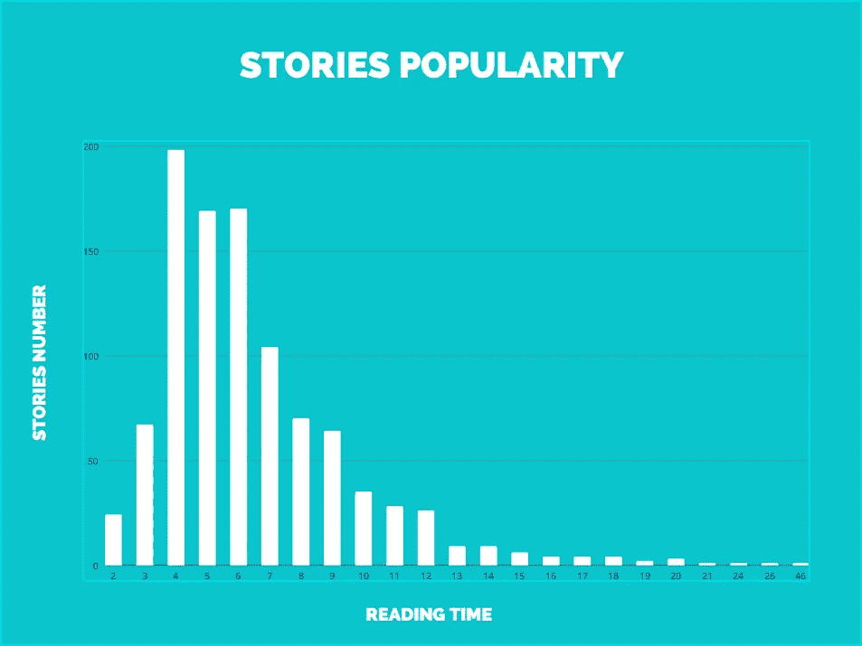

# 你的故事需要多长时间来策划？

> 原文：<https://levelup.gitconnected.com/how-long-should-your-story-be-to-get-curated-aaf09b2ca3fc>

从《编程话题》发表的 **1000** 个故事中推断，**六分半钟**

照片由[克里斯·贾维斯](https://unsplash.com/@crissyjarvis?utm_source=medium&utm_medium=referral)在 [Unsplash](https://unsplash.com?utm_source=medium&utm_medium=referral) 拍摄

然而，这并不是最重要的信息。我抓取的故事大多是 4 分钟长的。我发现有些人告诉你，让你的读者参与**5-7 分钟**是获得策划的最佳机会(或者其他——很可能是——人为的数字)。在编程题目中，更像是**4–6 分钟。**

我想分析一下统计数据。**我对数据分析几乎没有经验**，所以如果我做错了，请原谅。我只是想揭穿一些神话，让这里的所有作家都振作起来。我希望结果会很好。

# 一点分析

假设从[媒体策划指南](https://help.medium.com/hc/en-us/articles/360006362473-Medium-s-Distribution-Standards-What-Writers-and-Publications-Need-to-Know)来看，故事大多是手工策划的。那么，是否意味着工作人员只阅读较短的故事？不一定。人们读这样的故事最多吗？大概——是的。我只是没有足够的数据。从技术上来说，我可以用一些掌声来衡量一个故事的受欢迎程度，不幸的是，我不是会员，我不能通过中等付费墙看到它们。

最受欢迎的故事是大约 5 分钟长的故事。这是否意味着你应该以此为目标？一点也不。我相信这些故事只是最主要的。当你的思想流动时，你不会去数那些单词。从我有限的经验来看， **5 分钟**可能足够抓住一个主题。但并不总是！

编程有很多教程，比这个长一点。这并不意味着它们不那么有价值——恰恰相反。我相信这类故事是经得起未来考验的。从长远来看，作者可以从中获益。这真的取决于你在媒体上的受欢迎程度，你的出版与否，以及许多其他因素。

真正重要的是，即使你的故事长达 46 分钟，它仍然可能被策划。它们并不丰富——是的，但你不会每隔一天就碰到这样的话题。就写吧。但是请记住，归根结底，T2 4 分钟 T3 阅读量如此之大是有原因的。我不能告诉你是什么，但有可能是完美的长度让你的读者保持专注。

# 我如何收集数据

我已经开始检查我是否被允许抓取网站。在[规则](https://policy.medium.com/medium-rules-30e5502c4eb4)中有一个明确的声明，以下是不允许的:

> 执行不成比例的大量交互，尤其是通过自动化手段。这包括大量、不加选择的交互，例如关注其他帐户(关注垃圾邮件)、鼓掌、高亮显示或留下注释

我没有想到这种恶意的行为。我还检查了 [robots.txt](https://medium.com/robots.txt) 文件——仍然可以使用。然后下载了[题目](https://medium.com/topic/programming)源码，用自己用 Python 写的小刮刀离线执行任务，只因为 Medium CSS 及时变化。我需要自己的快照来修补。

这个脚本很简单，我相信没有必要去分析它，因为我并没有把重点放在我的*研究*的编程方面，尽管你可以[查看一下](https://gist.github.com/izdwuut/ab6edbcf1b98903345c1b62730d46a02)如果你愿意的话。

# 谢谢你的时间

这很短——大约 3 分钟。我应该担心我做错了什么，但我非常冷静。我在做我的事——就像你一样！这里的一个漂亮的图表只是为了抓住你的注意力。我想鼓励你把注意力放在最重要的事情上——讲述你的故事。所有这些指导方针——扔掉它们吧——包括这一条。跟随你的直觉，不要害怕尝试。收集你自己的知识，超越你的竞争者。

万事如意！