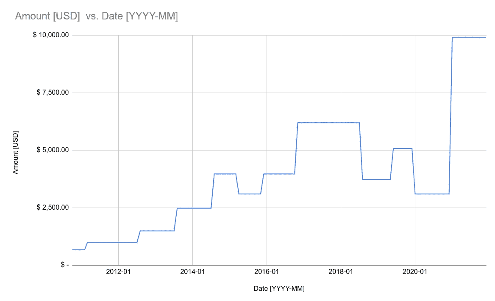

# 你能从中赚多少钱——一个基于我个人经历的故事

> 原文：<https://levelup.gitconnected.com/how-many-figures-you-can-make-in-it-a-story-based-on-my-personal-experience-2c0d8d5fef83>

这个故事不会是 UX/UI 故事(图片由作者提供)。

简短的回答是:

“适可而止。”

长的答案有点复杂。

我知道你们中的一些人已经厌倦了这种新趋势，尤其是当新年开始的时候。*我在 2021 年做这件事赚了七位数，我赚了八位数…* 是的，我打赌你知道(我也知道)。尽管如此，我还是想给你们一些启发，因为你们中的一些人可能会感到困惑，有信任问题，或者通常想了解 IT 行业的工资是如何形成的。

在我开始之前:

*   所有的值都以美元为单位，所以我们可以有一个共同的分母。这里有一个提示**:永远要问一问哪个货币人正在写或谈论**。截至 2022 年 1 月 2 日写这篇文章时，用日元赚八位数相当容易。
*   我想展示一下我过去 11 年的收入，以及它是如何随着时间的推移而变化的。
*   呈现的价值是税前价值。

这些年来我的收入水平发生了变化。

一些评论:

*   大约 12 年前，我开始从事 IT 行业，当时我还是个新手——我唯一的编程经验是我在大学里积累的
*   15 年前，我还是个菜鸟。我 16 岁(或者更小)的时候连代码都不会。
*   这里的收入来自我的*主要*收入来源。我有一种企业家的生活方式，我有很多方面，在一些时间间隔内有多个客户，但这不应该影响整体观点。
*   你可以注意到很多起伏。背后的解释是，我做了一些有意识的决定，降低自己的收入，试图建立一些东西。**老实说，我现在正在考虑这个错误。**
*   最大的变动(不管是上升还是下降)都与工作变动有关——你可以考虑一下。

回答第一个问题:**我现在的收入是六位数——每年大约 12 万美元，其中我需要缴纳 19%的所得税，每年还要缴纳大约 4 万美元的社保。在波兰，税收就是这样运作的。我的独资企业也有一笔小的额外费用，比如会计师或 GSuite。除去税后费用，我现在挣五位数。**

你能在里面做出七位数吗？最低的七位数将是 1 000 000。如果我的数学不错，这意味着每月 83k 美元。有这方面的经验，这么多的钱几乎不可能只靠卖编码之类的服务来赚。最大的问题是有限的时间(**平均每月 720 小时**)和当前的市场价格(**我们程序员在大多数情况下仍然在出售时间**)。据我所知，即使在硅谷，这样的赌注也是最高的(但如果有人有更广泛的洞察力正在阅读这篇文章，请在回复中纠正我，如果我不在这里)。

我查看了关于薪水的页面(实际上是 glass door ), 100 万美元对于一个技术领导者来说甚至是不可能的。这两页都显示一年最多 25 万到 30 万美元。仍然是六位数。

**作为一个程序员，做什么能赚到七位数甚至更多？**

*   让自己转向销售数字产品——你可以制作一些优秀的销售 WordPress 模板(我不是在开玩笑)。
*   您可以出售您正在创建的程序的许可证。
*   如果你停止考虑出售时间会有所帮助。不会发生在你职业生涯的初期，甚至更晚，但我相信你会在某个时间点开始有这样的想法。
*   可以考虑把自己这些年积累的知识卖掉。
*   如果你是一个移动开发者，你可以创建一个应用程序，并在应用商店出售。

总而言之:

*   *标准*编码:五位或六位数字
*   七位数甚至更多:只有当你想明白的时候。
*   记住，美元不是世界上最重要的东西。这是生活的一个层面——应该为了更舒适的生活而建造。
*   人们可以在互联网上写任何东西，如果你有信任问题，你可以联系我并向我索要发票来支持我的主张。

**我希望你会对 insight 感兴趣。如果是这样的话，请毫不犹豫地跟我一起鼓掌。谢谢！**