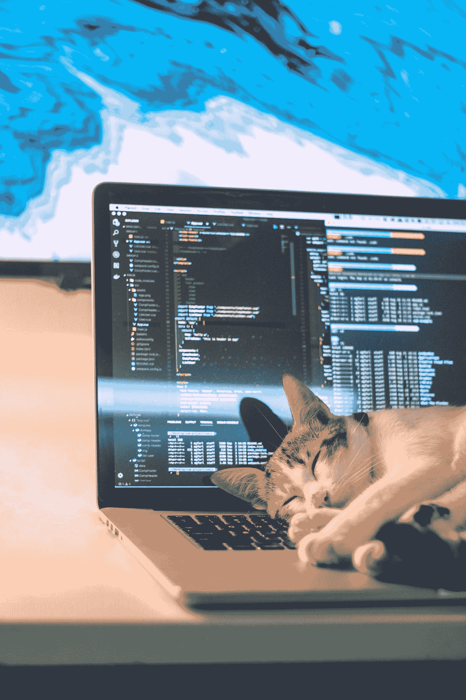

# 你一天应该写多少小时的代码？

> 原文：<https://levelup.gitconnected.com/how-many-hours-should-you-code-a-day-5c5c63d742b9>

在 [Unsplash](https://unsplash.com?utm_source=medium&utm_medium=referral) 上[泰沛](https://unsplash.com/@agforl24?utm_source=medium&utm_medium=referral)拍摄的照片

说到编程，你每天应该花多少时间来编程？这是一个程序员争论多年的问题。一些人认为你应该每天尽可能多的写代码，而另一些人认为为了保持专注和高效，休息是很重要的。在这篇博文中，我们将探讨争论的双方。

## “尽可能多的编码！”

那些认为你应该每天尽可能多花时间编码的人认为，你花在编码上的时间越多，你就会做得越好。他们认为，通过长时间的编码，你将能够内化概念并掌握成为一名成功的程序员所必需的技能。此外，他们认为休息只会打断你的工作流程，让你更难回到编程的心态中。

这种立场的另一个论据是，如果你想尽快提高，你需要投入时间。如果你刚刚开始学习一门新的编程语言，这一点尤其正确。那些认为你应该每天尽可能多的写代码的人认为牺牲空闲时间来写代码对于尽快提高你的技能是必要的。

## “编码是一场马拉松，而不是短跑”

另一方面，那些认为休息很重要的人认为长时间编码实际上会导致精疲力竭。精疲力尽在编程社区中非常普遍，可能是由于长时间工作而没有休息造成的。持这种观点的人认为，为了保持精力充沛和专注，休息是很重要的，编码时间太长会导致厌倦和错误。

此外，他们认为，从长远来看，休息实际上会帮助你更有效率，因为你会以全新的视角回到工作中。这使得开发人员更有效率，更好地利用他们的时间。

照片由[凯特琳·贝克](https://unsplash.com/@kaitlynbaker?utm_source=medium&utm_medium=referral)在 [Unsplash](https://unsplash.com?utm_source=medium&utm_medium=referral) 上拍摄

## 裁决

那么，结论是什么？你每天应该写多少小时的代码？

事实是，这个问题没有对错之分。最终还是要看你自己的喜好和工作风格。有些人可能会发现，当他们长时间编码时，他们会更有效率，而其他人可能更喜欢更频繁地休息。重要的是找到最适合自己的，并坚持下去。

然而，如果你刚刚开始，编码更短的时间可能会有帮助，这样你就可以逐渐增加你的耐力。如果你感到筋疲力尽，休息一会儿或者减少工作时间可能是个好主意。

## 结论

归根结底，真正重要的是一致性。间隔重复是学习任何东西的关键，编码也不例外。所以只要你坚持投入时间，你就会随着时间的推移提高你的技能。如果你能找到适合自己的节奏并坚持下去，你就能成为一名成功的程序员。

记住，最重要的是享受你正在做的事情。所以找到一个适合你的平衡点，并坚持下去！

# 分级编码

感谢您成为我们社区的一员！在你离开之前:

*   👏为故事鼓掌，跟着作者走👉
*   📰查看[级编码出版物](https://levelup.gitconnected.com/?utm_source=pub&utm_medium=post)中的更多内容
*   🔔关注我们:[推特](https://twitter.com/gitconnected) | [LinkedIn](https://www.linkedin.com/company/gitconnected) | [时事通讯](https://newsletter.levelup.dev)

🚀👉 [**加入升级人才集体，找到一份惊艳的工作**](https://jobs.levelup.dev/talent/welcome?referral=true)