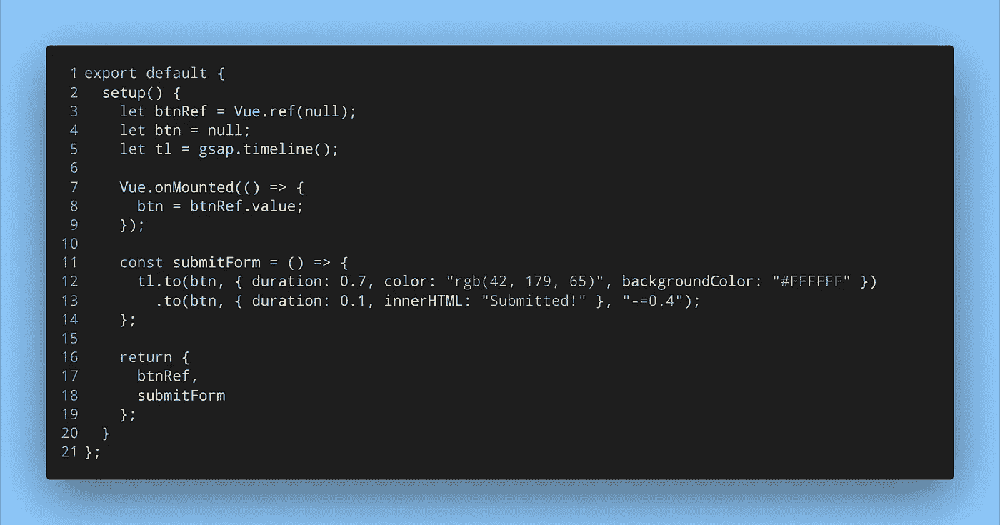

# 动画一个按钮需要多少行？GSAP 让一切变得简单

> 原文：<https://levelup.gitconnected.com/how-many-lines-would-it-take-to-animate-a-button-gsap-makes-it-easy-1fd02df20969>

詹姆斯·哈里逊在 [Unsplash](https://unsplash.com?utm_source=medium&utm_medium=referral) 上拍摄的照片

在本文中，我用 GSAP 实现了一个简单的按钮动画，并使用了 Vue 3.x 中引入的 Composition API，如果你不熟悉 Composition API，可以参考文末链接的资源。

# 什么是 GSAP？

GSAP(green sock Animation Platform)是一个 JavaScript 动画库，允许开发人员用很少的代码行创建强大的动画。有了这个库，您可以更精确地控制动画，从而更容易地创建复杂的动画。GSAP 库体积小，易于使用，并且可以在各种浏览器中进行一致的计算。

# 简单按钮动画

我已经创建了一个简单的表单，并使用 GSAP 在单击提交按钮时运行动画。为此，我使用了来自 Vue 的组合 API 和 ref。动画本身只需要两行代码:

按钮动画代码

这是笔。你也可以做一些很酷的动画:

资源

*   [简单果岭教程](https://ihatetomatoes.net/simple-greensock-tutorial-your-first-steps-with-gsap/)作者[彼得·蒂奇](https://twitter.com/ihatetomatoes)
*   [尼古拉斯·克莱默](https://www.freecodecamp.org/news/the-beginners-guide-to-the-greensock-animation-platform-7dc9fd9eb826/)[撰写的《格林斯托克初级指南](https://www.linkedin.com/in/nicholas-kramer-3574b463/)
*   [如何在网页上制作绿色的动画](https://css-tricks.com/how-to-animate-on-the-web-with-greensock/)作者[莎拉·德拉斯纳](https://twitter.com/sarah_edo)
*   [关于组合 API 的官方 Vue 文档](https://v3.vuejs.org/api/composition-api.html)
*   肖恩·怀尔德穆特编写的