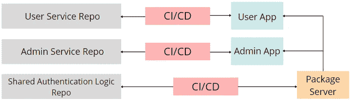
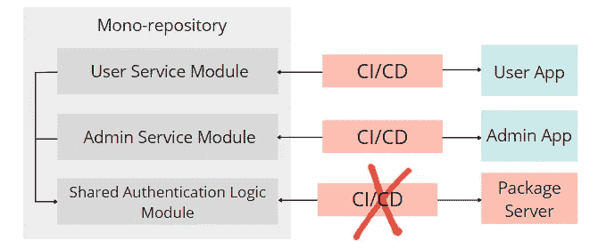
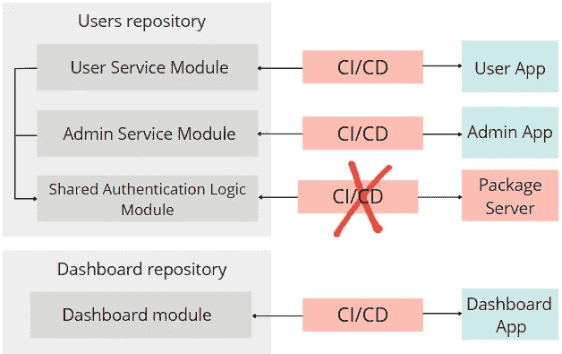

# 一个微服务项目需要多少个存储库？

> 原文：<https://levelup.gitconnected.com/how-many-repositories-do-you-need-for-a-microservices-project-b5c991aa440>

## 在多存储库和单存储库之间找到平衡点。

马库斯·温克勒在 [Unsplash](https://unsplash.com?utm_source=medium&utm_medium=referral) 上的照片

为一个整体项目选择存储库数量的规则通常非常简单——将整个代码库放在一个存储库中，就这样。

然而，随着项目的增长，开发人员可能会决定将整体项目拆分为微服务。选择存储库的数量变得有点困难。开发人员需要回答他们在处理整体项目时从未遇到过的问题:

*我应该把每个微服务放在一个单独的存储库中，还是应该把它们都放在同一个存储库中，但是放在不同的模块/文件夹中？*

在单存储库和多存储库之间进行选择时，有什么规则、指南或最佳实践可以遵循吗？

我希望能帮助你回答这两个问题以及其他一些问题，所以让我们开始吧。

# 多储存库方法

也许微服务项目最明显的策略是将每个微服务和每个共享库放入一个单独的存储库中。然后为每个存储库设置 CI 和 CD 管道，其中每个存储库代表一个部署单元。

应用程序组件的这种分离为我们带来了许多优势:

## 快速 IDE

one 解决方案中的代码库越大，您喜欢的 IDE 需要的计算机资源就越多，这会影响您的性能。

开发人员在 IDE 中执行的最常见操作如下:

*   打开解决方案。
*   构建解决方案。
*   执行自动重构。
*   在类和方法之间导航。

对于小型分解解决方案，所有这些和其他操作的运行速度要比大型整体解决方案快得多。

## 快速 Git

Git 等版本控制系统在处理小型回购时比处理大型回购时运行得更快。

像 git pull、git fetch、git check out、git clone、git status 等命令对于小型存储库来说会更快，使得在一个存储库中进行本地开发更加方便。

## 明确的职责划分

存储库是严格而清晰的边界，将应用程序的整个代码库分隔开来。很容易为每个存储库分配一个负责团队，并跟踪谁负责什么。

其他团队也需要能够使用拉请求对不属于他们的存储库进行更改。这是必要的，因为拥有存储库的团队可能会被工作淹没，所以其他不太忙的团队可以帮助他们做出一些改变。

然而，**只有拥有存储库的团队才被允许批准拉请求**。

另一方面，多存储库方法有几个缺点:

## 复杂的开发生命周期

除非开发人员实现一个跨越多个存储库的特性，否则开发生命周期很简单。

在这种情况下，开发人员需要在多个不同的存储库中进行更改。不同的团队应该花时间在沟通上以就合同达成一致，谁应该首先实现和部署变更等等。

## 代码复制

开发团队可以开始独立地在他们的存储库中实现相同或相似的功能。这种问题通常是由于团队之间沟通不畅或不充分造成的。跟踪不同存储库中的重复代码是很困难的。

代码的重复可以通过将公共逻辑移动到共享库中来解决，共享库的代码放在单独的存储库中。

然而，**管理共享库**有它的缺点:

*   开发人员在更新共享库的公共 API 时必须非常小心，以避免中断更改。
*   发布新版本的库需要在所有使用它的存储库中进行版本更新。
*   从使用共享库代码的服务中调试它是很困难的。

## 难以实施系统一致性

当不同的团队在不同的存储库中工作时，很难保持整个系统处于一致的状态:

*   服务使用不同的框架。
*   服务使用不同版本的库。
*   服务使用不同的设计模式、方法和最佳实践。

当团队之间建立良好的关系时，这个问题通常不会发生。然而，当团队主要实现与其他存储库和团队隔离的特性时，交流就会受到影响。

# 单一知识库方法

在开始讨论单一存储库的优点和缺点之前，消除一个常见的误解很重要:

> 单一存储库并不意味着一个单一的项目。

具有微服务架构的项目可以驻留在单个解决方案的单个存储库中。每个微服务都可以存在于自己的模块中。每个模块可以有自己的单元测试、复合根、CI 和 CD 管道，如果需要，可以独立地构建、部署和扩展。

将所有微服务放在一个解决方案中的一大优势是，它们可以直接引用共享库，因为一切都在一个解决方案中。共享库不再需要拥有自己的 CI/CD 管道，这可以大大简化开发生命周期。

*在。NET 中，模块是一个类库项目。这个很酷的* [*GitHub 库*](https://github.com/kgrzybek/modular-monolith-with-ddd) *描述了如何尽可能模块化地构建你的应用。*

当共享库的公共 API 发生变化时，开发人员要检测到重大变化所要做的就是构建解决方案并检查构建错误。

单一存储库的几个优点:

*   确保在整个项目代码库中使用相同的模式、框架、库版本和代码风格变得很容易。所有团队都会知道对存储库做了什么更改，因为 GitHub 上有一个地方可以跟踪对一个存储库的请求。单一存储库改善团队协作。
*   当开发人员需要修改多个存储库的代码时，开发人员总是需要运行唯一的 IDE 实例来简化开发过程。此外，单个 IDE 实例简化了新开发人员的入职流程。
*   在单个解决方案中跟踪代码重复和其他指标很容易，这提高了应用程序的整体质量。

但是没有什么是免费的，所以单一存储库有它们的缺点:

*   在多存储库方法中，每个存储库都是一个独立的部署单元(每个存储库都有自己的 CI / CD 管道)。然而，对于单一存储库，很容易错误地绕过独立部署的原则，一次部署整个系统。这导致了传统整体应用程序中固有的一个问题:一个小的代码更改需要重新部署整个系统。
*   对于大型的单一解决方案，IDE 和 Git 命令的性能会较慢。
*   当许多团队在同一个存储库中工作时，合并冲突的可能性更高。

# “中庸”方法

到目前为止，我们已经讨论了两种对立的方法:应用程序组件的最大分离和不分离。但是通常两者之间的平衡可能是最好的:一些与**相关的**服务和共享库可以被分组并推到一个存储库中，而其他服务可能仍然在单独的存储库中。

如何理解哪些相关的服务被分组到一个存储库中？以下是一些想法:

*   如果只有少数几个小服务使用一个或几个共享库，那么将它们全部放在同一个存储库中会更容易管理共享依赖关系。
*   如果经常为开发人员实现的几乎每个功能一起修改多个服务，那么将这些服务放在同一个存储库中，甚至将它们作为一个单元一起部署是有意义的。
*   如果服务代码库很大，可以将其转移到单独的存储库中，以提高 IDE 和 Git 的性能。

将相关的服务和共享库放入同一个存储库中，并将它们作为一个整体进行部署，这可以极大地简化开发生命周期，并避免破坏性的更改。

# 摘要

我们讨论了很多，现在是时候以具体提示的形式进行总结了:

*   大型单一存储库最好由每个微服务或一组相关的微服务分割成较小的存储库，以提高 IDE 和 Git 命令的性能。
*   经常一起修改的服务和共享库可以驻留在同一个存储库中，甚至有一个 CI / CD 管道。
*   当一个团队负责位于不同存储库中的多个服务时，它们可以被合并到一个存储库中。
*   当对项目的未来有很大的疑虑时，从单一存储库中的模块化、整体式应用程序开始。以后，如果项目增长，可以很容易地将它分割成单独的存储库。
*   最好坚持团队中有大量初级开发人员的单一存储库方法，因为这种方法很简单。

## 我的其他文章

 [## 开发人员不应该害怕 SQL Server 中的死锁

### 后端开发人员处理死锁的策略。

levelup.gitconnected.com](/developers-shouldnt-be-afraid-of-deadlocks-in-sql-server-8f8f4578675f)  [## 为什么 C#中 List <struct>的分配速度比 List <class>快 15 倍</class></struct>

### 在上一篇文章《免费提高 C#代码性能的 5 种方法》中，在其中一个例子中，我测量了…

levelup.gitconnected.com](/why-is-list-struct-is-15-times-faster-to-allocate-than-list-class-17f5f79889ae)  [## 面向技术领导者和资深人士的 50 个软件工程最佳实践

### 最佳工程师的最佳实践。

levelup.gitconnected.com](/50-software-engineering-best-practices-for-technical-leaders-and-seniors-cfcdf6a17e44)