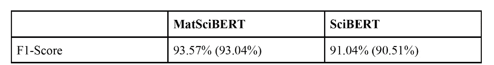
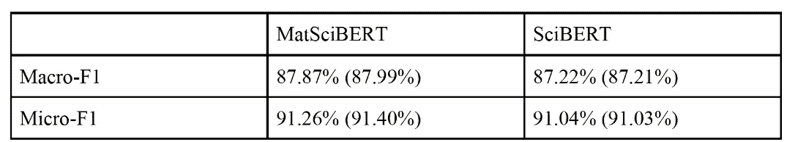
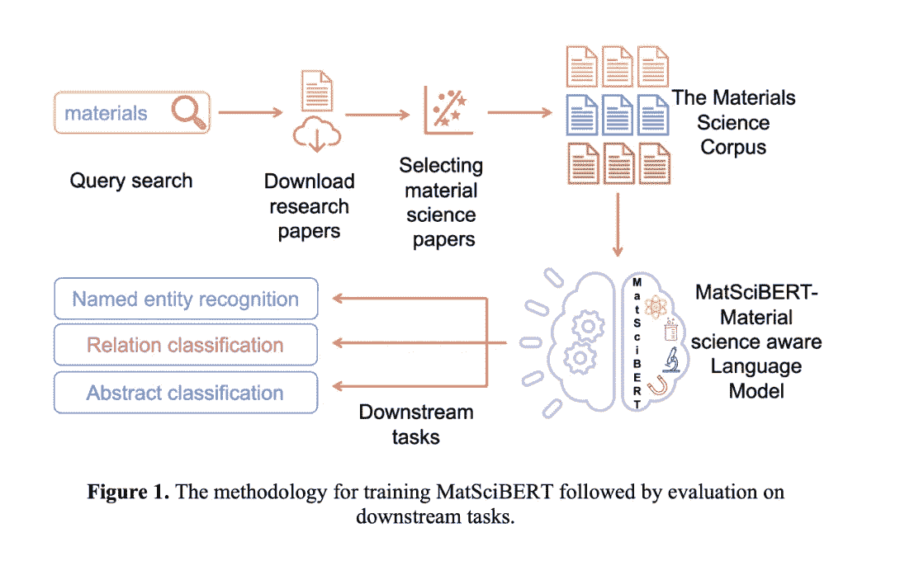

# MatSciBERT 如何优于 SciBERT 和 BERT

> 原文：<https://levelup.gitconnected.com/how-matscibert-is-an-improvement-over-scibert-and-bert-5d39e8c1571b>

我描述 MatSciBERT，将其与 SciBERT 进行比较，并显示与原始 BERT 模型相比的总体结果

你好，我是来自 Unsplash 的 Nik

您可能已经了解了 BERT，并且您已经通过为您的实现管道预先训练它们来优化了它的专门化模型。

如果您将 MatSciBERT 添加到您的 NLP 必须知道的模型列表中，您将有一个良好的开端，尤其是如果您跨科学文献用例工作的话。

我最近写了关于 SciBERT 的文章，这是一个在计算机科学和生物医学领域的大量出版物上训练的 BERT 模型，目的是为科学文本提供有根据的单词表示。

在与 SciBERT 一起工作时，我偶然发现了 MatSciBERT，这是一个“用于文本挖掘和信息提取的材料领域语言模型”[3]。是另一个 BERT 模型[1]；然而，与 SciBERT 不同的是用于优化它的训练源:

> SciBERT 接受过材料研究论文的培训，包括“合金、玻璃、金属玻璃、水泥和混凝土[3]”。此外，论文是从 ScienceDirect 和 Elsevier API [3]中检索的。

来自 Unsplash 的 Studbee

# **它的根基**

有人认为 MatSciBERT 已经展示了经验性能，揭示了它如何在所有三个下游任务上优于 SciBERT [1]:抽象分类、命名实体识别和关系提取[1]。

比较 MatSciBERT 和 SciBERT 的 F1 分数、宏观 F1 分数和微观 F1 分数显示 MatSciBERT 明显优于 SciBERT。例如，请参见下面的两个表格。

来自[1]。

研究表明，这与玻璃和非玻璃数据集的测试集结果有关，“平均超过 3 个种子”[1]。

**亦作:**

来自[1]。

该研究阐明了材料合成程序数据集[1]“3 粒种子的平均值”[1]的测试集结果。

# MatSciBERT 的机会

BERT 是一系列 NLP 应用程序实现管道的基础；因此，专门的工作领域将受益于专门为其应用而构建的 NLP 构造。

在涵盖 MatSciBERT [1]的研究论文中，我们做了大量工作来揭示镁和铝合金在航空航天和汽车中的日常应用机会，钛合金在生物相容性植入物中的应用机会，或者玻璃在光学和通信设备中的应用机会。

需要付出很大的努力，才能综合已发表的关于这些特性(现有元素)的理论和应用的大量研究；因此，MatSciBERT 创始人的目的是加速知识的提取、分析和基于数据的传播。

如果他们(MatSciBERT 创始人)有可能应用机器学习或自然语言处理的最佳实践，从开放的自由文本中快速提取和解析出特定的见解，如果他们也能在可管理和可接受的最大程度上从程序上自动化这种分析，就有可能实现更快的理解(告知这些属性的操作方法)。

# **方法论**

下图展示了 MatSciBERT 的基础架构，揭示了其方法论。

来自[1]

用于训练该模型的数据集包括与材料领域相关的文本，这是 SciBERT 所缺乏的，SciBERT 在以下方面被训练到 100%:(1)82%覆盖生物医学领域，12%覆盖计算机科学领域。

为了训练每一类材料的 SciBERT 语言模型，研究人员首先从 Elsevier Science Direct 数据库中下载了超过一百万篇研究论文[1]。这些论文中的 500 篇然后被人工注释以确定它们与感兴趣领域的相关性。然后，SciBERT 分类器对这些带标签的摘要进行微调，以便从下载的 100 万篇文章中识别相关论文。从每一类材料中选出的论文被用来训练 SciBERT。此外，材料科学语料库(MSC)随后被分为训练集和验证集，其中 85%用于训练语言模型，其余 15%用于观察它们在未知文本上的表现[1]。

由来自 Unsplash 的[张志勇](https://unsplash.com/@danielkcheung)

# **实现**

考虑以下应用:文档分类、图像信息提取和关系分类[1]。MatSciBERT 可以用于从单词中提取上下文含义，从而使主题分类更加准确。此外，MatSciBERT 可以从图片标题中提取实体，并为特定查询识别相关图像。

图像有很多信息可以告诉我们关于材料的信息。为了获得这些信息，我们可以看看图片的说明。然而，很难识别标题中的哪些关键词是相关的。MatSciBERT 对命名实体识别进行了微调，可用于从图片标题中提取有用的信息。一些顶级提取实体是“涂层(应用)、XRD(表征)、玻璃(样品描述符、无机材料)、成分(一种材料属性)、热(合成方法)和六方(对称性/相位)”[1]。

来自 Unsplash 的 Yulia Matvienko

# **离别的思念**

我描述了 MatSciBERT，并通过简单描述它的方法和开发它的基础，将它与 SciBERT 进行了比较。MatSciBERT 的创始人创建它是为了解决材料科学期刊解析中的一个问题。该语言模型利用了来自计算机科学和生物医学语料库(SciBERT 最初是在其上进行训练的)的知识以及来自材料科学的附加信息，以在诸如文档分类、NER 和关系分类等任务上实现更好的性能。

如果你对这篇文章的编辑有任何建议，或者对进一步扩展这个主题领域有什么建议，请和我分享你的想法。

另外，请考虑[订阅我的简讯:](https://pventures.substack.com)

## 我还写了以下内容，您可能会感兴趣:

## 1.金融工程用例的 FinBERT

 [## 金融工程用例的 FinBERT

### 应用于各种金融用例的 FinBERT 方法和理解。

medium.com](https://medium.com/mlearning-ai/finbert-for-financial-engineering-use-cases-984fcfde82fc) 

## 2.西伯特、罗伯塔和伯特:2022 年实施哪一个

 [## 西伯特、罗伯塔和伯特:2022 年实施哪一个？

### 这些实施管道的介绍和最新更新。

pub.towardsai.net](https://pub.towardsai.net/siebert-roberta-and-bert-which-one-to-implement-in-2022-2964cb3a40b6) 

*参考文献:*

*1。古普塔，t .，扎基，m .，克里希南，N. M. A .，&# 38；毛森。(2021 年 9 月 30 日)。MatSciBERT:用于文本挖掘和信息提取的材料领域语言模型。ArXiv.Org。*[*https://arxiv.org/abs/2109.15290*](https://arxiv.org/abs/2109.15290)

*2。M3RG-IITD。(未注明)。GitHub — M3RG-IITD/MatSciBERT:材料科学感知语言模型。GitHub。检索到 2022 年 8 月 10 日，来自*[*https://github.com/M3RG-IITD/MatSciBERT*](https://github.com/M3RG-IITD/MatSciBERT)

*3。m3rg-iitd/matscibert 抱脸。(未注明)。检索到 2022 年 8 月 10 日，来自*[*https://huggingface.co/m3rg-iitd/matscibert*](https://huggingface.co/m3rg-iitd/matscibert)