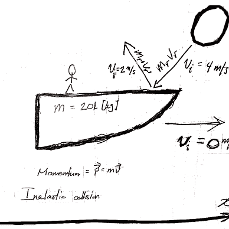
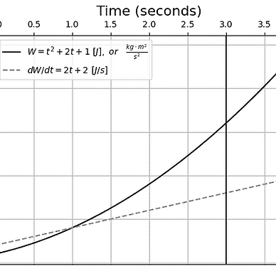

# 算术平均数有多大意义

> 原文：<https://levelup.gitconnected.com/how-meaningful-is-the-arithmetic-mean-2a03433df883>

## 给定算术平均值的标准差，计算算术平均值的正态分布概率

D 关于公共政策和其他社会现象的讨论通常利用服从正态分布的随机变量的算术平均值来“支持”某些想法的价值——无论是对现实的描述，还是要实施的规范性决策或政策。有人可能会问:“*的算术平均值代表了*人口的多少？”在本文中，我将设计一个估算器 *ex nihilo* 来描述算术平均值的正态曲线概率的行为，给出它的标准偏差。


部分图像成分来自:[Sumisawa&Kosaka(1995)](https://www.rottentomatoes.com/tv/5c5b1396-e846-3d3b-8fe7-6665a568e057/s01/e06)。

# 目录一览

1.  背景
2.  实验
3.  数据分析
4.  讨论
5.  结论
6.  参考

# 背景

[古尔德(2013)](https://doi.org/10.1001/virtualmentor.2013.15.1.mnar1-1301) 在讨论他自己从*腹部间皮瘤*中康复的故事时，宣称*中间值不是信息*，他将其描述为一种“严重的癌症”他讨论了被诊断患有这种癌症后的平均预期寿命是八(8)个月，以及他乐观的态度如何帮助自己战胜疾病，挑战了对这一统计数据的天真解释！

古尔德的文章启发我做了这个小项目，我试图回答以下问题:“*给定正态分布，给定其标准差*，算术平均值出现的概率是多少？”我还问:“*算术平均值的概率和不断增加的标准差参数*之间有什么关系？”我计划用实验数学和计算技术来解决这个问题。

## 问题设置

我将首先定义正态分布的概率密度函数:


情商。一

在这个版本的概率密度函数中，我删除了位置参数(μ),因为它是不相关的，我正在测试给定一个变化的标准差参数(σ)的固定算术平均值的概率。

借助实验数学的技术和工具，我打算通过计算φ(0，σ)，增加σ，并记录和观察函数的行为，来测试给定增加的标准偏差的固定算术平均值的概率。

然后，我将构建各种参数方程，在给定σ的情况下，尽最大努力估计φ(0，σ),导出它们的系数，选择最佳的一个，并在σ变化时，将系数解释为解释φ(0，σ)输出的基础。然后我会讨论我的发现，最后得出结论。

# 实验

我将使用 JupyterLab 桌面应用程序( [Bektas 2021](https://blog.jupyter.org/jupyterlab-desktop-app-now-available-b8b661b17e9a) )来完成我的计算。我将首先导入必要的库来进行计算。

```
import numpy as np
import matplotlib.pyplot as plt

from scipy.stats import norm
```

为了生成实验数据，我将使用计算机将算术平均值的概率计算为σ → ∞ (Eq。2):


情商。2

虽然我不能使σ达到无穷大，但我可以使σ非常大。我将测试σ的范围设置为从 1 到 100，并让它递增 0.001。以下代码对此进行了描述:

```
stdevs = np.arange(1, 100, 0.001)
pr_avg = [norm.pdf(0, loc=0, scale=σ) for σ in stdevs]
```

随着σ变大，执行这段代码会用算术平均值的概率列表填充`pr_avg`列表。

## 实验结果

为了了解σ和φ(0，σ)之间的关系，我将使用以下 Python 代码绘制结果:

```
%matplotlib inline

plt.figure()
plt.rcParams['xtick.bottom'] = plt.rcParams['xtick.labelbottom'] = False
plt.rcParams['xtick.top'] = plt.rcParams['xtick.labeltop'] = True

plt.plot(stdevs, pr_avg, "--", color="grey", label=r'"Empirical" $\phi(0; \sigma)$ results')

plt.title(r'Standard Deviation: $\sigma$', fontsize=16)
plt.ylabel(r'Average Probability: $\phi(0; \sigma)$', fontsize=16)
plt.grid()
plt.legend()

plt.show()
```

图 1 显示了上述 Python 代码的结果:


图 1:σ和φ(0，σ)的关系

# 数据分析

## 模型选择和参数估计

为了更好地理解这种关系的行为，我决定用指数曲线来拟合“经验”结果。通过“目测”图表，我决定使用一个简单的半衰期模型([第 2018 页，第 98 页](https://www.basicbooks.com/titles/scott-e-page/the-model-thinker/9780465094639/))，如公式 3 所定义:


情商。3 —在[页之后(2018，第 98 页)](https://www.basicbooks.com/titles/scott-e-page/the-model-thinker/9780465094639/)

其中`H`是代表周期长度的常数，`t`是代表经过的周期数的独立变量。标准偏差可以代替`t`。

我将公式编程到我的 JupyterLab 笔记本中，将`H`设置为`H=1` ，并绘制结果:

```
EV_p = lambda t, H: .5**(float(t) / float(H))

plt.plot(stdevs, pr_avg, "--", color="grey", label=r'"Empirical" $\phi(0, \sigma)$ results')
plt.plot(stdevs, [EV_p(σ, 1) for σ in stdevs], color="black", label=r'$\mathbb{E}_{\phi(0, \sigma)} = (1/2)^t$')

plt.title("Standard Deviation", fontsize=16)
plt.ylabel("Average Probability", fontsize=16)
plt.grid()
plt.legend()

plt.show()
```

图 2 描述了这段代码的结果:


图 2

这个模型似乎不太符合数据。我决定尝试使用不同的`H`参数值，并对用于生成图 2 的代码块进行了修改，以便在不同的`H`参数下评估不同的半衰期曲线:

```
[... snip ...]
base = 0.5
H_potential = ((0.25, "red"), (0.50, "orange"), (.75, "yellow"), (1, "green"), 
     (2, "blue"), (3, "purple"), (4, "brown"), (5, "black"))

for H in H_potential:
    plt.plot(stdevs, [EV_p(σ, H[0]) for σ in stdevs], color=H[1], 
        label=r'$\mathbb{E}(\sigma) = ' + str(base) + r'^\frac{\sigma}{' + str(H[0]) + r'}$; H = ' + str(H[0]))
[... snip ...]
```

图 3 描述了修改的结果:


图 3-具有不同`H`参数的不同半衰期模型。

我先向所有色盲和只能看到单色的读者道歉。从图 3 来看，`H`参数似乎没有完全捕捉到“经验结果”的行为。我将不得不试验一下基数**和**`H`的值，以找到最合适的。经过一些实验和“聪明的猜测”，我认为半衰期模型并不适合“经验结果”

我试图用一个指数函数(参见 [Weisstein n.d.](https://mathworld.wolfram.com/LeastSquaresFittingExponential.html) )和一个*sigmoid*函数( [Sinnott 2016，第 368 页](https://doi.org/10.1016/b978-0-12-805394-2.00015-5))进行实验，但结果就像半衰期模型的结果一样，在这里记录它们是多余的，所以我不会这样做。相反，我将定义一个估算公式 *ex nihilo* 并手动调整其参数。等式 4 是我通过积极的修改发现的估计量:


情商。四

现在我可以继续评估这个估计量与实验数据的吻合程度。

## 解释的方差:R 统计量

曲线拟合近乎完美。为了证明事实确实如此，我将使用 R 系数(等式)。5)确定我的估计量解释了多少方差:


情商。5 —在[之后纽卡斯尔大学](https://www.ncl.ac.uk/webtemplate/ask-assets/external/maths-resources/statistics/regression-and-correlation/coefficient-of-determination-r-squared.html)。

分子是关于实验算术平均概率和回归模型预测之间的差异的误差平方和，分母是关于实验算术平均概率和它们的平均值之间的差异的误差平方和。

应用此公式显示 R 值接近 1(其值为 0.99989)，从而证明我的估计量描述了给定标准偏差的算术平均值的正态曲线概率的行为。图 4 描述了我的结果:


图 5

以下是我用来生成上述图表和开发我的估算器的 Python 代码:

```
F = lambda σ, θ0, θ1: (θ0 + θ1 * σ)**(-1)

θ0 = 0.05
θ1 = 2.50

RSS, TSS = 0, 0
pr_avg_avg = sum(pr_avg) / float(len(pr_avg))
for σ, pr in zip(stdevs, pr_avg):
    RSS += (pr - F(σ, θ0, θ1))**2
    TSS += (pr - pr_avg_avg)**2

R2 = 1 - (RSS / TSS)

plt.plot(stdevs, [F(σ, θ0, θ1) for σ in stdevs], color="black", 
         label = r'$ \mathbb{E}_\phi [\sigma] = (0.05 + 2.50\sigma)^{-1}; R^2 = ' + str(round(R2, 5)) + '$')
plt.plot(stdevs, pr_avg, ":", color="blue", label=r'"Empirical" $\phi(0, \sigma)$ results')

plt.title(r'Standard Deviation: $\sigma$', fontsize=16)
plt.ylabel(r'Average Probability: $\phi(0; \sigma)$', fontsize=16)
plt.grid()
plt.legend()

plt.show()
```

我可以很有信心地说，给定其标准偏差的算术平均值的正态曲线概率符合以下估计量:


情商。4 redux

有了这个估计量，就有可能在给定标准偏差的情况下，以很高的精度估计正态曲线算术平均值的概率。图 6 描述了算术平均值的标准偏差和它们各自的预期正态曲线概率的一些例子的表格:


图 6

# 讨论

据我所知，以前没有进行过概率实验来探索正态曲线的标准偏差与其算术平均值的概率之间的关系。众所周知，随着标准偏差的增加，算术平均值的概率会降低，尽管我不知道有任何实验试图量化随着标准偏差的增加，这个结果概率会降低多少。尽管过去可能有数学家和统计学家做过的工作。

考虑到我实验的局限性，我在做实验和分析数据时选择了一个有限的封闭区间[1，100]。在统计学中，*外推*超出定义的区间进行数据分析是**不推荐** ( [Boslaugh 2012，第 470 页](https://www.oreilly.com/library/view/statistics-in-a/9781449361129/))。我的估计可能不适用于小于 1 或大于 100 的标准差。

更进一步的限制是，至少在目前，我的估计量只是数学中的一个猜想——而不是一个 ***已被证明的*** 数学定理或引理。这种假设函数及其参数是从 nihilo 中设计出来的，只是为了在有限的范围内拟合实验数据，它并不遵循先前建立的定理、引理、假设或定义。

未来的研究可能涉及增加上限，并将实验数据分为训练集和测试集，并在新的案例上测试估计器(参见[2018 页，第 87 页](https://www.basicbooks.com/titles/scott-e-page/the-model-thinker/9780465094639/))。未来的研究还可能包括为这个估计量构造一个证明，或者把它作为一个新定理的基础。

# 结论

我有很多理由决定继续这个项目。其中之一是，根据我个人的经验，平均值的概念被一些新闻媒体的作者和记者滥用了。另一个原因是来自 S. J .古尔德的灵感促使我这样做——尽管我的文章可能没有反映他试图传达的东西。

借助实验数学的工具，我已经证明了其算术平均值的正态曲线概率的期望值由下面的公式表示:


基本公式

对于任何对我用来做这些实验和写这篇文章的 Jupyter 笔记本感兴趣的读者来说，可以在这里访问它:

[](https://www.kaggle.com/code/lambdacalculus/how-meaningful-is-the-arithmetic-mean) [## 算术平均值有多大意义？

### 使用 Kaggle 笔记本探索和运行机器学习代码|使用来自无附加数据源的数据

www.kaggle.com](https://www.kaggle.com/code/lambdacalculus/how-meaningful-is-the-arithmetic-mean) 

## 插头

对于那些有兴趣看我解决教科书上的数学问题的读者来说，不管是成功的还是失败的，我邀请他们看看我的*数学杂事*中等清单:


[阿列克谢](https://medium.com/@EpsilonCalculus?source=post_page-----2a03433df883--------------------------------)

## 数学杂物

[View list](https://medium.com/@EpsilonCalculus/list/maths-sundries-b5366eed435b?source=post_page-----2a03433df883--------------------------------)22 stories

对于喜欢我的作品但尚未注册 Medium 会员计划的读者，如果他们能通过我的推荐链接注册，我将不胜感激(这在经济上帮助了我 https://medium.com/membership/@EpsilonCalculus ❤️):[t5】](https://medium.com/membership/@EpsilonCalculus)

此外，如果读者能帮助我的朋友[米拉拉齐奥](https://twitter.com/MiraLazine)，那将不胜感激！读者可以在这里查看她的社交媒体账户，甚至给自己捐款:

[](https://twitter.com/MiraLazine) [## 米拉·拉齐奥——推特。

### 复数，跨性别，残疾，神经分歧，左派。

twitter.com](https://twitter.com/MiraLazine) [](https://medium.com/@MiraLazine) [## 米拉津-中号

### 阅读米拉·拉辛在媒介上的作品。一个专注于帮助边缘化和对立系统的作家…

medium.com](https://medium.com/@MiraLazine) [](https://cash.app/$MiraLazine) [## 用现金支付米拉·拉齐奥

### 在 Cash App 上即时免费换钱

cash.app](https://cash.app/$MiraLazine) 

# 参考

贝克塔斯，M. (2021)。 *JupyterLab 桌面应用现已推出*！Jupyter 博客。2022 年 11 月 10 日检索自:[https://blog . jupyter . org/jupyterlab-desktop-app-now-available-b8b 661 b 17 e 9 a](https://blog.jupyter.org/jupyterlab-desktop-app-now-available-b8b661b17e9a)

博斯劳(2012 年)。*统计学一言以蔽之:一个桌面参考*【第二版】。奥赖利媒体公司。

古尔德，S. J. (2013 年)。中值不是消息[再版]。*《AMA 伦理杂志》(第 15 卷，第 1 期，第 77-81 页)*。美国医学协会(AMA)。[https://doi.org/10.1001/virtualmentor.2013.15.1.mnar1-1301](https://doi.org/10.1001/virtualmentor.2013.15.1.mnar1-1301)

隅泽，k .(编剧)，小坂，h .(导演)。(1995).*定时炸弹*(第一季第六集)。电视剧集。美少女战士[英语配音]。DIC 制片公司。

纽卡斯尔大学。*决定系数，R 平方*。2022 年 11 月 11 日检索自:[https://www . ncl . AC . uk/web template/ask-assets/external/maths-resources/statistics/regression-and-correlation/coefficient-of-determination-r-squared . html](https://www.ncl.ac.uk/webtemplate/ask-assets/external/maths-resources/statistics/regression-and-correlation/coefficient-of-determination-r-squared.html)

佩奇，S. E. (2018)。*模型思考者:让数据为你服务你需要知道的事情*。基础书籍。

辛诺特，R. O .，段，h .，，孙，Y. (2016)。大数据分析案例研究。*在大数据(第 357–388 页)*。爱思唯尔。[https://doi.org/10.1016/b978-0-12-805394-2.00015-5](https://doi.org/10.1016/b978-0-12-805394-2.00015-5)

魏斯泰因。*最小二乘拟合——指数*。沃尔夫拉姆数学世界。2022 年 11 月 11 日检索自:[https://mathworld . wolfram . com/leastsquaresfittingexponential . html](https://mathworld.wolfram.com/LeastSquaresFittingExponential.html)