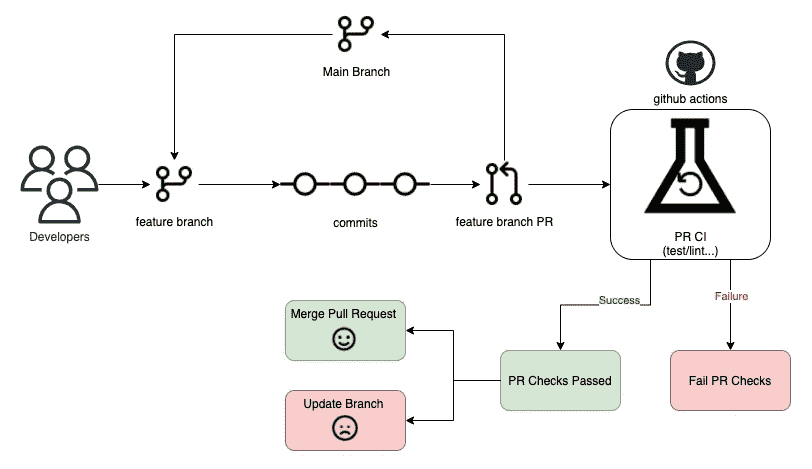
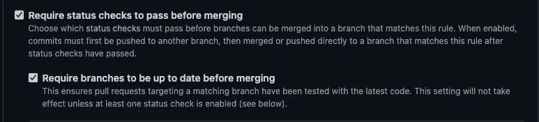
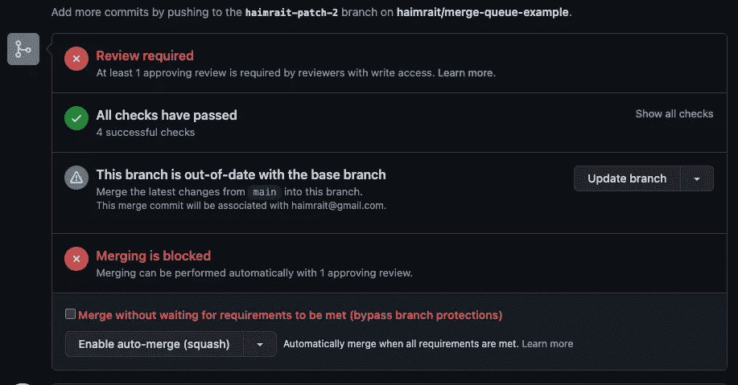
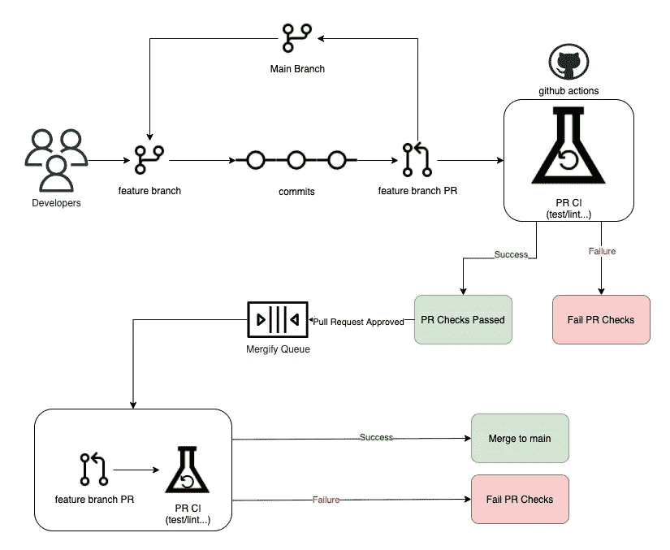
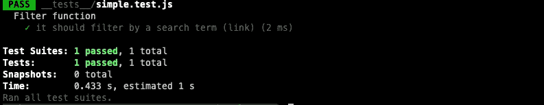
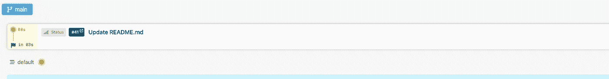
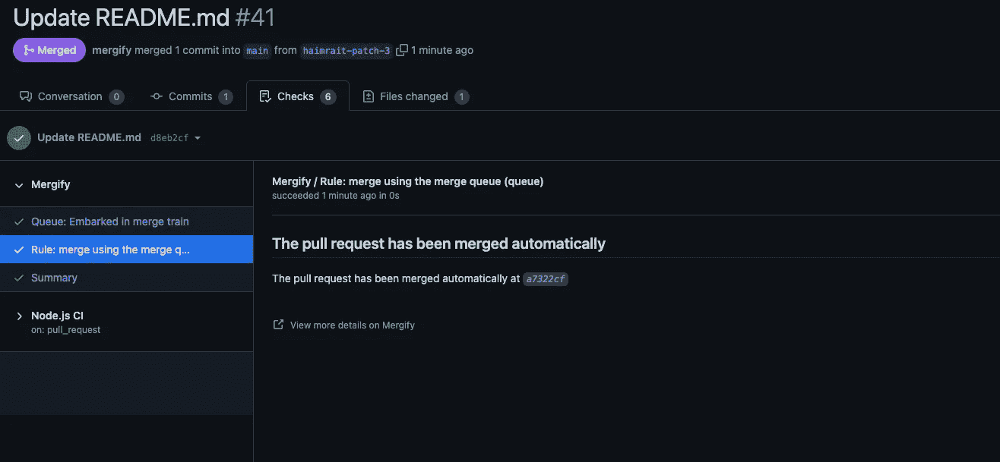

# 合并队列如何让我的生活更轻松

> 原文：<https://levelup.gitconnected.com/how-merge-queues-made-my-life-easier-1d8ea6384eca>

## 我们如何用 Mergify 和 Merge queue 自动化我们的开发过程？


如果你的团队正在用 GitHub 开发一个软件项目，那么当多个开发人员试图同时将拉请求合并到主分支时，你会感到很困难。如果你听起来很熟悉，这篇文章可能对你有帮助。

TLDR——我创建了一个内置公关自动化和合并队列配置的 GitHub repo。看一看！

## 我们的开发过程是如何工作的？

我们是两个团队，由 10 名开发人员组成，从事同一个单一回购项目。我们的开发过程与此非常相似:分配到一个标签的每个开发人员创建一个新的特性分支，并在开发过程中添加一些提交。最后开发者做一个特色分支 PR。该 PR 需要运行一些 CI 流程(测试、lint 等)。此外，每个 PR 必须由另一个开发人员批准。当 PR 被批准并且 CI 检查通过时，该 PR 可以被合并到主分支中。

查看下面的开发流程图。



旧的开发过程

## 出了什么问题？

当我们开始更快地交付并创建更多的 PRs 时，我们为主要分支机构创建了一个保护规则。此规则确保 PRs 在与主分支合并之前是最新的。

增加这条规则的原因是:

1.  为了确保新代码在主测试中与当前代码一起被测试，为了避免在合并时中断测试，要求每个 PR 与主分支保持同步。这确保了被合并的代码尽可能是最新的，并最小化了当代码被合并时出现冲突或其他问题的风险。
2.  为了简化审核过程，当 PRs 是最新的时，审核者可以更容易地理解所提议的更改，并提供更准确的反馈。这有助于简化审核流程，提高效率。

总的来说，向 GitHub 分支添加保护规则，要求每个 PR 都是最新的，这有助于提高代码的质量和可靠性，并鼓励团队内部更好的协作和交流。



分支保护规则的 GitHub 设置

然而，这一规则可能会给开发人员带来新的问题，因为他们中的一些人可能会发现必须不断更新他们的 PRs 以保持最新是令人沮丧的。这可能导致士气下降，甚至可能阻碍合作。



更新分支视图:(

## 解决方案是什么？

为了解决这个问题，我们的开发人员之一， [Ophir Yael](https://www.linkedin.com/in/ophiryael/) 发现，为了避免“更新分支”问题，我们可以使用一个合并队列，特别是 Mergify。Mergify 是一个在 GitHub 上自动合并拉请求(PRs)的工具。

## 什么是合并队列？

合并队列是一些版本控制系统和 GitHub 用来管理分支合并过程的特性。当一个合并请求被发出时，来自一个分支的变更被添加到一个队列中，系统等待直到这些变更可以被安全地合并到主开发分支中。

合并队列的目的是确保主分支不会中断。在我们的例子中，一次只执行一个合并，这有助于减少合并冲突和偏斜的风险。它还有助于确保合并后的代码是正确的，并且符合必要的质量标准。我们如何将合并队列集成到 CI 管道中？

建议的解决方案是当 PR 在 GitHub 上提交时，它被添加到 Mergify 管理的合并队列中。然后 GitHub 会自动检查 PR 是否有任何合并冲突或其他需要在 PR 合并前解决的问题。如果没有问题，一旦它变成 Mergify 将自动合并到主要发展分支的公共关系。如果有需要解决的问题，Mergify 会通知 PR 作者或其他相关方，在问题解决之前不会合并 PR。



新开发流程

## 如何开始？

在我们开始之前，我应该说 Mergify 有不同的[计划](https://mergify.com/pricing)，并且不是所有的特性都可以在免费计划中使用，但是我用免费计划创建了一个非常酷的例子。这个应用程序使用 jest 并配置 GitHub 操作来模拟 CI 流程，就像真实应用程序一样。

1.  登录 Mergify [仪表板](https://dashboard.mergify.com/)。
2.  点击`Enable Mergify on a new account`或转到[https://github.com/apps/mergify/installations/new](https://github.com/apps/mergify/installations/new)
3.  GitHub 现在会让你选择你想让 Mergify 访问的库。选择您喜欢的任何存储库，或者选择所有存储库。
4.  您将被重定向到仪表板。

现在让我们创建一个简单的 NodeJS 应用程序。

1.  将您的存储库克隆到本地文件夹。
2.  运行`npm init -y`来初始化您的应用程序
3.  跑`npm install -D jest`
4.  创建`__tests__`文件夹
5.  添加`__tests__/simple.test.js`

```
 describe("Filter function", () => {
    test("it should filter by a search term (link)", () => {
      expect(1+1).toBe(2);
    });
  });
```

6.在 package.json 的脚本部分添加一个测试脚本，应该是这样的

```
 {
  "name": "merge-queue-example",
  "version": "1.0.0",
  "description": "",
  "main": "index.js",
  "scripts": {
    "test": "jest"
  },
  "author": "",
  "license": "ISC",
  "devDependencies": {
    "jest": "^29.3.1"
  }
}
```

7.让我们试着运行测试`npm test`结果应该显示测试通过。



8.让我们继续创建我们的 GitHub 工作流来创建 CI 流程，create `.github/workflows/node.js.yml`。

```
# This workflow will do a clean installation of node dependencies, cache/restore them, build the source code and run tests across different versions of node
# For more information see: https://docs.github.com/en/actions/automating-builds-and-tests/building-and-testing-nodejs

name: Node.js CI

on:
  push:
    branches: [ "main" ]
  pull_request:
    branches: [ "main" ]

jobs:
  build:

    runs-on: ubuntu-latest

    strategy:
      matrix:
        node-version: [14.x, 16.x, 18.x]
        # See supported Node.js release schedule at https://nodejs.org/en/about/releases/

    steps:
    - uses: actions/checkout@v3
    - name: Use Node.js ${{ matrix.node-version }}
      uses: actions/setup-node@v3
      with:
        node-version: ${{ matrix.node-version }}
        cache: 'npm'
    - run: npm ci
    - run: npm test
```

我不会深入讨论工作流配置，这是另一篇博文，但是一般来说，这个工作流在不同的 Nodejs 版本(14、16、18)上运行之前的测试。当对主要分支机构开立 PR 时。

9.在根目录中添加`.mergify.yml`。

```
pull_request_rules:
  - name: merge using the merge queue
    conditions:
      - base=main
      - "#approved-reviews-by>=1"
      - check-success=build (14.x)
      - check-success=build (16.x)
      - check-success=build (18.x)
    actions:
      queue:
        method: squash
        name: default
```

`pull_request_rules`属性是一个规则列表，它指定了在哪些条件下应该对拉请求采取特定的操作。每个规则都由一组条件和满足条件时要采取的操作组成。一般来说，这个规则增加了 5 个不同的条件`base=main`意味着这个规则将只受合并到主分支的 PR 的影响。`#approved-reviews-by>=1`表示每个请购单在合并前至少需要一次审批。接下来的三个条件`check-success=build`意味着合并将一直等到 CI 过程成功。在我们的例子中，我们配置了一个工作流，在三个不同的 NodeJS 版本(14、16、18)上运行测试。

10.`actions`部分表示 Mergify 将在满足上述条件后执行哪些操作，在本例中，我们将合并方法改为 squash 并设置队列的名称(默认)。请看下面的截图，看看它在 Github 和 Mergify dashboard 上的样子



Mergify 仪表板队列部分



GitHub 检查部分

完整的例子可以在这个 [GitHub repo](https://github.com/haimrait/merge-queue-example) 中找到。

## 结论

使用 Mergify 和合并队列是 GitHub 存储库中自动管理 pull 请求的一种有用方法。

Mergify 是一个工具，它监听存储库的拉请求时间线中的事件，并根据配置的规则采取行动。它可以用来自动化各种任务，比如标记、注释或合并拉请求。

合并队列是等待合并的拉请求列表。它可以用来管理拉请求合并的顺序，并确保某些拉请求优先于其他请求。

Mergify 和 merge queue 一起可以帮助简化代码审查过程，并减少维护人员的工作量。他们可以确保变更在准备好的时候得到及时的审查和合并，同时仍然允许维护人员控制过程。

总的来说，使用 Mergify 和合并队列是自动管理拉请求和提高代码审查过程效率的有效方法。

感谢 [Ophir Yael](https://www.linkedin.com/in/ophiryael/) 对本文的帮助。

# 分级编码

感谢您成为我们社区的一员！在你离开之前:

*   👏为故事鼓掌，跟着作者走👉
*   📰更多内容请查看[升级编码刊物](https://levelup.gitconnected.com/?utm_source=pub&utm_medium=post)
*   🔔关注我们:[推特](https://twitter.com/gitconnected) | [LinkedIn](https://www.linkedin.com/company/gitconnected) | [时事通讯](https://newsletter.levelup.dev)

🚀👉 [**加入升级人才集体，找到一份神奇的工作**](https://jobs.levelup.dev/talent/welcome?referral=true)