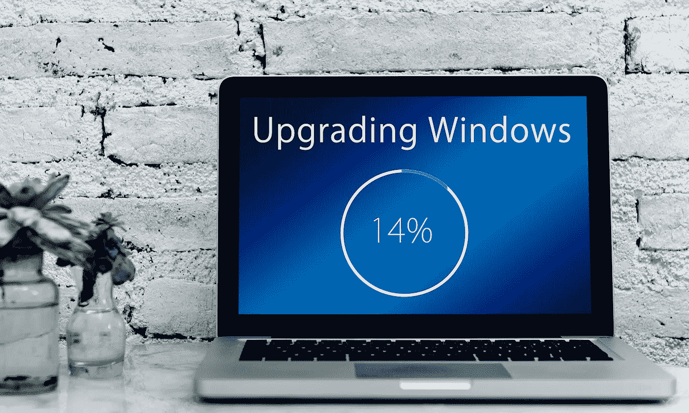

# 微软如何治愈我的分裂型人格障碍

> 原文：<https://levelup.gitconnected.com/how-microsoft-cured-my-split-personality-disorder-c3f574722177>

当谈到微软的整个软件生态系统时，我一直是内部分裂的，同时持有两种意见。Windows 11 改变了这一点。

计算机的迷人之处在于，它们不仅仅是一种工具——它们是制造工具的工具。同时，它们能够为我们解决问题(比如提供娱乐、存储数据、使交流变得可能和容易等等)。)并使我们有可能通过编程新的解决方案来构建我们自己的解决方案。

作为一个将电脑作为解决问题工具的用户，我一直热爱 Windows。它易于运行，易于维护，微软的大多数操作系统这些年来也老化得很好(因为它们仍然有点快)，最近，它们不那么崩溃了。还有:这个平台运行我所有的游戏。我喜欢 Office(甚至 Outlook)，团队很好，不太关心 UI 方面(3 天后我已经完全习惯了)，我喜欢我不必照看操作系统的事实。

但是也有黑暗的一面:软件开发。在 Windows 上构建 C++代码是一件痛苦的事情。让代码在 Linux 上运行会给你一种温暖如家的感觉。一切正常。你有一个软件包管理器，你告诉它安装所有你需要的，可以制作，制作，运行。简单。即使你使用更复杂的环境，比如像 CUDA 这样的硬件依赖，一切通常都正常工作，你可以期待文档是好的，因为所有的开发人员都在 Linux 上。

然而，在 Windows 上，您的最佳选择是双重引导。在很多情况下，在 Windows 上编码最简单的方法就是不要在 Windows 上编码，而是找到一些方法来恢复 Linux 用户体验。本质的问题是，很难让代码正确地构建和链接，这就是为什么您要么转向 Linux，要么使用像 Android Toolkit 或 Java Toolkit(如 Maven)这样的工具包来为您完成所有的配置。

我喜欢微软的一点是，他们在这一点上诚实而开放。其他销售操作系统的公司可能只是在他们的营销材料中声明他们是最好的，直到有足够多的人从纯粹的重复中相信这一点。但微软实际上已经着手解决这个问题:在 Windows 10 中，他们为 Linux 引入了 *Windows 子系统，让双启动基本上过时了。*

双靴有三个问题:

1.  您必须拆分存储，并且基本上必须预测哪种操作系统需要多少存储。
2.  你最终会少用一个系统，它会严重老化。对我来说，这意味着双引导 Linux 通常是过时的，无论何时我使用它都要花很多时间。
3.  切换速度很慢，并且需要重新启动。

有了 WSL(和 WSL 2 ),这些问题都解决了。不需要重新启动，不需要单独的文件系统，很容易切换到访客 Linux，这使我个人更经常地使用它，因此，我也更经常地维护它。然而，即使有了 WSL，仍然存在一些问题。我感受最深的是缺少图形服务器，因此没有图形应用程序，文件系统被奇怪地隔离开来，因此将数据输入和输出 WSL 系统总是很奇怪。

在 Windows 11 中，这两个问题对我来说都完全解决了。现在，您可以在 WSL 中简单地运行图形应用程序，它会绘制一个 Windows 窗口，因为 Windows 现在默认提供所需的适配器(查看[这篇关于 WSLg 架构的精彩文章](https://devblogs.microsoft.com/commandline/wslg-architecture/))，WSL 系统的文件系统现在会自动挂载到 Windows 资源管理器中，反之亦然。

这些变化使 Windows 11 对我这个开发者来说是一个非常舒适的系统。我可以随时使用 Linux 或 Windows。但这只是一些装饰性的糖果——这些问题中的大部分以前都有解决方案，它们现在只是转移到 Windows 核心中，并且需要更少的配置。不过，让我高兴的是，看到微软认真对待这些问题，并且没有太过自负。三十年来，开发者一直在抱怨 Windows 中臭名昭著的 CMD。首先，微软增加了 PowerShell 来改善这一点。虽然 PowerShell 解决了一些问题，但它与默认的 Ubuntu 终端和 bash 相去甚远。然后 Windows 引入了 WSL，基本上将 Linux 终端带到了 Windows。这也解决了一些问题，但他们并没有就此止步。相反，他们推出了 Windows 终端，现在可以有 Linux，Windows，Azure Shell，hell，甚至 CMD 的标签，如果你还生活在 90 年代:)

很明显，微软希望将良好的开发者体验整合到 Windows 中，他们没有偷工减料。他们不只是简单地购买一家虚拟机公司，将虚拟机集成到操作系统中，并告诉开发人员闭嘴，他们实际上做了工作，并实施了复杂问题的理想解决方案。

当微软收购 GitHub 时，人们有点害怕和惊讶，但我认为这是最好的选择。到目前为止，他们所做的就是给我们免费的无限的个人资料库。信任是很难赢得的——尤其是对那些有时会与用户利益发生冲突的大公司来说，但我觉得微软最近已经赢得了很多信任。让我们看看接下来会发生什么。

Ps:这只是众多点中的一个。其他的有:

*   面向初创公司的 Office 365 Business Basic 捆绑包的定价模型。一个月 4.20€(呵呵)你得到的值是破纪录的。
*   Windows 11 中的虚拟桌面。
*   VSCode。最好的 IDE，毫无疑问。走开 JetBrains(索引…索引…索引…)！
*   从 Windows 7 到 8 到 10 到 11 的免费升级。
*   一切都是司机。天啊，我有时候讨厌 Linux 驱动程序…
*   MS Teams 实际上很棒，尤其是因为它集成得非常好。在我们都需要视频通话软件的时代，不需要 Discord 或 Zoom 或任何其他第三方软件。
*   就我个人而言，我也喜欢他们坚决支持 UEFI 和安全引导，并要求 TPMs。这将简单地建立一个对用户有益的标准。仔细想想，这对微软或 Windows 没什么作用，它所做的只是让你的电脑更安全。他们把运行 Windows 作为一项要求，只会让你能买到的每台电脑都默认安装 Windows。