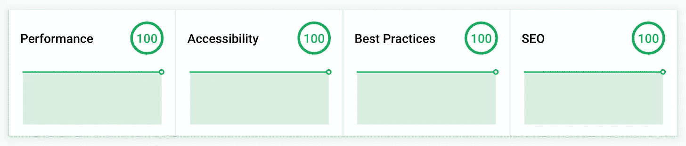
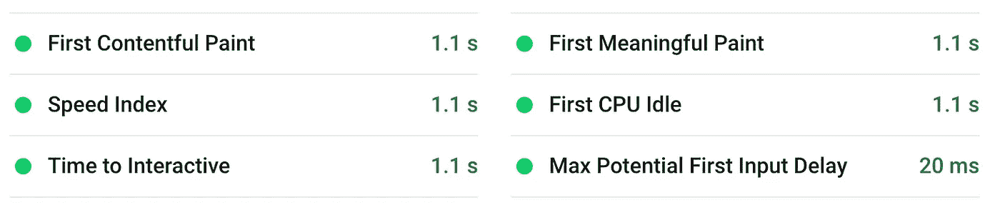

# 你实际需要多少 JavaScript？为了什么？

> 原文：<https://levelup.gitconnected.com/how-much-javascript-do-you-actually-need-and-what-for-2e0ae47aa9cc>

因为我住在巴塞罗那，所以我会时不时去参加喜剧/讲故事活动。然而，我有一些麻烦，哪个事件是哪一天，因为他们都有不同的脸书网页等。然后我想起我是一名开发人员，决定自己创建一个简单的列表，列出所有即将发生的事件。因为我想快速创建一些东西，所以我决定用 [Next.js](https://nextjs.org/) 引导一个项目，这样我就可以同时使用服务器端和客户端 React。

# 获取数据

正如您可能已经想到的，我使用了脸书的 API 来获取事件数据。我本可以使用一个或另一个 NPM 包来逐个请求地轻松获取数据。这本来可以很好地配合我的项目的设置，但这将是一个巨大的过度。数据不会改变很多次，也不会基于用户数据或任何东西。这就是为什么我决定创建一个可以由 cronjob/CI 系统轻松运行的 CLI 脚本。？).

之后，我使用我很久以前发布的 [React UI 组件](http://dejakob.github.io/react-alegrify-ui)创建了一个快速界面。一切进展顺利，我有了一些索引页，并使用 [now.sh](http://now.sh/) 将它发布到生产中。我对这个结果非常高兴，然后我和一些朋友分享了这个结果。

几乎在发布这个页面之后，我就被问到为什么这个页面这么慢。作为一个“专业”前端开发人员，你最不想听到的就是你的页面太慢。我必须想办法解决这个问题。

# 这真的需要服务器端脚本吗？

如今，服务器端脚本非常强大。您可以在服务器端呈现与客户端相同的组件。然而，存储数据、填充数据、呈现组件、组装页面并将其发送回是相当占用内存的。这是我的页面非常慢的原因之一。真的需要吗？页面没有太大变化。

要回答“这真的需要服务器端脚本吗？”答案是否定的。该页面不会根据用户、会话或相关数据而改变，并且可以转换为静态页面。

## 但是还是要更新的吧？

为了了解我是否真的真的真的需要服务器端脚本，我试图弄清楚在什么情况下页面真的需要更新。没有完美的方法，因为我没有收到任何来自脸书的活动变更或创建的更新。然而，我认为对于这个网站的初始阶段，每天同步一次可能就足够了。

## 所以，重写所有的代码？

为了代码的可维护性，我仍然想使用 react，也想使用我的 UI 组件。我不必重写或改变页面的代码，而是改变页面的创建过程。

我使用的默认 Next.js 设置是基于一个请求一个请求地生成页面。我想摆脱服务器端脚本，所以我决定将这一代转移到项目的构建阶段。

通过使用我编写的简单 CLI 脚本，我可以为我想要创建的每个页面运行 React 的`renderToString`。页面将在任何人请求之前预先构建，输出将存储为普通的 HTML。

## 这个怎么更新？

现在我有了静态 HTML 页面，这很棒，但我也需要以某种方式更新它们。为了简单地服务网站，我离开了 now.sh，决定使用[谷歌云存储](https://cloud.google.com/storage)，因为现在一切都是静态的。

要更新页面，我只需重新运行生成页面的自定义 CLI 脚本，并将它们上传到 Google Cloud。由于这已经是一个必须定期运行的简单脚本，我决定使用 [Bitrise](https://www.bitrise.io/) 来解决这个问题。Bitrise 是许多 CI 工具中的一个，它在每次推送后或基于时间间隔(这是我需要的)运行脚本。

通过采取这些步骤，我能够完全摆脱所有的服务器端脚本，仍然得到相同的页面。

# 这真的需要客户端脚本吗？

由于页面直接由一些信息和链接组成，JavaScript 不是一个沉重的要求。我的 Next.js 设置有许多现成的 js 来合并和重新呈现组件。然而，页面的初始视图不需要这些。所以，你可能已经感受到了:我也把这些都去掉了。

在这个页面上删除了服务器端和客户端的 JavaScript，极大地提高了性能(正如预期的)。

我通过 [Google PageSpeed](https://developers.google.com/speed/pagespeed) 和 [web.dev](https://web.dev/measure) 进行了测试，结果令人惊讶。在这两个网站上，我得到了满分 100 分，我的互动时间似乎是 1.1s。

# 我们应该回到静态网站吗？

通常，我会回答没有，因为大多数网站严重依赖用户数据，或者在某些方面是交互式的。我们永远不应该为了性能而牺牲功能和交互性。另一方面，最近似乎有一种疯狂的趋势，即随时随地使用 JavaScript，即使在不需要的时候。

几年前，服务器端脚本只在绝对必要时使用，JavaScript 只在小片段中添加。每当单页面应用程序开始起飞时，越来越多的东西被扔进一个 JavaScript 文件，大大降低了网站的速度。现在，在历史上的那一点几年后，我们找到了一些处理大量 JS 的方法。例如，动态导入，它将 JS 分成几个文件，只在需要的时候加载。此外，服务人员将日光视为更好地缓存和控制所有资源的一种尝试。所有这些改进都很棒，但有时它们解决了一个一开始就不应该存在的问题。

在我看来，每一个信息丰富的网站(比如我创建的这个)都应该是完全可以不用 JavaScript 访问的。如果需要交互性，很好，添加它，但是不要阻塞页面加载。作为概念的证明，我在页面中添加了对软链接的支持。这是用 JavaScript 实现的，但只有在页面完全加载后才会添加，并且对于与页面的交互是完全可选的。这个原理也可以称为“渐进式渲染”。

简而言之，只有在必要的时候才使用 JavaScript。如果你真的要添加，尽量让它可选。

我提到的网站可以在 [https://expat.barcelona](https://expat.barcelona) 上找到