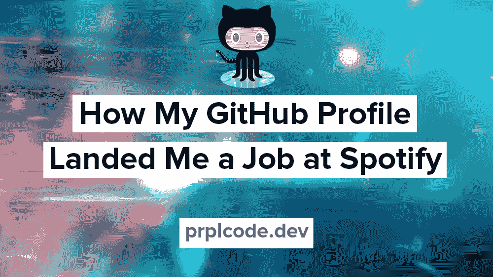

# 我是如何通过 GitHub 个人资料在 Spotify 找到工作的

> 原文：<https://levelup.gitconnected.com/how-my-github-profile-landed-me-a-job-at-spotify-9e513e34d9ae>

这就是我的 GitHub 个人资料如何让我在 Spotify 找到工作的经历。关键是我的 GitHub 档案和我多年前参与的各种回购。这篇文章将是个人的，关键是投资组合的重要性。它不一定是一个好的投资组合(我的当然不是)。但是拥有一份投资组合可能是能否得到这份工作的关键。

# Spotify 采访

在 Spotify 之前，我在另一家公司担任软件工程师。这是我大学毕业后的第一份工作，还不错。我了解到软件是如何被专业开发的，这很有趣。一天，我收到一封来自 Spotify 的电子邮件，他们要求申请 3 个月的实习。我马上把我的简历发给了他们。

几天后，我接到一个电话，我被叫去面试。面试的日子快到了，我开始觉得不舒服😨。面试那天，我发烧了，但还是吃了点药去了。面试不太顺利。我们在黑板上交谈并做了一些编码练习。我完全失去了知觉(部分是因为药物)。我说的最后一句话是“*请查看我的 GitHub 简介*”，他们说他们会的。

面试后，我对自己非常失望😔。我回到家里，开始了我的工作，现在看来，这份工作既无聊又乏味。

# 回电

几天过去了，我接到一个电话。是招聘人员！他说他们喜欢我，愿意给我提供实习机会！哇，多好的感觉！😃我接受了，几周后我辞去了现在的工作。我的朋友和同事都很惊讶我会辞去全职工作去实习 3 个月，但我并不在乎。我生命中最大的两个爱好是技术和音乐，我将同时与这两者一起工作！💻🎸

# 实习结束

实习的条件是，如果他们喜欢我，他们会给我一份固定的工作。我的实习期快结束了。我很紧张，但我学到了很多东西，认识了很多来自世界各地的人，所以我很高兴。我们开了个会，他们说他们想给我一份永久的工作。又来了，极乐！我感到如释重负，当然还有兴奋！

# 我的 GitHub 个人资料

后来，我在和团队里的一个人聊我面试的事情。我告诉她事情有多糟糕，我对仍然得到这份工作感到多么惊讶。她跟我说了一些类似于*的话，是的，他们告诉我它变坏了。但是当我们看你的 GitHub 简介时，我们发现你真的可以编码。这就是为什么我们想要你*。

我的个人资料不多；一些 HTML、CSS 和 JavaScript 网站是我为了好玩和学习而建的。在面试之前，我浏览了一下代码，以确保它看起来整洁美观。

# 结论

多亏了我的 GitHub 档案，我得到了一份实习工作，后来在 Spotify 得到了一份永久的工作。我意识到拥有一个投资组合是多么重要。它不一定是最好的，只是一些显示你能做什么的东西。这是 6 年前的事了。我仍然在 Spotify 工作，现在是高级软件工程师。事实证明这是一个非常棒的工作场所，所以我还没有找到离开的好理由。

如果我能做到，你也能！！👊感谢阅读。

*在* [*Twitter*](https://twitter.com/prplcode) *，*[*LinkedIn*](https://linkedin.com/in/simeg)*，或者* [*GitHub*](https://github.com/simeg)

*原载于*[*PRP lcode . dev*](https://prplcode.dev))