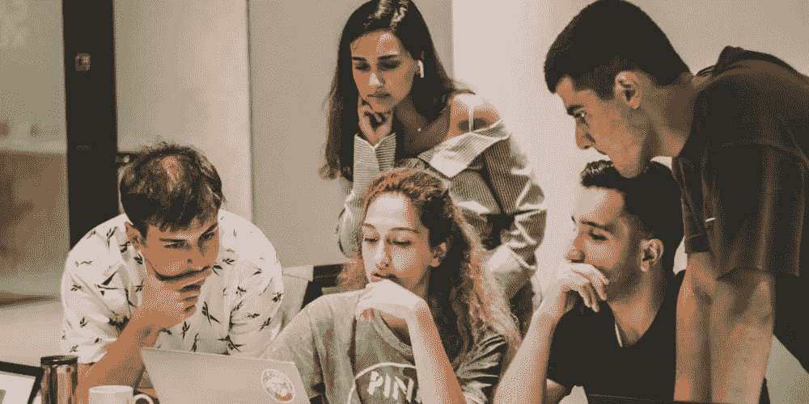

# 我对开源的看法发生了怎样的变化

> 原文：<https://levelup.gitconnected.com/how-my-view-on-open-source-has-changed-93e8e0dd5bca>

[拉拉·阿兹利](https://unsplash.com/@lazizli?utm_source=unsplash&utm_medium=referral&utm_content=creditCopyText)在 [Unsplash](https://unsplash.com/s/photos/teamwork?utm_source=unsplash&utm_medium=referral&utm_content=creditCopyText) 上的照片

在我写的第一篇关于开源的博客中，有一件事我想知道:

> *我听说了很多关于大多数程序员在为开源项目做贡献时所经历的迷人的进化。从他们的技术技能(例如编程知识、编码风格)到他们的软技能(例如协作和沟通技能)的一切都得到提高。*

没有太多的破坏，我可以说，我来寻找黄金，但我发现了钻石。只有 14 周，感觉关于开源还有相当多的方面我还没有经历过。尽管如此，我不会让它阻止我分享我的个人经历。

# 支持性社区

照片由[海伦娜·洛佩斯](https://unsplash.com/@wildlittlethingsphoto?utm_source=medium&utm_medium=referral)在 [Unsplash](https://unsplash.com?utm_source=medium&utm_medium=referral) 上拍摄

有一点我可以肯定的说:我热爱开源的精神。我和不同规模的开源社区(例如[塞内卡-CDOT](https://github.com/Seneca-CDOT) 、[斯特普森](https://stepzen.com/)、 [Appwrite](https://appwrite.io/) 和 [Zulip](https://zulip.com/) )一起工作过得非常愉快。幸运的是，他们都很棒，对初学者很有耐心。

# 惊人的学习机会

[车窗](https://unsplash.com/@windows?utm_source=medium&utm_medium=referral)在 [Unsplash](https://unsplash.com?utm_source=medium&utm_medium=referral) 上拍照

我有好几次机会不仅学习新技术，还学习良好的软件开发实践。我帮助[元素](https://element.io/)修复了一个 CSS 错误，但是在提交我的拉取请求时犯了几个[错误。在 Hacktoberfest 期间，我获得了两种全新的技术(即 Ruby 和 GraphQL)和一棵漂亮的树，用于我的 4 个合并的 pull 请求。在审核 IPC144 课程笔记的内容时，我也有机会与](https://dev.to/oliverpham/mistakes-to-avoid-before-submitting-your-pull-request-3nl8) [Docusaurus](https://docusaurus.io/) 一起工作。最后，我永远不会忘记我为用 jQuery 和手柄为 Zulip 开发一个新特性而付出的努力。

# 开源到底是什么

在经历了这一切之后，仍然很难说我的技能是否有所提高。尽管如此，我最终意识到[其实没什么关系](https://www.youtube.com/watch?v=eVTXPUF4Oz4)(谢谢林肯公园的提醒)。在我看来， ***开源就是发布你的“坏”代码/项目，并与其他人合作改进它*** 。我指的“坏”不是“值得被羞辱和不被尊重”。是“值得改进/增强/优化”中的“坏”。那是两码事。

因此，我对过去的自己和任何想开始开源的人的唯一建议是:做好学习的准备。如果你对一个项目感兴趣，但不知道如何开始，从社区中了解它(`git grep`或 VSCode 搜索工具可能是你的*最好的伙伴*，但一个支持的社区是*你的妻子/丈夫*)。如果你不知道如何修复一个特定的 bug，那就学习其他人是如何处理它的。如果你想让其他人帮助你完成你的开源项目，与其他维护者交流，了解他们如何对待新的贡献者。在开源领域，我认为我们都在这里成长，不仅作为一个开发者，而且作为一个社区。

# 结论

我希望开源可以应用到生活中的许多其他方面。承认我对开源有多痴迷有点尴尬。事实上，我太习惯于在一个开源项目上提交一个新的问题，并要求就此开展工作，以至于前几天我无意识地对加拿大丰业银行做了同样的事情。银行出纳员一定以为我嗑药了或者什么的。最后，我要感谢[大卫](https://github.com/humphd)，他帮助我和其他同学掉进了这个迷人的兔子洞。如果你正在读这封信(这是很有可能的)，我们真的很感谢你令人惊叹的内容和支持，戴夫！从 0.1 版到 0.4 版和实验室是一次不可思议的冒险。我期待着这门课之后的下一章。

*原载于 2021 年 12 月 11 日*[*https://dev . to*](https://dev.to/oliverpham/how-my-view-on-open-source-has-changed-1bpc)*。*