# 神经网络如何学习

> 原文：<https://levelup.gitconnected.com/how-neural-networks-learn-f602d6f77a13>

## 推导出前馈反向传播算法

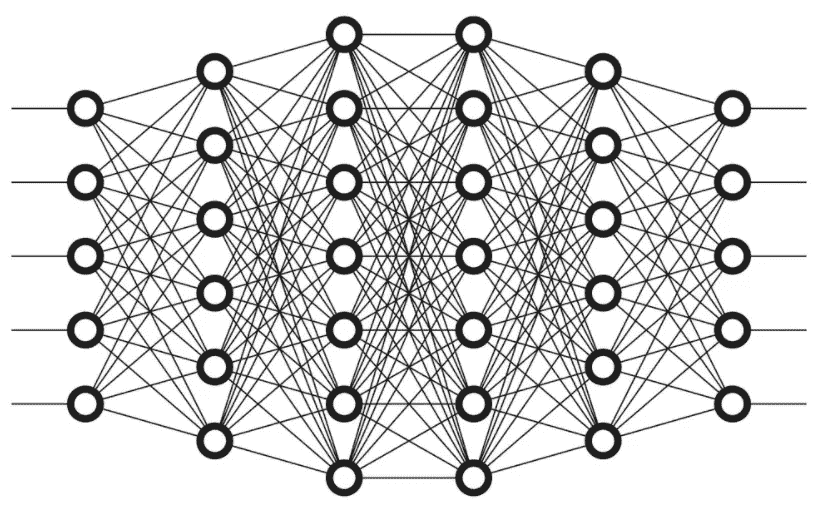

*注:这篇文章是关于神经网络从无到有* *的* [*系列的第三部分。这里的数学建立在第 2 部分—*](https://medium.com/@karenovna.ak/neural-networks-from-scratch-series-c969ba5b4e2b) [*训练单个感知器*](https://blog.usejournal.com/training-a-single-perceptron-405026d61f4b) *的数学基础上，因此我强烈建议你对那篇文章中的等式有一个坚实的理解。读者应该有微积分方面的经验。*

在我的 [**上一篇文章**](https://blog.usejournal.com/training-a-single-perceptron-405026d61f4b) 中，我推导了训练单个感知器的数学方法。这里的文章是前一篇文章的延续，前一篇文章将训练单个感知器的概念扩展到训练多层和多感知器神经网络。 ***这篇文章包括了推导前馈反向传播算法所需的所有数学知识，前馈反向传播算法是神经网络学习的核心。***

 [## 训练单个感知器

### 它的学习规则是从零开始的

blog.usejournal.com](https://blog.usejournal.com/training-a-single-perceptron-405026d61f4b) 

事不宜迟，我们直接进入内容。

1.  **单感知器模型快速回顾**

[**训练单个感知器**](https://blog.usejournal.com/training-a-single-perceptron-405026d61f4b#a773) (单个节点、单层神经网络的最简单形式)涉及使用 [**梯度下降**](https://blog.usejournal.com/training-a-single-perceptron-405026d61f4b#b7ed) 来迭代 [**更新连接输入和感知器的权重**](https://blog.usejournal.com/training-a-single-perceptron-405026d61f4b#b7ed) ，使得 [**误差函数**](https://blog.usejournal.com/training-a-single-perceptron-405026d61f4b#fe4f) 最小化**。**误差函数测量在 [**监督学习**](https://blog.usejournal.com/training-a-single-perceptron-405026d61f4b#7069) 设置中，感知器的实际输出与期望输出(标签)的偏差。然后，在 [**感知器增量函数**](https://blog.usejournal.com/training-a-single-perceptron-405026d61f4b#bfb0) 的帮助下，权重根据我们观察到的误差进行更新——该函数量化当前权重需要改变多少，以获得更新的权重，从而进一步减少误差。为了简单起见，我将忽略这篇文章中的偏见。

考虑下面的感知器模型，它有一个感知器 *j* 和一个 *m* 维输入向量 *x* 。

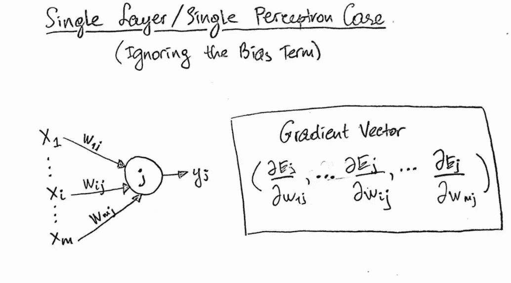

图 1:单一感知器模型

从现在开始，每当涉及数学讨论时，我将把感知器称为一个*节点*。向量 *x* 通常被称为**特征向量。**这个特征向量包含 *m 个*元素，每个元素代表描述单个数据点的单个特征。为了给这个节点应用渐变下降，我们需要计算****。在这种情况下，梯度向量是一个 *m* 维向量，其分量是误差函数 *E* 相对于权重的偏导数。*因此，梯度向量的每个分量代表 E 在单个权重方向上变化的速率。*****

****回想一下，梯度矢量的每个分量可以利用 [***链式法则***](https://blog.usejournal.com/training-a-single-perceptron-405026d61f4b#f626) 计算如下:****

****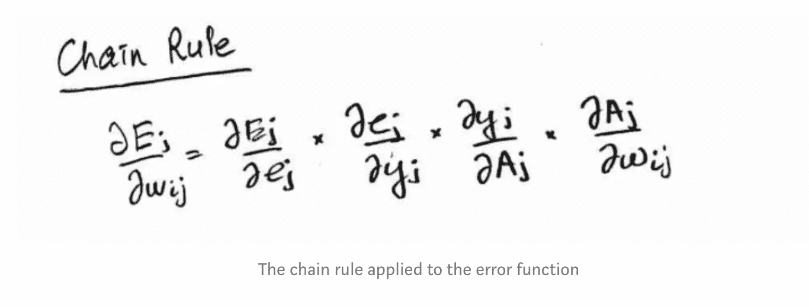****

> *******在单感知器模型中，梯度向量是这样的表达式，其中误差函数相对于将输入仅连接到一个节点的所有权重取偏导数。*******

****我们从最右边的层和函数移到边或权重:*E→E→y _ j*→*A _ j*→*w _ ij*。上述等式中所有具有某个指数 j 的因子可以方便地聚合成一个因子 *delta_j* 。这不仅仅是数学上的方便，而且是反向传播算法的基础，我们将在后面看到。经过大量的数学运算，我们为单个权重导出了 [***感知器增量函数***](https://blog.usejournal.com/training-a-single-perceptron-405026d61f4b#bfb0) ，如下所示:****

****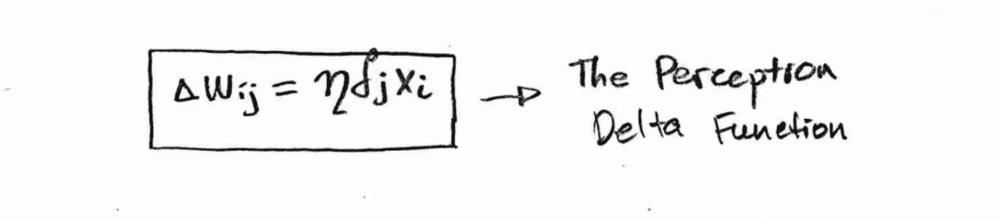****

****但是现在让我们来看一个网络，它有几个输入，这些输入馈入几个节点，这样每个节点的输出可以作为其他节点的输入。****

******2。前馈反向传播算法(FFBP)******

******2.1。前馈过程******

****对于多层、多感知器网络，我们有一个*输入层*、一个*隐藏层*和一个*输出层。*让我们用一个具体的例子，输入层有 *m* 个输入，隐藏层有 *n* 个节点，输出层有一个节点 *k* ，如下图所示:****

****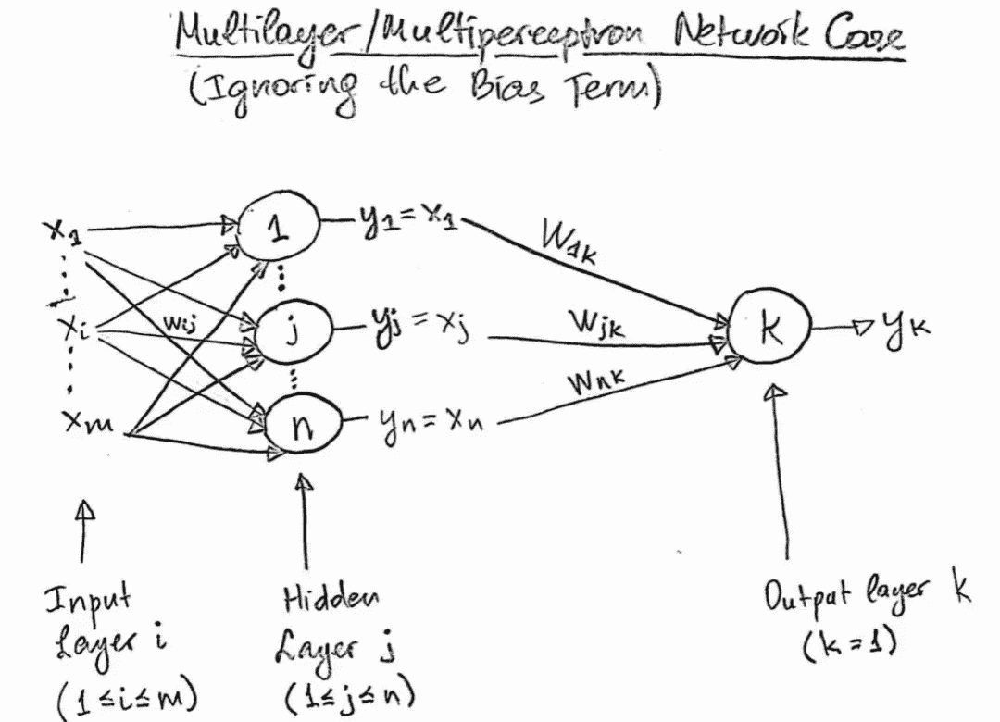****

****图 2:一个多感知器，多层神经网络。****

****输出层中的节点产生*实际输出*，然后通过误差函数将其与*期望输出*(标签)进行比较。这个过程是这样的:****

1.  ****输入层*的输入通过*网络，在隐藏层的每个节点(节点 1，2，…j，…n)产生一个输出****
2.  ****然后，隐藏层的输出(y1，y2，…y_j，…y_n)被用作输出层中节点 *k* 节点的输入(x1，x2，…x_j，…x_n)。****
3.  ****输出层中的节点 *k* 最终产生实际输出(y_k)。****

****这个过程在算法的名称中被我们称为' ***前馈'*** '，因为输入层的输入从左到右通过网络反馈，从而在输出层产生实际输出。你可能也听说过这个过程被称为 ***前馈时期*** 。****

****这里的示例网络可以被概括为在每个隐藏层和输出层中具有任意数量的隐藏层和任意数量的节点。我选择在输出层使用单个节点 *k* 来处理简单的二进制分类问题。如果输出层包含不止一个节点，那么我们将会处理一个多类分类问题。****

******2.2。反向传播过程******

****一旦我们通过前馈时期，并在节点 *k、*产生实际输出，我们就需要计算梯度向量，类似于我们对单感知器模型所做的。然而，网络中额外数量的节点和隐藏层大大增加了计算该梯度向量的复杂性。****

> *******在多层多感知器模型中，梯度向量要复杂得多，因为误差函数的偏导数是相对于与所有输出层节点相关联的所有权重以及相对于所有隐藏层节点来计算的，这使得神经网络的工作在计算上非常昂贵。通常，如果网络总共有 n 个权重，那么在每次迭代中将有 n 个偏导数要计算，并且每个偏导数的计算在数学上非常复杂。*******

****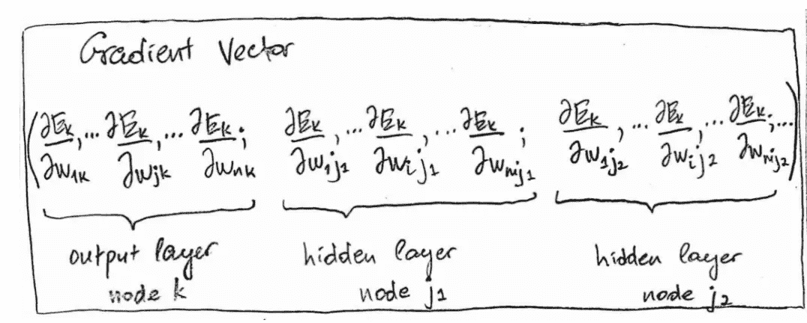****

****多层、多感知器神经网络的梯度向量表达式(也称为怪物表达式)****

****我将把上面的表达式 ***称为怪物表达式*** ，因为我以后需要引用它，并且因为它对我来说看起来像一个怪物。根据图 2，在计算梯度向量时，我们需要考虑两个层:换句话说，梯度向量的元素首先被计算为相对于连接输出层和隐藏层的权重的误差函数的偏导数，然后被计算为相对于连接隐藏层和输入层的权重的偏导数，从右到左(向后)。我强烈建议继续参考图表来形象化这里所说的内容。****

******输出层到隐藏层******

****如果我们只放大 monster 表达式中的一项，比如第二项，我们会看到误差函数相对于连接输出层和隐藏层的权重的偏导数，即相对于某个权重 *w_jk* (从右到左)。如您所见，我们从误差函数开始，在完成前馈时期后，节点 *k* 在输出层产生输出后，计算该误差函数。这是一个偏导数的表达式，它将隐藏层中的第 j 个节点连接到节点 k。****

****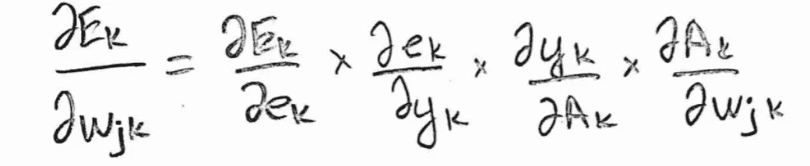****

****等式 1:用于计算关于连接输出层和隐藏层的权重的梯度向量元素的等式(从右到左)****

****这个方程是如何计算与最外层相关的梯度向量元素的一般化形式。在我们的特定示例中，由于我们有三个权重将节点 *k* 连接到隐藏层中的三个节点，因此我们将计算三个偏导数。这三个偏导数是描述*输出层到隐藏层*连接的梯度向量的三个分量(或元素)。实际上，这个通用表达式计算梯度向量，就像我们之前在单感知器模型中所做的一样。唯一的区别是我们在这个例子中改变了下标。****

> *******不要混淆梯度向量和偏导数的概念。梯度向量是包含误差函数相对于神经网络内的权重的偏导数作为其元素的向量。神经网络的梯度向量具有与网络中的权重一样多的偏导数。*******

******隐藏层到输入层******

****接下来，让我们放大 monster 表达式中的一项(即偏导数),它与连接隐藏层和输入层的权重之一有关(同样，从右到左)。更具体地说，让我们看看误差函数相对于连接隐藏层中的第 j 个节点和输入层中的第 I 个节点的权重的偏导数。*输入层中的第 I 个节点实际上与第 I 个输入相同——即 x_i.*****

****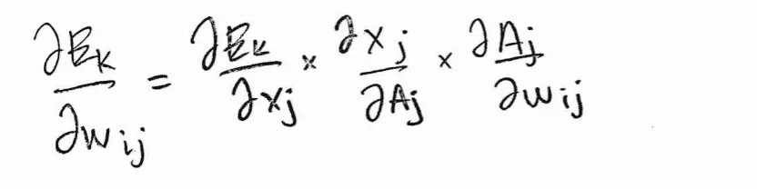****

****等式 2:用于计算关于连接隐藏层和输入层的权重的梯度向量元素的等式(从右到左)****

****在这种情况下，因为我们不是从输出层开始，所以误差不会一次向后传播一层。这就是为什么这个学期我们只有三个因素，而不是四个。总的来说，****

> ****关于将 ***隐藏层节点连接到输入层节点*** (也称为输入)的权重的偏导数有三项。****
> 
> ****关于将一个 ***隐藏层节点连接到另一个隐藏层节点*** 的权重的偏导数有三项(如果有多个隐藏层)。****
> 
> ****关于将 ***隐藏层节点连接到输出层节点*** 的权重的偏导数具有 4 项。****

****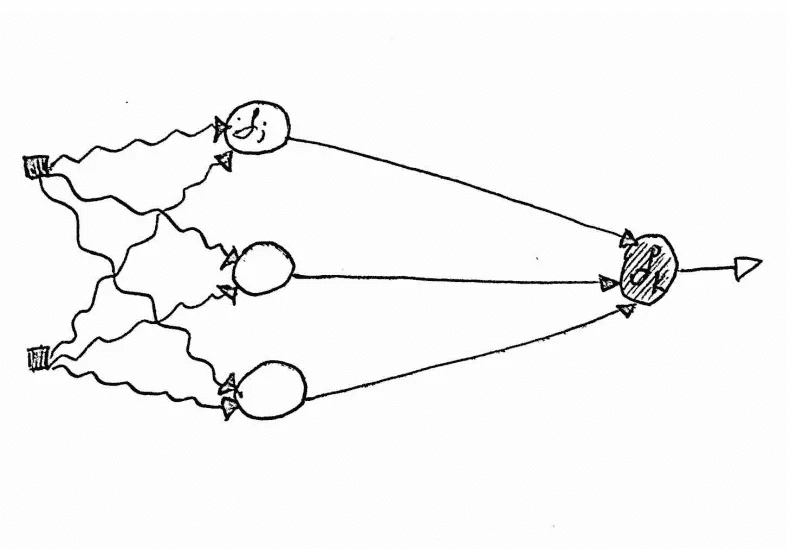****

****图 3:我们神经网络的简图。****

****回想一下，之前我一直提到“从右到左”。为了更好地描述这里讨论的过程，请阅读上面的图 3。****

1.  ****我们可以使用在输出节点计算的 *delta_k* 值来计算与误差函数相关的关于由直边表示的权重的偏导数。****
2.  ****偏导数允许我们计算隐藏层中节点处的 *delta_j* 值。****
3.  ****然后，因为我们现在有了 *delta_j* 值，我们可以计算与卷曲边缘表示的权重相关的偏导数。****
4.  ****但是 *delta_j* 的值依赖于 *delta_k、*的值，因此我们再次在网络中从右向左移动——或者换句话说，我们在后退。****

****这就是为什么我们把这个算法的过程叫做*’****‘反向传播’，*** 也叫做 ***反向传播历元。*******

******2.3。完整的 FFBP 算法******

****我现在会在这里给你更多的数学知识，因为这对理解神经网络如何学习并不重要。重要的是要知道，在做了一些微积分和代数魔术之后，我们可以进一步简化等式 2:****

****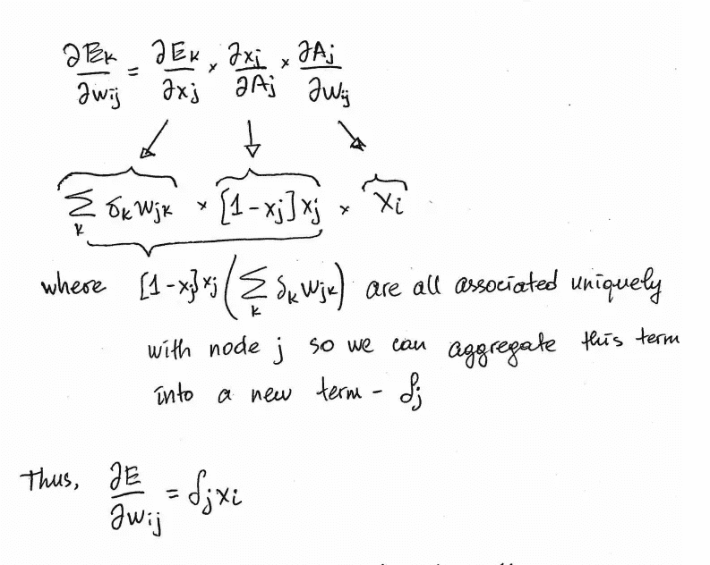****

****由于梯度向量的一个元素表示误差函数相对于给定权重下降最快的方向，我们可以将上面的表达式重写为:****

****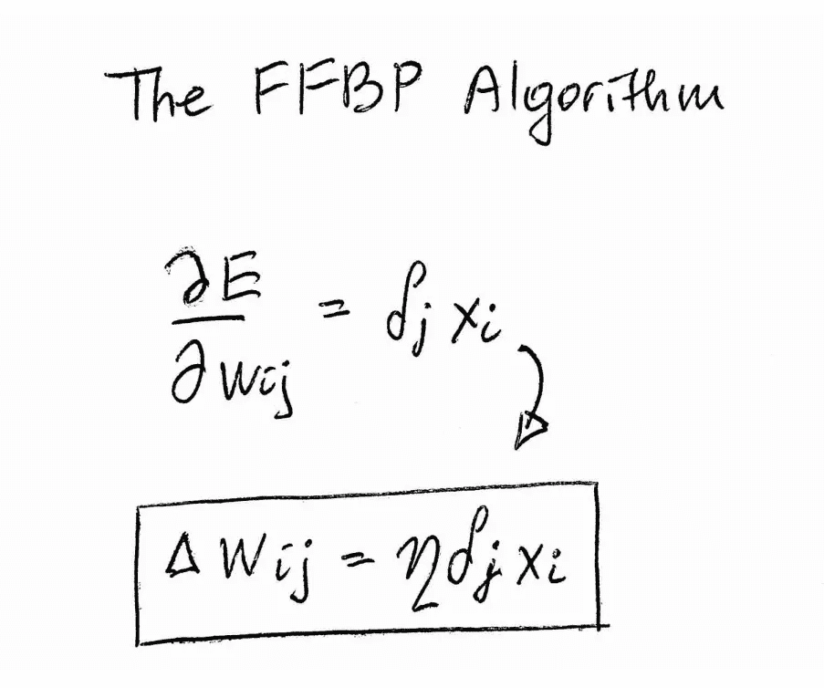****

> ******框中的表达式是 *FFBP 算法，该算法量化了需要应用于当前权重(* w_ij *)的变化(*δ*)，以便减少算法的下一次迭代的误差。*******

*****除了应用于具有更多节点和层的神经网络之外，您能看出这与我们为单个感知器模型导出的感知器 delta 函数非常相似吗？梯度向量要复杂得多，但这仅仅是因为增加了节点数量及其相关权重。唯一的细微差别是我们计算网络中不同层的梯度向量元素的方式略有不同(等式 1 和 2)。*****

****顺便说一下，如果你真的想看我上面跳过的数学细节，请在下面给我留言，我会把它包括进去。****

******3。概括所有的数学难题******

****我希望你看到，一旦你理解了单个感知器是如何学习的，那么理解具有更复杂拓扑的神经网络就是将我们已经知道的单个感知器扩展到由多个感知器和多个层组成的网络。也就是说，FFBP 算法本质上是应用于更复杂拓扑的感知器 delta 函数。我将再次敦促你，确保你理解我之前帖子中的所有内容，尤其是梯度下降是如何工作的，因为这是 FFBP 算法的关键部分。****

****概括地说，FFBP 算法在每次迭代中有两个不同的阶段:前馈时期和反向时期。****

1.  ****在前馈时期期间，输入通过网络从最左侧层到最右侧层馈送到节点中，直到在输出节点产生输出。一旦产生输出，就计算输出的误差。****
2.  ****在后推历元期间，误差函数用于计算梯度向量，该梯度向量包含关于网络中每个权重的偏导数，这是用于最小化误差的梯度下降的关键部分。导数是在网络中反向计算的-从最右边的输出层到最左边的输入层。****

****1 和 2 中的过程描述了 FFBP 算法的一次迭代。随着这样的迭代越来越多，网络以某种方式不断更新权重，使得误差函数继续变得最小。 ***一旦误差函数被最小化，意味着我们已经找到了网络的最佳权重，我们就说神经网络已经被训练好了。*******

****本系列的下一篇文章将是 FFBP 算法实现的数值例子。希望这个例子能进一步加强我在这篇文章中提出的数学。****

****此内容摘自 [*Rojas，Raul (1996):神经网络:系统介绍。柏林:施普林格出版社。第 7.1 至 7.3 章。*](http://page.mi.fu-berlin.de/rojas/neural/index.html.html) *4，第 8.1–8 . 2 . 1 章，摘自约翰霍普金斯大学教授 M. Fleischer 博士的课堂笔记《神经网络导论研究生课程》。*****