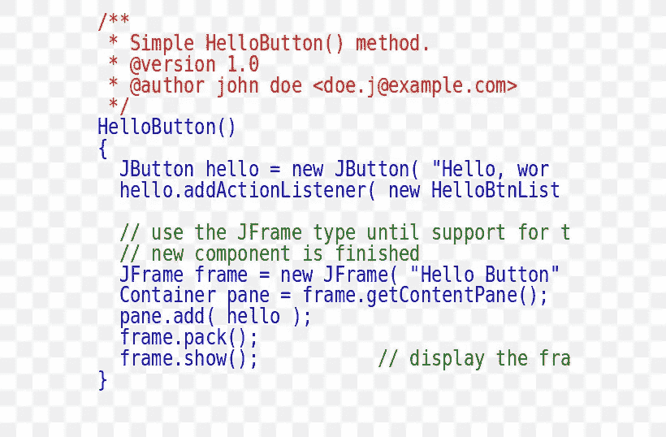
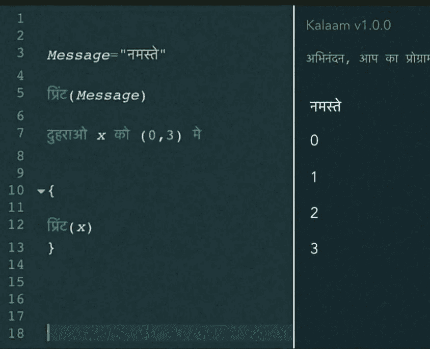

# 非英语国家如何规划

> 原文：<https://levelup.gitconnected.com/how-non-english-speaking-countries-program-1d7ae02f547>

## 这是我对自己很好奇的事情，而且…我终于联系到了一个知道答案的人

公平地说，并不是所有的国家都懂英语，考虑到英语对他们来说是完全陌生的，他们也没有必要去了解这种语言。当然，我们不会包括像印度，巴基斯坦等国家，因为他们没有英语作为他们的主要语言，但是…来吧…印度有世界上第二多的说英语的人，印度所有的节目都是用英语写的。但是像韩国、波兰、法国等国家呢？嗯，我们所做的，大约是所有程序的 33%。其余的是非英语或符号导向的…我知道。

> 顺便说一句，我知道你们中的一些人可能不同意这一点和你的个人经历，但是请记住。事实上，你正在阅读这意味着你可以理解和解释英语…我不是在说你

罗曼·辛克维奇·🇺🇦在 [Unsplash](https://unsplash.com?utm_source=medium&utm_medium=referral) 上拍摄的照片

# 第一种方法

一些开发人员通过使用英语和注释来完成这项工作，并将代码分割成他们可以用自己的语言理解的片段。这是通过使用关键字和标识符而不是语言理解来实现的。虽然对我们大多数人来说，这看起来很费时间，也不专业，但这是他们唯一可行的方法。还有，这种编程基本上是计算机眼中的英文编程，除了一堆评论，这意味着你有更多的机会让这个代码对其他人有用，因为它是英文的。

# 第二种方法

当然，这种方法只有在软件本身在他们开发它的国家完全孤立的情况下才是有用的，也就是说，使用一种本地语言的编程语言。

有像 sako 这样的编程语言——它类似于 Fortran，但是是为波兰人设计的；Chagno——主要是为韩国人设计的面向图形的程序，比如游戏；Rouille——一种生锈的法语编程语言；Kalaam——一种印地语编程语言；Glagol——一种俄语编程语言，等等……

所以，是的…大多数不熟悉英语编程语言的人有基本的选择，但需求也很少，而且很少使用。

# 第三种方法

但是还有另一种方法可以解决这个问题。那就是……你猜对了——可视化脚本。同样，你必须了解一些英语，才能读懂这里面写的基本单词，但根据我遇到的人，大多数人只是用它来学习英语语法，以及它如何作为一个开始的桥梁，继续使用一种语言手工编码。

所以，是的…那是一个我们从未见过的完全不同的世界，我们几乎不知道它是如何运作的。

也就是说，我希望你喜欢这篇文章，并从中获得一些东西，关注我的社交和 Patreon，这对我真的很重要，我会在下一篇文章中与你见面。

**你真棒:)**

> 法丁吉克