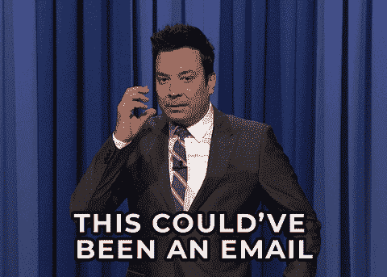
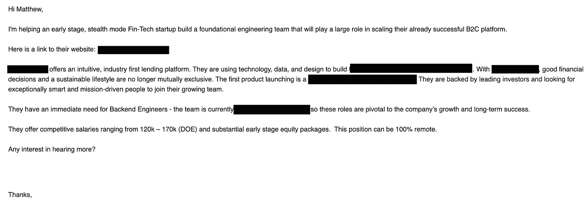
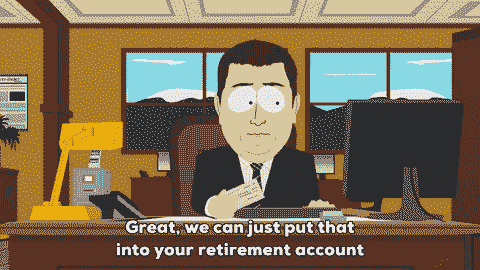

# 如何不招软件工程师

> 原文：<https://levelup.gitconnected.com/how-not-to-recruit-a-software-engineer-c05bffbb1793>

## 时间是我们最宝贵的财富；不要浪费它

埃里克·普劳泽特在 [Unsplash](https://unsplash.com/s/photos/hiring?utm_source=unsplash&utm_medium=referral&utm_content=creditCopyText) 上拍摄的照片

并非所有的招聘都是平等的。

我有过一些非常积极的招聘经历，我最终得到的工作和我没有得到的一样好。然而，对于每一次积极的招聘互动，我都有过*可列举的*消极互动。

我对目前的工作很满意，不打算找新工作。然而，如果我在找工作，我认为，由于我在各种技术方面有多年的经验和熟练程度，我会是一个非常强大的候选人。

我不是那种被糟糕的招聘程序伤害最深的工程师。

## 伤害最深的是谁

在我看来，最受糟糕的招聘/面试做法负面影响的是那些行业的新人。那些刚从大学或训练营毕业的人。那些一直在自学的人。那些从一个行业转到软件工程的人(几年前我就是这种情况)。

对于他们来说，找工作特别难，压力特别大， ***急*** 。

*不久前，我写了一篇关于训练营毕业生毕业后生活的博文***，但它可能对软件工程就业市场上的任何新求职者有所帮助。**

*当雇主在没有有效尽职调查和不尊重明确性的情况下联系他们时，第一次找工作的不安全感就被放大了。一些雇主可能会认为这是一个孤立的引诱*一个*求职者以低价得到他们的例子，实际上这是求职者每天经历的*的*复合*互动。**

**我记得那种感觉。**

**我会收到一封邮件。我会觉得最初的希望是这个会是我*最终*降落的位置。我的努力*终于*得到了验证，听不到回音的重担*终于*解除了。**

****

**只是在发了几封邮件、打了几个电话，或者两者兼而有之之后，才发现我没有足够的经验。**

**我不知道正确的筹码。**

**我不符合 XYZ 的要求，不配得到我要求的薪水，甚至这份工作本身。**

**在正常情况下，做出这些评估可能是公平的。**

> **招聘人员对工作要求、潜在薪资和福利都很坦诚。我试图证明我的能力，但不幸的是，我做不到，或者公司在其他地方找到了更好的候选人。**

**尽管这可能令人沮丧，但我不能说这是浪费时间或沟通不畅的结果。有时候星星就是不对齐。**

**但是我们都知道上述情况通常不是这样。**

## **典型的招聘场景**

**更典型的情况是，某人分享了一份模糊的工作描述和一份更加模糊的薪资福利待遇。有些要求看起来很武断，或者与你的经验不符，但尽管如此，这是一个他们“认为你非常适合”的角色这并不理想，也不十分清楚——尤其是当它涉及到对你有什么好处的时候。**

**但是，嘿，你*需要*一份工作。**

**至少这比申请一份工作，甚至得到一个面试机会，却被人代劳要有希望得多(根据最近的一项研究，T4 有 75%的可能性)。所以，你上钩了，被牵着鼻子走，却因为这样或那样的原因而失望。**

**事实是，很多这样的来回可能从一开始就已经决定了。这可以节省*新工程师、 ***和*** 雇主的宝贵时间，这些时间本可以分别花在个人技能/求职或寻找更理想的候选人上。***

****

**正如一位招聘人员所说，当我问他们如何获得我的联系方式时，他坦率地在一封冷冰冰的电子邮件中写道，“LinkedIn +互联网。大多数人的联系方式其实很容易找到。”**

**鉴于他们在“LinkedIn +互联网”上找到了我的联系信息，而且“相当容易”找到，人们可能会认为他们也“很容易”看到了我过去和现在就业情况的最准确代表，即我最常做的工程工作的经验和类型。**

**此外，我的 LinkedIn *没有显示我为新机会打开的电子邮件* ***或*** *。然而，他们只是在给我发了封冷邮件后才试图在那里与我联系。***

**当然，他们可以从其他地方收到我的电子邮件，但他们也可以从我的 LinkedIn 上推测出*也许*我不像其他人那样对新工作或冷冰冰的电子邮件持开放态度*积极接受工作*。**

**以下是上述招聘人员的原始询价。**

****

**公司和招聘人员信息已被编辑。**

**让我们来分解一下我对这封邮件的一些疑问。**

## **崩溃**

**首先，这是一封冷冰冰的邮件。这不是我理想的介绍方式，但是嘿，我很忙。如果它是彻底的，并提供更多具体的信息，说明它对我有什么好处——如果我真的在找工作——我也不会介意。**

**第二，虽然对公司的描述相对清晰，但有…**

*   ****没有**指定的工作要求。**
*   ****没有**技术栈，除了说它是后端。**
*   ****没有**提到项目管理风格或者我要向谁汇报。**

**只提到他们需要后端工程师。**

**虽然我精通全栈，但快速浏览一下我的 LinkedIn 就能告诉你，从历史上看，我的前端经验多于后端经验。我以为你在“LinkedIn +互联网”上找到了我的信息，而且“挺容易碰到”的？**

**第三，他们给了我一个相差 50k 的范围，“DOE”。稍后会详细介绍。**

**第四，他们没有提到健康、视力、牙科或退休福利，只是提到了“早期股权”(即初创公司的第一轮融资股权- *不完全是*近期的担保资金)。**

****

**最后，他们急需“后端工程师”——资历不明。**

**不要误解我的意思，我认为多年的经验或头衔不应该像有时那样成为薪酬评估的重要因素，但这种模糊性意味着我需要决定他们想要什么——当他们已经知道他们想要什么的时候。有点像你需要计算出你欠国税局多少税，尽管他们已经知道你欠了多少。**

**他们要中级工程师吗？学长？线索？以上都是？根据市场数据，上述所有人的工资标准都有很大不同。**

***这些招聘人员* ***无疑*** *拥有的市场数据。***

**我能自己解决这个问题吗？当然可以。一会儿我会告诉你怎么做。**

**问题是，当这个**招聘人员有了规格*而*是发起对话的人**时，它就把工作放在了候选人身上。他们只是不想分享太多，直到他们和你通过电话——即使这样，他们也可能会含糊其辞。**

**让我们跳回到他们提到的“母鹿”。**

**起初，范围和 DOE 似乎是有效的。嘿，这总比说它“有竞争力”要好，你的经验越多，你最终在他们给你的范围内的资格就越高。但是再看一眼，你会意识到你离获得一份清晰的薪水还没那么近——尤其是因为职位本身就很模糊。**

**他们对“DOE”的定义是什么？1-5 年？3-10 年？**

**除了“DOE”和提供的薪资范围不够精确之外，他们已经知道你有多少经验。考虑一下。**

## **他们到底知道多少**

**按照他们的说法，多年的经验是决定你薪水的重要考虑因素。由于多年的经验是相关的，而且你的信息很容易获得，可以有把握地假设他们对你有多少经验有一个粗略的想法——并且这大概足以使*至少获得*他们范围内的最低值。**

**难道他们不能把两个和两个放在一起，看看你的经验水平落在光谱的哪里？或者至少有一个更窄的范围？**

**让我们自己试试。**

****

*   **薪资范围:12 万美元至 17 万美元**
*   **范围最小和最大差异:50，000 美元**
*   **保守经验范围:3–10 年；7 年的差距**

> **我得出这个范围是假设他们不会为一个初级工程师支付 12 万美元，而且 10 年的经验可以被认为是非常资深的。**

*   **每经验一年的大概花费:大约 7142 美元(5 万美元/ 7 年)**
*   **我的经历(“在 LinkedIn +互联网上很容易找到”):大约 4 年**
*   ****预计工资:127142 美元(12 万美元+(1 x 7142 美元))****

**招聘人员在给你发邮件询问工作机会时不考虑上述任何信息的可能性微乎其微。万一他们真的没有上述信息，他们不应该伸出手，浪费他们(更重要的是你)的时间。**

**他们甚至不需要一个确切的数字，但你不能做得比 5 万美元的差异？你从专业角度为技术人员安排职位，是吗？**

**更不用说，他们 100%得到了某种预算。**

**相反，他们摆出了老掉牙的戏弄姿态:**

> **想了解更多关于这个职位的信息吗[例如，你的薪资范围是多少]？你这周有空吗？**

**这就引出了一个问题-为什么要有悬念？古老的说法是，他们不分享工资，因为他们不想让他们的竞争对手知道他们提供什么。[这很大程度上是废话](https://www.forbes.com/sites/jackkelly/2021/09/23/salary-ranges-should-be-listed-on-job-descriptions-and-worker-compensation-disclosed-for-all-to-see/?sh=62ec99a715e2)，但是让我们幽默他们一下。**

**这和一封冰冷的邮件有什么关系？竞争对手将如何看到他们提供的东西，并随后为我的相同职位提供更多？**

> **剧透提醒:他们不能，也不会。再试一次。**

## **真正的原因**

**那么为什么他们真的不告诉你呢？**

**简单。他们想要欲擒故纵，让你投入到这个过程中，然后很有可能**让你打电话**。**

**为什么在电话里？原因有很多。**

****

**第一，在电话中更容易推动对话，让*你*自己给*定价*。虽然这是你在求职时应该知道的事情，但通常来说，要钱是尴尬的，更不用说当你担心这会影响你找到工作的机会时——尤其是如果你是这个行业的新人。**

**相比电子邮件，主动对话的压力也能更好地为招聘人员所用。他们会给你发电子邮件，因为这比打电话更少侵扰和被动。虽然一封冷漠的电子邮件更容易被忽略而不会被吼，但它也更容易快速广泛地传播。**

**更不用说，除非你录下了电话，否则没有后人，也没有可供日后参考的书面记录。没有任何承诺或修饰的记录。**

***要了解为什么科技招聘人员喜欢打电话，请看这篇* [*的博文*](/why-software-recruiters-want-to-talk-on-the-phone-42e977d2f093) *。***

## **但是，这真的重要吗？**

**读到这里，你可能会想，*他为什么这么吹毛求疵？谁在乎描述的透彻不透彻？如果你***没有得到这份工作真的有关系吗？如果你* ***做*** *懂了吗？****

**作为一个多年来经历过上百次磨难的人，我可以自信地说是的。是的，它是。**

**我记得我刚开始时的感觉。来回的招聘过程既耗时又让人焦虑。**

**在你去那里之前，这不是一个权利的问题。我不相信我曾经或现在有资格得到我申请的任何工作，甚至是我现在的工作。我通过努力工作、敏捷、快速学习和对代码的热情获得了这些工作。**

**如果冷漠邮件在第一封邮件中多花一点时间提供更多信息，我认为我的招聘压力会大大降低吗？我会从更快捷的流程中受益，更快地找到工作吗？**

****

**就我个人而言，我认为雇主在提供更多信息上损失的时间(如果有的话)会以更快(和更多)的招聘过程的形式重新获得。你知道谁的时间*实际上受到了*负面影响吗？**

**工程师。**

## **物流**

**时间是我们最宝贵的财富。**

**当你积极找工作的时候，它会变得更有价值。**

**这个过程压力很大——尤其是对于那些目前没有工作、正试图开始职业生涯的人来说。回复邮件需要时间。**

**电话吗？甚至更久。**

**如果不占用你一天的时间，打电话是不容易的。回复一封电子邮件通常比留出一段时间积极申请职位要少得多。**

**如果一封邮件可以完成你试图在两封、三封或更多邮件或电话中完成的事情(剧透:可以)，那就去做吧。尊重你的时间、公司的时间和候选人的时间。**

**即使你最终支付的费用比你模棱两可时要多，从长远来看，这也能为公司省钱。**

**这些也只是物流。**

## **人民**

**考虑一下跟随一个 ***需要*** 这份工作的人的情感代价。**

**考虑到新工程师很可能被其他人或多人拖住，*而*他们积极申请更多的工作(*和*致力于开源，*和*研究算法，*和*基本上尽他们所能帮助他们的情况)。**

**总是如此，但特别是在今天的气候下，同情、诚实和清晰不应该被认为是理所当然的，以努力挤出更多的候选人来获得更低的薪水。**

**我们看到了疫情隧道尽头闪烁的光芒，多年来它极大地扰乱了(并夺走了)我们的生活。**

**俄罗斯入侵乌克兰，战争已经进行了几个月，并且(在撰写本文时)每天都在继续。**

**通货膨胀处于“四十年来的最高水平”。**

**雇主需要停止装傻，努力在谈判中胜过候选人。停止使用喷雾和祈祷的方法来分享工作机会。**

**给正在读这篇文章的新候选人:你努力工作来到这里，很快就会看到你的劳动成果——不要让某人伸手要一份工作而破坏了它。四年前，我对自己没有今天鼓励我在更不安全的就业情况下代表他人写这篇文章的那种自尊或信念。**

**读这篇文章的雇主们:做得更好。如果一份工作值得去做，那就值得花钱去做。员工寿命的好处是，更快、更积极的招聘过程比削减一些初始工资更有价值。时间是我们最宝贵的财富。**

**不要浪费每个人的。**

**你是一个感觉不同的招聘人员还是工程师？不要害怕让我在评论中听到它！**

**[***升级您的免费 Medium 会员资格***](https://matt-croak.medium.com/membership) *并接收各种出版物上数千名作家的无限量、无广告的故事。这是一个附属链接，你的会员资格的一部分帮助我为我创造的内容获得奖励。***

***您还可以通过电子邮件* [***进行订阅***](https://matt-croak.medium.com/subscribe) *每当我发布新内容时，您都会收到通知！***

***谢谢！***

## **参考**

** [## 我对新兵训练营毕业生编码的建议

### 天哪，你成功了！现在怎么办？

medium.com](https://medium.com/geekculture/my-advice-for-coding-boot-camp-grads-29a9d5eb6878)  [## 为什么员工和雇主在互相模仿

### 当劳拉被一家总部设在伦敦的跨国音乐公司邀请参加最后阶段的面试时，她想…

www.bbc.com](https://www.bbc.com/worklife/article/20220311-why-workers-and-employers-are-ghosting-each-other#:~:text=It%27s%20a%20practice%20that%27s%20common,company%20after%20a%20job%20interview)  [## 工资范围应该列在工作描述上，工人的报酬应该公开给所有人看

### 作为一个社会，美国对金钱有一种不健康的迷恋。我们如饥似渴地阅读“最富有的人”名单。金融…

www.forbes.com](https://www.forbes.com/sites/jackkelly/2021/09/23/salary-ranges-should-be-listed-on-job-descriptions-and-worker-compensation-disclosed-for-all-to-see/?sh=62ec99a715e2)  [## 为什么科技招聘人员喜欢打电话

### 如何避免成为另一个“这可能是一封电子邮件”的陈词滥调

levelup.gitconnected.com](/why-software-recruiters-want-to-talk-on-the-phone-42e977d2f093)  [## 在留住员工的问题上，薪酬重要吗？

### 在“大辞职”中，员工们都在行动。根据美国劳动局的数据…

lattice.com](https://lattice.com/library/does-pay-matter-when-it-comes-to-employee-retention#:~:text=The%20answer%20is%3A%20It%20does,needs%20to%20be%20a%20priority.) 

[https://www . Forbes . com/advisor/investing/why-is-inflation-rising-right-now](https://www.forbes.com/advisor/investing/why-is-inflation-rising-right-now/)/**