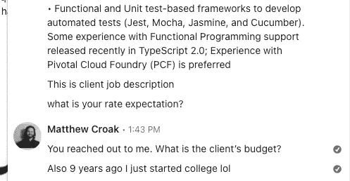

# 如何不招聘软件工程师第二部分

> 原文：<https://levelup.gitconnected.com/how-not-to-recruit-a-software-engineer-part-ii-d71acd581da3>

## 两次 LinkedIn 推介；两种截然不同的反应

路易斯·维拉斯米尔在 [Unsplash](https://unsplash.com/s/photos/interview?utm_source=unsplash&utm_medium=referral&utm_content=creditCopyText) 上的照片

如果你读过我最近的几篇帖子，包括这篇帖子的[第一部分](/how-not-to-recruit-a-software-engineer-c05bffbb1793)，你就已经知道我对杂乱无章的科技招聘人员有多不满意了。与其说是因为它们对我和我的职业生涯的影响，不如说是因为它们对那些最需要它们服务的人造成了伤害。

初级工程师。

## 最需要他们的人

大三学生，这个领域的新人，是最难找到工作的人。入门级职位的数量远远少于中高级职位，更不用说对许多初级职位的武断要求了，大多数人不会认为这些初级职位是入门级的。

大三学生更难证明自己的能力，因为他们是大三学生。除了一些演出或实习工作，他们通常没有专业经验。这些人通常也更渴望工作(考虑到他们还没有工作)。

我的观点是:

> 他们是最有可能与科技招聘人员合作的人，因为他们的参照系更小，对工作也更渴望。
> 
> *这不是秘密。*

说到这里，请和我一起进行另一个冷招聘分析。我们将比较两个冷冰冰的 LinkedIn DMs。下面是第一个。

这是第二个。

# 是什么让它们相同

在我深入探讨是什么让一个比另一个更好之前，让我们看看它们有什么共同点。

## 非常简短

简短，甜蜜，没有链接什么的。

## 关于工作/公司的信息很少

他们都提供了职位名称。第一条提到工作地点，时长，以及*面试方式？*第二个提到了公司。

除此之外，他们没有给我太多的其他工作。

## 对我有什么好处

这并不奇怪。

显然，当你招聘某人时，提供哪怕是一点点薪水和福利都是不可能的。它们都没有包括任何工资信息(我假设第一个是小时工资，因为它看起来是合同规定的)，更不用说任何保险和其他福利的指示(因为第一个看起来是合同规定的，我猜没有)。

## 我拒绝了他们两个

对他们来说不幸的是，我只是对我目前的状况很满意，并没有积极寻找新的角色。

# 是什么让他们不同

现在我们已经讨论了它们的共同点，让我们看看它们的不同之处。实际上只有两件事，但第一件事会造成很大的不同(没有双关的意思)。

## 自动化/爆炸与个性化

毫无疑问，第一个是普通爆炸，可能是自动的。他们说“希望你做得好！”当他们甚至不直接称呼我*和*时，他们试图表现出真诚，但他们直接进入了**角色最基本的**参数。接下来是“谢谢&问候”以及可能是公司电子邮件的页脚。

他们没有花时间让它变得更加个性化。这告诉我，他们也没有花时间让*真正查看我的 LinkedIn* ，看看我是否真的**是一个好的候选人(稍后会详细介绍)。**

**第二个，更有风度。**

**他们不用我的全名，甚至不用我的名字，而是用大多数人叫我的名字:马特。现在，有些人可能会说，用你不认识的人更熟悉的术语称呼他们是不好的做法。**

**对于这些情况，我完全不认同。**

**他们没有说任何贬义词，甚至没有任何暗示性别的话。以这种方式称呼我，表明这是一个个人的，而不是大众的信息。**

**他们有没有复制/粘贴尸体发给其他工程师？很有可能。**

**但事实上，他们花时间直接称呼我，并使用昵称是一种很好的。更不用说，这让我相信他们可能看了我的 LinkedIn 或其他链接(我称自己为 Matt ),因此对我是否适合这个角色有了更好的想法。**

## **我的回应**

**我的回答是，咳咳，对他们两个来说非常不同。**

**尽管事实上我拒绝了他们两个，但我认为他们中的一个值得继续交往下去。下面是我对第二条更有个性的信息的回应。**

****

**这是 LinkedIn 比较轻松的一面:连接和建立共生的职业关系。以后我们都可以把对方当成资源。**

**以下是我对第一条一般性信息的回应。**

****

**如你所见，比起保持联系，我更担心在这里发表观点。之后，他们回复了一份更长的工作描述，但我不会把整个事情都包括进去，因为除了有些多余之外，没有什么值得注意的(对于这些类型的询问来说，这并不稀奇)。**

****

**在顶部，它基本上与第一条消息相同(除了这次它们共享客户端)。他们仍然没有试图以任何方式解决我。**

**还有…**

> ****9 年以上的工作经验必须****

**很抱歉…**

****

**快速浏览一下我的 LinkedIn 就会告诉他们，我**没有这么多经验。但同样，这不是一个经过充分研究的推介。****

**9 年多前，我基本上开始上大学。我想我应该让他们知道。**

****

**还有，他们问**我**我想要什么**报酬**。你会爱上它的。这些招聘人员……姑且称之为“大胆”。他们找到我，要我给自己定价。**

**但是谁知道呢。也许他们是招聘游戏的新手。**

**我想我应该让他们知道，如果他们打算向人们伸出援手，他们应该在心里有一个号码。**

**你可能会想，在我回复之后，他们可能会带着更多的钱回来，或者可能根本不会回来，因为我显然不感兴趣。**

**但是没有。**

**“大胆”还在继续。他们只是用“分享你更新的简历”来回应。**

****

**这是真实的生活吗？与其问他们这个，我决定让他们知道我的感受。**

****

**我的口才无与伦比。**

**我意识到委婉语可能翻译不好。所以我决定给他们写一份更全面的回复。**

****

**更加雄辩和专业。**

**我希望他们明白，人们——尤其是那些真正需要工作的人——应该得到尊严和尊重。当一个已经申请了几个月却一无所获的人得到一个潜在职位的消息时，对他们来说这感觉像是一个转折点。又一次结束紧张求职的机会。**

**这不是邀请他们把胡萝卜放在鼻子前面。**

**作为招聘人员，你拥有他们想要的所有信息。他们已经在找工作上花了这么多时间，不要再给他们介绍新的机会了。**

> **时间是我们最宝贵的财富，所以请记住这一课，尊重他人的时间和注意力。**

**我仍然感到震惊的是，这些招聘人员只是到处宣传一个模糊的工作描述，希望以更低的价格找到一个绝望的人。**

**对不起，但是滚开。**

**你认为第二个招聘人员没有第一个成功吗？让我换个方式问。你认为第二个招聘人员看起来和第一个招聘人员一样绝望吗？或者似乎不太可能保持积极和富有成效的联系？**

**如果你这样认为，那么请看我对第一位招聘人员的回应。**

****

**我敢拿我的薪水打赌，第二个招聘人员的工作安置成功率更高，而且比第一个人挣得更多。**

> **作为一名招聘人员，你还想要什么？**

**为了结束这个分析，让我们看看他们是如何回应我的课的。他们真的带走了吗？我真的有所作为吗？**

****

**这似乎是…一个大大的否定。好吧，总是有下一次(相信我，会有下一次)。**

**[***升级您的免费 Medium 会员资格***](https://matt-croak.medium.com/membership) *并接收来自各种出版物上数千名作家的无限量、无广告的故事。这是一个附属链接，你的会员资格的一部分帮助我为我创造的内容获得奖励。***

***您还可以通过电子邮件* *订阅，每当我发布新内容时，您都会收到通知！***

# **参考**

** [## 如何不招软件工程师

### 时间是我们最宝贵的财富；不要浪费它

levelup.gitconnected.com](/how-not-to-recruit-a-software-engineer-c05bffbb1793)  [## 为什么没人再雇佣初级开发人员了

### 当全世界软件开发人员的工作机会和薪水一起飙升的时候…

www.notonlycode.org](https://www.notonlycode.org/nobody-hires-juniors/)  [## 初级经验要求可能会影响你的招聘

### 在美国有比官方认定的失业人数更多的工作机会，然而…

www.shrm.org](https://www.shrm.org/resourcesandtools/hr-topics/talent-acquisition/pages/entry-level-experience-requirements-hurting-hiring.aspx)**