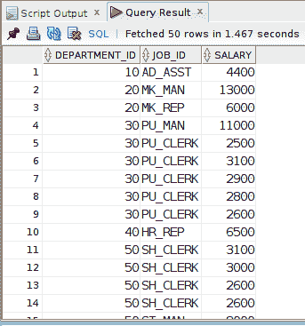
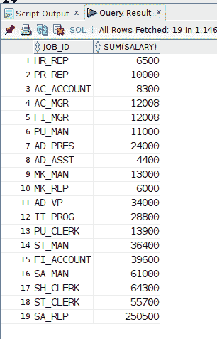

# 在 GROUP BY 查询中如何限制 ORDER BY

> 原文：<https://levelup.gitconnected.com/how-order-by-is-restricted-in-group-by-queries-ba92ea57e2d9>

像往常一样，我在我的博客上分享我在这里学到的东西。随着我继续学习 SQL，这种语言的细微复杂之处总是让我感到惊讶，除非你被它们迷住了，或者通过有意的学习，否则你不一定会学到。幸运的是，我的情况是后者。我指的是在`GROUP BY`查询中使用的`ORDER BY`子句。继续阅读了解更多信息。

图片来自 [Pixabay](https://pixabay.com/?utm_source=link-attribution&utm_medium=referral&utm_campaign=image&utm_content=154203)

自我推销:

如果你喜欢这里写的内容，尽一切办法，把这个博客和你最喜欢的帖子分享给其他可能从中受益或喜欢它的人。因为咖啡是我最喜欢的饮料，如果你愿意，你甚至可以给我买一杯！

## 重点 SQL 研究

从《OCA Oracle 数据库 SQL 考试指南》这本书[(非附属链接)中，我读到一些信息，当出现`GROUP BY`子句时，`ORDER BY`有些受限。我觉得我应该已经知道这些了。但是，为了巩固我的知识，我写在这里。](https://www.amazon.com/dp/B07484STST/ref=cm_sw_r_cp_apa_glt_Z6SXJH7DB4N4CTG42GGZ)

我使用 Oracle 数据库，因为这是我重点了解的实施。*我不是 100%确定这些原则是否适用于其他 SQL 供应商*。

## 抽样资料

对于示例查询，我使用的是作为流行实践 **HR** 模式一部分的 **EMPLOYEES** 表:

员工表描述

## 按 SELECT 子句列表中存在或不存在的列排序

这是一个相对简单的查询，带有一些**部门标识**、**工作标识**和**薪水**信息。通知一`ORDER BY`出现在`SELECT`条款列表中的**部门标识**:

(注意:某些输出行受限于给定屏幕截图中的可用内容。)

选择列表中的 DEPARTMENT_ID 列。

下一个查询类似于上面的查询。不同的是 **DEPARTMENT_ID** 不包含在`SELECT`子句列表中。然而，我可以`ORDER BY` 没有问题的**部门 ID** 列:

(注意:一些输出行受限于给定屏幕截图中的可用内容。)

DEPARTMENT_ID 列不在选择列表中，但仍能进行排序。

## 在 GROUP BY 查询中引入 ORDER BY 子句

现在让我们执行一个查询，将`SUM()`列的**工资**列。我们必须`GROUP BY`不属于聚合函数调用的任何列。在本例中， **JOB_ID** 列。但是，看看我尝试和`ORDER BY`的**部门 _ID** 列时会发生什么:

报告了错误。

结果，那个查询是不允许的。

为什么不呢？在前面的一些示例查询中，我对一个列进行了`ORDER BY`操作，不管该列是否在`SELECT`子句列表中。

# GROUP BY 查询中的 ORDER BY 限制

因为使用`GROUP BY`子句时`ORDER BY`是有限的。让我们来看看在这个特定的上下文中`ORDER BY`子句中到底允许什么。

## 按 SELECT 子句列表中的列或 GROUP BY 子句中指定的列排序

您可以对出现在`SELECT`子句列表中或在`GROUP BY`子句中命名的列进行`ORDER BY`操作。在下面的查询中，我在`ORDER BY`子句中使用了 **JOB_ID** 列，在这种情况下，它涵盖了两个*规范*(这里不太严格地定义):

GROUP BY 查询中 ORDER BY 子句的查询结果。

(相关:`ORDER BY` *目标*可以通过名称、别名或数字列列表位置来指定。)

## 按聚合函数排序

对于这个例子，我通过`SUM(SALARY)`聚合函数调用进行排序，这是完全有效的:

对我每周发来的关于我在 SQL/PHP 世界做什么的邮件感兴趣吗？访问此[注册](https://digitalowlsprose.ck.page/1b35a06295)(异地链接)页面并订阅。我保证没有垃圾邮件。谢谢大家！

ORDER BY SUM()聚合函数。

## 按任意聚合函数排序

对我来说更棘手的是，排序集合函数*不需要出现在`SELECT`子句中。这里我在**雇用日期**列上使用了`MAX()`聚合函数:*

按 MAX()聚合函数排序。

下面是对`SELECT`子句列表中`MAX(HIRE_DATE)`聚合函数调用的后续查询，作为排序顺序的参考:

在 SELECT 子句列表中包括 MAX()聚合函数调用。

## 未覆盖:用户、系统日期、UID

参考书中还提到`ORDER BY`可以指定[用户](https://docs.oracle.com/javadb/10.8.3.0/ref/rrefsqlj42476.html)、[系统日期](https://docs.oracle.com/cd/B19306_01/server.102/b14200/functions172.htm)或 [UID](https://docs.oracle.com/database/121/SQLRF/functions239.htm#SQLRF06153) 当有`GROUP BY`时。在撰写本文时，我还没有介绍这个功能，因为我不熟悉这些细节的最佳环境。

如果您看到任何不正确的地方或对代码有任何疑问，请在下面的评论区留下您的评论。感谢您的阅读！

请添加任何评论，强调您使用`GROUP BY`子句对查询进行`ORDER BY`排序的体验，从而帮助这篇博文变得更好。

喜欢你读过的？看到什么不正确的吗？请在下面评论，感谢阅读！！！

# 行动的号召！

感谢你花时间阅读这篇文章。我真心希望你发现了一些有趣和有启发性的东西。请在这里与你认识的其他人分享你的发现，他们也会从中获得同样的价值。

访问 [Portfolio-Projects 页面](https://wp.me/P28ctb-3KD)查看我为客户完成的博客帖子/技术写作。

[**如果你给我买咖啡，我一定会喝！**](https://ko-fi.com/joshlovescoffee)

要在最新的博客文章发表时收到来自本博客(“数字猫头鹰散文”)的电子邮件通知(绝不是垃圾邮件)，请点击“点击订阅！”按钮在首页的侧边栏！(如有任何问题，请随时查看 [Digital Owl 的散文隐私政策页面](https://wp.me/P28ctb-3gI):电子邮件更新、选择加入、选择退出、联系表格等……)

请务必访问[“最佳”](https://joshuaotwell.com/where-blog_post-in-digital-owls-prose-best-of/)页面，收集我的最佳博客文章。

[Josh Otwell](https://joshuaotwell.com/about/) 作为一名 SQL 开发人员和博客作者，他热衷于学习和成长。其他最喜欢的活动是让他埋头于一本好书、一篇文章或 Linux 命令行。其中，他喜欢桌面 RPG 游戏，阅读奇幻小说，并与妻子和两个女儿共度时光。

免责声明:本文中的例子是关于如何实现类似结果的假设。它们不是最好的解决方案。所提供的大多数(如果不是全部)示例都是在个人发展/学习工作站环境中执行的，不应被视为生产质量或就绪。您的特定目标和需求可能会有所不同。使用那些最有利于你的需求和目标的实践。观点是我自己的。

*原载于 2021 年 6 月 30 日 https://joshuaotwell.com***。**