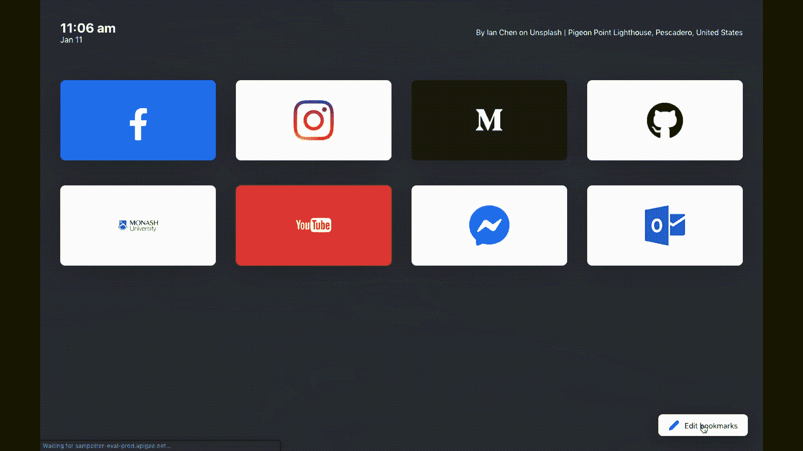

# Podac 如何将图像加载速度提高 95 倍

> 原文：<https://levelup.gitconnected.com/how-podac-loads-images-95x-faster-f1d6063590c2>

## 不，这不是魔术，只是简单的 Chrome 诡计

在过去的一年里，我的一个有趣的小项目一直在构建一个优雅而高效的新标签页。自从我开始使用 Chrome 以来，我对默认的新标签页印象不深:只包含几个最近的链接(其中大部分我从未真正需要)和谷歌搜索栏。我想在那一页上放的是我的主要书签，用一些漂亮的背景加以点缀，这应该不是太难的要求。

使用 React，我组装了一个简单的背景组件，它将首先从我在 Unsplash 上的个人收藏中获取图像，然后将它们呈现在视图中。

然而，这样做有一个非常明显的问题:加载时间。运行一个实验，我计算出获取 Unsplash 图像的平均加载时间为 395ms，实际加载图像并将其渲染到视图中需要 792ms。发生这种情况是因为在加载时，组件首先必须向 Unsplash 发送一个 API 调用，等待响应，然后最终发送另一个请求来加载返回的图像 URL。这意味着有很多不必要的加载时间，这对一个新的标签页来说是不可接受的。

# 解决方案 1:预加载去毛刺图像

我心想，与其从 Unsplash 获取当前页面的 URL，不如将该 URL 保存到 localStorage 并在下次打开新标签时使用。这样，就不需要在加载映像之前向 Unsplash 发出请求，有效地减少了总的加载时间，对吗？

您会注意到一些变化:不是直接从 Unsplash 获取背景的 src，而是通过`fetchSrc`函数重新路由。在这个函数中，它首先检查 Unsplash 中是否有已经保存的图像，如果没有，则返回保存的 url 或一个全新的 URL。

**幸运的是，获取图像源的加载时间缩短到了 5 毫秒！不幸的是，背景渲染到视图中的加载时间增加到了 977 毫秒。**这意味着后台加载的总时间只比以前稍微快了一点。也许，Unsplash 的 API 在这几次运行中很忙，导致图像加载时间实际上增加了。虽然在获取图像源方面有 390 毫秒的改进，但也不算太差。

# 解决方案 2:保存到 Chrome 的图像缓存中

在我摆弄之前的解决方案时，我注意到了一些有趣的事情。有时我会打开预先加载的图片网址看一看，认为我可以预测下一个标签打开时会出现什么照片是非常巧妙的。但是这样做，意味着当我真正打开一个新标签页时，图像加载几乎是即时的。我意识到，在打开那个保存的图片 URL 时，我一定是把它保存到了某种 Chrome 图片缓存中。因此，当我最终打开这个新标签时，这个缓存将允许后台以闪电般的速度加载。所以我想知道我能否用我的代码复制这个。您还记得上一个解决方案中的`saveNextImage`函数吗？这只是添加到该函数中的一行神奇的代码，它极大地缩短了加载时间。

那一行代码:

`fetch(image.urls.custom).then(res => console.log(res));`

一条很容易被认为毫无意义的线，提供了巨大的性能优势。**在获取预加载的图像时，结果显示图像加载时间平均下降到 42 毫秒！比第一个解决方案提高了 95%。**图像加载时间的大幅减少，加上从 localStorage 获取图像源所需的 5 毫秒时间，意味着每当我打开一个新标签时，我只需 47 毫秒就能看到一幅漂亮的背景图像。

# 结论

总而言之，我能够**将 1180 毫秒的平均加载时间减少到仅仅 47 毫秒！**加载新标签的体验从缓慢转变为流畅优美。但是当然，这只是实现更优雅、更高效页面目标的第一步，最终版本看起来更像这样

如果你喜欢它的外观，你一定会喜欢它的手感。请自行下载该扩展:

[https://chrome . Google . com/web store/detail/new-tab-page-podac/](https://chrome.google.com/webstore/detail/new-tab-page-podac/nfonljoaendacefohigmllikiempdipg)