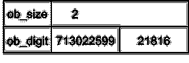

# Python 如何使用 Bignum 表示整数

> 原文：<https://levelup.gitconnected.com/how-python-represents-integers-using-bignum-f8f0574d0d6b>

## 了解 Python 如何使用 Bignum 表示任意数量级的整数。


照片由克里斯·贾维斯在 [Unsplash](https://unsplash.com/s/photos/addition?utm_source=unsplash&utm_medium=referral&utm_content=creditCopyText) 上拍摄

用 C/C++等低级语言编码的程序员需要考虑整数表示所用的内存量。他们必须考虑变量的最小值和最大值，以避免溢出问题。这些程序员必须考虑一个`int`是否足够，或者一个`long`是否必要。

与 C/C++相比，Python 在处理整数时更有优势。在 Python 中，不存在整数溢出问题；因此，Python 程序员不需要担心每个整数使用什么变量类型。Python 允许程序员操纵巨大的数字，而不必担心精度损失。Python 中整数的唯一表示限制是当机器用完空闲内存时，但这是硬件限制。

实际上，这对于计算像阶乘这样的大值很有用。不使用外部库，Python 可以独立于结果的大小计算阶乘。下面是一个计算阶乘的函数示例:

```
def factorial(n):
   if n == 0 or n == 1:
     return 1
   return n * factorial(n-1)
```

使用输入`231`执行`factorial`函数演示了 Python 可以表示的整数值的大小。

```
>>> factorial(231)
1792233667382633521618843263044232513197622942259968207385215805123682159320161029848328112148883186161436034535802659466205111867109614573242316954383604389464524535467759401326264883566523043560811873179996072188155290081861628010250468430411854935707396605833540921031884571521279145124581094374547412403086564118143957940727734634769439112260383017302489106932716079961487372942529947238400000000000000000000000000000000000000000000000000000000
```

> 注意，有更高效的算法来计算阶乘；这个例子用来说明输出的大小。

**整数表示法**

在进一步讨论之前，请注意本文只考虑了 CPython 实现。这个实现是 Python 的默认版本，也是最常见的分布式版本。不同的实现可以用不同的方式表示整数，但是这里的讨论只涉及 CPython 中的整数表示。使用 CPython 的一个好处是，整个代码库在 Github 上的 CPython 存储库中是公开的。

从 Python 3 开始，所有整数值都用下面的结构表示:

```
struct _longobject {
   PyObject_VAR_HEAD
   digit ob_digit[1];
 };
```

可以这样扩展宏和表示结构:

```
struct {
   sssize_t ob_refcnt;
   struct _typeobject *ob_type;
   ssize_t ob_size; 
   uint32_t ob_digit[1];
 };
```

上面结构的前两个元素对于这个讨论并不重要。元素`ob_refcnt`用于 Python 的垃圾收集器中，而`ob_type`用于类型标识，在本例中，对象是一个整数。

整数值由另外两个变量表示:`ob_digit`和`ob_size`。Python 使用`ob_digit`数组将数字的每个数字分别存储在不同的索引位置。此外，ob_size 变量用于存储两个值。它存储了`ob_digit`数组的长度和整数的符号(正或负)。

在大多数系统中，`ob_digit`是一个`uint32_t`数组，但是在一些旧的计算机中，`ob_digit`可以是一个`uint16_t`数组。本文将只考虑第一种情况的`uint32_t`数组。

这种用字符串或数组表示整数值的方法称为 Bignum 算法。通常，Bignum 实现用二进制表示值；然而，对于`uint32_t`数组来说，这并不节省空间。

**基地 2 ⁰**

考虑到使用`uint32_t`数组表示整数的系统，Python 不能使用所有 32 位来存储数字。对这种限制的简要解释是，出于实用性和效率的原因，Python 中的许多内置函数需要特定数量的位来表示整数。对于一个更好奇的读者，在官方的 CPython 库中有关于这个限制的评论。

因为 Python 只能使用每个元素 32 位中的 30 位，所以所有整数都被转换为基数为 2 的⁰.因此，数组中所有数字的值都在 0 和 1073741823 (2 ⁰-1).)之间注意，变量`ob_size`存储数组的长度，数字以⁰为基数 2，而不是以 10 为基数。

此外，数组表示是按小端顺序排列的。换句话说，顺序是从最不重要的值开始(较低的索引值)。例如，假设数字存储在基数为 10 的⁰中，而不是基数为 2 的，那么使用数组表示的数字`234`将是:`<4,3,2>`。

例如，Python 中的数字`234254646549834273498`将首先被转换成基数为 2 的⁰.因为我们没有足够的字符来表示基数为 2 的⁰中的所有数字，所以为了便于说明，基数为 2 的⁰中的数字将以基数为 10 来表示。因此，以 2 为基数的⁰中的数字`234254646549834273498`是`462328538,197050268,203`，其中`462328538`代表第一个数字，其他两个值以此类推。那是因为 462328538×(2⁰)⁰+197050268×(2⁰)+203×(2⁰)= 234254646549834273498。

因此，Python 中基数为 2 的⁰的数字`234254646549834273498`有 3 个数字:`462328538,197050268,203`，它在 Python 中的表示方式如下:


> 如果这个数字是负数，Python 表示将有相同的数组，但是`*ob_size*`将是`*-3*`。

**普通整数优化**

使用 Bignum 算法转换和表示整数的过程对于运行时操作来说非常耗时。由于这个原因，因为`int`类型在 Python 中是不可变的，所以 Python 在程序执行之前为`-5`和`256`之间的所有值创建表示。在执行过程中，每当请求这些对象时，Python 都会重用它们。

使用 Bignum 算法的一个明显缺点是在内存使用方面。Python 中的任何整数值都至少使用 28 字节的内存，比 C 语言创建一个类型为`int`的变量所需的内存多 7 到 14 倍。

**Bignum 加法**

使用 Bignum 算法的一个好处是执行算术运算的简单性。本文将只讨论加法，但是其他操作遵循相同的概念。

Bignum 加法背后的想法是执行加法，就像人们用纸和铅笔在 10 进制中添加数字一样。该过程首先从最低有效位开始，并继续向最高有效位进行。每个数字的每个数字分别相加，结果通过一个*进位值*向下一个更高的有效数字移动。


Bignum 算法使用数组遵循这种方法。该过程是将来自每个数组的相同索引的每个值分别相加，并将超出小数位的值结转到下一个索引。该算法从索引`0`开始迭代，直到最小数组的长度，始终使用进位方法将数字相加。

该算法首先创建一个新的空数组来存储结果。请注意，两个值之和的结果最多比总和中的最大数字多一位。例如，`9`和`93`之和就是`102`。本例中最大的值是`93`，它有 2 个数字。加法的结果有 3 位数，比`93`多一位。在某些情况下，结果的位数等于最大数的位数。在这种情况下，算法会减小数组的大小，以适应没有前导`0`的结果。最后一个数组单元格(最高索引)具有值`0`的唯一情况是用于表示数字`0`。

为了便于说明，这里有一个用 Bignum 算法表示的两个数字相加的例子。加在一起的值是`234254646549834273498`和`23425464654983`。

数字`234254646549834273498`可以这样表示:


数字`23425464654983`可以这样表示:



该算法首先创建一个大小为 4 的新数组(比表示加法中最大值的数组长一个单元格)。


接下来，该算法逐个索引地开始进位过程。


在遍历所有索引直到最小数组长度之后，该算法计算以下值:


最后，程序将数组大小减 1，以删除最后一个空单元格。然后，通过添加创建的完整结构以这种方式表示:


最初的算法是用 C 写的，但这里有一个 Python 函数模拟了这个过程。

> 函数`*add*`接受两个 Python 列表。每个列表代表这个函数中要添加的一个整数。这些数字已经被转换为以 2 为基数的⁰，并且每个列表元素存储该值的一个数字。

总之，Python 使用 Bignum 算法来表示整数。与 Java 和 C/C++等其他语言相比，Python 使得处理整数变得非常简单。虽然其他语言要求程序员确定存储数字的大小变量，但 Python 抽象了这一需求。但是，这种方法在内存使用方面也有缺点。像 C 这样的语言使用 2 或 4 个字节来表示一个类型为`int`的变量，而 Python 至少需要 28 个字节。对于简单的脚本，这种额外的内存使用不会造成差异；然而，对于数据量大的程序，使用 c 之类的其他语言可能会很有趣。

非常感谢您阅读这篇文章！很快我将发布更多关于 Python 和其他编程主题的内容。

**参考文献:**

https://rushter.com/blog/python-integer-implementation/

[https://www . code mentor . io/@ arpitbhayani/how-python-implements-super-long-integers-12 icw5 vk](https://www.codementor.io/@arpitbhayani/how-python-implements-super-long-integers-12icwon5vk)