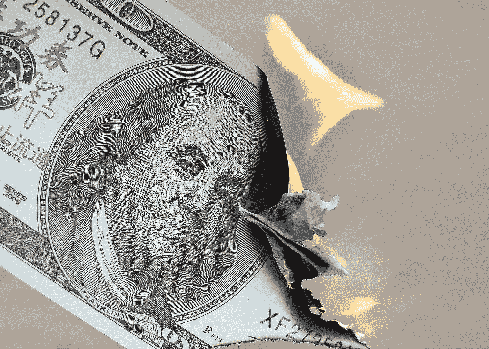

# Safe moon——被称为“加密的最新庞氏骗局”的 DeFi 令牌——有多安全

> 原文：<https://levelup.gitconnected.com/how-safe-is-safemoon-the-defi-token-described-as-cryptos-newest-ponzi-b49ddc1c9a4f>

## 投资机会还是骗局？

图片由 [Foto-Rabe](https://pixabay.com/users/foto-rabe-715168/?utm_source=link-attribution&utm_medium=referral&utm_campaign=image&utm_content=4418858) 来自 [Pixabay](https://pixabay.com/?utm_source=link-attribution&utm_medium=referral&utm_campaign=image&utm_content=4418858)

正如只要有钱，就有快速致富的计划。受害者被在短时间内轻松致富的承诺所诱惑，而且通常风险极小或为零。

可悲的是，这类计划通常只不过是利用脆弱和人类天生贪婪的骗局。加密货币代表了货币的技术演变，它在这类骗局中的份额已经超过了[。](/bitcoin-scams-and-how-to-avoid-them-bd7724f3ad54)

除了犯罪活动之外，比特币和以太坊等合法且成熟的加密货币的可信度和信任度也受到了许多不断涌现的另类硬币和所谓的迷因硬币的进一步破坏。虽然其中一些在实现去中心化金融(DeFi)方面具有真正的潜在作用，但大多数只不过是现代创始人和少数幸运投资者的快速致富计划。

当密码怀疑论者听说最近的一些现象，如 [DogeCoin](/deconstructing-dogecoin-not-all-cryptocurrencies-are-equal-ee347b29700f) (一种最初作为笑话出现的迷因币)[的价值在 2021 年攀升了 6500%](https://www.marketwatch.com/story/dogecoin-armys-campaign-to-drive-crypto-to-1-was-a-bustso-why-do-bulls-still-feel-vindicated-11619024046)，这主要是由像 Elon Musk 这样的人的推文和咆哮推动的，这重申了他们的信念，即密码作为一个整体只是一个泡沫，或者更糟，一个骗局。

来源:[推特](https://twitter.com/elonmusk/status/1284291528328790016?s=20)

Elon 和其他 Doge 爱好者在 Twitter 上引起的问题，更普遍的是相互矛盾的消息和在线炒作。一些人分享了他们如何通过日内交易这种代币在短时间内合法致富。幸运的是，他们在硬币定价很低时买入，在价格暂时飙升时卖出。

此外，还有一些故事来自那些希望效仿早期采用者成功的人，他们受到快速轻松赚钱的承诺甚至是财富前景的诱惑。他们冒的风险超过了他们能承受的损失，在最高价买入，当价格崩盘时，他们眼睁睁地看着自己的财富缩水到一无所有。

他们的行为是基于 FOMO 的投资策略的结果——害怕错失良机。

一些人变得富有，许多人失去了金钱，而比特币等相对稳定和持久的加密货币也遭到了同样的对待，经常看到它们的价格(和声誉)在替代货币崩溃后暂时变得暗淡。

促使投资者常规行为的最新加密令牌是安全月。

# 什么是 SafeMoon？

SafeMoon 在其网站上被描述为*“一个社区驱动的，公平推出的 DeFi 令牌。”*

鉴于它的结构鼓励那些购买硬币的人长期持有，它的创始人推出它似乎有着高尚的意图。这是通过从每笔销售中扣除 10%的费用来实现的，其中一半然后分配给现有的硬币持有者。这种“税”理论上可以阻止任何人进行日内交易，因为收益必须超过扣除额，才能使任何交易有价值。

问题是在短期内，其收益(由市场狂热和网上炒作推动)的飙升远远超过了旨在阻止抛售的 10%的扣除额。

截至 2021 年 4 月 19 日，其价格[在之前的 3 周](https://www.benzinga.com/markets/cryptocurrency/21/04/20686555/why-safemoon-cryptocurrency-is-up-130-and-what-you-should-know-about-it)内飙升了 2900%。在撰写本文时，它的定价为每枚 0.000004469 美元，如此微小的价格已被证明对那些想以少量投资获得几十万枚硬币的投机者具有吸引力。

# 为什么不碰碰运气呢？

SafeMoon 已经发行了 1000 万亿代币，这是一个惊人的数字。相比之下，只会发行 2100 万枚比特币，而完整的发行要到 2140 年左右才会铸造出来。

SafeMoon 代币发行本身的规模应该是一个危险信号。想想看，许多出现在网上的促销迷因都围绕着 SafeMoon 实现“仅 1 美分”估值这一看似可行的概念。在最近一集来自 CoinDesk 的分解播客[中，主持人指出，如果达到这个价格，其市值将达到 100 万亿美元——占整个世界财富的四分之一。可行吗？不是特别喜欢。](https://podcasts.apple.com/gb/podcast/breakdown-ico-2-0-how-will-big-bitcoin-buying-institutions/id1414384043?i=1000518087788)

不出所料(也让潜在投资者困惑的是),社交媒体平台上充斥着早期交易者吹嘘自己成功的帖子:

来源:[推特](https://twitter.com/RealKhalilU/status/1383992561237323779?s=20)

与此同时，YouTube 上出现了热情的“投资者”建议如何购买的视频——不过要明确的是，他们并没有提供财务建议(据称):

来源: [YouTube](https://youtu.be/fqf-Vo4Fv9k)

在这个阶段，SafeMoon 令牌的实际用例似乎在很大程度上是不相关的。通过搜索他们自己的网站和对媒体上各种其他文章的分析，仍然不清楚它的有用目的是什么，或者 SafeMoon 的长期目标是什么。所有迹象都表明，它将成为又一个投资泵和转储的载体。

毫无疑问，一些人会通过适时下注轻松赚一点钱，但会有更多的人被吸进去，下注超过他们输不起的数额。这就像是这些人将会遭受财务损失，并对加密货币整体感到不满。

# 价格暴涨的背后是什么？

有趣的是，各种推文表明，SafeMoon 可能是一个由协调一致的日内交易者组成的在线财团的关注对象，他们瞄准它，以期在抛售自己的股票之前抬高价格。

这种活动导致 GameStop 的[股票飙升](https://themakingofamillionaire.com/the-gamestop-and-wallstreetbets-episode-has-helped-normalise-bitcoin-133bbcc00192)，就像今年早些时候一样——这是 Reddit 上华尔街赌注集团的目标。

来源:[推特](https://twitter.com/cryptovenizo/status/1384078120873955331?s=20)

价格飙升可能是 Discord 和 Reddit 等平台上的群体协调活动的结果，或者仅仅是 Twitter、YouTube 和抖音视频上的帖子的累积效应。这可能是投资价格快速上涨时导致的典型狂热的代表——这种波动往往会吸引更多的投资者，他们出于 FOMO 的感觉而被迫参与进来。

不管是什么原因，都无关紧要。当价格高到无法支撑下去时，持有者就会跳槽，这将促使价格暴跌，伤害那些没有及时退出的人。

一直以来，各种各样的骗局和计划都是如此，这些骗局和计划以快速轻松的财富诱惑人们。泡沫迟早会破裂，最后持有的人是损失最大的人。

# 为什么加密货币更重要？

你可能想知道问题出在哪里？

谁在乎少数幸运(或勇敢)的人是否能赚到快钱？

首先，这是一个道德问题。像 SafeMoon 这样的加密令牌的创造者和向易受骗的买家出售魔豆的骗子没有什么区别。这有点像金字塔计划，金字塔底层的人最初可能会赚一点，但真正致富的是创始人。当所有的事情都发生时，那些处于顶端的人也受到的伤害最小。

另一个重要原因是，这种硬币和代币的发行可能会破坏比特币和以太坊等具有长期效用和真正价值的真正加密货币的正面声誉和诚信。

比特币有一个明确的长期目标——通过将更多的控制权、所有权和影响力放在公民手中，去中心化并从根本上改变我们的金融体系。它有望降低全球和跨国转移资金的成本和复杂性。它[让所有人都能获得](/bitcoin-could-be-a-force-for-social-good-heres-how-2a4150f2a1e)一种真正的价值储存手段，不会因为政府随意印刷新货币而贬值。

尽管许多持怀疑态度的人指出，比特币过去的价格波动是它与 SafeMoon 的一个共同特征，但它们之间的差异是显著和实质性的。。

比特币以[吸引了极端的情绪和观点而闻名，与持怀疑态度的人相比，它吸引了支持者的极端情绪和观点。目前在 SafeMoon 上看到的类似事件只会助长这些情绪，并混淆加密货币的情况。](https://medium.datadriveninvestor.com/bitcoin-is-it-mandatory-to-be-a-lover-or-a-hater-78b6a7307dad)

这些例子阻碍了人们真正理解比特币的工作原理以及它可能给他们带来的好处。它阻止了许多本可以从中受益的人参与进来。

# 下一步做什么？

如何投资是个人选择的问题——我们每个人都有自己对风险的容忍度和偏好。抛开情感不谈，明智的做法是只投资那些你能承受损失的钱，而且最好只投资那些你真正理解的东西。

就 SafeMoon 而言，一些人无疑会通过交易赚钱。问题是，它是否会有一个持久的未来，还是会在短期内分崩离析，随着它的崩溃，带走许多投资者的希望和梦想。

无论发生什么，我相信许多加密货币的真正支持者都渴望确保比特币和以太坊不会与 SafeMoon 之类的公司相提并论。

如果你喜欢阅读这样的故事，并且愿意支持 Medium 上的作家，考虑注册成为 Medium 会员。一个月 5 美元，给你无限的故事。如果你注册使用我的链接，我会赚一小笔佣金。

 [## 阅读托比·黑兹伍德(以及媒体上成千上万的其他作家)的每一个故事

### 作为一个媒体会员，你的会员费的一部分会给你阅读的作家，你可以完全接触到每一个故事…

tobyhazlewood.medium.com](https://tobyhazlewood.medium.com/membership) 

注:*本文仅供参考。不应将其视为财务或法律建议。在做任何重大财务决定之前，先咨询财务专家。*

## [如果你喜欢这篇文章，我希望你能加入我的邮件列表。](http://bit.ly/TobyHazlewoodList)