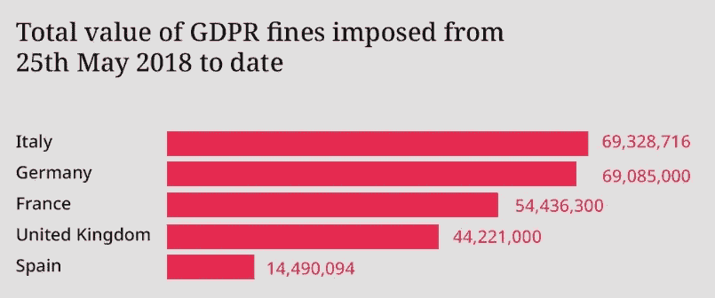

# 你公司的数据有多安全？

> 原文：<https://levelup.gitconnected.com/how-safe-is-your-companys-data-f6f969257d49>

## 数据泄露无处不在…我们做错了什么？

二十年前，通过普通的非加密电子邮件，通过纯文本文件(如 CSV)共享客户数据是很常见的。好了，明文，附在邮件里，简单明了！每个人都这样做了…

你今天会做吗？我希望不是！

由[米歇尔·特雷瑟默](https://unsplash.com/@mtresemer?utm_source=medium&utm_medium=referral)在 [Unsplash](https://unsplash.com?utm_source=medium&utm_medium=referral) 上拍摄的照片

数据隐私在任何地方都已经成为一个主导主题，大多数人都“意识到”数据隐私，即使他们决定不太关心它。此外，人们越来越意识到自己的权利，而“*救护车追逐者*”也是如此，他们试图通过传统的“*不赢不收费**”横幅从数据泄露的公司那里榨取金钱(最后，如果你赢了，你可能会得到大约 5 英镑……但别担心，他们会保留其余部分)。*

所有这些都明显改变了公司从基础设施和数据角度看待其安全性的方式，事实上，没有人希望成为愚蠢的数据泄露或不幸的勒索软件攻击的下一个受害者。

但是，即使很明显各公司都在努力做好这件事，但感觉我们还是没有做到……

> 如今，数据安全是出错代价最大的事情之一，然而，许多公司仍然没有通过最终测试...

事实是，数据泄露仍然太常见，其中很多都是由于纯粹的粗心，就像数据库完全开放给公共网络一样:

> [**2021 年 3 月 21 日**
> CVS 健康云数据库中的一个错误配置暴露了超过 10 亿条记录，(…)大约 240GB 的数据库没有密码保护(…)](https://www.itpro.com/policy-legislation/data-protection/359907/cvs-health-data-breach-leaves-a-billion-records-exposed)

和对公共网络开放的云存储桶:

> [**2020 年 8 月 12 日**
> (..)包含价值 7gb 的未加密文件，其中包括 **350，000，000 串唯一的电子邮件地址** (…) 留在可公开访问的(…) S3 桶(..)](https://cybernews.com/security/350-million-email-addresses-left-exposed-on-an-unsecured-server/)

这只是快速互联网搜索数据泄漏的两个小例子，而且只是冰山一角…当然，大多数泄漏不是由于新手的错误，但是，

> 公司犯了太多次错误，这让他们付出了沉重的代价…

# 对数据泄露的赔偿正在直线上升

最近，英国航空公司遭受了一次影响员工和客户的数据泄露，泄露的数据包括姓名、地址和卡的详细信息。

> “信息专员办公室向英国航空公司开出了迄今为止最大的一张罚单，罚款 2000 万英镑，原因是该公司未能保护顾客，这是“不可接受的”，BBC 新闻，2021 年[(来源)](https://www.bbc.co.uk/news/technology-57734946)

而这远不是一个“独特”的案例。在[这份 DLA Piper GDPR 罚款和数据泄露 2021 年 1 月报告](https://www.dlapiper.com/en/us/insights/publications/2021/01/dla-piper-gdpr-fines-and-data-breach-survey-2021/)中，我们可以看到排名前 5 位的国家自己受到了超过€2 . 5 亿英镑的罚款:

DLA Piper GDPR 罚款和数据泄露 2021 年 1 月报告，[如此处所示](https://www.dlapiper.com/en/us/insights/publications/2021/01/dla-piper-gdpr-fines-and-data-breach-survey-2021/)

我们都会对这些罚款是否太多，甚至对判决是否符合罪行有自己的看法，但最终这只是噪音:罚款是强加的，必须支付(*或在法庭上提出质疑*)。

# 门槛比以往任何时候都高

2017 年 9 月，Equifax 发生了迄今为止最重大的数据泄露事件之一。在调查违规事件期间，Equifax 承认该公司

> 6 个月前(3 月)通知说，黑客可以利用其系统中的漏洞，但未能安装必要的补丁。([来源](https://www.cnbc.com/2019/07/22/what-you-need-to-know-equifax-data-breach-700-million-settlement.html))

**总而言之，这次数据泄露估计给 Equifax 造成了约 5.6 亿美元的损失。哎哟…**

Sharon McCutcheon 在 [Unsplash](https://unsplash.com?utm_source=medium&utm_medium=referral) 上拍摄的照片

但除此之外，当时的美国联邦贸易委员会主席还说了一句非常有趣的话:

> “从个人信息中获利的公司有额外的责任来保护这些数据，”(……)“Equifax 未能采取基本措施来防止影响约 1.47 亿消费者的违规行为。”

请注意“*失败的基本步骤*”这里是:他们知道这个漏洞 6 个月了，却没有打补丁…

# “等你，畜生！”—来自内部的威胁

这幅 1888 年的画作由[威廉·霍姆斯·沙利文](https://en.wikipedia.org/wiki/William_Holmes_Sullivan)所作，命名为 [*Et 屠蛮*](https://en.wikipedia.org/w/index.php?title=Et_tu_Brute_(Death_of_Caesar)&action=edit&redlink=1) ，并位于[皇家莎士比亚剧院](https://en.wikipedia.org/wiki/Royal_Shakespeare_Theatre)，公共领域

人们经常将“数据泄露”与黑客联系在一起，但事实并非总是如此，有时威胁甚至来自您自己的公司内部！

> [2014 年，一名心怀不满的莫里森公司员工决定泄露近 10 万名员工的所有工资单信息(链接)。](https://www.bbc.com/news/uk-england-leeds-33566633)

这名员工是一名审计员，他需要访问数据作为其职责的一部分，因此您可能会认为这对莫里森来说是一个轻松的“脱身之计”,也是一条通往完全赦免的清晰道路……您可能会这样认为，但您大错特错了。

关于莫里森斯是否应该为泄密负责的决定让律师们工作了 4 年(*逝去的时间*)。[一审法院判决认定该公司负有责任，一审上诉法院也是如此](https://www.bbc.com/news/business-45943735)。直到 2019 年，在他们的第二次上诉中，[莫里森斯才得以达成一项有利的决定](https://www.computerweekly.com/news/252473689/Morrisons-in-new-appeal-over-data-breach-fine)，并设法躲过了 40 万英镑的罚款*(很多钱，但以今天的标准来看，实际上是一笔很小的罚款……)。*

# 有人可能会问，这些公司做错了什么？

这是必须的方式吗？好吧，一些泄露是注定要发生的，在一天结束的时候，有大型黑客企业产生了巨大的利润，他们非常持久。但我认为，仍有很大空间让他们的生活变得更加艰难。

你在网上发现的许多数据泄漏都是从容易解决的错误开始的:没有人阻止公共访问的 Blob 存储桶、向公共 web 公开的不安全数据库、未打补丁的已知安全漏洞等等。

但这是我下周文章的主题…
**现在正在直播！** [你可以在这里阅读](https://jmarquesdatabeyond.medium.com/data-leaks-everywhere-what-are-we-doing-wrong-5ca6f627aadf?sk=b4a11dfbe39f76aacf783ae08f1efd47)