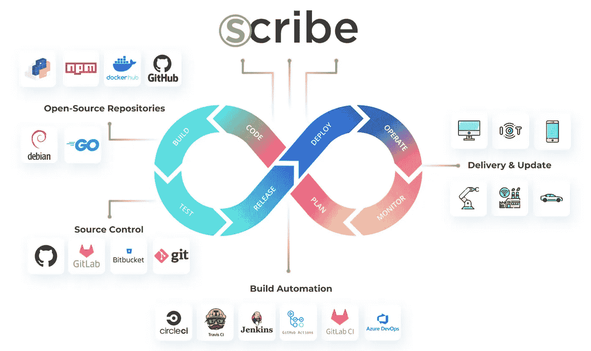
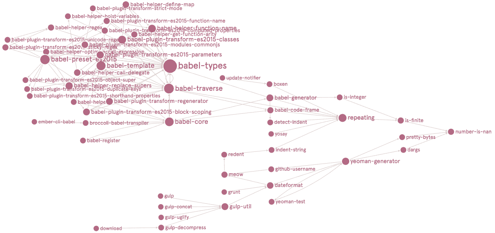
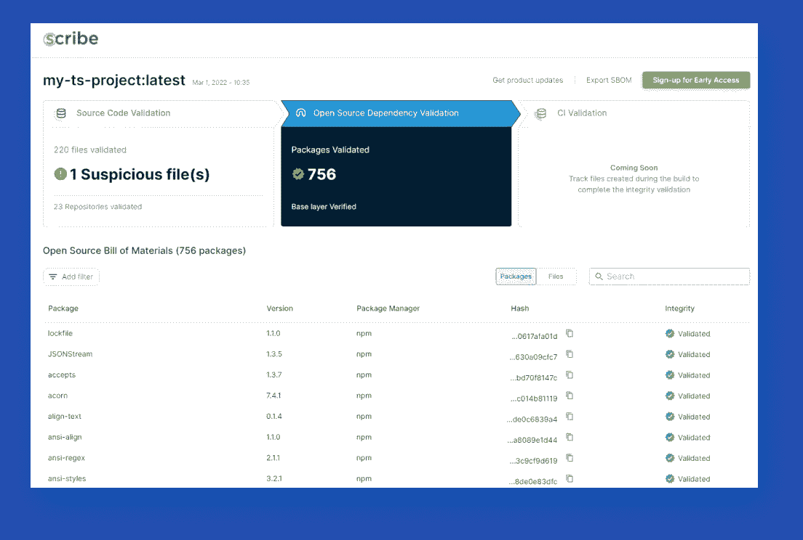
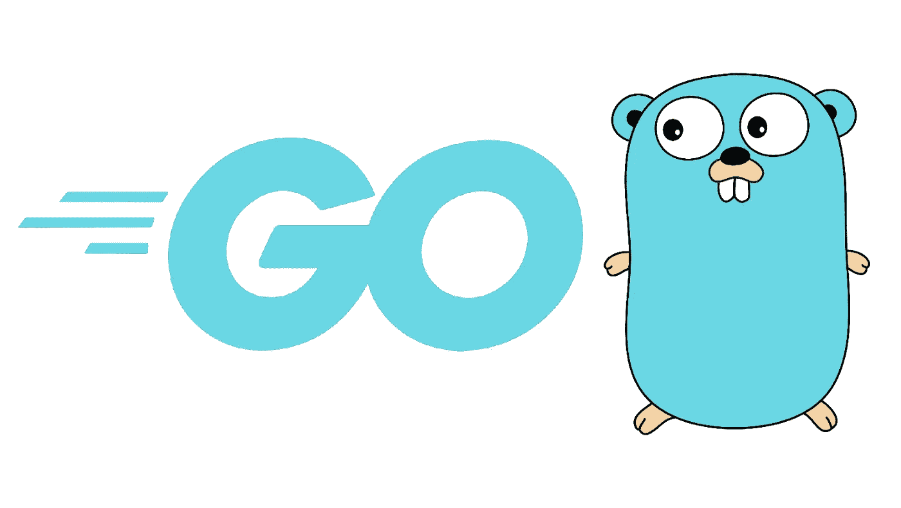
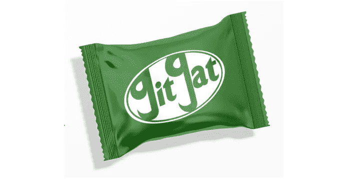

# Scribe 如何构建一个每个软件都经过验证且安全的世界

> 原文：<https://levelup.gitconnected.com/how-scribe-is-building-a-world-where-every-piece-of-software-is-validated-and-secure-2ed0870cb223>

## 《抄写员》采访巴拉克·布鲁多

本周我们采访了 Scribe 的 Barak Brudo。他分享了 Scribe 如何处理寻找恶意软件漏洞的复杂任务，以及他们如何创建标准来确保我们在您的代码中使用的大量软件包组合是安全的，并且软件不会在通过您的管道时发生变化。Barak 提供了关于代码交付如何工作、黑客如何试图渗透以及我们如何保持安全的深刻见解。

> >被面试的➡️ [填写这张表格](https://forms.gle/zRs7Uhidtd7WTyCy8)
> >寻找一份令人惊叹的工作？➡️ [访问升级招聘平台](https://jobs.levelup.dev/talent/welcome?referral=true)

> “坏人通常不会直接盯上某家公司。例如，你不会直接试图渗透微软的代码。你寻找许多公司使用的小构件。这些更容易攻击。你让它自然而平静地传播。然后，一旦你到达一个高价值的目标，坏演员就激活攻击。”

# Scribe 是做什么的？

Scribe 旨在帮助解决软件供应链安全问题。目前，我们提供完整性验证和 SBOM(软件材料清单),以及对您的过程和工件的洞察。我被这家公司吸引是因为它感觉像是一种在世界上有实际用途和重要性的产品——我不想为一家只是转移资金而不给世界回报有价值的东西的公司工作。

软件供应链是所有软件都使用其他软件的想法。我们坐战斗机吧。一家公司可以把自己的名字印在飞机上，但它是由不同公司制造的许多组件组成的。然后那些公司使用其他公司自己提供的组件和材料。对于软件来说，也是一样的。所有的软件都是由其他人的代码组成的，通常是开源软件。

来源:[https://medium . com/graph-commons/analyzing-the-NPM-dependency-network-e2cf 318 C1 d0d](https://medium.com/graph-commons/analyzing-the-npm-dependency-network-e2cf318c1d0d)

你可以把它想象成树根或者冰山。你可以看到可见的部分。然而，随着你越来越深入，更多的东西隐藏在表面之下。

坏人通常不会直接盯上某个特定的公司。例如，你不会直接试图渗透微软的代码。你寻找许多公司使用的小构件。这些更容易攻击。你让它自然而平静地传播。然后，一旦你到达一个高价值的目标，坏演员激活攻击。

最终，公司不再检查构建模块软件，因为它已经运行了很长时间。此外，“主要”公司验证并签署他们正在使用的包含漏洞的代码，但是管道下游的公司永远不会看到恶意代码。这就造成了一种虚假的信任感。

这就是我们正在解决的问题——隐藏软件对您的代码进行未经批准的更改的风险。我们正在解决可见性和信任的问题。我们正努力让信息尽可能自由地共享。我们的目标是向您展示实际存在于您的代码中的所有不同的包，包括所有的瞬态依赖。

我们从 NPM 和 Node 开始，稍后将开始开发其他的包管理器。

***看文士试图防范的攻击种类，*** [***看网络安全管理软件产品的黑客***](https://www.gao.gov/blog/solarwinds-cyberattack-demands-significant-federal-and-private-sector-response-infographic) ***。***

# 你能解释一下完整性验证和 SBOM 吗？

SBOM —软件材料清单。这些是软件成分。这包含了一个软件中的所有文件和库。它包含所有需要的数据，包括暂时的依赖和关系。它是对软件工件组成的详细描述。

你希望 SBOM 成为一个标准。你希望它能被任何人和任何组织共享。然后你可以用代码扫描 SBOM 来完全理解你包含的软件。

我们用自己的系统创造了 SBOM。为了验证，我们需要两个比较点，我们检查差异。SBOM 创建包含所有文件的散列，因此我们可以比较存储库中的文件散列和最终图像中的文件散列。如果在任何不打算更改的文件中有差异，这意味着它在管道中的某个地方被修改了。任何未计划的修改都可能表明有问题。

# 您使用什么技术堆栈？

我们的产品是用 Go 编写的，使用 Mongo 作为数据库。我们仍然处于发布时间表的早期，所以随着更多功能的增加，我们将加入更多的构建模块是理所当然的。

# 那 Go 和 Mongo 让它成为解决这个问题的正确选择呢？

Go 的一个优势就是完全编译。当您已经编译了代码，您确切地知道您得到了什么，并且您确切地知道在您的最终工件中发生了什么。

我们选择 Mongo 是因为我们需要 NoSQL，不需要桌子。数据量如此之大，以至于我们需要轻松快速地连接和访问文件和文件夹。有这么多复杂的层和图像，我们需要一个非表数据库的灵活性。

# Scribe 是怎么开始的？

该公司于 2021 年 6 月左右开始运营，此前不久，拜登政府在著名的太阳风事件后发布了 EO 14028。第 4 部分，关于软件供应链的安全，对创始人来说是一个相对较新的未开发的领域。他们有一个产品和生态系统的想法，可以满足 EO 的许多要求，并给任何使用开源软件的人带来真正的价值。

露比·阿尔贝尔(首席执行官)、盖伊·切诺布罗夫(R&D 副总裁)、丹尼尔·内本扎尔(首席技术官)

# 是什么让 Scribe 独一无二？

没有多少公司从完整性验证的角度处理软件供应链问题而不添加任何扫描。其背后的思想非常简单——在 CI/CD 管道中的几个点创建一个 SBOM，并使用 SBOM 中包含的文件哈希值来比较文件。对散列的任何更改都意味着文件被更改，并且大多数文件并不打算在管道中更改，因此这种更改被怀疑是恶意的。

当然，实际方面要复杂得多，因为每种语言都有一种独特的编译和构建代码的方式，而且有些文件在这个过程中会发生变化。这些文件可以在源代码控制和最终工件之间改变它们的名称或位置，因此直接一对一的比较很难做到。

# 你正在解决的最有趣的问题是什么？

影响许多公司的一个问题就是缺乏信息。市场仍然没有充分了解潜在的危险和可能的补救措施。有 NIST 的 SSDF，CISA 的推广 SBOM 的工作，当然，还有 EO 本身，都准备推动市场的变化。但这种变化是缓慢的，我只是希望我们能在看到下一次太阳风之前，在全球软件供应链中找到一个更安全的位置。

此外还有知识产权的问题。没有人希望他们的代码开放，但他们希望我们提供的验证。我们这样做的方法是文件散列。当我们拥有由 SBOM 创建的文件散列时，我们不需要查看代码。

我们创造了回购的 SBOM 和最终形象的 SBOM。然后我们比较输入和输出的散列，如果文件不匹配，那么我们知道这是我们应该检查的地方。

对于开放源代码，我们会将您使用的软件包与其已知的在线源代码进行比较。如果我们看到差异，我们知道有问题。如果是这种情况，用户可能从错误的地方下载了代码，或者代码在下载过程中被修改了。我们不是在寻找漏洞或秘密，我们只是在验证你所使用和交付的正是你想要的。

# 一旦 Scribe 实现其愿景，世界将会变成什么样子？

在这个世界上，你可以立即搜索任何公司或产品，并看到证明它没有被篡改的证据链和出处。“信任但验证”是一个常见的习语，我们的目标是尽可能简单地验证任何类型的库、包或产品，当然，只要他们将我们的解决方案整合到他们的管道中。

一旦每一个软件都被详细描述，我们将生活在一个乌托邦的世界里，在那里公司可以完全理解他们使用和生产的软件。每个公司都会洞察任何潜在的问题。您可以提前知道在您选择使用的代码版本中检测到了什么问题或可能的漏洞。

# 对你来说，典型的一天是什么样的？

我有很多任务，所以我可能会从写下那天我需要做的最重要的事情开始。在任何一天，我都会试着花时间在社交媒体上看看这个领域有什么新的东西，并关注谷歌快讯，看看是否有相关的东西出现。我也试着找时间检查我的电子邮件和回答相关的问题，给一些时间写或编辑文章或博客帖子，并为我们安排的下一次会议或网络研讨会做准备。

# 你现在正在尝试的技术或工具中有没有让你感到兴奋的？

我们的大多数工具都是标准的，但我们最近发布的一个开源包叫做 [GitGat](https://github.com/scribe-public/gitgat) ，旨在提供 GitHub 安全态势报告。这是全新的，刚刚开始。GitHub 容易攻击，但也容易防御。我们描述问题并告诉你如何解决。我们扫描你的回购，并给你建议。

# 你在招人吗？什么职位？

我们正在招聘高级 Golang 后端开发人员(永远不够)和安全研究人员。

# 我们可以去哪里了解更多？

我们的网站，【scribesecurity.com 

# 分级编码

[Level Up](https://levelup.gitconnected.com/) 是一个月 300 万开发者的社区([了解更多并关注](https://levelup.gitconnected.com/)或[阅读更多访谈](https://levelup.gitconnected.com/interviews/home))。我们还与最好的初创公司和最具创新性的科技公司合作🔥

*   **你是开发者吗？**有最优秀的公司要求聘用你
    ➡️[t14】加入到人才集体 t16】](https://jobs.levelup.dev/talent/welcome?referral=true)
*   ➡️ [**聘请顶尖工程师**](https://jobs.levelup.dev/talent/welcome)
*   ➡️ [**面试申请表**](https://forms.gle/oWT83qtGdydfi7yL8) 面试贵公司

我们还为开发者提供免费的职业成长工具: [**编码面试课程**](https://skilled.dev/)[**自动简历生成器**](https://gitconnected.com/resume-builder)[**作品集 API**](https://gitconnected.com/portfolio-api)

在推特[和 LinkedIn](https://twitter.com/gitconnected) 上关注我们