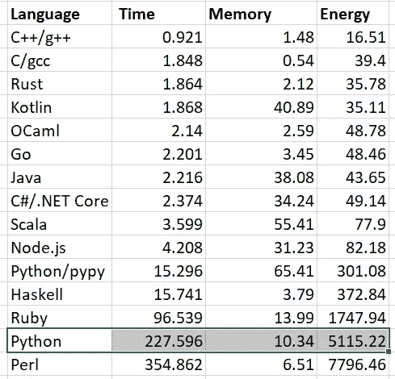
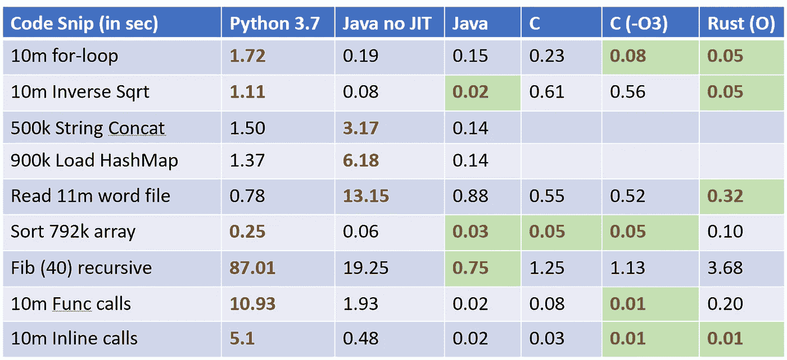

# Python 到底有多慢？

> 原文：<https://levelup.gitconnected.com/how-slow-is-python-6f2fc1fbfbaa>

## 我们都知道它比 C，Java，Rust 慢，但是到底有多慢呢？

Alex bljan 在 [Unsplash](https://unsplash.com?utm_source=medium&utm_medium=referral) 上拍摄的照片

就在我开始思考这篇文章的时候，我的 Medium feed 发表了一篇滑稽的帖子“Python 其实并不慢”——我读了它，尽管我知道这不是真的，只是一个点击诱饵。当谈到 Python 时，你是在和一只蜗牛打交道，虽然你可以训练出一只蜗牛，但你无法逃脱它的基本遗传(不像经典电影《Gattaca》中的伊桑·霍克)。

# 标杆管理

我开始编写一些简单的基准程序，用 C、Rust、Java 和 Python 进行交叉测试。我认为要评估的主要类别有:

*   管理内存压力(对象创建/销毁)
*   类似 JSON 的字符串处理
*   循环和计算密集型操作

作为参考，有一个很棒的 [GitHub 项目](https://github.com/kostya/benchmarks)评估十几种语言的性能。下面是汇总表，如果 C++的基线是 1，那么 Python 在 [brainf 测试](https://gist.github.com/roachhd/dce54bec8ba55fb17d3a)(这是一个非常有趣的**图灵机**解释器)中慢了 227 倍。

由 [Kostya M](https://github.com/kostya/benchmarks) 的 github 项目提供

我最终编写了超级基本的代码片段测试，因为我意识到我忘记了如何用这些语言编程。我不得不重新设定我的雄心以匹配我的微弱技能...

道格·福实验室

# 来自测试结果的见解

*我将在参考资料部分链接到我的 GitHub 进行真正的测试。我希望命名是不言自明的。*

这些是我跨语言的心得:

1.  **Python 文件 I/O 相对较快**，因为限制因素是磁盘
2.  **Python 在递归上异常慢**，做递归 Fibonacci 在 fib(30)上慢得不可理喻
3.  **Python 函数调用缓慢**——导致了递归问题
4.  Java w/o JIT 优化可能真的很慢，有些事情甚至比 Python 还慢
5.  Java 原生字符串仍然非常慢(100 倍)，使用 StringBuilder 使它变得相当快，但是比 Python 慢
6.  **Java w/ JIT 现在相当快**几乎不值得再用 C 了…
7.  Rust 真的很快，如果我知道如何在它里面更好地编码，可能会更快…

速度慢 200 倍的基准测试还没有在我的小工具包中得到验证，但是很明显，只要进行一些额外的函数调用和递归，就可以轻松实现。

# **那么 Python 为什么慢呢？**

大多数事情都是显而易见的，但让我列出来:

1.  Python 是**解释的**，虽然是字节编译的，但并没有真正优化
2.  它是**垃圾收集**，但是它主要使用引用计数，所以它比 Java 快一点或者至少更确定
3.  默认情况下，它没有 JIT 编译器(T7)——这对于解释型语言来说似乎很关键(PyPy 利用这一点将其提升了 10 倍)
4.  作为一种**非类型化的动态语言**有其缓慢之处(并且使得构建 JIT 更加困难)
5.  执行**函数调用异常缓慢**(也许是堆栈帧分配有些复杂？)

注意，我们甚至没有测试多线程或多编程，因为我们都知道 Python 也有 **GIL(全局解释器锁)**问题。

# 如何优化 Python

有一些技巧可以提高 Python 的速度，但是大多数都不是很好。

1.  使用多进程来产生工人(但是要注意你会受到 GIL 的限制)
2.  写原生 C 代码，链接到 Python
3.  使用本地 Python 函数(用 C 语言在运行时编写)
4.  一行列表理解似乎是性能优化的，所以它们看起来不仅仅是很酷的技巧

老实说，我没有看到很多很棒的提示……有些提示就像“使用 O(n)和 O(n-log n)算法，而不是 O(n)”……也许第一个提示应该是**学习一些计算机科学**？

# 参考

1.  让 Python 快速—[https://github . com/ajcr/ajcr . github . io/blob/master/_ posts/2016-04-01-fast-inverse-square-root-Python . MD](https://www.kdnuggets.com/2021/06/make-python-code-run-incredibly-fast.html)
2.  python Slowness—[https://medium . com/analytics-vid hya/is-python-really-very-slow-2-major-problems-to-know-that-makes-python-very-slow-9e 92653265 ea](https://towardsdatascience.com/why-is-python-so-slow-and-how-to-speed-it-up-485b5a84154e)
3.  Python 为什么慢—[https://hackernoon.com/why-is-python-so-slow-e5074b6fe55b](https://hackernoon.com/why-is-python-so-slow-e5074b6fe55b)
4.  hack test1 的 GitHub。*样本 s—[https://github.com/dougfoo/medium](https://github.com/dougfoo/medium)
5.  Python 中缺乏字节码优化—[https://nullprogram.com/blog/2019/02/24/](https://nullprogram.com/blog/2019/02/24/)