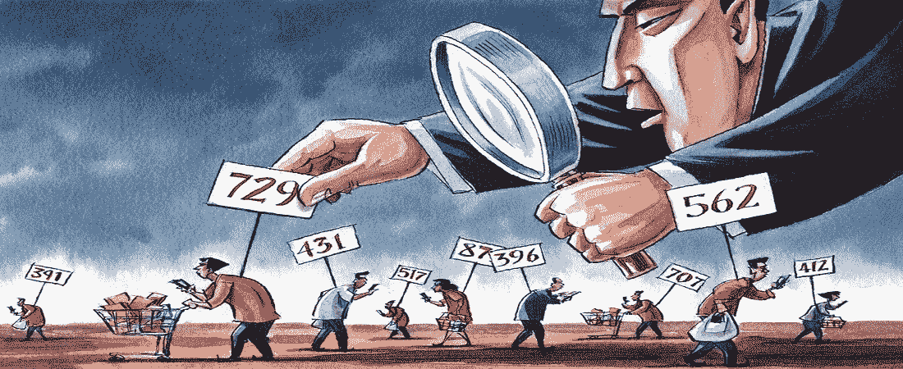
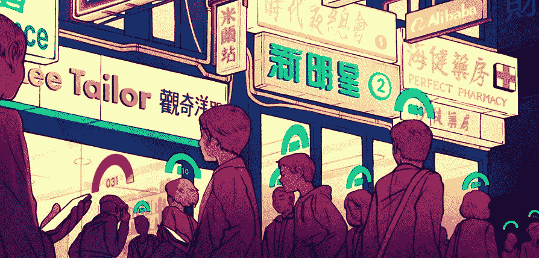
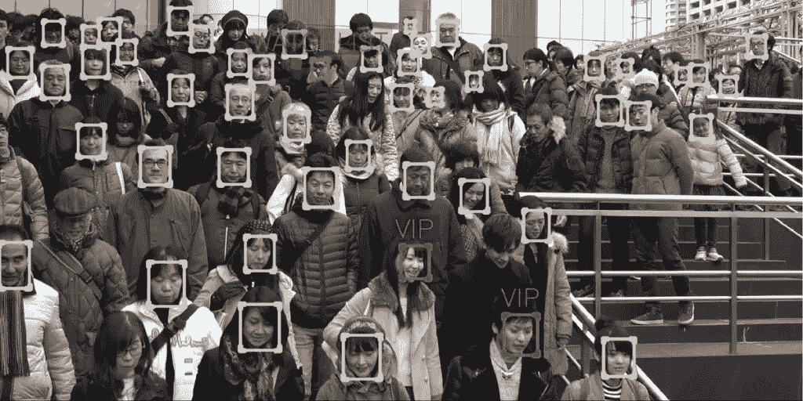
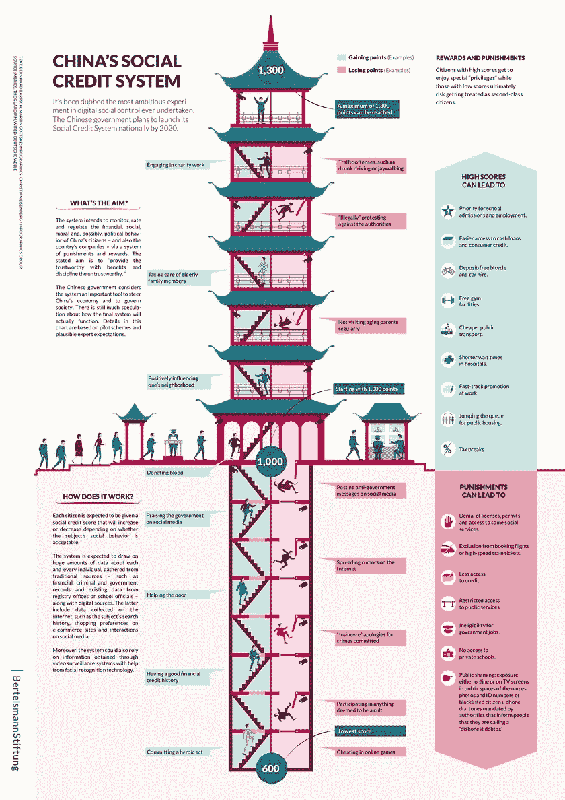

# 社会信用是如何运作的——中国数字反乌托邦

> 原文：<https://levelup.gitconnected.com/how-social-credit-works-chinese-digital-dystopia-504965e5e474>

成为一个没人愿意与之打交道的弃儿是古代最严重的惩罚。几千年前，这是死前的折磨。在原始社会，正是因为害怕被踢出群体，才维持了铁一般的纪律。

也许很快我们就会回到一个类似的社会秩序模式，在这种模式下，公众的认可将是第一位的，而权利和自由将会被集体决定迅速收回。这已经在中国发生了——在中国的一些地区，有一个社会评级系统。

## 中央王国的秩序体系

在任何一个国家，都有规范、规则和限制——立法的、道德的、社会文化的——它们构成了一个单一的社会行为体系。依靠遵循它们，或者相反，拒绝它们，每个个体的名声就形成了。

但是现在在坏脾气的坏名声和被剥夺权利之间有一个深渊。很少，当一个坏的，但守法的人被剥夺了一些社会福利。

在中国，自 2014 年以来，引入了真正引入史前社区中存在的社会形态的系统。在它的帮助下，人们获得了很高的声誉——这被称为“社会评级”——他们比那些不符合规范的人获得了更多的道德和物质利益。

但是那些不遵循既定标准的人实际上被降到了印度种姓“贱民”的地位。他们禁止在任何地方和机构使用，人们不与他们交流，因为与“低级”的人合作会伤害有价值的社会代表。

在中国，这种想法正在肥沃的土壤上生长。正如中国圣人孔子所写的那样，保持善行的积极平衡是实现“高贵丈夫”的理想。许多人成为每个人的评判者——人们向某个特定的人表达感谢或抱怨。有影响力的仲裁人的权威，制定标准，在内容上，一切由大家评价。

这是道的原则之一的实现——国家不干涉人民的事务，而是为社会的和谐发展创造条件。

## 它是如何工作的

自 2021 年 1 月以来，中国通过了新的民法典，正式将社会排名制度合法化。它已经在一些省份运行，但显然没有一个统一的网络来评估行为，奖惩标准。

我通过让普通的中国公民描述这个系统的运作来说服自己。然而，在广州(广东省)，两名当地居民甚至没有听说过她。那么，在天朝帝国的各个行省里，是什么在运作呢？我们可以从国务院和共产党的党的机器发布的文件中判断这一点。

汉学家列昂尼德·科瓦契奇(Leonid Kovacic)表示，在本质上，社会信用是一个自动、实时刺激公民某些行为并进行自我审查的系统。它由几个模块组成:对行为的监视和监控，对每个人的行为的评估，以及奖惩机制。

下面是它在实践中的工作原理。根据来自官方来源的信息，该系统起作用的城市之一(例如，苏州市)的居民在其社会账户上获得初始数量的积分——这是 1000 个单位。因此，一开始，每个人都处于平等的地位。

将来，这一数额可能会根据个人的行为而增加或减少。顺便说一下，类似的规则也适用于法律实体——公司被评估是否符合环境、法律和社会标准。

一个单一的信息中心根据来自超过 142 个机构以及银行、街道上的监控系统等的 160，000 个参数来分析在线行为。

当总分增加到 1050 分或更多时，这样一个模范公民被赋予最高的等级——AAA。评分 1000 分是有声望的 A +类，超过 900 分是平均 B 级，低于 849 分是边缘 c 类，低于 599 分的公民被列入 D 类黑名单，甚至不能从事出租车司机工作。事实上，他们成为社会的弃儿。

你可以通过诚信行事和做好事来获得积分。积极的业力是通过参加慈善活动、照顾年迈的家人、通过与邻居的良好关系、通过捐赠、通过拥有良好的信用记录和不违反交通规则而获得的。而随之而来的，政府支持也会带来一些积分。

> “国务院最近发布的文件规定，该系统应促进和鼓励在中国社会中接受和传播社会主义价值观。这里我们指的是反对西方价值观，一定程度的自我审查，承认党的指导和领导作用，以及对国家资本主义的承诺。该文件呼吁将社会信用体系进一步融入尽可能广泛的国内外经济关系中，”列昂尼德·科瓦契奇说。

因此，当局和共产党表达的赞同可以被认为是传播必要的价值观，并给因果报应加分。

同样，相反的情况——批评领导层或反对派活动(参与抗议活动、传播反政府信息或诽谤共产党和政府的谣言)——可以扣分。

此外，违反交通规则、参加教派或金融金字塔的活动、频繁购买烟酒或对年迈父母的帮助不够等也可以扣分。

“好”公民在医院和政府机构得到优先援助，他们可以指望优惠的贷款条件，商品和服务的折扣。这样的人有权利送孩子去私立学校和大学，开飞机，坐火车，住好酒店。评级甚至会影响一个人在约会应用中的位置。

因此，所有这些在某种程度上都剥夺了处于社会金字塔最底层的人的权利。他们将几乎找不到任何工作，送他们的孩子去幼儿园或学校，他们将得不到贷款，他们将得不到车票，他们将住不到好的旅馆。

这已经在发生——据《环球时报》报道，截至 2018 年 4 月，糟糕的诚信评级导致 425 万次高速列车旅行和 1110 万次飞机航班被取消。

他们甚至害怕与“低级别”的人交谈——突然有人注意到并告知当局与 d 类人交流。此外，可能会受到公众谴责——所有朋友和熟人都会被告知一些不体面的行为。

很自然，评估的客观性和惩罚是否充分的问题立即出现。列昂尼德·科瓦契奇说，现在每个省和地区都在竞争创造力，并制定自己的奖惩措施。

因此，中国当局正试图协调该系统，并建立统一的标准。因为由于贷款延期支付或罚款，一个人无法使用高速交通工具或安排孩子上学。

但是，人们对这样做的可能性存在严重怀疑。首先，当局有足够多的当前问题需要迫切解决——中国的相同冠状病毒因素尚未退居幕后。第二，当局未能解决各部门之间及时和完整交换信息的问题。这不是一个技术难题，而是一个政治问题——通常情况下，一个部门就是不想与另一个部门共享信息，因此，整个系统无法运行。

在信息交流方面，这是一个部门间竞争和斗争的问题。这位专家说，这些是政治和行政结构的问题，不清楚如何解决。

> “当系统上的第一批文档出来时，一切都是不祥而美好的。有这样一个数字全景监狱的图像，其中的人，像机器人一样，将遵循老大哥的指示。但现在有一种感觉，即社会评级体系是一个巨大的政治过度，这并不是它注定会成功的事实，”列昂尼德·科瓦契奇说。

但这位汉学家认为，也许这个系统已经以某种形式投入运行了——只是没有正式宣布而已。

> “也许当局故意不宣传该系统的工作，以便社会被一只看不见的手所控制。而且毫无疑问，中国社会的管理组织得很好。列昂尼德·科瓦契奇说:“对新冠肺炎采取同样的零容忍战略，该战略虽然有几次中断，但仍在运作并带来成果。”。

到目前为止，社会评级系统还没有以任何方式与数字元集成。然而，没有人会费心去把财务和社会等级联系起来，以增加人们的杠杆作用。事实上，在这种情况下，不仅可以剥夺权利，还可以剥夺 d 组公民的金钱，并将它们交给 a 组值得信赖的公民。

📰 ***订阅*** [***斐波那契***](https://medium.com/@unclefibonacci) ***我来保持最新***