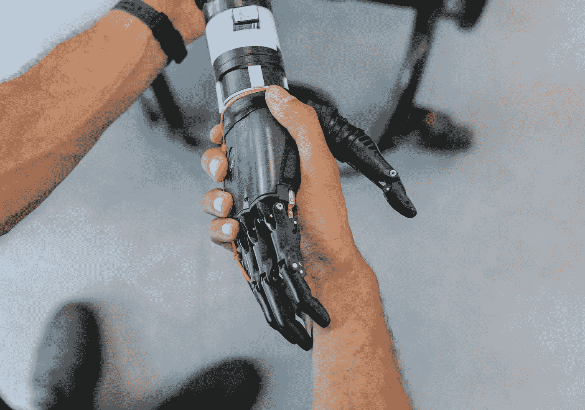

# 如何使用软件设计原则来交付优秀的产品/服务

> 原文：<https://levelup.gitconnected.com/how-software-design-principles-are-used-to-deliver-great-products-services-9e1b92436024>

鸣谢:照片由[this engineering RAEng](https://unsplash.com/@thisisengineering?utm_source=unsplash&utm_medium=referral&utm_content=creditCopyText)在 [Unsplash](https://unsplash.com/s/photos/software?utm_source=unsplash&utm_medium=referral&utm_content=creditCopyText) 上拍摄

## 软件设计的三个层次:组织、商业和最终用户

> 这是根据[这篇原创 Quora 问答](https://www.quora.com/How-is-the-principle-of-software-design-used-to-produce-high-quality-software-applications-that-meet-the-need-of-the-users/answer/Joseph-Matthias-Goh?ch=10&share=77919b53&srid=DxrK) : ***创作的一篇作品，软件设计的原理是如何被用来生产出满足用户需求的高质量软件应用的？***

软件设计，像任何其他形式的设计一样，必然涉及利益相关者。就利益相关者而言，我认为软件设计发生在三个层次:组织**，**业务**，最后是最终用户**。这三个层次也可以解释为:提供价值(组织)的能力和敏捷性的持续增长，提供价值(业务)，以及最终价值(T21)本身(最终用户)。****

****这些层次中的每一个都提出了挑战，这些挑战经常会与其他层次发生冲突，这取决于每个层次的感知需求，对我来说，这既是设计软件的挑战，也是设计软件的美妙之处。****

# ****组织****

****大多数参与软件创作的组织都是为了交付价值而存在的。这通常是通过提供产品和服务来换取金钱。****

****如果一个组织没有成长，它提供更多服务和产品的能力——即产生更多的钱——就会降低；如果一个组织不知道如何发展，那么它对最终用户需求做出反应的灵活性就会降低。到 2021 年，最终用户往往有点善变。****

****如今，停滞不前无异于落后。缺乏其中任何一个通常会给组织提供一个有效的方法，使其交付价值的旅程停止。****

****组织层的软件设计通过优化容量和敏捷性来支持组织:能够用更少的资源做更多的事情，并保持代码足够灵活以适应变化。这些可能是与代码无关的决策，例如外包哪些部件，使用托管服务还是部署自托管服务，或者云平台还是裸机机架。为了支持交付的敏捷性，这涉及到要在软件/代码架构上做出的设计决策，如代码模块化和实现面向服务的架构。****

# ****商业****

****当谈到业务方面时，对话变成了尽快交付价值。对于软件工程类型来说，这可能被称为工程卓越的反命题，但我认为交付和工程卓越之间的促进张力是真正推动令人愉快的软件以可持续的方式向前发展的因素。****

****过多地关注卓越，你会得到一个遵循所有最佳实践的架构良好的产品，但是没有交付任何价值。相反，过于关注交付，你会发现自己由于错误和遗留代码而无法交付。****

****在业务层面上，软件设计通过做出决策来使功能更快地交付，从而有助于取悦最终用户。想想对产品提供反馈(如果有人真的这么做的话),并在几周后看到你所要求的特性被实现。****

****当然，这是除了确保维护组织完整性之外的事情，这可能看起来像是实现诸如封装、抽象、多态、继承和组合等原则的决策(在这些原则中，我可能没有足够的知识来列举)。****

****这些原则通常可以说是支持代码重用的，但从长远来看，由于众所周知的泄漏抽象法则，代码重用本身也可能会对交付敏捷性产生反作用。这就是重构(或者通常缺少重构)发挥作用的地方。****

# ****最终用户****

****最后，在用户层面上，软件设计归结为关于特定技术和平台的决策，这些技术和平台可以支持要交付的期望价值，并考虑最终用户的需求。这些设计决策看起来像是关于数据是否需要实时呈现、用户期望什么级别的安全性、用户需要什么级别的数据一致性等问题。****

****就代码本身而言，与价值相关的设计决策通常涉及库、框架或运行时的选择:最终用户是否期望高计算性能？用 C++或者 Rust 或者 Go。最终用户期望单页应用程序的 UX 吗？在基于 jQuery/PHP 的东西上使用 React 或 Vue 或 Angular。用户期望实时数据流吗？使用 sockets/HTTP 2，而不是基于 HTTP 的 RESTful/GraphiQL API。****

# ****概括起来****

****软件设计最终仍然是设计，这意味着它是关于基于从各种涉众那里收集的需求创建一个计划，以实现给定问题域和一组约束的最可行的解决方案。****

****糟糕的软件设计往往会导致产品和服务平庸，并且经常无法令人满意，对我来说，这是组织功能障碍的一种症状，由于某种原因导致需求没有得到很好的理解/研究，或者焦点没有放在正确的地方。****

****然而，好的软件设计会产生价值交付，并引发喜悦，并不断重复。****

****如果你喜欢这篇文章，考虑贡献一些掌声👏🏻这样它可能会接触到更多的人+激励我写更多。还可以考虑关注我，了解我的最新作品(如下:****