# 怎么串进去的。NET C#工程

> 原文：<https://levelup.gitconnected.com/how-string-in-net-c-works-f1d69bfa30f5>

## 回归基础

## 关于字符串及其在。NET C#


照片由 [amirali mirhashemian](https://unsplash.com/@amir_v_ali?utm_source=unsplash&utm_medium=referral&utm_content=creditCopyText) 在 [Unsplash](https://unsplash.com/?utm_source=unsplash&utm_medium=referral&utm_content=creditCopyText) 上拍摄，由 [Ahmed Tarek](https://medium.com/@eng_ahmed.tarek) 调整

一些开发者对中的`String`感到困惑。**网**。混淆来自于这样一个事实，即`String`是一个`Object`——它是一个**引用**类型——但仍然充当一个**值**类型。

另一件事，所有的开发者都知道`String`是一个不可变的类型，但是有些开发者不明白为什么。

因此，在本文中我们将讨论`String`在**中是如何工作的。NET** C#试图涵盖我们需要的关于这个话题的所有基础知识。

[](https://medium.com/subscribe/@eng_ahmed.tarek) [## 🔥订阅艾哈迈德的时事通讯🔥

### 订阅艾哈迈德的时事通讯📰直接获得最佳实践、教程、提示、技巧和许多其他很酷的东西…

medium.com](https://medium.com/subscribe/@eng_ahmed.tarek) 

照片由 [Liam Briese](https://unsplash.com/@liam_1?utm_source=unsplash&utm_medium=referral&utm_content=creditCopyText) 在 [Unsplash](https://unsplash.com/?utm_source=unsplash&utm_medium=referral&utm_content=creditCopyText) 上拍摄，由 [Ahmed Tarek](https://medium.com/@eng_ahmed.tarek) 调整

# 存储器分配

要了解`String`在**中是如何工作的。NET C#** ，我们需要了解在创建和操作一个`String`时内存是如何分配的。

因此，让我们一步一步地通过一些简单的例子来看看在内存分配方面后台实际发生了什么。


## 初始化后更改值

在第 **1** 行，我们定义了一个名为 **s0** 的变量，并将其值设置为“Ahmed”。

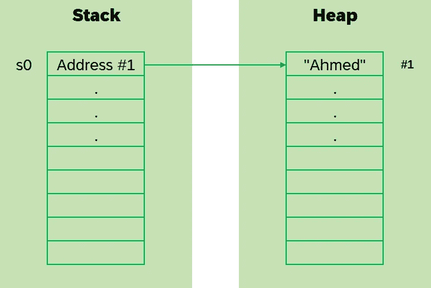

在第 **2** 行，我们将 **s0** 的值更改为“Tarek”。

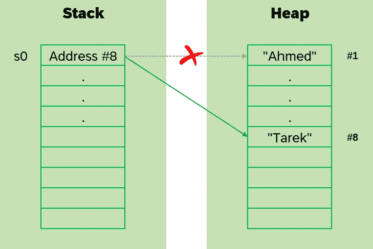

由于`String`是不可变的，实际发生的是在堆内存中创建一个新的内存位置并用“Tarek”填充。然后， **s0** 的地址被更新到新的存储位置。

因此，在第 **3** 行，结果如下:

```
Tarek
```


## 用相同的值初始化多个变量

在第 **1** 行，我们定义了一个名为 **s1** 的变量，并将其值设置为“Ahmed”。

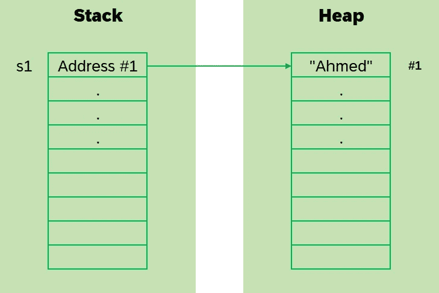

在第 2 行，我们定义了一个名为 **s2** 的变量，并将其值设置为“Ahmed”。

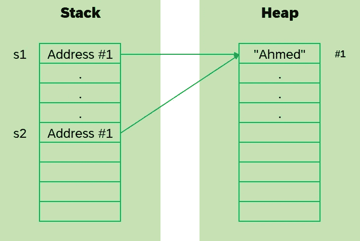

因为`String`是不可变的，这里实际发生的是堆就像一个字典，其中`String`的值是键。

因此，每当要创建新的`String`并将其分配到堆中时，如果已经存在相同的`String`值，则不会发生新的分配，而是使用相同的现有内存分配。

因此，在我们的例子中， **s2** 的地址被更新为与 **s1** 相同的地址。

因此，在第 **3** 和 **4** 行，结果如下:

```
True
True
```


## 使用“新字符串()”初始化变量

在第 **1** 行，我们定义了一个名为 **s3** 的变量，并将其值设置为“Ahmed”。

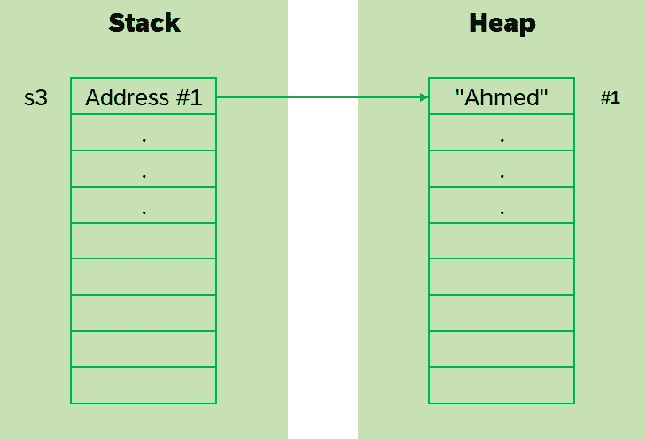

从第 **3** 行到第 **12** 行，我们定义了一个名为 **s4** 的变量，用`new String()`传入一个对应于“艾哈迈德”的字符数组来初始化它。

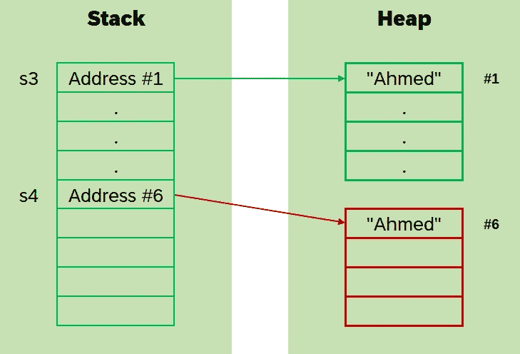

因为我们使用了`new String()`来创建一个新的`String`实例，所以现在发生了一个独特的动作。让我解释一下。

当我们直接使用一个字符串值来初始化一个变量时(像`var s3 = “Ahmed”`)，分配发生在堆内存中的一个特殊的池上。在这个特殊的池上发生的任何分配都在所有直接初始化的`String`变量之间共享。

但是，每当使用`new String()`时，会分配一个内存位置，但不在这个特殊的池中。

因此，从第 **14** 行到第 **23** 行，我们定义了一个名为 **s5** 的变量，用`new String()`传入一个对应于“Ahmed”的字符数组来初始化它。

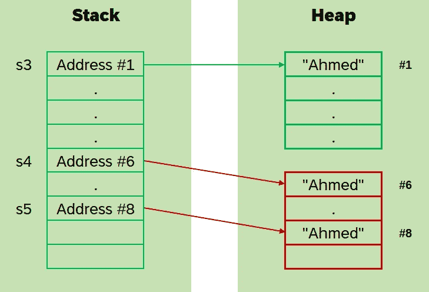

看，为变量 **s5** 设置了另一个新的内存分配。

因此，在第 **25** 、 **26** 、和 **27** 行，结果如下:

```
True
False
False
```

对于线 **25** ，结果为**真**，因为它们都具有相同的值。

对于行 **26** ，结果为**假**，因为它们不共享相同的内存分配，它们实际上是两个不同的引用。

对于行 **27** 也是如此，结果为**假**，因为它们不共享相同的内存分配，它们实际上是两个不同的引用。


## 通过引用隐式设置变量

在第 **1** 行，我们定义了一个名为 **s6** 的变量，并将其值设置为“Ahmed”。

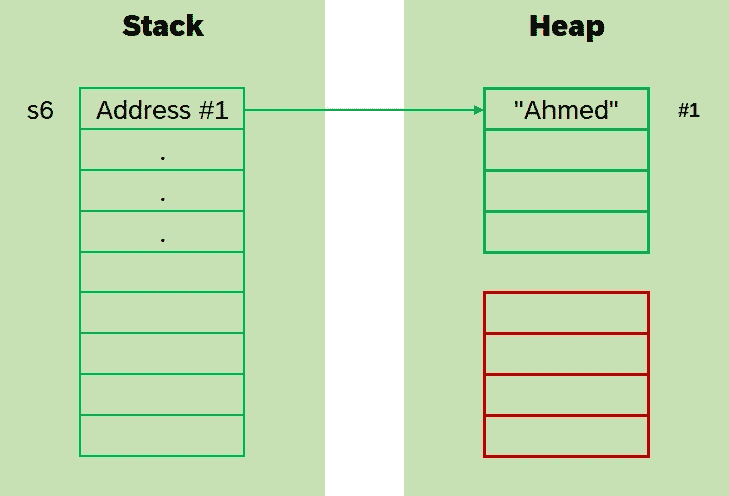

在第 **2** 行，我们定义了一个名为 **s7** 的变量，并将其引用隐式设置为 **s6** 。


这里发生的是 **s6** 的地址被复制到 **s7** 。因此，它们都引用相同的堆内存分配。

在第 **3** 行，我们将变量 **s6** 的值设置为“Tarek”。

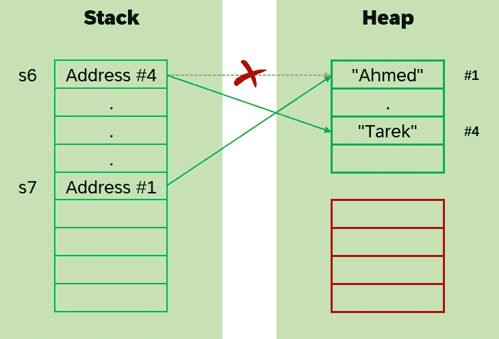

正如我们之前解释的，这里实际发生的是在堆内存中创建了一个新的内存位置，并用“Tarek”填充。然后， **s6** 的地址被更新到新的存储位置。

然而， **s7** 不会被更新。这意味着它仍然会引用保存“Ahmed”的内存位置。

因此，在第 **4** 和 **5** 行，结果如下:

```
Tarek
Ahmed
```

对于第 **4** 行，结果是 **Tarek** ，因为现在 **s6** 正在引用保存“Tarek”的内存位置。

对于第 **5** 行，结果是**艾哈迈德**，因为现在 **s7** 仍在引用保存“艾哈迈德”的内存位置。


## 通过引用显式设置变量

这里发生的情况类似于**通过引用**隐式设置变量的情况。

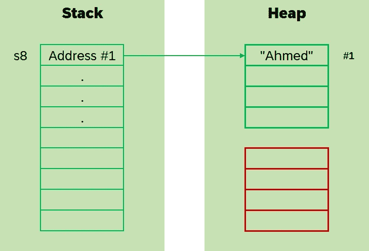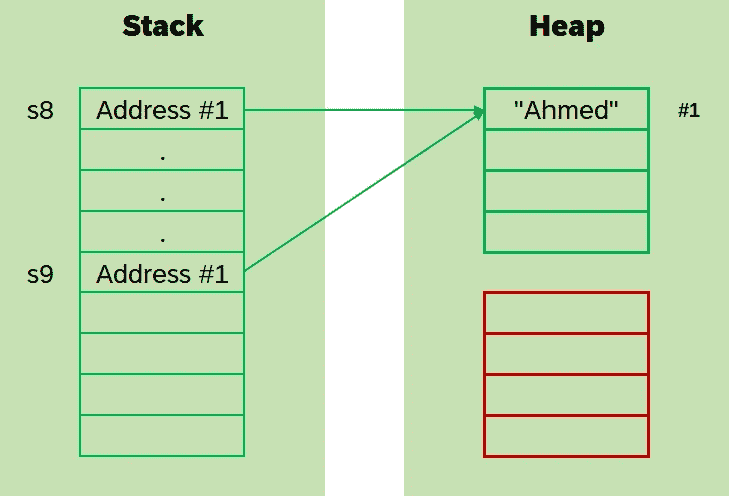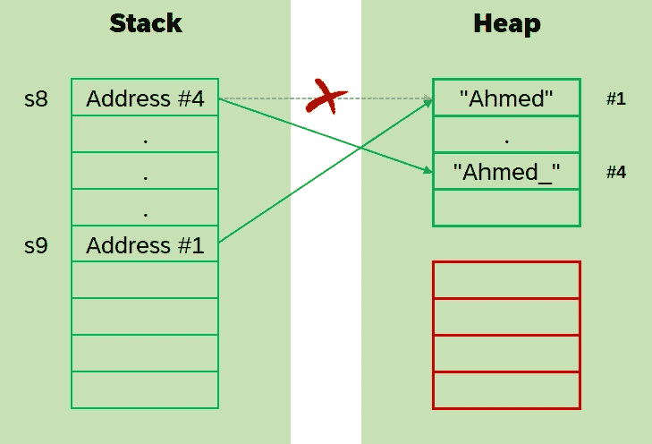

在第 **6** 和 **7** 行，结果如下:

```
Ahmed_
Ahmed
```


**字符串不可变的优点**。照片由[登·哈森](https://unsplash.com/@harrson?utm_source=unsplash&utm_medium=referral&utm_content=creditCopyText)在 [Unsplash](https://unsplash.com/?utm_source=unsplash&utm_medium=referral&utm_content=creditCopyText) 上拍摄，由[艾哈迈德·塔里克](https://medium.com/@eng_ahmed.tarek)调整

# 字符串不可变的优点

现在，你可能会问:

> 字符串不可变的好处是什么？

答案在某种程度上是合乎逻辑的。让我解释一下。


## 线程安全

由于`String`是不可变的，在内存分配层面上，我们确信它的值根本不会改变。

因此，我们不希望出现任何竞争问题，因为即使不止一个线程访问一个`String`变量，它的值也总是相同的。


## 一致性

如果我们有以下内容:

```
var s1 = "Ahmed";
var s2 = "Ahmed";
var s3 = "Ahmed";
```

然后，我们决定将 **s1** 的值更改如下:

```
s1 = "Tarek";
```

实际发生的情况是，只有 **s1** 的值会被更改为“Tarek”。然而， **s2** 和 **s3** 的值仍然是“Ahmed”。


## 内存优化

同样，如果我们有以下内容:

```
var s1 = "Ahmed";
var s2 = "Ahmed";
var s3 = "Ahmed";
```

在这种情况下，在堆内存中只分配一个内存位置，其值将被设置为“Ahmed”。

因此，按照同样的模式，假设我们有数百甚至数千个某个字符串的实例，性能不会受到影响，因为默认情况下`String`是内存优化的。


## 轻松复印

由于`String`是不可变的，当我们需要一个副本时，我们可以简单地返回`this`。为什么？因为它作为值类型，因为它的值永远不会改变。


由 [Marvin Esteve](https://unsplash.com/@tme18?utm_source=unsplash&utm_medium=referral&utm_content=creditCopyText) 在 [Unsplash](https://unsplash.com/?utm_source=unsplash&utm_medium=referral&utm_content=creditCopyText) 上拍摄，由 [Ahmed Tarek](https://medium.com/@eng_ahmed.tarek) 调整

# 重要说明

正如我们之前所说的，运行如下代码:

会在堆内存中创建 5000 个内存分配，这一点都不好。

下面是这段代码的内存分配:

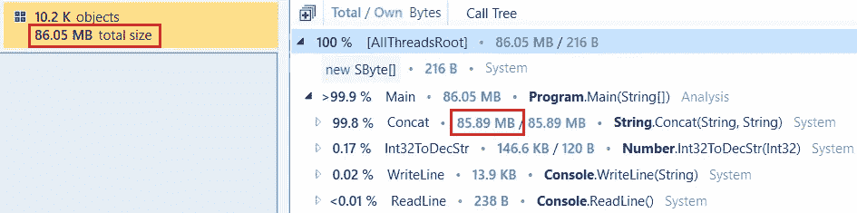

**长循环的内存分配**。图片由[艾哈迈德·塔里克](https://medium.com/@eng_ahmed.tarek)拍摄

因此，对于这种情况，当您发现自己为`String`变量创建了太多的内存分配时，您需要使用`StringBuilder`。

因此，我们可以这样更新上面的代码:

这样，您将获得相同的输出结果，但是优化了内存分配。

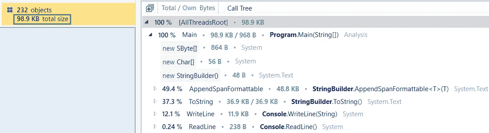

**StringBuilder 的内存分配**。图片由[艾哈迈德·塔里克](https://medium.com/@eng_ahmed.tarek)拍摄

看，差别是巨大的。


由[皮埃特罗·拉姆帕佐](https://unsplash.com/@peterampazzo?utm_source=unsplash&utm_medium=referral&utm_content=creditCopyText)在 [Unsplash](https://unsplash.com/?utm_source=unsplash&utm_medium=referral&utm_content=creditCopyText) 上拍摄，由[艾哈迈德·塔里克](https://medium.com/@eng_ahmed.tarek)调整

# 最后的想法

现在你应该理解了**中关于`String`的公共基础知识。NET** 框架。

此外，有一篇关于`String.GetHashCode`的有趣文章，你可能会喜欢读。[文章是**时的字符串。中的 GetHashCode()。NET C#把你逼疯**](https://itnext.io/when-string-gethashcode-in-net-c-drives-you-crazy-c97ac7507d7b?sk=f9baa36c281e5f8afd79ef665ab39953) 。

最后，我希望你喜欢读这篇文章，就像我喜欢写它一样。


# 希望这些内容对你有用。如果您想支持:

如果您还不是**中介**会员，您可以使用 [**我的推荐链接**](https://medium.com/@eng_ahmed.tarek/membership) ，这样我可以从**中介**那里获得您的一部分费用，您无需支付任何额外费用。订阅 [**我的简讯**](https://medium.com/subscribe/@eng_ahmed.tarek) 将最佳实践、教程、提示、技巧和许多其他很酷的东西直接发送到您的收件箱。


# 其他资源

这些是你可能会发现有用的其他资源。

[](/datetime-best-practices-in-net-c-4c2679fcc9e0) [## 中的日期时间最佳实践。NET C#

### 在中使用 DateTime 时要遵循的最佳实践。NET C#

levelup.gitconnected.com](/datetime-best-practices-in-net-c-4c2679fcc9e0) [](/prototype-design-pattern-in-net-c-67db46c3d28f) [## 中的原型设计模式。NET C#

### 中了解原型设计模式。NET C#

levelup.gitconnected.com](/prototype-design-pattern-in-net-c-67db46c3d28f) [](/curse-of-recursion-in-net-c-b017271ddbe6) [## 递归的诅咒。NET C#

### 为什么以及如何在？NET C#

levelup.gitconnected.com](/curse-of-recursion-in-net-c-b017271ddbe6) 