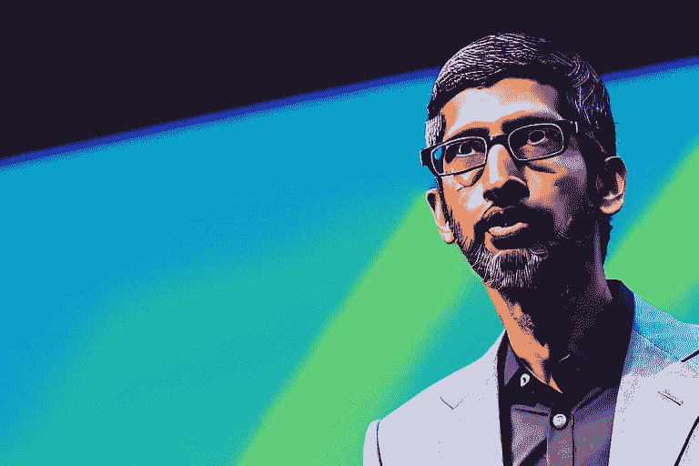

# 桑德尔·皮帅是如何在 2004 年一次棘手的面试中被谷歌聘用的

> 原文：<https://levelup.gitconnected.com/how-sundar-pichai-got-hired-by-google-in-a-tricky-interview-in-2004-370ac4fcb054>

## 当你在面试中不能回答一个问题时，这是非常非常重要的一课

作者拍摄的照片

在工作面试中，我们都尽力以一种让我们与众不同的方式来回答。我们试图给面试官留下深刻印象，无论是通过在简历中添加一些非凡的技能，还是简单地回答一些具有挑战性的问题。

但是当你不知道一个问题的答案时，你该怎么办呢？你会简单地回答“我不知道”还是想出一个解决问题的办法？在评估你理想工作的面试官面前，这是一个棘手的情况。

2004 年，谷歌面试产品管理副总裁时，桑德尔·皮帅也遇到了同样的问题。2017 年，皮查伊与他所在的印度理工学院的学生讨论了他在世界科技巨头公司之一的面试过程。

皮查伊说，在第一轮面试中，面试官问了他对 Gmail 的看法。有一个问题:谷歌在同一天，4 月 1 日，宣布了它的电子邮件服务。“我以为这是愚人节的一个玩笑”，皮柴说。

> 他说他无法回答这个问题，因为他还没有用过这个产品。“是第四个面试官问，‘你看过 Gmail 吗？’。我回答没有。然后他给我看了。之后，第五位面试官问，“你对 Gmail 有什么看法？”然后我开始给出我的答案。”皮柴在谈话中说道。

大多数候选人在试图回答问题之前会编造一些东西。皮查伊的行为完全相反，这给他的面试官留下了深刻的印象，最终，他得到了这份工作。

让我们来看看皮查伊被聘用的一些关键因素:

## 他表现出“知识上的谦逊”

在面试中承认你不知道某个问题的答案通常会让你损失几分，但总比编造一个不真实的答案要好。

甚至科学也同意。根据研究，承认无知或“智力谦逊”的能力与高等教育有关。

> 这是前谷歌人力运营高级副总裁拉兹洛·博克所追求的最高品质之一。“成功、聪明的人很少失败。因此他们不能从失败中吸取教训。
> 
> 相反，他们犯了基本的归因错误，认为如果有好事发生，那是因为我是个天才。如果发生任何不好的事情，通常是因为一个傻瓜，缺乏资源，或市场的变化。”他在接受《纽约时报》采访时说。

下次面试官问你一个具有挑战性的问题时，保持你的脾气，花些时间再回答。皮柴仔细思考回答。他甚至没有看到它，所以他能说什么呢？

## 他有理由

皮查伊坚持为什么他不知道答案:他无法使用该产品，而不是简单地说，“我不知道”。他表现出了这样做的兴趣，这是招聘人员通常在候选人身上寻找的品质。

> 对于每一个“我不知道”，都有一个学习新东西的机会。

皮查伊从这一课中得到了优势，面试官在第四轮给他看了产品。

## 他改变了话题

对话从皮查伊不知道的事情开始。然后皮查伊转移话题，回答他确实知道的。

在看到 Gmail 运行后，他对该产品有了更好的理解。这让他表现出坦率和智慧，这也是他后来在谷歌广为人知的原因。

教训是，如实回答不会发生在你获得美德分数的真空中。智力诚实的好处是它允许你展示你所知道的。

皮查伊给出了一个最好的例子，他做了充分的准备，同时仍然带着尊重和真诚处理一个具有挑战性的环境。在困难的情况下，他不畏艰险，接受了挑战，并获得了丰厚的回报。

# 找到你的内心

从谷歌每年收到的数百万份申请中，你只有 0.2%的机会被录用。如果你足够幸运，通过并收到了一份面对面面试的邀请，考虑一下如何让自己与众不同。让它有价值，并为自己是那 0.2%的人而自豪。

跟随桑德尔·皮帅的示范路径。从皮查伊在谷歌的经历中学习如何在面试中应对危急情况。自信一点，为自己的无知提供一个可以理解的理由。这就对了。与其否认错误，不如拥抱错误并把它们作为教训。

*感谢阅读。别忘了关注我，在评论里分享你的宝贵意见。*