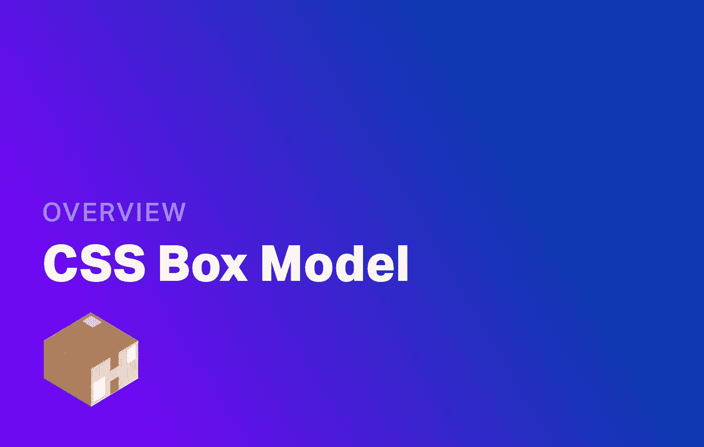
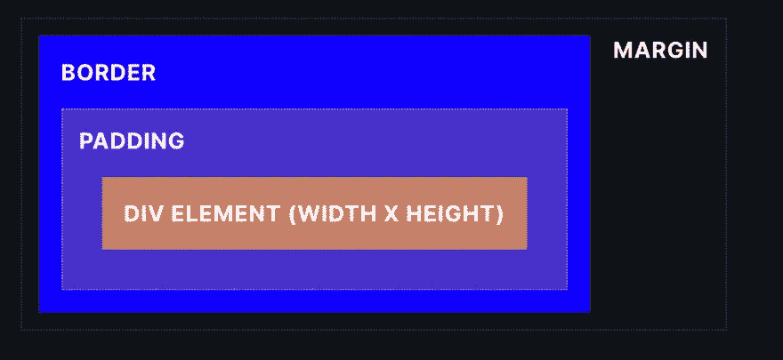
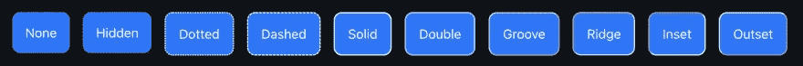
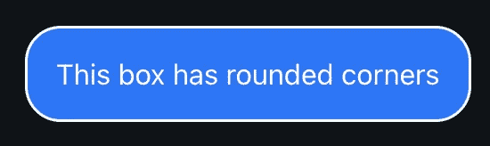

# CSS 盒子模型如何工作

> 原文：<https://levelup.gitconnected.com/how-the-css-box-model-works-9249737c1ac9>



CSS 盒子模型是一个在 CSS 中很少使用的术语，但是可能是你在 CSS 中知道的最基本的东西。简单地说，盒子模型决定了页面上任何对象的大小、边距和填充。它还指 CSS 处理'`inline`'和'`block`'内容的怪异方式。

# 盒子模型

在 HTML 中，每个元素都创建一个盒子。其中一些元素，比如 span 和 p 是内联的，这意味着它们与文本一致，而不是页面的结构元素。

其他元素，如 div 是大的“块”元素。每个元素都有不同的类型，所以在学习 HTML 和 CSS 时熟悉这些元素是很有用的。

块元素具有固定的宽度和高度，有时会跨越整个页面，而行内元素位于文本行内，这意味着它们的内容会在旁边浮动。经常使用的另一种类型的元素是内联块，在内联上下文中，例如在文本块中，它只是固定宽度和高度的块。

不管一个元素是内联的还是块的，所有的元素都有一些核心的“盒子”属性。这些显示在下图中。



```
div {
    width: 100px;
    height: 100px;
    padding: 10px;
    border: 2px solid black;
    margin: 5px;
}
```

对于填充和边距，我们也可以在同一行上分别引用每一边。在 CSS 中，当我们提到每一边时，顺序是上、右、下、左。看看下面的例子:

```
div {
    /*  top side padding: 10px
        right side padding: 20px
        bottom side padding: 5px
        left side padding: 10px
    */
    padding: 10px 20px 5px 10px;
}
```

我们也可以通过使用属性 padding-top、padding-right、padding-bottom 和 padding-left 来直接调用它们。保证金存在完全相同的属性，即:

```
div {
    margin-left: 20px;
}
```

# 尝试一下

下面是一个演示 div 元素，带有一些滑块。使用滑块调整长方体模型属性，并查看它如何影响 div:

# 快速案例研究

让我们多想想盒子模型是如何工作的。我们创建一个新的`div`，宽度为`40px`，填充为`20px`，边框为`2px`，如下所示。我们还增加了`4px`的保证金。

```
div {
    width: 40px;
    padding: 20px;
    border: 2px solid black;
    margin: 4px;
}
```

# 这个盒子有多大？

由于宽度是`40px`，填充是`20px`，边框是`2px`，所以页面上渲染的总宽度实际上是`84px`！

再解释一下，图中所示的宽度是不包括填充的宽度。既然我们说填充的是`20px`，CSS 就把`20px`加到盒子的各个边上。也就是说左边是`20px`，右边是`20px`，一共是`40px`。当我们把它加到我们的宽度上，我们就得到了`80px`。

最后，我们在整个 div 周围设置了边界`2px`，左边是`2px`，右边是`2px`。结果是`40px` + `40px` + `4px`，或者`84px`。

# 显示

CSS box 模型还有另一个名为 display 的属性，它允许你隐藏一个项目。Display 还允许我们设置一个特定的 HTML 来阻止或内嵌。出于箱式模型的目的，让我们考虑几个关键属性:

1.  `none` -项目被隐藏。
2.  `inline` -项目内嵌，即与文本内嵌，不能添加宽度或高度。
3.  `block` -该项目是一个块，即它占据整个宽度并从新行开始。
4.  `inline-block` -该项目是内联文本，但可以在 CSS 中添加宽度和高度。
5.  `contents` -显示项目，就好像其容器不存在一样，并添加到上面的容器中。CSS 框模型显示属性的示例

让我们看一个简单的例子。下面的代码显示了一个 span 被强制为块元素的例子。`span`元素通常是内联的，所以这个例子将像`div`一样给这个`span`元素赋予 box 属性。

```
span {
    display: inline;
    width: 100px;
    height: 30px;
    padding: 10px;
}
```

# 盒子尺寸

CSS 分别管理填充、宽度和边框的方式一直是 CSS 社区争论的焦点。因此，已经创建了一个属性来解决这个问题，称为盒子大小。盒子大小让我们可以忽略这个默认行为。

让我们考虑一下我们的`40px`宽度盒子，它的宽度最终是 84px。我们可以将盒子大小设置为:

边框:宽度包括边框和填充。我们的总宽度现在将是 40px，甚至包括填充和边框。
内容框:默认行为，宽度不包括边框和填充。我们的总宽度现在是`84px`。现在我们有了更多的控制，可以确定地设置我们的宽度，它们会像我们期望的那样显示在页面上。

# 边界

边界是我们影响盒子模型的另一种方式。可以使用`border-top`、`border-right`、`border-bottom`或`border-left`将边框定义为围绕整个元素，或在特定的一侧。这里有一个例子:

```
div {
    border: 1px solid red;
    border-top: 2px solid black;
}
```

边界属性也可以拆分成单独的行。1px 纯红可以写成:

```
div {
    border-width: 1px;
    border-color: red;
    border-style: solid;
}
```

类似地，我们可以将这些应用于单侧，即顶部的`border-top-width`、`border-top-color`或`border-top-style`。我们可以为任何一方这样做。

颜色接受任何颜色，您可以在颜色部分了解更多关于颜色的信息。边框样式属性接受以下值:`none`、`hidden`、`dotted`、`dashed`、`solid`、`double`、`groove`、`ridge`、`inset`、`outset`。



# 边框半径

最后，边界半径让我们添加圆形边缘到我们的 div。注意，这并不影响盒子模型，所以元素的大小保持不变，但是确实影响了它的美观。它接受任何单位——但下面我用像素作为例子。单位越大，舍入越大。下面是一个代码示例:

```
div {
    border-radius: 20px;
}
```



# 结论

这就是你理解盒子模型所需要知道的一切。如果你有兴趣测试你的知识，[我也做了一个小测验，你可以在这里查看](https://fjolt.com/quiz/css-box-model-quiz)。感谢阅读。

# 分级编码

感谢您成为我们社区的一员！更多内容见[升级编码出版物](https://levelup.gitconnected.com/)。
跟随:[推特](https://twitter.com/gitconnected)，[领英](https://www.linkedin.com/company/gitconnected)，[通迅](https://newsletter.levelup.dev/)
升一级就是转型理工招聘👉 [**加入我们的人才集体**](https://jobs.levelup.dev/talent/welcome?referral=true)