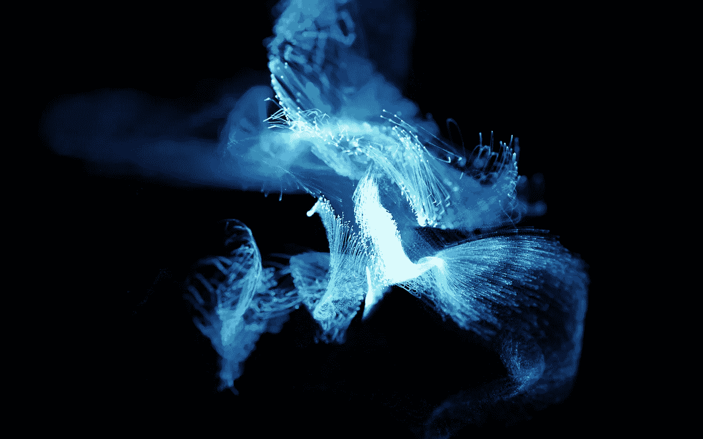
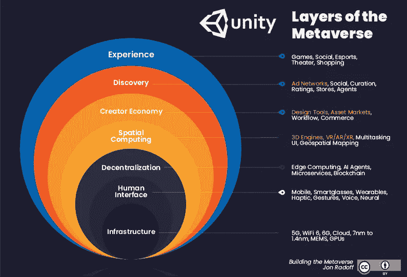

# 元宇宙将如何弥合远程协作中的差距

> 原文：<https://levelup.gitconnected.com/how-the-metaverse-will-bridge-the-gaps-in-remote-collaboration-dbb65a5fc042>

在什么样的工作角色中，有可能从床上爬起来，发现自己在一个小时内就在热带天堂的海滩上发表演讲？或者在伦敦开始你的一天，在另一个大陆结束？如果元宇宙意识到其巨大的潜力，这样的场景可能会变得司空见惯。

虽然新冠肺炎疫情已经实现了远程工作的大幅增长，这不太可能恢复到与内部就业相同的水平，但[元宇宙](https://levelup.gitconnected.com/tagged/metaverse)是一种快速发展的技术，可以通过缺乏面对面的交流来弥合协作差距。

在元宇宙世界的早期渲染中，用户可以生成自己的数字化身，并通过虚拟现实体验在网络空间中发送它们，这种体验可以类似于会议室、圣特罗佩或外太空——取决于你希望在哪里进行合作。

[哈佛商业评论](https://hbr.org/2022/04/how-the-metaverse-could-change-work)甚至提出，我们可能很快就能派人工智能驱动的数字双胞胎去元宇宙参加工作会议，以便代表我们进行合作。本质上，天空，或者至少是云，是元宇宙的极限。

但是，这种新兴的技术发展究竟会如何让我们的工作生活变得更好？让我们更深入地了解元宇宙带来的无限可能:

# 革新远程工作场所

近年来，虚拟现实在包括零售、物流和客户服务在内的一系列行业中的使用越来越频繁。

根据普华永道的数据，在不到 10 年的时间里，虚拟现实将在全球 2300 万个工作岗位中使用——元宇宙将成为这一巨大增长的驱动力。

虚拟现实能够模拟办公室位置，促进不同时区的同事之间的实时会议，并生成可以提供有影响力的演示的可视化效果，虚拟现实可以使我们在未来以有意义的方式进行协作，无论我们在哪里。

通过虚拟现实和元宇宙的优势，我们可以看到企业在前进的团队中体验到更高水平的生产力和协作，为更好的绩效和收入利润铺平了道路。

*(图片:* [*中等*](https://medium.com/building-the-metaverse/market-map-of-the-metaverse-8ae0cde89696) *)*

如上图所示，我们不仅可以依靠虚拟现实作为推动元宇宙的关键技术，边缘计算和区块链还可以帮助提供更强大的体验，这些体验足够安全，可以让企业清晰、安全地共享机密信息。5G 服务和最终的 6G 数据可以为世界上任何两点之间的无缝通信铺平道路，而智能可穿戴技术将使我们的虚拟体验感觉像是基于现实一样。

这些先进的技术将使熟练的程序员能够渲染身临其境的环境，为远程项目协作和安全访问信息铺平道路。此外，标准化的协议可以使许多不同的增强世界通过一个[单一开放元宇宙](https://insidetelecom.com/remote-work-and-the-metaverse-a-new-norm/#:~:text=By%20mimicking%20office%20locations%2C%20enabling,through%20remote%20work%20and%20collaboration.)变得可访问——这意味着协作不必受到试图访问不同软件进行通信的不同团队的阻碍。

# 模拟生活

元宇宙的出现将有助于弥合随着向远程工作角色的广泛转变而在员工协作中形成的差距。随着越来越多的员工发现自己在家工作——甚至在不同的办公地点工作——与同事隔绝，元宇宙有可能以一种有效的方式模拟面对面的交流。

塔塔咨询服务公司(Tata Consultancy Services)的管理合伙人弗兰克·戴安娜(Frank Diana )在接受 Tech Target 采访时表示:“(元宇宙)能够提供像面对面互动一样的协作和社交满足感，这将使公司能够创造出难以置信的分散和多样化的劳动力。”。

元宇宙[积累的经验可以消除主持视频会议的困难，或者将大量员工挤进一个房间进行演示的挑战。空间音频和 3D 体验意味着 VR 技术可以为团队提供身临其境和难忘的体验，帮助员工更好地保留信息，并为每个人提供正在讨论的内容的清晰视图。](https://medium.com/gitconnected/video-game-stocks-battle-it-out-to-become-the-stars-of-the-metaverse-fa7ee342d824)

# 利用有效的培训

由于元宇宙的发展，招聘、入职和培训员工的任务在未来也将变得更加无缝。虚拟现实对工作角色的模拟意味着员工可以数字化地为各方尝试一个角色，以研究他们是否适合这份工作。[虚拟现实培训](https://www.born.net/blog/vr-training)项目甚至可以筛选那些与沟通、协作和领导力相关的重要软技能。

我们已经看到元宇宙和虚拟现实技术帮助改善招聘过程的证据，像米高梅度假村这样的[公司已经与元宇宙公司 Strivr 合作，在入职前提供他们工作角色的虚拟模拟。这种方法可以帮助候选人发现他们对自己的期望是否满意，并为公司创造更高的保留率。](https://www.spiceworks.com/collaboration/team-collaboration/guest-article/the-metaverse-brings-huge-opportunities-to-the-future-of-work/)

尽管元宇宙的发展仍处于早期阶段，但我们已经看到公司为了支持协作而采用该技术，这一事实是一个强有力的指标，表明远程协作的差距正在缩小。对于那些迅速抓住元宇宙潜力的公司来说，回报已经开始显现。