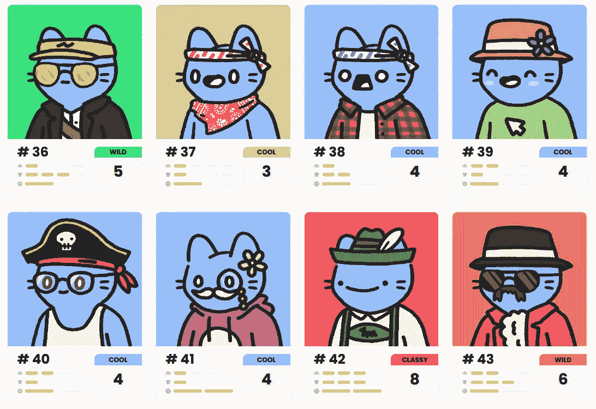

# 作为一名 python 开发人员，NFT 浪潮如何帮助我赚了 1000 多美元

> 原文：<https://levelup.gitconnected.com/how-the-nft-wave-has-helped-me-earn-1000-as-a-python-developer-237a20190571>

这没有你想象的那么难


6900 万美元的 JPG，来源:

近年来，由于广泛的数字艺术意识和区块链技术的技术进步，如智能合同的创建和部署，NFT 的场景发生了巨大的变化。[以太坊](https://ethereum.org/en/)是第一个通过他们的 [ERC-721](https://ethereum.org/en/developers/docs/standards/tokens/erc-721/) 标准引入 NFTs 的区块链，甚至在今天也是使用最广泛的。

有趣的是，你不需要知道任何关于区块链技术来做我做的工作，这是纯粹的 Python 和枕头库。

# NFTs 的结构



来源:[酷猫](https://www.coolcatsnft.com/gallery)

大多数 NFT 都有共同的特征，这些特征根据它们的创造者的稀有决定而不同。例如，以上面的酷猫 nft 图像为例，它们都有完全相同的身体结构和共同的特征，如帽子、脸、衬衫和另一个特征称为层。每个特征变化都存储为 PNG 图像，可以通过混合它们的 alpha 通道(透明度)叠加在其他特征图像上，以获得所需的图像。

另一个美丽的例子是卡尔达诺区块链上的[亮沼泽](https://brightpalz.io/) nft，这是它们的[稀有度](https://brightpalz.io/attributes-and-rarity/)分布。


来源: [CNFT](http://cnft.io/marketplace?project=Bright%20Palz)

# 使用的工具

Python 是一种通用语言，老实说，它能够做几乎任何事情，包括图像处理，这是 NFT 创作的本质。

使用的工具:

*   枕头图书馆
*   图像库
*   csv 和 json 来导出元数据

# 该过程

如前所述，所有特征图像都存储为 PNG 图像，程序所要做的就是将它们堆叠起来，同时根据稀有度分布进行特征选择。

伪代码:

```
1\. Repeat while N images are generated
     a. Create an empty mapping for trait name and its value
     b. Perform trait selection
     c. Read selected traits files and stack them
     d. Make an entry in metadata
     e. Save the Image
2\. Export metadata as a json and CSV file
```

请记住，根据创作者的要求，可能会涉及到额外的逻辑，以包含更多令人欣喜若狂的图像/GIF。

生成的最终代码是可重用的，并且可以通过微小的修改来循环使用，以适应另一个 NFT 项目。到目前为止，我已经做了两个项目，其中一个几天内就卖光了。

# 结论

所以，这是一次小小的旅行，展示了我曾经参与的技术是如何在经济上和智力上帮助我的。NFT 创作者在像 fiverr，freelancer 和 upwork 这样的自由网站上寻找开发者，一旦你得到一份工作，就更容易开始新的项目。谢谢你一直读到最后。请继续关注更多关于 Python 和自动化的文章。

[](https://towardsdatascience.com/create-your-first-ci-cd-pipeline-with-jenkins-and-github-6aefe21c9240) [## 与 Jenkins 和 GitHub 一起创建您的第一个 CI/CD 渠道

### 创建和部署自由式 Jenkins 项目的指南

towardsdatascience.com](https://towardsdatascience.com/create-your-first-ci-cd-pipeline-with-jenkins-and-github-6aefe21c9240) [](https://python.plainenglish.io/5-ways-to-schedule-jobs-in-python-99de8a80f28e) [## Python 中调度作业的 5 种方法

### 对于自动化的程序员来说。

python .平原英语. io](https://python.plainenglish.io/5-ways-to-schedule-jobs-in-python-99de8a80f28e)