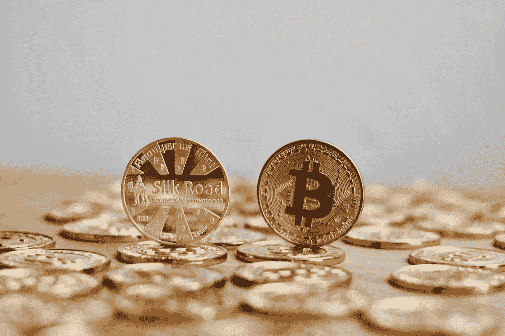
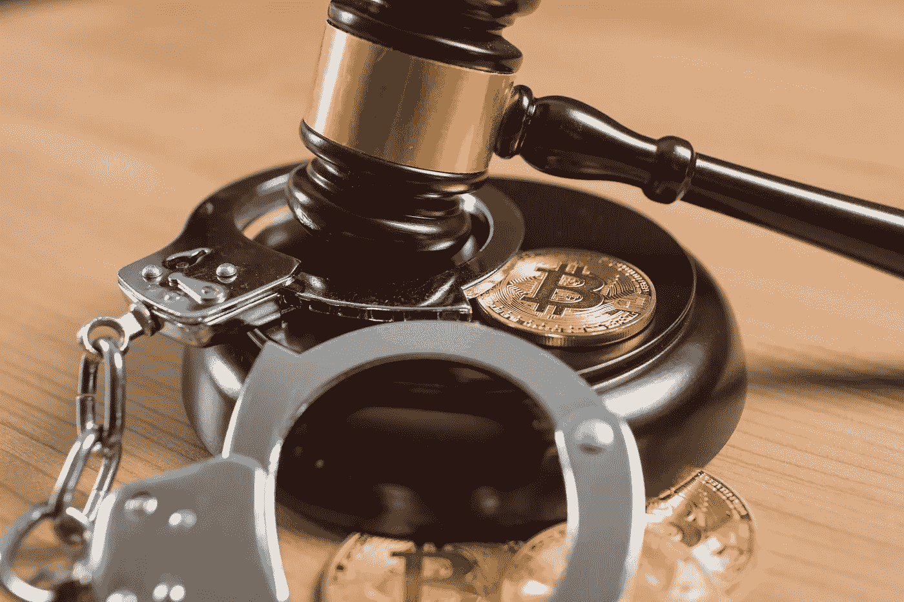
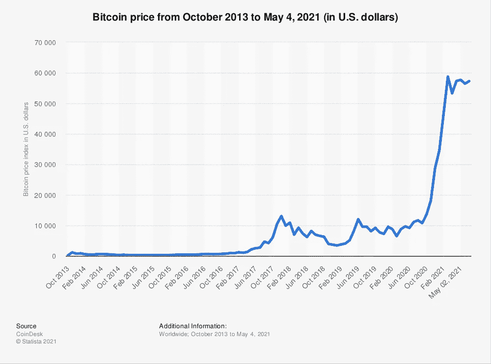

# 美国政府如何因出售比特币而错失 100 亿美元

> 原文：<https://levelup.gitconnected.com/how-the-us-government-missed-out-on-10-billion-by-selling-its-bitcoin-42450586711>

## 他们应该 HODL 化从丝绸之路缴获的比特币

图片: [Shutterstock](https://www.shutterstock.com/image-photo/digital-currency-physical-bitcoin-coin-gold-744986095)

怀疑者对比特币最常表达的反对意见之一是，它为犯罪活动提供了便利。这是一种常见的误解，经常被那些在[政府](/why-are-governments-choosing-to-remain-ignorant-and-short-sighted-about-bitcoin-e2e62bfcb71e)和有影响力的职位上的人所表达，他们不理解这一点，并且很容易忽视现金已经为犯罪企业的匿名运作提供了便利。

这一观点最近在伯克希尔·哈撒韦公司的投资者会议上提出。投资大师查理·芒格是沃伦·巴菲特的商业伙伴，他直言不讳地描述了比特币:

> “当然，我讨厌比特币的成功，我不欢迎一种对绑架者、勒索者等如此有用的货币……我应该谦虚地说，我认为整个该死的发展令人恶心，违背了文明的利益。”

那么，查理不是你的粉丝？

Twitter 上对芒格评论的回应是意料之中的——至少可以说是严厉的:

来源:[推特](https://twitter.com/APompliano/status/1388604543718547458?s=20)

大多数人会尊重芒格几十年来作为投资者的成功，但他的言论暴露了他对比特币缺乏真正的理解，以及在缺乏真正知识的情况下依赖于通常的陈词滥调和说辞。

然而，尽管统计数据证明，涉及比特币的犯罪交易量正在逐年下降，但这种看法可能看起来是正确的，这是可以理解的。大多数人第一次听说比特币是作为丝绸之路运作的一个相关和不可或缺的部分，丝绸之路是一个暗网网站，在那里可以使用比特币自由和匿名地购买毒品、枪支和黑客工具。

美国政府终于在 2013 年末追上并逮捕了丝绸之路的创始人罗斯·乌布里希特。自那以来，拆除该场所并逮捕其雇员和附属人员的活动一直在继续。

2020 年 11 月，当美国国税局截获并没收了一批 69370 比特币时，这些调查结束，这些比特币据信是一名黑客从丝绸之路上窃取的。

这就提出了一个问题——美国政府如何处理被查封的比特币？

# 比特币和丝绸之路

在 2021 年的过程中，我对比特币和区块链技术更加着迷。今年年初，我做了一笔小额投资，主要是作为一项实验。从那以后，我一直试图理解它是什么，它是如何运作的，以及对于那些最常被其批评者提出的反对意见，是否有[任何真正的实质内容。](/cryptocurrency-is-not-just-a-tool-for-criminality-6996c949c42)

受查理·芒格的另一句话的启发(讽刺地)，我试图在研究中保持客观:

> “除非我能比反对我的人更好地陈述反对我的观点，否则我无权发表意见。我认为，只有当我达到那种状态时，我才有资格说话。”
> 
> 查理·芒格

鉴于芒格最近在比特币问题上的爆发，他似乎已经忘记了这一信条，这种方法似乎是合理的。与其简单地寻找相信某件事的理由，不如调查一下担忧和冷嘲热讽的来源。

因此，作为我对比特币了解的一部分，我开始探索丝绸之路的历史。我如饥似渴地阅读了尼克·比尔顿(Nick Bilton)的《T4》(American)这本书，现在我理解并欣赏比特币是如何以及为什么成为丝绸之路运作的内在因素。

在本书的早期，我们了解到黑暗网络、Tor 浏览器和比特币是罗斯·乌布里希特(又名*恐惧海盗罗伯茨*)用来从头开始建立在线市场的基本元素。这是他的自由主义理想的体现，也是让消费者在网上购买他们想要的东西，而不受政府的干涉或监督。

该网站的访问者可以购买各种毒品和其他非法商品，使用比特币匿名支付，就像人们用现金向罪犯支付此类商品，希望避免被发现一样。相似之处显而易见，但不可否认的是，比特币让丝绸之路得以存在并在网上蓬勃发展。

在鼎盛时期，该网站每天产生数万美元的销售额。在被捕时，乌尔布里切特的估计净资产为 2850 万美元。他在旧金山公共图书馆[被捕后，联邦调查局特工立即搜查了他的公寓](https://edition.cnn.com/2013/10/04/world/americas/silk-road-ross-ulbricht/index.html)，他们没有发现装满现金的手提箱，而是发现了各种 u 盘，里面装着乌布里切特藏匿的比特币。

我不禁想知道这些比特币到底怎么了。鉴于丝绸之路的大部分故事发生在 2013 年之前，当时一个比特币的价格不到 1000 美元，如果优盘仍在美国政府手中，美国政府似乎可能已经走运了？

# 丝绸之路比特币怎么办？

2015 年 11 月， [BBC 报道](https://www.bbc.co.uk/news/technology-54833130)最后一批 22000 枚比特币在丝绸之路被查获。这使得乌尔布里切特被捕后，美国政府没收的比特币总数达到约 17.5 万枚。

根据美国联邦调查局的网站，民事资产没收法对适当处理犯罪所得以及在调查过程中扣押的金钱和货物做出了规定。

被没收的枪支通常会被销毁，除非它们可以出售，所得的钱可以做好事。建筑物、汽车和其他财产可能会被改变用途，用于公共利益或执法目的，否则它们会被出售，所得资金用于赔偿受害者。在可能和适当的情况下，被扣押的金钱(无论是现金还是电子形式)通常会返还给受害者。

在 Ulbricht 的审判中，政府[提交了 5 封证明信](https://www.vice.com/en/article/539ey3/the-heartbreaking-letters-from-families-of-silk-road-overdose-victims)，由那些从丝绸之路购买毒品并因意外用药过量和药物不良反应而死亡的不幸者的家庭撰写。对这些受害者的家庭进行补偿是有道德依据的，尽管这不会让他们的亲人起死回生。这将如何工作，或者是否会发生还不清楚。

在追踪货币的流动和来源方面，虽然比特币可以用来保护持有和使用它的人的匿名性，但通过区块链可以很容易地追踪单个硬币的流动。每枚硬币留下的痕迹将被永久、不变地记录下来，并保存在整个网络的数字账本中。这实际上*增加了*加密货币的每个单元如何从一个人转移到另一个人的透明度。

图片来源: [Shutterstock](https://www.shutterstock.com/image-photo/bitcoin-regulation-btc-cryptocurrency-coin-judge-1401029288)

正是这种透明度使执法机构能够追踪从丝绸之路上被盗走的比特币，并将其没收。它还帮助联邦特工发现，参与此案的两名特工——卡尔·福斯(Carl Force)和肖恩·布里奇斯(Shaun Bridges)——自己在调查期间叛变，从丝绸之路窃取了比特币，后来试图出售给自己。

这种透明度也有助于让联邦政府追踪并没收 69370 枚比特币，这些比特币是一名黑客在乌尔布里切特被捕 7 年后从丝绸之路窃取的。

对这些比特币的扣押肯定让美国政府陷入了两难境地。至少可以说，迄今为止，美国政府中身居要职的关键人物都对比特币不屑一顾。美联储主席杰罗姆·鲍威尔最近将比特币描述为“一种投机资产”，而财政部长珍妮特·耶伦指出比特币作为一种货币是“低效的”。

因此，鲍威尔、耶伦或他们的任何前任都不太可能批准美国政府持有丝绸之路比特币——这可能解释了他们接下来所做的事情。

# 他们卖掉了它们(可能还会打折)

在截至 2015 年底的 17.5 万枚比特币中，政府将它们拍卖给了出价最高的买家。尚不清楚这些比特币的实际价格，但英国广播公司的一篇文章暗示最后一批 22000 枚比特币被分成 2000 枚卖给了 11 个不同的竞标者。

这些硬币很可能以低于市场价的价格售出(我无法想象拥有那些曾被用来在丝绸之路上购买毒品的硬币会有什么荣誉可言)。事实上，BBC 报道称，此次拍卖吸引了总共只有 11 名竞标者的“低投票率”——所以每个人都带着东西离开了。

在试图计算政府可能赚了多少钱的同时，考虑比特币多年来的价格波动也是有意义的。

来源: [Statista](https://www.statista.com/statistics/326707/bitcoin-price-index/)

价格在 2013 年 11 月达到 1164 美元的峰值，就在乌尔布里切特被捕后(我想知道这是否有关联？).从那时起直到 2015 年 11 月，价格从未超过 375 美元。

如果我们假设最好的情况，17.5 万枚比特币以每枚 375 美元的价格出售，那么通过拍卖它们筹集的资金总额将为 6560 万美元。

**如果他们持有这些比特币，并在今年 61，000 美元的高点出售，他们会赚 107 亿美元。**

简而言之，他们通过出售比特币而不是 HODL 化比特币(比特币的俚语，用于离线冷藏)错过了超过 100 亿美元。

# 2020 年查获的 69370 个比特币怎么处理？

现在的问题似乎是，联邦政府应该对美国国税局 2020 年 11 月扣押的比特币做些什么(如果有的话)。到目前为止，我还没有找到任何关于已经做了什么的报道，但是考虑到当前的价格和普遍的政治情绪，这似乎是一件很重要的事情。

**以今天的价格计算，这些比特币价值 39 亿美元(每枚 56519 美元)。**

这给政府带来了相当大的道德难题。

如果他们在一个加密交易所出售比特币，这可能会被视为官方对比特币的认可，远远超出他们迄今愿意提供的程度。

*   这将是对比特币确实是一种存储和分配价值的有效机制的承认。
*   这将表明人们接受比特币可以有效地作为一种可以升值的投资资产(自从这些硬币在丝绸之路上使用以来，人们已经这么做了)。
*   这在某种程度上是承认，比特币和区块链并不危险，因为它们支持匿名——事实上，它们被政府收回的事实是比特币通过区块链的设计实现的透明度。
*   这将类似于政府从比特币这一技术中获得经济利益，而许多政府高官一直热衷于贬低和疏远这项技术。

也许他们已经在逐渐出售比特币，一次一点，以便以尽可能好的价格将其兑换成美元，并试图避免公开承认这些事实？这将有助于他们避免像拍卖另一个丝绸之路比特币那样损失如此惊人的金额。

或者也许，只是也许他们拿着它们想看看会发生什么？

# 最后一个选择

还有最后一种可能性很小但确实存在——政府出于原则摧毁丝绸之路比特币。

如果美国政府真的反对比特币，并且看不到这种技术的真正用途或目的——这不太可能，但我认为是可能的——他们可以简单地选择通过安全地处理包含加密密钥的硬件设备来销毁比特币。

不时有比特币持有者丢失物理存储设备的故事出现。其他人[丢失了密码](https://www.businessinsider.com/bitcoin-owner-who-lost-password-made-peace-potentially-huge-loss-2021-1?r=US&IR=T)和恢复短语，因此被阻止访问他们的比特币。不管怎样，这些比特币已经一去不复返了。

网络上最多只能发行 2100 万枚比特币——这是内置于计算机协议中的一个有限数字。丢失的存储设备上的任何比特币都永远消失了。据估计，到目前为止，已经发行的所有比特币中有多达 [20%可能会永久丢失。](https://www.investopedia.com/news/20-all-btc-lost-unrecoverable-study-shows/)

如果美国政府认为比特币没有实际价值，那么它可以发表声明，永久销毁这 69370 枚比特币，进一步减少流通数量。不过，我暗自怀疑他们不会那样做。

# 最终想法

比特币在丝绸之路的兴衰中发挥了不可否认的重要作用。有人可能会说，如果没有比特币，丝绸之路就不会出现，这在某种程度上可能是真的。也就是说，如果比特币不存在或者不那么容易被采用，一种处理支付和保持匿名的替代手段可能会发展起来。

同样重要的是要记住，现金总是允许人们匿名支付商品和服务——比特币只是利用了这一属性，并在在线环境中实现了这一点。如上所述，所有权的匿名性伴随着*更大的透明度*——通过询问区块链，很容易跟踪比特币在用户之间的移动。这一功能在抓捕腐败政府特工和追回被黑客窃取的比特币、追回与丝绸之路相关的犯罪所得方面发挥了重要作用。

我们可能永远不会知道美国政府决定如何处置其持有的丝绸之路比特币(以及其他刑事诉讼和调查中可能持有的任何比特币)。尽管如此，想到联邦政府持有超过 30 亿美元的比特币——这种加密货币被许多高级官员反复描述为毫无意义且具有潜在危险，我就觉得好笑。

我想知道查理·芒格是否也秘密持有一些？

*如果你喜欢阅读这样的故事，并且愿意支持 Medium 上的作家，考虑注册成为 Medium 会员。一个月 5 美元，给你无限的故事。如果你注册使用我的链接，我会赚一小笔佣金。*

 [## 阅读托比·黑兹伍德(以及媒体上成千上万的其他作家)的每一个故事

### 作为一个媒体会员，你的会员费的一部分会给你阅读的作家，你可以完全接触到每一个故事…

tobyhazlewood.medium.com](https://tobyhazlewood.medium.com/membership) 

注意:*本文仅供参考。不应将其视为财务或法律建议。在做任何重大财务决定之前，先咨询财务专家。*

## 如果你喜欢这篇文章，我希望你能加入我的电子邮件列表。