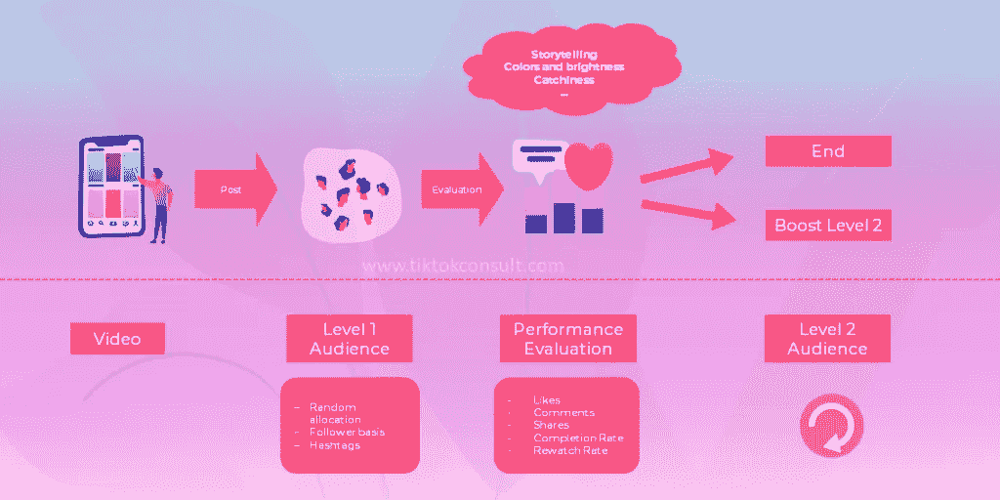
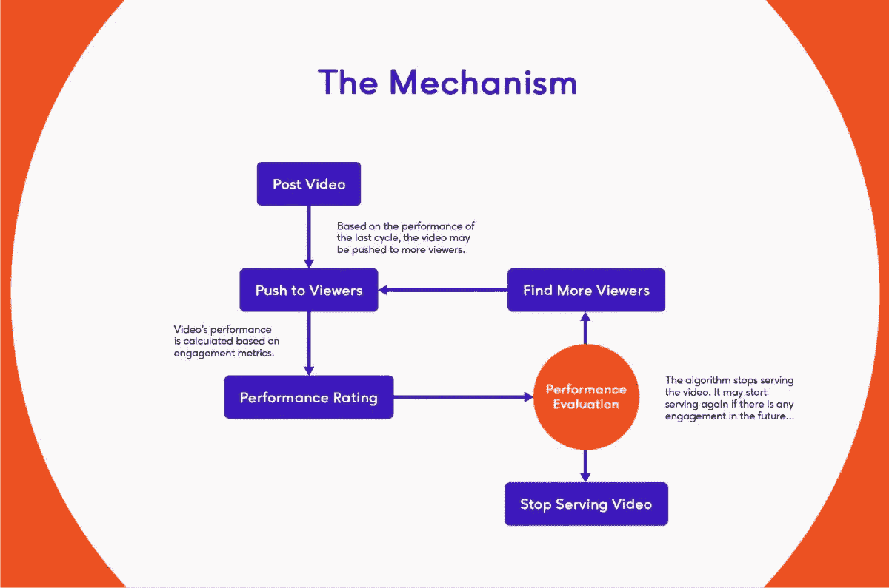
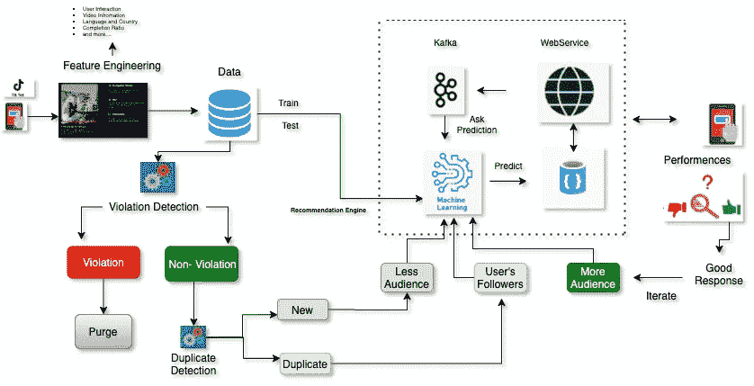

# Tik Tok 的工程是如何运作的。

> 原文：<https://levelup.gitconnected.com/how-tik-toks-engineering-works-f746bb82645d>

来源:亚历山大·沙托夫经由[Unsplash.com](https://unsplash.com/photos/I4p0FcjDBJI)

Tik tok 是 z 世代中最受欢迎的社交媒体平台之一，拥有超过 23 亿的总下载量和超过 15 亿的月活跃用户，它是如何工作的？

tik tok 算法以让用户在应用上停留超过 10 分钟而自豪。这个令人印象深刻的数字是 Instagram 的 3 倍。该算法以两种方式工作。一个面向内容创作者，另一个面向数百万观众。

# 内容创建者

当内容创建者上传视频时，它由计算机视觉算法进行评估。该算法分析视频中的所有内容，将其归类到正确的类别中。

然后是 NLP 算法，它分析视频的元数据并转录视频的音频，以更好地理解内容。

一旦机器学习算法收集了关于你的少量信息，它就会将你的视频推荐给平台中的一小部分用户。

来源:Tik Tok [营销](https://tiktokconsult.com/wp-content/uploads/2020/02/tiktokmarketing.ch_Blog_Algorithmus-ENG-1024x512.png)

一旦视频被推向一小部分观众，它的表现就会被评估。根据矩阵分数跟踪绩效:

再观看率= 10 分

完成率= 8 分

股份= 6 分

评论= 4 分

喜欢= 2 分

不像其他社交媒体平台那样，关注、喜欢和评论率更高。tik tok 算法优先考虑再观看率，给它分配 10 分，然后是完成率，8 分，然后是其余的。观看并完成您的视频的人越多，您的评分就越高。

然而，你不能让你的视频无休止地循环播放，算法只会计算一次，因为度量是按用户计算的。

## Tik Tok 内容流

来源:[助推器](https://wearebooster.com/wp-content/uploads/2020/07/TikTok-Algorithm-Process-Flow-Chart-1200x795.jpg)

*   用户发布视频
*   视频由机器学习算法进行分析，不遗余力地评估元数据、音频和图像等一切。
*   一旦分析完成，视频就被批准并推向一小部分观众。
*   机器学习算法决定哪些观众最适合该视频。
*   然后将视频推送给用户。用户与视频互动，然后在此基础上进行评估。根据分数，视频被评定为成功或不成功，如果视频不成功，则视频的生命周期结束。如果视频有一个成功的表现，它就会被推回给更多的观众，并再次经历整个过程。

# 新用户/观众

作为一个观众，你不负责创造内容，你只是想观看内容。机器学习算法必须尽可能多地了解作为观众的你，以便它们能够适当地推荐视频。

当你打开手机应用程序时，你无需注册就可以进入 tic toks 获取视频。此时，tic tok 正在尽可能多地了解你。第一批视频旨在让你尽可能长时间地呆在应用程序中，并了解你喜欢什么类型的内容。这是通过向你展示被归类为高参与率和低退出率的视频来实现的。

在你互动的视频中，关注的是你重播的视频，完整的，标签的，趋势的。观众的评分如下:

*   再观察率= 10
*   完成率= 8
*   股份= 6
*   评论= 4
*   喜欢= 2

# 数据流

来源:[数据收集](https://cdn-images-1.medium.com/max/1600/1*itNy-sECVewPMOEb2_t2lg.png)

tik tok 是一个阅读量很大的系统，观看者的数量超过了内容创作者的数量。这相当于 1:100 的比率。

视频最初通过上传 API，然后移动到特征工程部分。这个特征工程部分负责视频的分类、验证、元数据、图像、声音的分析。基本上，这是机器学习算法，尽可能地评估视频。

整个视频处理都在这个阶段完成。根据视频的不同，会发生两件事。一个 30 秒的视频被分解成 4 个部分，一个 10 秒的视频只是通过视频的所有阶段。对于 30 秒的视频，视频文件然后被分解成不同的块，这些需要被转换成 4 个不同的过程。

*   第一个过程是将文件转换成不同的格式。
*   第二是将组块转换成不同的分辨率
*   存储为一个文件的内容将是该文件的 8 到 16 个副本。
*   现在这些被上传到亚马逊 S3 桶

亚马逊 S3 桶构成了存储过程的第一部分；根据支持的分辨率和格式，一个视频会有不同的文件。根据用户的地区和人口统计数据将文件上传到 S3 存储桶，如果在一个地区无法访问该文件，则可以在另一个地区访问该文件。

为了实现这一点，我们使用了亚马逊 S3 和 TIC toks CDN(Akamai ), CDN 可确保视频始终可用，即使某个区域节点可能出现故障。

因此，当用户想要观看特定视频时，特征工程服务检查视频的用户数据库以及视频元数据数据库。该算法然后将此与用户详细信息相结合，通过他们最近的区域传送视频，如果他们的区域关闭，则传送到他们旁边的另一个区域。

# 附加阅读:

【https://later.com/blog/tiktok-algorithm 号