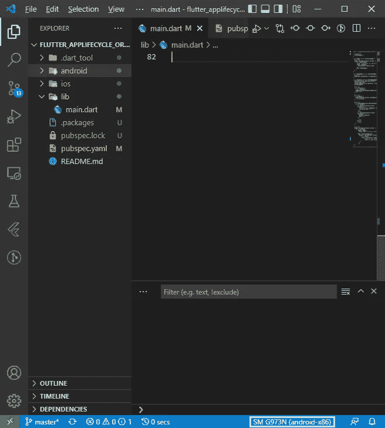

# 如何用 NoxPlayer 加速 Android 应用开发？

> 原文：<https://levelup.gitconnected.com/how-to-accelerate-android-app-development-with-noxplayer-e28c47a0bc2c>

一个轻量级 Android 模拟器指南，帮助您顺利开发应用程序！

**使用 NoxPlayer 加速 Android 应用开发**

# 问题是

作为一名移动开发人员，您总是希望保持笔记本电脑的健康和更新。无论你增加多少内存或硬盘，总有一天 Android 模拟器会通过冻结所有工作进程来降低系统性能。

想象一下，在这种情况下，在你的前辈面前展示你的作品，你会感到多么尴尬。

# 解决方案

这可能是你想试用一款轻量级 Android 模拟器[**no xplayer**](https://www.bignox.com/)**的好时机。以下是转换到 Nox 后您将获得的一些优势。**

## **根级别访问**

****

**导航到根级别访问设置。**

**安装成功后打开 NoxPlayer，点击⚙️settings icon️，启用 **Root** 选项。它允许您以超级用户的身份进行根级访问，以浏览隐藏的目录并执行想要测试的操作。**

## **管理和同步多个仿真器实例**

****

**使用多驱动器管理器管理多个仿真器实例。**

**使用**多驱动管理器**，你可以创建模拟器的多个实例。点击**添加仿真器**按钮，根据您的需求选择 Android 版本。**

****

**导航到同步选项。**

**还没完呢！您也可以同步操作；一旦鼠标在单个实例中移动，相同的动作将在所有模拟器实例中执行。**

## **只需点击一下即可启用 FPS**

****

**导航到“显示 FPS”选项。**

**大多数开发人员更喜欢通过启用每秒**帧**选项来检查应用程序动画。这有助于他们在开发阶段优化源代码。**

****

**从游戏选项卡导航到框架设置滑块。**

**打开**系统设置**，选择**游戏**选项卡，根据需要调整滑块来调整画面设置。**

## **更改默认设备设置**

**不喜欢默认界面，为什么不更改设备设置？导航到**设备**选项卡，选择您喜欢的手机型号。**

****

**导航至仪器设置。**

**如果你认为模拟器占用了太多的内存，调整性能设置。选择您喜欢的**分辨率设置**来切换默认屏幕尺寸。**

****

**NoxPlayer 中的性能设置。**

## **模拟移动 GPS**

**您可以通过输入地名或定义纬度和经度值来移动当前的虚拟位置。要访问位置设置，请单击位置图标。另一个令人惊讶的功能是，你可以在谷歌和百度地图之间切换。**

****

**导航到位置设置。**

## **屏幕捕捉和视频录制**

**NoxPlayer 允许您使用**“prints CrN”**和**“Video Recorder”**功能录制和保存应用程序的屏幕截图。**

****

**导航至打印机和录像机选项。**

## **摆弄手势和方向**

**很多时候，一旦 app 的定位发生变化，就需要考察用户体验。Nox 提供了**“旋转”**功能，可在横向和纵向模式之间切换。**

****

**演示手势和方向。**

## **备份和恢复数据**

**是否要运行同一个仿真程序实例的多个副本？只需打开**多驱动管理器**并选择**复制**选项。**

****

**创建模拟器实例的多个副本。**

**您也可以使用备份和恢复功能移动您的数据。**

****

**在 Nox 播放器中备份数据。**

# **V **S 码** +扑+ NOX =快乐编码！**

**足够的闲聊；让我们言归正传。对于本教程，您需要安装以下软件。**

*   **[Android Studio](https://developer.android.com/studio) 带 SDK & ADB(跳过仿真器安装)**
*   **[Visual Studio 代码](https://code.visualstudio.com/download)**
*   **Nox 播放器模拟器**

1.  **安装成功后，打开 Nox 播放器并启用**“USB debugging⁴.”****

****

**导航到 Android 中的 USB 调试选项。**

**2.之后，关闭 NoxPlayer &导航到`C:\Program Files\Nox\bin`并将`nox_adb.exe`文件移动到你的桌面(只是为了备份)。**

**3.从`C:\Users\USER_NAME\AppData\Local\Android\Sdk\platform-tools`复制`adb.exe`文件，粘贴到`C:\Program Files\Nox\bin`并重命名为`nox_adb.exe`**

**4.运行 Nox 仿真器，瞧，您将在 VSCode 状态栏中看到仿真设备。**

****

**VSCode 中 Nox 模拟装置的成功连接。**

**如果您失去连接，请在终端中尝试以下命令。**

1.  **`adb kill-server` -终止 Android 调试桥进程。**
2.  **`adb start-server` -初始化 Android 调试桥进程。**
3.  **`adb connect 127.0.0.1:62001` -与 NoxPlayer 连接。**

# **结论**

**我希望你喜欢这种开发 android 应用程序的简便方法。如果你喜欢这篇文章，请随意鼓掌五十次。**

# **参考**

****【1】:no xplayer——最快最流畅的 Android 模拟器&Mac** [https://www.bignox.com/](https://www.bignox.com/)**

****【2】:同步操作| NoxPlayer 常见问题**
[https://support.bignox.com/en/multi/sync](https://support.bignox.com/en/multi/sync)**

****【3】:如何在 Nox App Player 中备份和恢复您的数据** [https://www . big Nox . com/blog/How-to-backup-and-restore-your-data-in-Nox-App-Player/](https://www.bignox.com/blog/how-to-backup-and-restore-your-data-in-nox-app-player/)**

****【4】:启用 USB 调试| SAMs class . info** [https://tinyurl.com/259bhkh9](https://tinyurl.com/259bhkh9)**