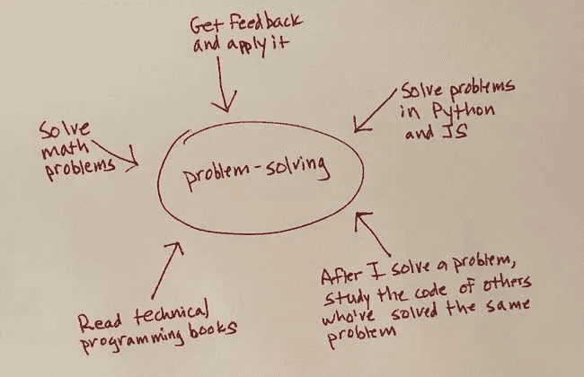

# 如何通过多种学习方式提高您的编程知识

> 原文：<https://levelup.gitconnected.com/how-to-accelerate-your-programming-knowledge-with-multiple-streams-of-learning-c190f364037e>

金融大师们谈论拥有多种收入来源。这个想法是从几个来源获得收入，而不是依赖单一来源。当学习编程主题和构建编程技能时，我们应该体现类似的原则。

我的建议是采用一种我称之为“多重学习流”或 MSL 的方法。它意味着从多个角度积极研究一个领域或建立一项技能。

这与更常见的学习方法形成对比，我认为这是一种“孤立”的学习方法。当你专注于单一的学习形式时，比如说一门课程或一个项目，并且只专注于这门课程或项目。

MSL 似乎显而易见。但很少有人遵循。人们常常采取孤立的学习方法。他们专注于一种单一的学习形式，让其他一切都靠边站。

一些常见的借口包括:

*   获得反馈？没时间了。
*   看技术书？也许在未来的某个时候。
*   和同行见面讨论编程话题，提问？也许在理想的世界里。
*   阅读和研究解决了同样问题的其他人的代码，并应用你所学到的东西？现在不行。

在这篇博文中，我认为 MSL 是学习和技能培养的好方法。

# 行动中的多种学习方式

我认识的一个程序员是学计算机的。他注册了一个在线课程，包括标准的讲座和作业。

对大多数人来说，学习就到此为止了。他们会完全专注于课程，而且只专注于课程。他们无意识地选择孤立的学习方法。

不是这个程序员。他的课程是学习计算机科学的一个途径，但绝对不是唯一的途径。

他花了大量时间处理其他相关项目和问题。他和两个同学几乎每周见一次面，讨论计算机科学话题并提出问题。他还虚拟地与一位同学会面，解决问题并获得反馈。直到最近，他还领导着一个讨论和分析技术书籍的阅读小组。

这位程序员是 MSL 的典范。他正在从多个角度积极攻击计算机科学。这有助于培养联系，巩固概念，提高学习速度。

可以肯定的是，他正在学习材料。但是还有更多。

他也从多个角度看待计算机科学领域——老师、同学、技术书籍的作者和同行——而不是单一的角度。这种观点的多元化不仅有助于培养开放的心态。但这也有助于你抓住细节:在一个语境中被忽略或混淆的东西在另一个语境中变得具体了。

这是 MSL 在行动。

# 出于需要而生

MSL 的想法是在我 25 岁左右的时候出于需要而产生的，当时我决定去研究生院学习艺术史。

然而，这是一个挑战。我没有艺术方面的行业经验，除了大学里的一些课程，我对这个领域知之甚少。为了让*进入*研究生院，我有很多工作要做。

为了跟上进度，我参加了一些课程。但是我受教育的很大一部分是在教室外的*进行的，在那里我积极投身于艺术世界。*

我成了当地博物馆的讲解员，在那里我给博物馆的艺术收藏和当前的展览做导游；亲身经历过的艺术(这远比在平面墙上投影的幻灯片上看到的要好)；了解了博物馆生活的方方面面。

我也成为了一位艺术史教授的研究助理。这一经历有助于提高我的研究和写作技能，并给了我一个艺术世界的学术视角。然后是艺术史阅读小组，我的十个同学(来自我补课的大学)就密集的理论文本进行了激烈的讨论。

艺术总是以不同的方式出现在我的脑海中。结果我的知识面直线上升。

当然，在那时，我还没有为我的学习方法取一个名字。我只是试图尽可能多的学习，从多个角度积极参与各种追求似乎是一种方式。

所以当我被研究生院录取后，我继续使用这种方法。这次我决定推出一个关于艺术的博客。

我借此机会采访了画廊老板、策展人和艺术家，他们非常愿意谈论和回答我的问题。我参加了很多艺术展览，去了很多艺术工作室。然后，我会回到我的公寓，写一篇博客。

我的知识又一次飙升。这就是我如何学习策划一个艺术展，以及艺术家如何工作和思考的。这也是我开始成为作家的原因。

几年后，我开始了另一项自学任务:学习编程。你可能认为我是从 MSL 开始我的旅程的。

但事实并非如此。

# 用多种学习方式编程

我无法解释*为什么*我没有用在学习艺术领域中对我很有用的方法开始学习编程。我简直想不起来。

相反，我用孤立的学习方法开始了我的自学编程之旅。没用。

三个月后，我做了一次彻底的重启，从头开始了我的编程之旅。那是因为我的第一次尝试没有效果，由于糟糕的学习技巧和不适当的学习策略。

在学习编程的第二轮中，我花时间学习如何学习，这样我手头就有了更好地学习技术主题的策略。我还制定了一个包括 MSL 在内的整体学习策略。

# 如何让它成为现实

你可以将 MSL 应用到一个特定的领域，比如学习计算机科学的程序员。你也可以把它应用到你想要学习的概念或技术中，或者你想要培养的技能中。

无论哪种方式，想法都是一样的:确定你想学什么或更擅长什么。然后，从多个角度积极出击。

当我第一次开始编程时，我遵循了经常被引用的提高解决问题能力的建议:解决很多问题。所以我采取了解决问题的孤立方法，只专注于解决尽可能多的问题。

但是重复只是故事的一部分，正如我后来发现的那样。仅仅重复不会让你成功。你必须对你的练习有*意图*，我在关于[如何更好地解决问题的文章中解释了这一点](https://amymhaddad.com/how-to-get-better-at-solving-programming-problems)。

现在我解决问题的方法是多方面的。

毫无疑问，为了更好地解决问题，解决问题是必不可少的。你必须做你想做得更好的事情。

但是我们不能忽视其他形式的可以加速你学习的知识，比如获得反馈和研究其他解决了同样问题的人的代码。

MSL 迫使你以不同的方式运用你的知识。用 Python 和 JavaScript 解决一个问题迫使我以不同的方式思考——即使是同样的问题。这也是我大力提倡解决数学问题的原因。

挑战变成了将通常被认为是被动形式的知识变得主动。

# 激活它

MSL 的一个基石是让学习的溪流活跃起来，理由很充分:你会记得更好。

以反馈为例。我的目标是实时获得反馈(在今天的远程工作环境中，通过视频会议很容易做到)，而不是依赖于拉式请求的书面评论。这将激活该流程。

通过评论阅读是被动的，而实时对话迫使你通过即时思考、问后续问题和对手边的信息做出反应来进行精神投入。

然后，把你学到的东西付诸行动。

我曾经从一个程序员那里得到反馈，他说我需要[写出更好的变量名](https://amymhaddad.com/improve-your-code-by-writing-better-variable-names.mdx)。所以我在《代码全集中读到了它们，并做了一个“变量名”清单。它挂在我书桌前的墙上。现在没有借口了:我一直在想写变量名。

或者考虑看技术书籍。乍一看，这听起来也像是一种被动的活动。

但是有办法让它活跃起来。首先，[抽查](https://amymhaddad.com/four-ways-to-learn-programming-topics)你的学习:在你读完一小段后，停下来总结一下你刚刚学到了什么。

另一种方法是专注于你读到的一个主题，并将其应用到你的日常工作中。我在 Evernote 中为我阅读的每本技术书籍输入笔记。例如，为了更好地编写测试，我拿出了关于测试驱动开发的笔记，这样我就被提醒要将我的知识付诸行动。

MSL 不是一个黑客。这不是权宜之计。学习和培养技能仍然需要时间和大量的工作。

但是根据我在学习孤岛方法和 MSL 方面的经验，我可以直接告诉你，后者远远优于两者。

这不仅是因为 MSL 更有效。但是多样性也使学习过程更加愉快。这是有道理的。毕竟，学习编程不是一蹴而就的事情。这可是[一生追求的](https://amymhaddad.com/learning-to-program-is-a-lifelong-pursuit)。享受旅程。

我在 amymhaddad.com 的**上写了关于学习编程的文章，以及学习编程的最佳方法。**

**原载于*[*amymhaddad.com*](https://amymhaddad.com/how-to-accelerate-your-programming-knowledge-with-multiple-streams-of-learning)*。**