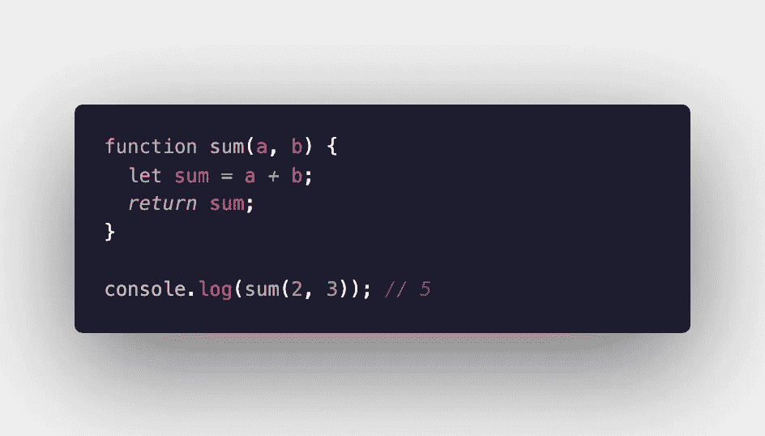
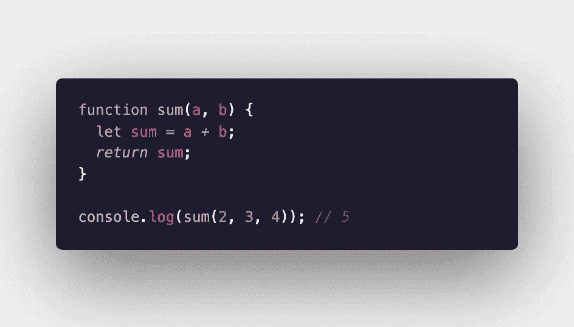
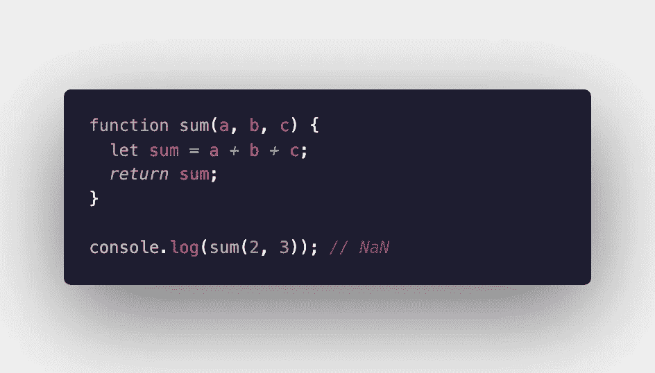
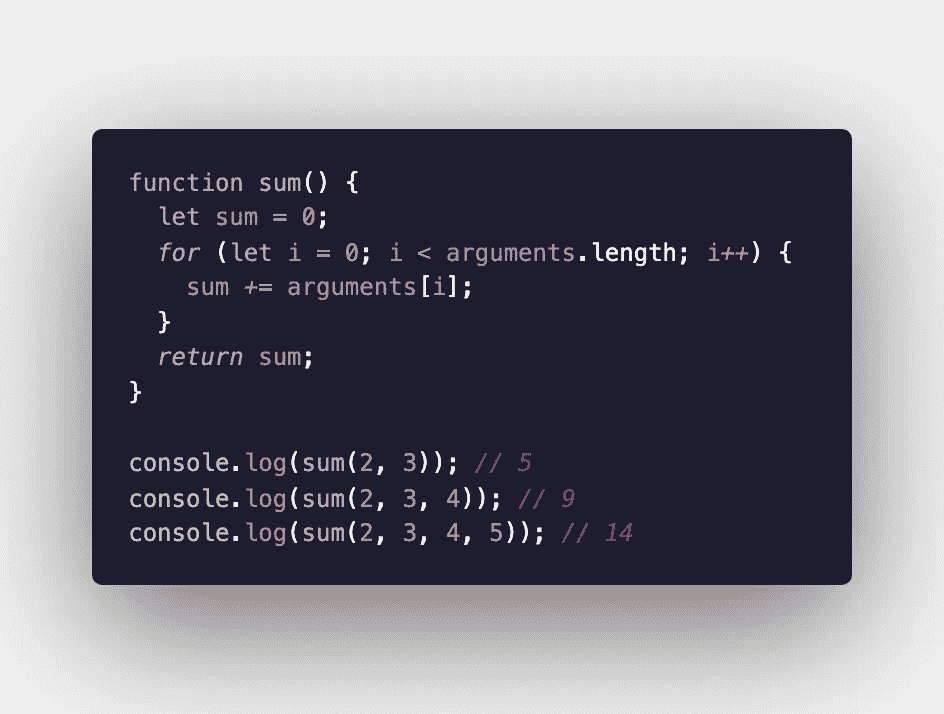
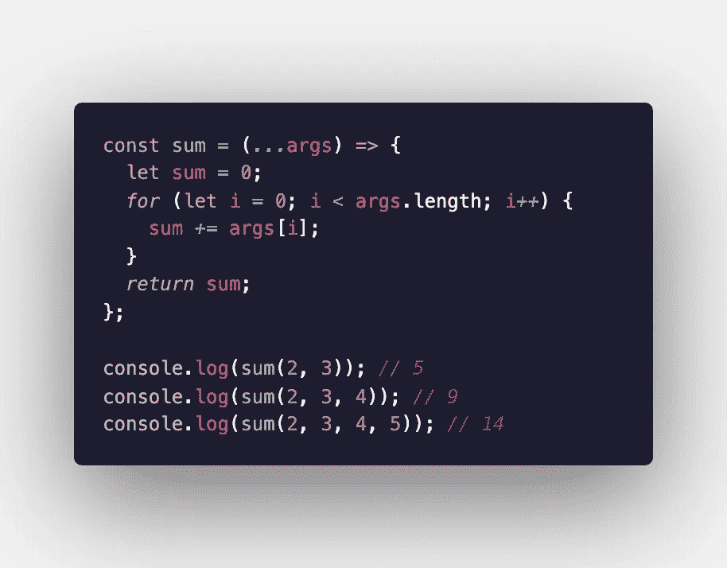

# 如何在 JavaScript 箭头函数中接受任意数量的参数

> 原文：<https://levelup.gitconnected.com/how-to-accept-any-number-of-arguments-in-a-javascript-arrow-function-ed9ba66ed53f>

当你创建一个 JavaScript 函数时，需要考虑的最重要的事情之一就是你的函数将接受的参数作为输入。根据数据类型，在将这些参数赋给变量名后，您可能需要以不同的方式考虑这些参数。但是，如果您不知道需要多少个参数，或者您希望函数能够接受任意数量的参数，这就变得有点困难了。这看起来似乎是一个容易完成的任务，但是如果你不熟悉所需的语法，自己解决起来可能是一个挑战。

我将向您展示几个简单的例子，演示如何在标准 JavaScript 函数和箭头函数中实现这一点，因为根据您编写的函数类型，实现这一点的方法略有不同。

我们将为本指南编写的函数将会很简单——我们希望构建一个接受多个参数并将它们相加的函数。

如果我们知道我们将接受多少个参数，这将是一个非常容易编写的函数。我们可以通过以下方式来实现它:

现在，让我们看看如果我们将三个参数传递给这个函数会发生什么:

我们期望的总和是 9，但是我们仍然得到和以前一样的输出:5。这告诉我们，这个函数实际上忽略了前两个参数之外的任何东西，因为这就是我们为其留出的空间。好，那么如果我们只为我们可能需要的最大数量的参数创建变量呢？让我们看看会发生什么:

现在，如果我们传入的*和*参数太少，输出就是 NaN。该函数不能接受少于预期数量的参数。

为了返回预期的结果，我们需要使用 arguments 对象。让我们看看 MDN 对 arguments 对象有什么看法:

> `arguments`对象是所有非[箭头](https://developer.mozilla.org/en-US/docs/Web/JavaScript/Reference/Functions/Arrow_functions)函数中可用的局部变量。您可以通过使用函数的`arguments`对象来引用函数内部的参数。它为调用该函数的每个参数都提供了条目，第一个条目的索引在`0`。

本质上，这允许我们访问传递给特定函数的所有参数。因为我们可以访问这个“arguments”对象的长度，所以我们可以创建一个简单的循环来返回所有给定参数的总和。

现在，我们可以传入任何想要相加的数字，以获得正确的总和。

# 箭头功能

正如在上面的 MDN 参考中提到的，当我们使用箭头函数时,“arguments”对象是不可用的。但是，箭头函数允许您接受任意数量的参数。我们可以引用“rest”参数来代替“arguments”对象。这必须与 spread 操作符一起使用，但是可以为该参数指定任何您想使用的名称。对于这个函数，我称它为“args”

如您所见，函数的结构几乎没有变化。这一次，我们从一个箭头函数开始，然后使用 spread 操作符传入“rest”参数，我已经将该参数赋给了变量名“args”然后，与原始函数一样，我们对传入的参数进行循环，并将每个参数相加。

这就是你需要做的！希望这有助于您将来创建参数数量可变的函数。

阿曼达·特劳特勒