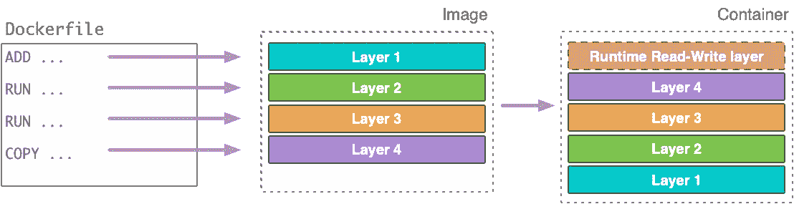

# 如何从另一个容器访问 Docker 容器

> 原文：<https://levelup.gitconnected.com/how-to-access-a-docker-container-from-another-container-656398c93576>

## 如何连接 Docker 容器的分步指南


图片来源于[迈克·惠特利](https://siliconangle.com/2015/11/09/docker-1-9-intros-a-fix-for-container-networking-headaches/)

本文的目的是展示如何配置两个或更多 Docker 容器来相互通信。在本文中，我们将执行以下操作。

*   使用示例 python flask web 服务创建 Docker 图像
*   运行两个独立的 Docker 容器
*   创建码头工人网络
*   将 Docker 容器连接到 Docker 网络

# 先决条件

要理解这一点，您需要具备编程和 API 的中级知识。您还需要在本地安装 Docker 引擎。

关于如何启动 Docker 容器的教程[在这里](https://docs.docker.com/engine/install/)。

# 想法💡

对于本文，我们将使用两个简单的 web 服务，每个都有一个端点。让我们将第一个 web 服务称为“ping ”,将第二个 web 服务称为“pong ”,并设计“ping”服务来查询“pong”服务的 API，以便它们可以打乒乓。

我已经使用 Python [Flask](https://flask.palletsprojects.com/en/1.1.x/) 构建了这些示例应用程序，你可以在这里阅读我在本教程[中使用的一些基本 Docker 命令。](https://docs.docker.com/language/python/build-images/)

我们将在一个专用的 docker 容器中运行每个服务，然后使用 Docker 网络连接 Docker 容器。


照片由 [Ellen Qin](https://unsplash.com/@ellenqin?utm_source=medium&utm_medium=referral) 在 [Unsplash](https://unsplash.com?utm_source=medium&utm_medium=referral) 上拍摄

# “ping”服务

这些服务是超级基本的 python flask 应用程序。`app.py`是添加端点的地方，如下所示。

在下面的例子中，“ping”服务有一个“/ping”端点，它反过来查询“pong”服务的“/pong”端点。如果“pong”服务不可达，那么它简单地返回“Ping…”；否则，它将返回“乒…乓”。

`requirements.txt`列出了我们构建 Docker 映像时要安装的所有 python 模块，然后`Dockerfile`列出了如何构建 Docker 映像的所有步骤。

Ping 服务

# “乒乓”服务

与“ping”服务一样，“pong”服务是一个带有“/pong”端点的 python flask 应用程序，如下所示。

“ping”服务将在端口 5000 上运行，“pong”服务将在端口 5001 上运行。

# 构建 Docker 图像



来源:[如何构建最佳 Docker 图像](https://www.metricfire.com/blog/how-to-build-optimal-docker-images/)

现在我们已经有了两个带有 Docker 文件的 python 服务，让我们为它们构建 Docker 映像。

```
cd ping-service
docker build -t ping-service .
```

和

```
cd pong-service
docker build -t pong-service .
```

运行`docker images`时，您应该会看到两个图像

```
REPOSITORY          TAG                 IMAGE ID            CREATED              SIZE
pong-service        latest              968a682344de        7 seconds ago        124MB
ping-service        latest              6e079525fd69        About a minute ago   128MB
python              3.8-slim-buster     b281745b6df9        8 days ago           114MB
```

# 运行 Docker 容器

创建 Docker 映像后，让我们启动并运行容器

```
cd ping-service
docker run --name ping-service-container -p 5000:5000 ping-service
```

预期的输出是

```
 * Running on [http://0.0.0.0:5000/](http://0.0.0.0:5000/) (Press CTRL+C to quit)
 * Restarting with stat
 * Debugger is active!
 * Debugger PIN: 761-609-740
```

如果我们做`curl http://0.0.0.0:5000`，我们应该得到`Hello, I am ping service!`，类似于上面，让我们运行“pong”服务。

```
cd pong-service
docker run --name pong-service-container -p 5001:5001 pong-service
```

让我们运行`docker container ls`来获取创建的容器列表

```
CONTAINER ID        IMAGE               COMMAND             CREATED             STATUS              PORTS                    NAMES
d7eb5ee014fb        pong-service        "python app.py"     13 seconds ago      Up 11 seconds       0.0.0.0:5001->5001/tcp   pong-service-container
d2331893e5b9        ping-service        "python app.py"     3 minutes ago       Up 3 minutes        0.0.0.0:5000->5000/tcp   ping-service-container
```

我们有两个运行容器，分别名为`pong-service-container`和`ping-service-container`。

# 设置 Docker 网络

没有 Docker 网络，这些容器就不能相互通信。换句话说，“ping-service-container”将无法查询“pong-service-container”中的“/pong”端点。

我们可以使用以下步骤通过 Docker 网络实现这种通信。

*   创建码头工人网络
*   将集装箱添加到码头网络

并且同一 Docker 网络中的所有容器可以使用容器名称或 IP 地址进行连接。

让我们做上面的

# 创建 Docker 网络

让我们创建一个名为`ping-pong-network`的 Docker 网络

```
docker network create ping-pong-network
```

运行我们得到的`docker network inspect ping-pong-network`

```
TheDarkSide:pong-service raf$ docker network inspect ping-pong-network
[
    {
        "Name": "ping-pong-network",
        "Id": "b496b144d72d9d02795eb0472351b093d6b4f1d0015a37e1525d4d163e7ec532",
        "Created": "2021-04-18T22:16:25.2399196Z",
        "Scope": "local",
        "Driver": "bridge",
        "EnableIPv6": false,
        "IPAM": {
            "Driver": "default",
            "Options": {},
            "Config": [
                {
                    "Subnet": "172.25.0.0/16",
                    "Gateway": "172.25.0.1"
                }
            ]
        },
        "Internal": false,
        "Attachable": false,
        "Ingress": false,
        "ConfigFrom": {
            "Network": ""
        },
        "ConfigOnly": false,
        "Containers": {},
        "Options": {},
        "Labels": {}
    }
]
```

如上所示，这是一个没有`containers`的网络，我们可以继续使用下面的命令向它添加运行容器

```
docker network connect ping-pong-network ping-service-container
docker network connect ping-pong-network pong-service-container
```

现在，当我们进行 Docker 检查时，`Containers`属性将显示这两个容器

```
"Containers": {
            "d2331893e5b9dad95a2691b81c256a9f07d4bf62c10601115483d45f8d7b8e2a": {
                "Name": "ping-service-container",
                "EndpointID": "3a9e8eea9802602652719461681d3ad4bc7c603697bc1c1b027e35876fdddad7",
                "MacAddress": "02:42:ac:19:00:02",
                "IPv4Address": "172.25.0.2/16",
                "IPv6Address": ""
            },
            "d7eb5ee014fbdb850a19ebb216a56f8b7ebd10db62af197d2d17f5be30ee0210": {
                "Name": "pong-service-container",
                "EndpointID": "901ba7f76df59498bd662742536ee31a56a26cc4eedd35d4bd681c9788be5291",
                "MacAddress": "02:42:ac:19:00:03",
                "IPv4Address": "172.25.0.3/16",
                "IPv6Address": ""
            }
        }
```

如上所示，容器可以使用**名称**或**IP v4 地址**相互通信。

# 验证 Docker 容器可以通信

当“ping”服务和“pong”服务都连接到同一个网络时，查询“ping”服务端点“/ping”

```
TheDarkSide:pong-service raf$ curl [http://0.0.0.0:5000/ping](http://0.0.0.0:5000/ping)
```

我们得到了

```
Ping ... Pong
```

测试时，停下其中一个集装箱，然后进行码头工人检查；它应该只显示一个容器。

# 连接容器的分步视频教程

对于那些更喜欢视觉学习的人，请查看深入的、一步一步的视频，了解如何从下面的另一个容器连接到 Docker 容器。

访问 Docker 容器的分步指南

# 结论

同一 Docker 网络中的 Docker 容器可以使用它们的 IP 地址或 Docker 容器名称进行连接。

当在开发或生产中使用 docker，并希望为不同的服务(如数据库、前端、后端、搜索等)使用专用的 Docker 容器时，这很方便。

敬请关注 Docker 和开发相关主题的未来帖子。