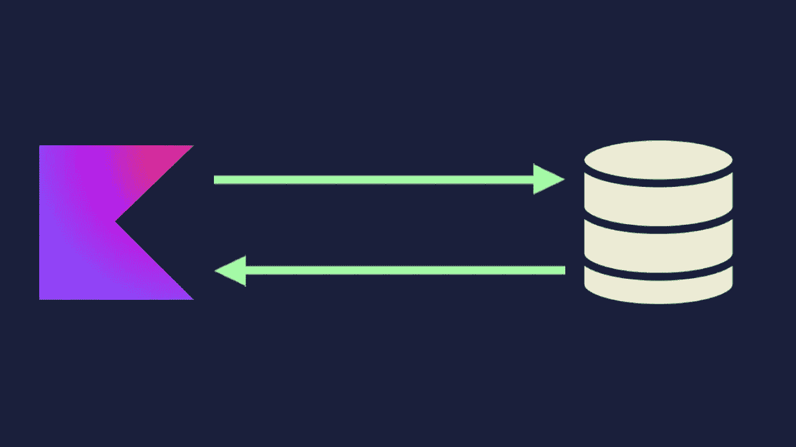
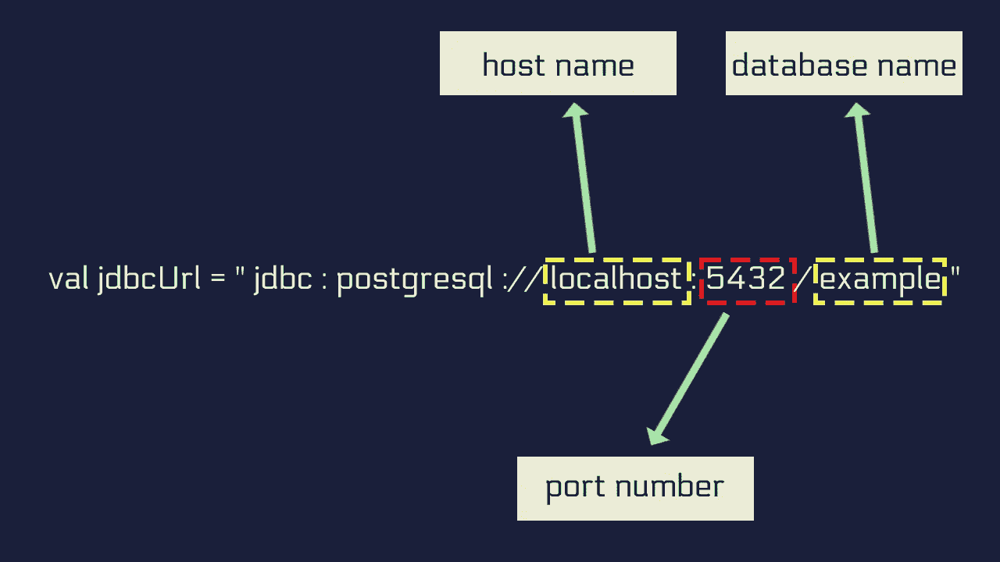

# 如何使用 JDBC 通过 Kotlin 访问数据库:基础知识

> 原文：<https://levelup.gitconnected.com/how-to-access-database-with-kotlin-6b86f6680cd7>

## 了解如何使用 JDBC 在底层访问数据库

访问数据库是一项常见的任务。所有服务器端应用程序都以某种方式访问数据库。就 Kotlin 而言，由于互操作性，它从 Java 世界继承了一组丰富的库。这些库提供了令人眼花缭乱的特性，如 ORM、类型安全 SQL 等等。

然而，如果你是第一次这样做，所有复杂的库可能没有多大意义。为了让你入门，在这篇文章中，我将向你介绍 JDBC。

具体来说，你会学到，

1.  什么是 JDBC？以及如何搭配 Kotlin 使用？
2.  什么是 JDBC 网址？
3.  如何与数据库建立连接并执行 SQL 查询。
4.  什么是连接池，如何用 HikariCP 实现？

## **什么是 JDBC？**

JDBC 代表 Java 数据库连接。它是一个低级的库，提供与数据库交互的功能。要使用 JDBC，你不必依赖任何第三方库。它与所有的 JDK 捆绑在一起。

## 如何将 JDBC 与科特林搭配使用？

*本文使用的代码可以在这个* [***Github* 资源库**](https://github.com/nilTheDev/jdbc-article) *中找到。*

**步骤 1:** 在数据库中准备一个表格

**步骤 2:** 找到数据库的 JDBC 驱动程序，并将其添加到您的项目中

**第三步:**使用 JDBC 网址建立连接

步骤 4: 编写并执行 SQL 查询

## 准备一张桌子

让我们创建一个名为`users`的表，并用一些数据填充它。我将使用 PostgreSQL。您可以使用自己选择的数据库。

创建表格

用数据填充它

现在一个`SELECT * FROM users`查询的结果看起来像这样。

## 将 JDBC 驱动程序添加到项目中

要从 Kotlin 代码中访问这些数据，您必须将数据库的 JDBC 驱动程序作为 Gradle 依赖项包含在内。如果您没有使用 PostgreSQL，您需要找到您正在使用的数据库的 JDBC 驱动程序。简单的谷歌搜索就足够了。

现在，我们将看到如何从数据库中检索数据。

## 创建模型类

首先，为我们将要从数据库接收的数据创建一个模型类。

## 通过 JDBC URL 建立数据库连接

要创建数据库连接，您需要一个 JDBC URL。以下是 JDBC 网址的样子，

正如你所看到的，JDBC 网址由三个主要部分组成。`host name`、`port number`和`database name`。

JDBC 网址的分解版本

要创建一个连接，使用`DriverManager.getConnection`方法。

`DriverManager.getConnection`方法的第一个参数是`JDBC URL`，第二个参数是数据库的`username`，最后一个参数是特定用户的`password`。

您可以在一个`Connection`对象上使用`isValid()`方法来验证连接是否有效。

## 编写和执行 SQL 查询

现在，您可以使用该连接编写和执行 SQL 查询。但是由于 JDBC 是一个低级的图书馆，一切都需要手工完成。

要使用您需要的连接执行一个`SELECT`查询，

1.  准备一条 SQL 语句
2.  执行语句。
3.  遍历`ResultSet`并使用`getInt`或`getString`等方法检索值

考虑下面的例子，

## 什么是连接池？

不了解连接池，对数据库交互的介绍是不完整的。

假设您正在编写一个服务器端应用程序。每当用户点击一个端点，你就打开一个新的数据库连接来获取数据。这是低效的，因为打开数据库连接是一个昂贵的任务，不应该一遍又一遍地做。这正是连接池可以解决的问题。

使用连接池，您可以打开在应用程序的整个生命周期中保持活动的多个连接。这些连接将被封装到一个`DataSource`中。每当您需要访问数据库时，您会向`DataSource`请求一个连接，而不是创建一个新的连接。`DataSource`会从连接池**中给你一个连接。**

许多库将为您提供方便的 API 来实现连接池。HikariCP 就是满足这个需求的最好的库之一。默认情况下，它使用 10 个连接作为最大限制。并且很容易修改。如果您想了解更多关于配置池大小的信息，请查看本指南: [**关于池大小**](https://github.com/brettwooldridge/HikariCP/wiki/About-Pool-Sizing) 。

让我们看一个使用 HikariCP 的连接池的快速示例。

首先将依赖项添加到您的`build.gradle.kts`文件中。

要初始化一个`DataSource`、**、**

1.  创建一个`HikariDataSource()`对象
2.  设置 JDBC 网址
3.  设置用户名
4.  设置密码
5.  从`DataSource`获取连接
6.  按照我上面演示的方式使用连接

这是一个工作示例，

**注意:**用`HikariCP`初始化`DataSource`有多种方式。阅读 [**HikariCP Github 库**](https://github.com/brettwooldridge/HikariCP) 的自述文件的 [**初始化部分**](https://gist.github.com/nilTheDev/c681d54b8c6e85369e3249a40ecf03e5) 。

## 为什么我们需要对 JDBC 进行额外的抽象？

如您所见，使用`JDBC`访问数据库很快会变成一项繁琐的任务。这个过程容易出错，并且需要开发人员进行大量繁重的工作和训练。这就是库和框架派上用场的地方。

当谈到访问数据库的库和框架时，有各种选项可供选择。你可以选择使用一个成熟的 ORM，比如 Hibernate，或者你可以使用一些低级的东西，比如 JDBI。JDBI 为 JDBC 提供了一个方便的抽象层。也有一些 Kotlin-first 图书馆。最受欢迎的是来自 Jetbrains 的暴露库。暴露有两种形式。包装 DSL 和轻量级数据访问对象的类型安全 SQL。

要全面了解 Java 世界中的所有数据库库，您可以阅读下面链接的文章。

[**Java &数据库:库概述&API 作者 Marco Behler**](https://www.marcobehler.com/guides/java-databases)

## 这里有一个简短的总结:

1.  你可以通过低级的 JDBC 图书馆访问数据库。它与所有的 JDK 捆绑在一起。所以，不需要另一个依赖。
2.  要连接特定的数据库，您需要该数据库的 JDBC 驱动程序。
3.  JVM 世界中的所有数据库库都构建在 JDBC 之上。
4.  在处理实际项目时，您应该使用连接池机制。连接池允许您保持少量的数据库连接处于活动状态。不是每次都创建一个新的连接，而是使用池中的一个连接。
5.  在实现连接池时，HikariCP 是一个不错的选择。默认情况下，它使用 10 个连接作为最大限制。并且很容易修改。

## 包扎

不管您决定使用哪个库，现在您已经对从应用层查询数据库时的情况有了基本的了解。

我很高兴你已经读完了这篇文章。我真的希望你能就你的想法说几句话。✏️