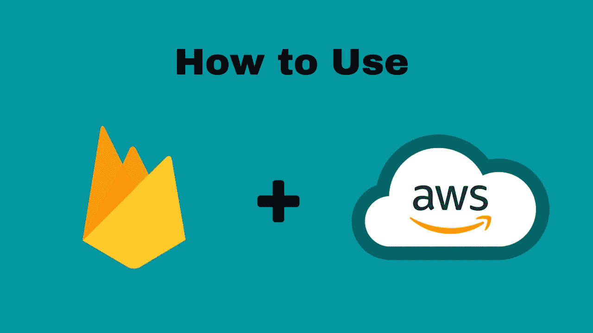
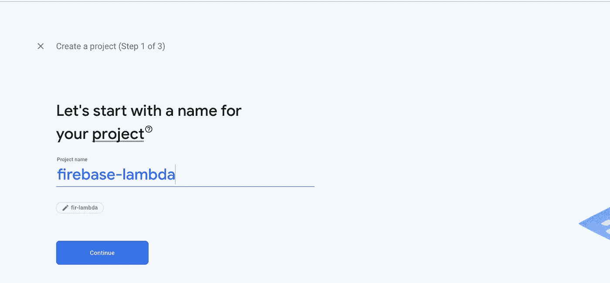
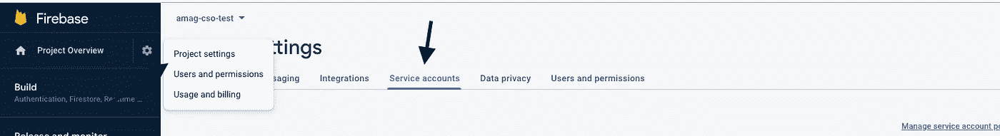
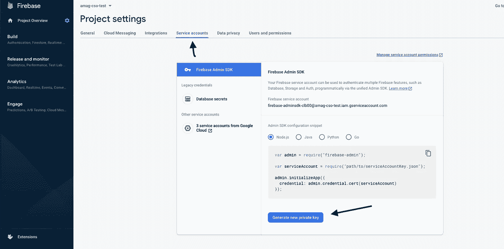
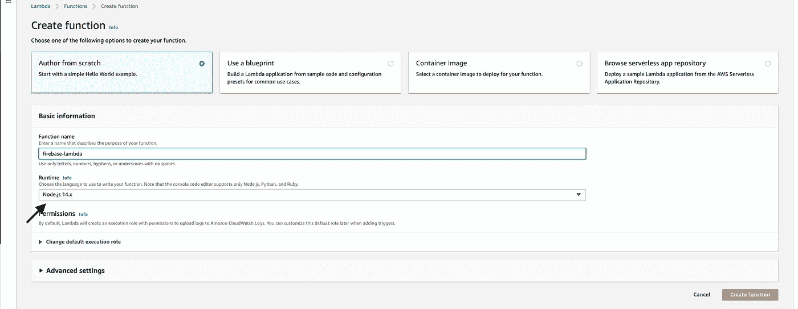
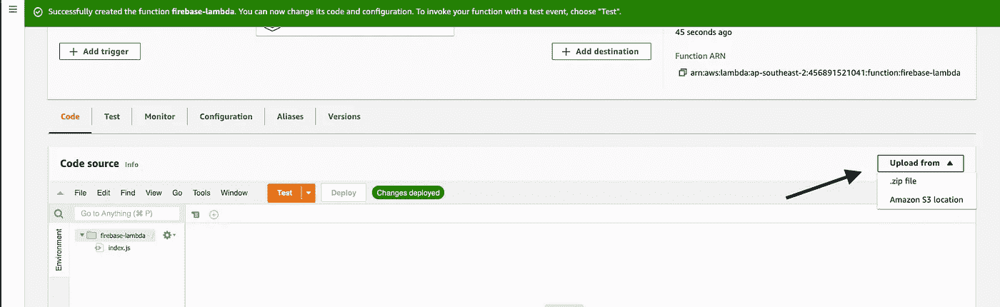
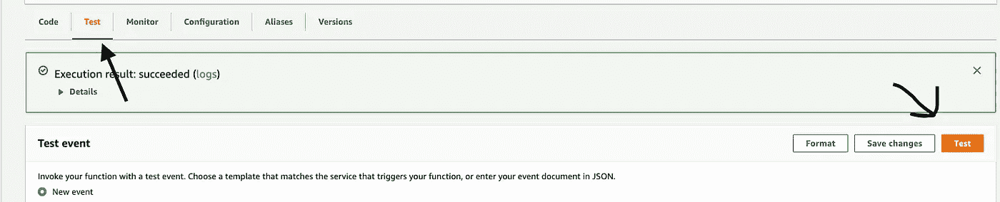

# 如何从 AWS Lambda 访问 Firebase

> 原文：<https://levelup.gitconnected.com/how-to-access-firebase-from-aws-lambda-f7f494dd435a>

全面的分步指南



Firebase+AWS

在这个世界上，了解云变得越来越必要。并且，Firebase 和 AWS 是两个主要的玩家。许多公司出于各种目的使用这两种服务。

在一些用例中，有必要交替使用它们。今天，我们将了解如何在 AWS Lambda 中使用 firebase 管理功能

# 什么是 AWS Lambda？

根据[文件](https://docs.aws.amazon.com/lambda/latest/dg/welcome.html)

> AWS Lambda 是一种计算服务，让您无需配置或管理服务器即可运行代码。

没错。您可以配置 AWS Lambda 以服务的形式运行您的功能。你不需要管理服务器。只要写出函数，你就可以开始了。

# 我们的使用案例

最近，我遇到了这样一种情况，我们需要为使用 React 构建的 web 应用程序实现推送通知，但不幸的是，仅使用 AWS 是不可能的。

所以我需要从 AWS Lambda 连接到 firebase admin。你可能会说我们可以使用一个有合适后端的专用服务器来实现。但对于这么简单的工作来说，似乎有些大材小用了。

# 概观

1.  我们将创建一个 firebase 项目并获取凭证
2.  我们将编写一个使用`firebase-admin` SDK 的 lambda 函数。
3.  我们将把功能推送给 AWS Lambda。

# 步骤 1:获取 Firebase 凭据

让我们首先前往[火焰基座控制台](https://console.firebase.google.com/u/0/?hl=bn)。您需要有一个 google 帐户才能登录控制台。然后创建一个新项目。



项目创建完成后，进入左上角的`project settings`并进入名为`Service Account`的选项卡



项目设置

找到按钮`Generate Private Key`。这将给你一个`.json`文件，用于设置我们后端的配置(在这个例子中是 Lambda)



serviceAccount.json

保存下载并保存`.json`文件，重命名为`serviceAccount.json`。

# 步骤 2:创建 Lambda

创建一个新的空文件夹

```
mkdir firebase-lambda
cd firebase-lambda
```

然后创建一些必要的文件

```
touch package.json index.js
```

我们将只有一个依赖，那就是`firebase-admin`。`package.json`的内容如下。

然后引入我们从 firebase 控制台下载的配置文件`serviceAccount.json`，并将其重命名为`serviceAccount.json`。

现在你的项目结构应该是这样的。

```
firebase-lambda
|--index.js
|--package.json
|--serviceAccount.json
```

好了，现在我们已经准备好给游戏添加火焰基地了！

# 步骤 3:添加 Firebase 管理功能

*   打开你的`index.js`文件。
*   将`firebase-admin`作为`admin`导入
*   用`configuration`初始化应用程序
*   然后使用`handler`函数中的 firebase 功能

索引. js

# 步骤 4:安装依赖项

在将项目上传到 AWS 控制台之前，我们需要进行一些打包，因为 AWS lambda 需要一个`.zip`文件。

从您的终端运行以下命令。

```
npm install
```

或者，如果你面临任何问题，你也可以使用 Docker 运行它。

```
docker run --rm -it -v "$PWD":/worker -w /worker node:14.16.1 npm i --production --silent
```

这将生成一个`node_modules`文件夹。

# 包装

现在使用下面的命令从项目的根目录创建一个`.zip`版本的文件夹。

```
zip -r firebase-lambda.zip .
```

这里需要注意的是:不要使用操作系统的默认软件压缩文件夹。它会导致 Lambda 执行中的问题。

# 第六步:上传

去 AWS 控制台搜索 lambda。

创建新功能



创建新功能

注意，我们选择 NodeJS 14 作为我们的运行时。你可以随心所欲的选择你的。

然后在创建功能后，转到该功能并点击`Upload from`



然后选择`**.zip file**`选项，上传生成的 zip 文件夹。

# 第七步:测试

AWS Lambda 有一个很好的特性，你可以从控制台调用你的函数。只需点击测试按钮，你就可以开始了。



试验

您可以从控制台确认您的 Lambda 正在工作。

给你。现在，您可以使用 lambda 中的 firebase 功能。我个人把它用于 Web 推送通知，其中 t 是强制使用 firebase 的。

谢谢你读到这里。如果有任何不尽如人意的地方，请告诉我。

祝您愉快！:D

**有话要说？**

**通过**[**LinkedIn**](https://www.linkedin.com/in/56faisal/)**或我的** [**个人网站**](https://www.mohammadfaisal.dev/) **与我取得联系。**

## 资源:

[https://medium . com/@ Sam stern _ 58566/how-to-use-cloud-firestore-on-AWS-lambda-4 BF 6d 3 a 473d 9](https://medium.com/@samstern_58566/how-to-use-cloud-firestore-on-aws-lambda-4bf6d3a473d9)