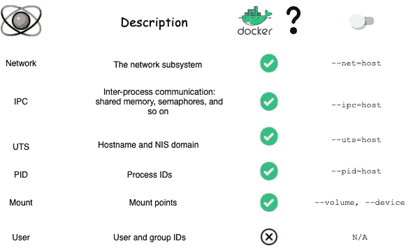

# 如何从 Docker 容器访问主机资源

> 原文：<https://levelup.gitconnected.com/how-to-access-host-resources-from-a-docker-container-317e0d1f161e>

## 绕过 Docker 抽象


由[德里克·奥扬](https://unsplash.com/@goosegrease?utm_source=unsplash&utm_medium=referral&utm_content=creditCopyText)在 [Unsplash](/s/photos/whale?utm_source=unsplash&utm_medium=referral&utm_content=creditCopyText) 上拍摄的照片

尽管 Docker 试图将应用程序从运行它的主机上抽象出来，但它永远不会被完全忽略。为了提供它的抽象，Docker 必须添加一个间接层。这些层可能会对您正在运行的系统产生影响，有时您需要了解它们来解决操作问题。

在本文中，我们将研究如何规避其中的一些抽象，最终得到一个几乎没有 Docker 的 Docker 容器。

## 名称空间和 Docker

Docker 卷便于从主机共享文件，并将较大的文件放在图像层之外。它们的文件系统访问速度也比容器文件系统快得多，因为某些存储后端会给某些工作负载带来巨大的开销。

Docker 为每个容器提供自己的网络接口的设置会导致另一个性能下降。与文件系统性能一样，网络性能肯定不是每个人的瓶颈，但您可能希望对自己进行基准测试。此外，你可能还有其他理由完全绕过 Docker 网络。

不管是什么原因，有时候 Docker 抽象会阻碍你的工作，Docker 确实提供了根据需要选择退出的能力。

Docker 提供了几种绕过 Docker 使用的内核名称空间功能的方法。

> **什么是名称空间？**名称空间是由内核提供给程序的一种服务，它允许程序以一种看起来拥有单独的资源实例的方式获得全局资源的视图。例如，一个程序可以请求一个网络名称空间，这将为您提供一个完整的网络堆栈。Docker 使用并管理这些名称空间来创建它的容器。

下表总结了 Docker 如何使用名称空间，以及如何有效地关闭它们。



例如，如果您的应用程序大量使用共享内存，并且您希望容器与主机共享这个空间，那么您可以使用`--ipc=host`标志来实现这一点。Docker 目前不使用 Linux 内核的用户名称空间功能，尽管在这方面一直在努力。

## 建立工作关系网

要使用主机的网络，运行容器，将`--net`标志设置为 host，如下所示:

```
fabripautasso@Fabricios-MacBook-Pro ~ $ docker run -it --net=host ubuntu /bin/bashroot@docker-desktop:/#
```

您会注意到这与网络命名空间的容器有很大的不同，因为容器中的主机名与主机的主机名相同。实际上，这可能会引起混淆，因为你在一个容器中并不明显。

在网络隔离的容器中，快速的 netstat 将显示启动时没有连接:

```
root@3f17f5f70226:/# netstatActive Internet connections (w/o servers)Proto Recv-Q Send-Q Local Address           Foreign Address         Statetcp        0      0 3f17f5f70226:52242      actiontoad.canonical:80 TIME_WAITtcp        0      0 3f17f5f70226:52240      actiontoad.canonical:80 TIME_WAITtcp        0      0 3f17f5f70226:50128      kazooie.canonical.co:80 TIME_WAITActive UNIX domain sockets (w/o servers)Proto RefCnt Flags       Type       State         I-Node   Path
```

使用主机网络的类似运行显示了同样繁忙的技术作者的通常网络繁忙的主机:

```
root@docker-desktop:/# netstat -nap | headActive Internet connections (servers and established)Proto Recv-Q Send-Q Local Address           Foreign Address         State       PID/Program nametcp        0      0 0.0.0.0:111             0.0.0.0:*               LISTEN      -tcp        0      0 0.0.0.0:65101           0.0.0.0:*               LISTEN      -tcp        0      0 192.168.65.3:62732      91.189.88.152:80        TIME_WAIT   -tcp        0      0 192.168.65.3:62730      91.189.88.152:80        TIME_WAIT   -tcp        0      0 192.168.65.3:62734      91.189.88.152:80        TIME_WAIT   -tcp6       0      0 :::111                  :::*                    LISTEN      -tcp6       0      0 :::62141                :::*                    LISTEN      -udp        0      0 0.0.0.0:64167           0.0.0.0:*                           -
```

出于几个原因，`—-net=host`标志是最常用的标志。首先，它可以使连接容器更容易。但是，您将失去容器端口映射的好处。例如，如果您有两个监听端口 80 的容器，您不能以这种方式在同一台主机上运行它们。

第二个原因是，使用这个标志时，网络性能比 Docker 好很多。虽然本地网络只需要通过主机的 TCP/IP 堆栈运行到网络接口卡(NIC)，但 Docker 必须额外维护一个虚拟以太网对(也称为 veth 对，是通过以太网电缆的物理连接的虚拟表示)，一个位于这对网络和主机网络之间的网桥，以及一个网络地址转换(NAT)层。在正常使用情况下，这种开销可能会导致 Docker 网络速度仅为本地主机网络速度的一半。

## PID

PID 名称空间标志看起来像:

```
fabripautasso@Fabricios-MacBook-Pro ~ $ docker run ubuntu ps -p 1PID TTY          TIME CMD1 ?        00:00:00 psfabripautasso@Fabricios-MacBook-Pro ~ $ docker run --pid=host ubuntu ps -p 1PID TTY          TIME CMD1 ?        00:00:07 init
```

前面的例子演示了主机的`init`进程在具有主机 PID 视图的容器中具有进程 ID 1，而没有该视图，看到的唯一进程是 ps 命令本身。

## 增加

如果您想要访问主机的设备，如果您想要使用特定的设备，您可以使用`--device`标志，或者您可以使用`--volume`标志挂载整个主机的文件系统:

```
docker run -ti —- volume /tmp:/ctmp ubuntu /bin/bash
```

这个命令将主机的`/tmp`目录挂载到容器的`ctmp`目录。docker 命令明确禁止将主机的`/`目录挂载到容器的`/`目录。

## 透明主机

您可以使用这些标志创建一个几乎包含主机视图的容器:

```
fabripautasso@Fabricios-MacBook-Pro ~ $ 
docker run -ti --net=host --pid=host --ipc=host \             1
--volume /:/tmp \                                             2
busybox chroot /tmp                                           3
```

*   1 —使用文章`--net`、`--ipc`和`--pid`中讨论的 3 个标志运行容器
*   2 —将主机的根文件系统装载到容器上的目录`/tmp`
*   3 —启动一个`busybox`容器，并执行`chroot`命令，使挂载的文件系统显示为根。

## 最后的想法

使用这些标志来绕过 Docker 的抽象将使您面临更多的安全风险。在安全性方面，使用它们应该等同于运行带有`--privileged`标志的容器。所以，如果你需要使用它们，一定要小心。