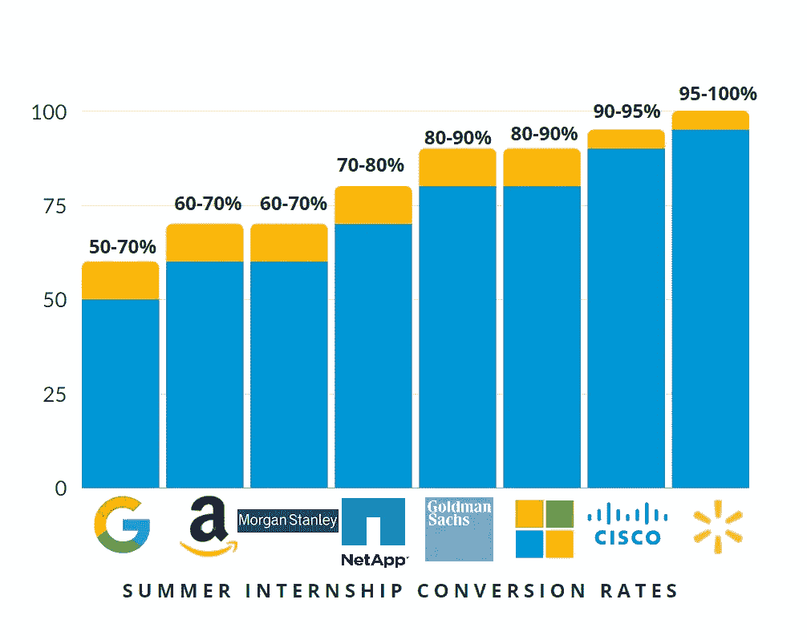

# 如何让你的实习之旅成为一份预实习工作

> 原文：<https://levelup.gitconnected.com/how-to-ace-your-journey-from-an-internship-to-a-pre-placement-offer-83e0e2976206>

克里斯蒂娜@ wocintechchat.com 在 [Unsplash](https://unsplash.com?utm_source=medium&utm_medium=referral) 上的照片

世界各地的公司都在为不同领域的学生推出实习计划，无论是技术、商业还是艺术。这些计划分别以 2 至 3 个月和 5 至 7 个月的暑期和春季实习形式进行。

这样的实习对学生极其有利。他们在职业生涯真正开始之前提供工作经验，接触现实生活中的项目，与专业人士建立关系网的机会，以及获得 PPO(预就业机会)的高可能性。当公司在这些实习生身上投入大量资源时，延长他们的工作时间以获得投资回报似乎是合理的。

去年，*沃尔玛*的实习生转换率高达 95%以上，而*谷歌*的最低转换率为 60%,不同的公司和不同的个人资料之间的转换率各不相同。他们主要依赖公司里的空缺职位。疫情的到来确实影响了这些比率，但是如果我们把范围缩小到主要的科技巨头，并没有太大的变化。下面是一些科技公司上一年的瑞典/SDE 暑期实习统计。

***公司不发布官方转化统计。以下数字是在这些公司工作的实习生报告的。同样没有准确性的证明。***

> 很明显，这些公司在招聘实习生时做得过头了。随着实习生之间竞争的加剧和疫情带来的持续压力，让你的实习岗位转换变得越来越困难。2021 批次提供了第一批虚拟实习的实习生。虽然对我们大多数人来说，这确实行得通，但也有很多人没能改变他们的实习经历。
> 
> 对于这些学生来说，竞争全职机会变得更加困难。他们的大部分时间花在做公司指定的工作上，而没有实习的学生则全心全意地专注于 FTE 的准备工作。这就自动产生了一个间隙，很难，但肯定不是不可能，来填补实习结束和全职工作开始之间的一点时间。不要忘记，与实习准备工作相比，全职开车很少有好处，因为前者更具挑战性，涉及的问题范围更广。

## 简而言之，如果你已经设法获得了一份实习工作，那么你的直接目标应该是把它转换过来，除非你有更好的理由不这么做。

我列出了一些帮助我在摩根士丹利进行为期两个月的虚拟暑期实习的技巧。我希望它们对你也有好处。

## **提前熟悉科技栈**

这主要适用于夏季实习，如果你必须工作在一个全新的技术堆栈上，创建和部署一个端到端的应用程序，两个月的时间可能会变得具有挑战性。大多数公司会在实习开始前至少两周把你和你的经理/团队联系起来。如果你在实际工作开始之前收集关于你的技术堆栈的知识并开始构建样本项目，这将会很有帮助。

## **足智多谋**

在你实习的第一周，**联系一位同事，收集资源/文档，解决特定技术、特定公司和一般问题。**

> 大多数时候，实习生在公司特定的环境中工作时，会被配置和设置所困扰。至少对我来说，这确实发生了。即使是琐碎的任务也会耗费大量时间。与其浪费大部分时间试图解决与公司环境相关的问题，不如联系你的队友。他们会更好地指导你。**确保你记录了你遇到的障碍和你采取的措施，因为你可能会再次陷入类似的情况。**

## **智能网络**

虚拟实习对实习的社交优势是一个打击。与同事交流和建立关系网完全取决于你。从长远来看，建立良好的关系总是有帮助的。每周至少认识两个新朋友。保持人际关系网和项目工作之间的平衡，因为实习时间有限，实现目标同样重要。

照片由[对比纤维](https://unsplash.com/@comparefibre?utm_source=medium&utm_medium=referral)在 [Unsplash](https://unsplash.com?utm_source=medium&utm_medium=referral)

## 保持强烈的职业道德

因为人们不会亲自和你见面，所以你的工作应该起到沟通的作用。完全掌控你的工作，确保你是发现任何可能的错误的人。尽全力按时完成最后期限。也就是说，不要把你的工作与生活的平衡抛之脑后，因为一旦你改变了想法，可能会适得其反。

## 你的经理应该像你一样相信你的工作

大多数公司，比如亚马逊、思科、高通、NetApp、高盛，都会根据你在实习期间的表现给你一份 PPO。在这种情况下，如果你在实习期间一直努力工作，来自经理的积极反馈真的可以扭转局面。

很少有公司，如*摩根士丹利、沃尔玛*等，会在实习快结束时进行转换面试。虽然这里的招聘同样取决于面试和你的表现，但一个强有力的经理反馈仍然可以成为你 PPO 背后的驱动力。

## 确保你被注意到

公司总是在寻找领导者；能够采取主动，不羞于表达自己的人。**注意不要神不知鬼不觉地离开。**积极参与团队交流，发表您的意见并提出问题。理想情况下，你应该有机会向你的超级团队/下属部门/部门展示你的工作。在这种情况下，提前做好准备，准备好笔记。这可能是你脱颖而出成为潜在雇员的一次机会。

## **系统地计划**

计划你的时间。将你的目标标记为职业目标或个人目标。在每周开始的时候，记下你的首要任务。每天结束时，做一行笔记来记录你的进展。这在向报告经理/scrum master 提供更新时非常有用。你肯定不想给人留下不工作的印象。

照片由 [Daria Nepriakhina](https://unsplash.com/@epicantus?utm_source=medium&utm_medium=referral) 在 [Unsplash](https://unsplash.com?utm_source=medium&utm_medium=referral) 拍摄

以上所有这些乍看起来似乎无关紧要，但当它们放在一起时，就会产生显著的不同。

> 从实习到 PPO 的道路不是一个飞跃，而是一段旅程，由一小步一小步组成，每一步都很重要。

我希望这些对我的读者有用，就像它们对我有用一样。

***万事如意！***

# 分级编码

感谢您成为我们社区的一员！[订阅我们的 YouTube 频道](https://www.youtube.com/channel/UC3v9kBR_ab4UHXXdknz8Fbg?sub_confirmation=1)或者加入 [**Skilled.dev 编码面试课程**](https://skilled.dev/) 。

 [## 编码面试课程+登陆你的开发工作

### 掌握编码面试的过程

技术开发](https://skilled.dev)