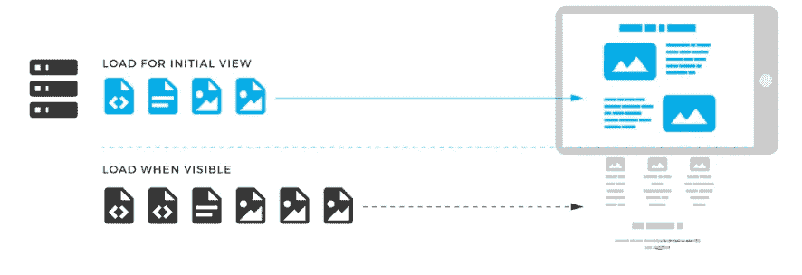
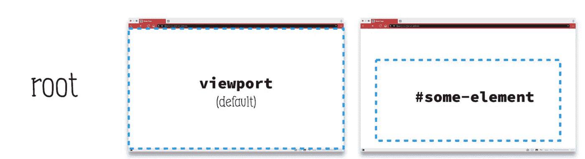
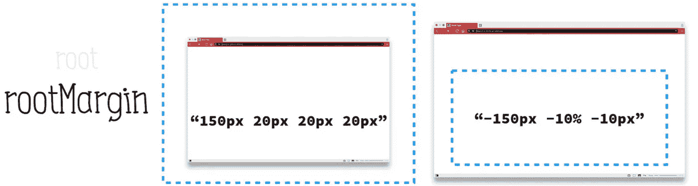
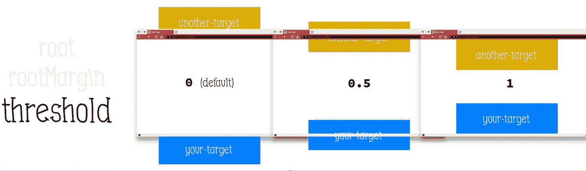
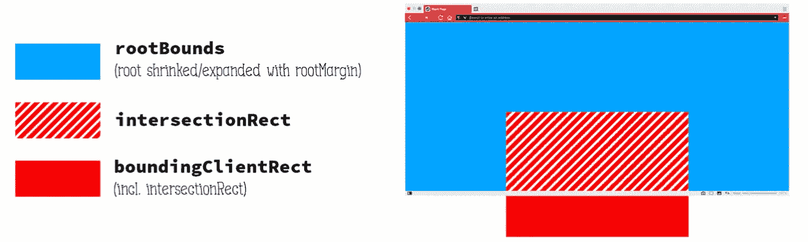

# 如何实现懒加载

> 原文：<https://levelup.gitconnected.com/how-to-achieve-lazy-loading-11ede55ef6b6>

## 对于任何包含大量信息的网页来说，延迟加载都是必须的


## 为什么需要延迟加载

通常当用户打开一个网页时，页面的全部内容将被下载并呈现在一个页面中。虽然允许浏览器缓存页面，但它们不能保证用户会查看所有下载的内容，例如，一个照片墙应用程序，用户可能只是查看第一个图像，然后就离开了，导致内存和带宽的浪费。所以我们只需要在用户需要访问页面的一部分时加载内容，而不是一开始就加载整个内容。

## 如何实现懒加载

当资源被呈现给网页(图像、视频)时，该资源引用小的占位符，并且当用户查看该页面时，实际的资源被浏览器缓存，并且当该资源在屏幕上可见时，占位符被替换，例如，如果用户加载该页面并立即离开该页面，则除了页面的顶部之外，不加载任何内容。



## 延迟加载特定实现

以加载一张图片为例，我们需要在`img` 标签中设置一个`data-src`属性，它指向我们实际需要加载的图片，而`img` 的`src` 指向一张默认图片，如果是空的，它也会向服务器发送请求。

```

```

稍后，当用户访问可视区域的`img` 元素时，`src` 值被替换为由`data-src`指向的实际资源加载的图像

```
const lazy = (el) => {
 let scrTop = getTop();
 let windowHeight = document.documentElement.clientHeight;
 function getTop(){
  return document.documentElement.scrollTop || document.body.scrollTop; 
 }
 function getOffset(node){
  return node.getBoundingClientRect().top + scrTop;
 }
 function inView(node){

 const threshold = 0;
 const viewTop = scrTop;
 const viewBot = viewTop + windowHeight;

 const nodeTop = getOffset(node);
 const nodeBot = nodeTop + node.offsetHeight;

 const offset = (threshold / 100) * windowHeight;
 console.log((nodeBot >= viewTop - offset), (nodeTop <= viewBot + offset))
    return (nodeBot >= viewTop - offset) && (nodeTop <= viewBot + offset)
 }
 function check(node){
   let el = document.querySelector(node);
   let images = [...el.querySelectorAll('img')];
   images.forEach(img => {
    if(inView(img)){
     img.src = img.dataset.src;
    }
   })
 }
 check(el);
}

window.onscroll = function(){
 lazy('.foo');
}
```

## 现代延迟加载实现方法

通过上面例子的实现，我们需要监听 scroll 事件来实现懒加载，虽然我们可以通过函数节流的方式来防止函数的高频率执行，但是我们还是需要计算`scrollTop`、`offsetHeight` 等属性，没有简单的方法不需要计算这些属性，答案是肯定的- `IntersectionObserver`

> IntersectionObserver API 为开发人员提供了一种异步侦听目标元素的方法，这些目标元素与其祖先或视口处于相交状态。祖先元素和视口称为根。

这只是观察一个元素是否与另一个元素重叠的问题。

IntersectionObserver 初始化过程提供了三个主要元素的配置。

1.  root:这是用于观察的根元素。他定义了可观察元素的基本捕获框架。默认情况下，root 指向浏览器的 viewport，但实际上可以是任何 Dom 元素，注意:root 在这种情况下，要观察的元素必须在 root 表示的 DOM 元素内部。



2.rootMargin:在计算交集时添加到根边界框的矩形偏移量，可以用来有效地缩小或扩大根判定的范围，以满足计算的需要。选项类似于 marginCSS，例如 root margin:“50px 20px 10px 40px”(上、右、下、左)



3.threshold:阈值列表，按升序排序，列表中的每个阈值都是侦听器对象的交集面积与边界面积的比率。当超过侦听器对象的任何阈值时，都会生成通知。如果没有值传递给构造函数，则默认值为 0。



为了告诉 intersectionObserver 我们想要什么配置，我们只需要将 config 对象和回调函数一起传递给 Observer 构造函数。

```
const config = {
    root: null,
    rootMargin: '0px',
    threshold: 0.5
}
let observer = new IntersectionObserver(fucntion(entries){
    // ...
}, config)
```

现在我们需要去给`IntersectionObserver` 实际的元素来观察。

```
const img = document.querySelector('image');
observer.observe(img);
```

关于这个实际观察到的元素，有几点需要注意:

*   首先他应该位于由`root`代表的`DOM` 元素中
*   IntersectionObserver 一次只能接受一个观察元素，不支持批量观察。这意味着，如果您需要观察几个元素(例如，一个页面上的几个图像)，您必须遍历所有元素，并分别观察每个元素。

```
const images = document.querySelecttorAll('img');
images.forEach(image => {
    observer.observe(image)
})
```

*   使用 Observer 加载页面时，您可能会注意到 IntersectionObserver 观察到的所有元素都触发了回调。我们可以用回调函数解决这个问题

IntersectionObserver 回调函数

```
new IntersectionObserver(function(entries, self))
```

在条目中，我们将回调函数作为特殊类型的数组:`IntersectionObserverEntry` 首先，`IntersectionObserverEntry` 包含三个不同矩形的信息。

*   root bounds:capture frame(root+root margin)矩形
*   boundClientRect:观察元素本身的矩形
*   intersectionRect:捕获框架和观察元素相交的矩形。



此外，`IntersectionObserverEntry`还提供了`isIntersecting`，一个方便的属性，返回被观察元素是否与捕获帧相交。
此外，`IntersectionObserverEntry`提供了计算上有用的遍历属性`intersctionRatio`:返回`intersectionRect` 与`boundingClientRect`的比值。

简单介绍之后，让我们回到主题，使用这个 IntersectionObserver 实现一个现代的惰性加载方法:

```
const images = document.querySelectorAll('[data-src]')
const config = {
    rootMargin: '0px',
    threshold: 0
};
let observer = new IntersectionObserver((entries, self)=>{
    entries.forEach(entry => {
        if(entry.isIntersecting){
         // Loading images
         preloadImage(entry.target);
         // Release from observation
           self.unobserve(entry.target)
        }
    })
}， config)

images.forEach(image => {
  observer.observe(image);
});

function preloadImage(img) {
  const src = img.dataset.src
  if (!src) { return; }
  img.src = src;
}
```

相比以前的懒惰加载方法并不更加简洁，而且只有当观察元素和捕获帧交叉或重叠时，才会触发 dropback 功能。

## 延迟装货的好处

*   延迟加载在优化内容加载和简化最终用户体验之间取得了平衡。
*   用户可以更快地加载内容，因为他们只需要在第一次打开网站时加载一部分内容。
*   该网站的用户保持率更高，因为不断向用户提供内容减少了他们离开网站的机会。
*   网站的资源成本更低，因为内容只在用户需要时才加载，而不是一次加载。

# 分级编码

感谢您成为我们社区的一员！在你离开之前:

*   👏为故事鼓掌，跟着作者走👉
*   📰查看[升级编码出版物](https://levelup.gitconnected.com/?utm_source=pub&utm_medium=post)中的更多内容
*   🔔关注我们:[Twitter](https://twitter.com/gitconnected)|[LinkedIn](https://www.linkedin.com/company/gitconnected)|[时事通讯](https://newsletter.levelup.dev)

🚀👉 [**加入升级人才集体，找到一份神奇的工作**](https://jobs.levelup.dev/talent/welcome?referral=true)