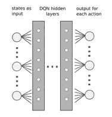

# 如何实际加速你的人工智能预测:异步优势演员评论家(A3C)

> 原文：<https://levelup.gitconnected.com/how-to-actually-speed-up-your-ai-predictions-asynchronous-advantage-actor-critic-a3c-94b3be26235d>

最重要的 A3C 基础，简单解释:用例，真实世界的应用，以及它是如何工作的

来自 Unsplash 的罗伯特·林德

还记得《T2 毁灭战士》这款游戏吗？如果你把这两者联系起来(A3C + Doom)，这个算法很可能会成为你记忆犹新的东西。

异步优势行动者评价(A3C)是一种强化学习算法，使用行动者评价神经网络架构[12]。该算法由谷歌的 DeepMind 研究团队提出；它已经被用来训练游戏实现的代理，包括第一人称游戏《毁灭战士》[13][14]。

A3C 算法是广泛使用的 A2C 算法的扩展[15]。像 A2C 一样，它由相似的部分组成:演员和评论家[12]。然而，与 A2C 不同，它使用单个代理从经验中学习，并使用这些知识将这些更新应用到其他代理，A3C 算法并行地使用多个代理，以独立和异步地从他们的经验中学习[16]。这意味着每个代理可以更新其政策梯度，可能更经常或更频繁，也可能导致更快地收敛到最优政策[17]。此外，使用多个代理还提供了更多的探索，因为每个代理将识别新的数据连接，并发现它们对应的(数据连接)环境的不同部分。

来自 Unsplash 的斯蒂芬·莱昂纳迪

# **引擎盖下**

A3C 算法已经被证明能够在许多不同的强化学习任务上实现最先进的性能，包括 3D 虚拟环境。在许多情况下，它可以远远超过其他算法[18]。例如，在流行的第一人称游戏 Doom 中，与训练其他算法(尤其是最先进的 one 算法)所需的时间相比，训练 A3C 算法可以在更少的训练时间内获得更高的平均分数。

A3C 算法赢得声誉有几个原因。首先，它使用多个代理允许潜在的更有效的探索和更快的收敛到最优策略。其次，它的演员-评论家架构使它能够学习如何采取行动(演员)，以及这些行动如何影响未来的回报(评论家)。强调后一种方法很重要，因为强化学习系统通常需要在探索和利用之间进行权衡，比如尝试新事物与使用已知的好策略，能够学习这两个方面可能会导致更好的整体性能。最后，更新的异步特性意味着每个代理都可能取得进展，即使其他代理没有取得进展，这是由于时间的使用和应用(在用于训练和输出管理的系统内)而可能加速学习的机会。

来自 Unsplash 的 Joshua Hoehne

# **其效力**

A3C 是一种强化学习算法，结合了基于值和基于策略的方法。作为学习选择行动的行动者网络和学习评估每个行动的预期回报的评论家网络之间的关系的一部分，算法被设计为多个代理与环境异步交互(而每个代理都有自己的行动者和评论家网络的副本[1])。

与传统的强化学习算法(如 Q-learning)相比，使用 A3C 有许多优势。首先，A3C 更新是在代理人采取的每一步之后完成的[19]，而不是 Q-learning [20]的情节实施方法。在这种情况下，优化 A3C 的机会在于它如何能够潜在地(在时间上，潜在地更快地)收敛于期望的解决方案，因为我们在整个培训过程中获得了关于我们的解决方案的反馈(而不是处理剧集依赖性)。

# **在机器学习的背景下**

A3C 对于深度学习来说是实用的，因为它使用了共享的全局模型[21]，这使得网络能够从各种经验和数据源中学习，帮助网络更好地概括，并增加潜在做出更准确预测的可能性。此外，A3C 采用异步更新方案，允许在多个内核或设备上进行并行训练，这可能会加快训练时间(无论 CPU/GPU 配置如何，算法优化都是影响训练时间的关键)。

来自 Unsplash 的 Todd Diemer

# **为什么自然语言处理是用例的一部分**

自然语言处理中的神经网络是实现流水线的基本方法。

输入、隐藏层和输出(示例)[23]

在 A3C 和由输入层、隐藏层和输出层[2]组成的三层结构的背景下，这些层中的每一层都有自己的一组相互连接的神经元，这些神经元将信息从一个神经元传递到下一个神经元。输入层作为 A3C 算法与外界的接口；它接收环境中正在发生的事情的信息，并将这些信息传递给隐藏层。隐藏层处理这些信息并产生一个传递给输出层的表示。然后，输出层获取这种表示，并将其映射到代理为实现其目标而可以采取的意义或动作上。

来自 Unsplash 的 paolo candelo

# **A3C 的真实实施**

A3C 是一种有效的机器学习算法，因为它使用多个代理来探索环境，可能更有效地探索状态空间(尤其是帮助代理学习)。此外，A3C 使用代理之间的共享网络[22]，允许每个代理从网络上其他代理的经验中受益。

A3C 已经被一些可识别的人工智能实现所采用。举例来说，它可以用来开发一种算法，可以更准确地识别图像中的对象。另一个应用涉及使用 A3C 使机器人能够通过障碍管理回避技术在环境中导航。它在整个金融行业也有应用，特别是在金融工程领域:A3C 可能会在定价方面进行预测分析。

人工智能中 A3C 的其他一些现实世界的例子包括面部识别和计算机视觉。面部识别用于识别数字图像或视频中的某些人或物体，计算机视觉使用允许计算机解释图像细节的算法，包括光照、姿势和纹理。

# **离别的思念**

如果你对这篇文章的编辑有任何建议，或者对进一步扩展这个主题领域有什么建议，请和我分享你的想法。

另外，请考虑[订阅我的每周简讯:](https://pventures.substack.com)

**根据我写的文章，其中一些你可能会感兴趣:**

## 金融工程的学习方法:你需要知道的一切

 [## 金融工程的学习方法:你需要知道的一切

### 如何开发和部署 Q-learning 方法，包括强化学习中的应用程序、用例、最佳实践…

medium.datadriveninvestor.com](https://medium.datadriveninvestor.com/q-learning-methods-for-financial-engineering-all-you-need-to-know-ae730ae8b0b) 

## 金融工程十大基本深度学习模型

 [## 金融工程十大基本深度学习模型

### 金融工程中这些方法的 10 个基本深度学习(DL)模型和用例。

medium.datadriveninvestor.com](https://medium.datadriveninvestor.com/top-10-essential-deep-learning-models-for-financial-engineering-ca550fcff91) 

## 金融工程的 5 大基本机器学习库

 [## 金融工程的 5 大基本机器学习库

### 五个机器学习库，其中一个是最重要的库，用于金融工程用例

pub.towardsai.net](https://pub.towardsai.net/top-5-essential-machine-learning-libraries-for-financial-engineering-d1ad6d7a8195) 

## 金融工程的 10 大基本 NLP 模型

 [## 金融工程的 10 大基本 NLP 模型

### 金融工程中这些方法的 10 个基本 NLP 模型和用例。

medium.com](https://medium.com/mlearning-ai/top-10-essential-nlp-models-for-financial-engineering-f78f2536a2a9) 

*参考文献*:

*1。* *强化学习——人工智能栈交换。*[*https://ai . stack exchange . com/questions/12103/do-we-need-to-use-the-experience-replay-buffer-with-the-the-a3c-algorithm*](https://ai.stackexchange.com/questions/12103/do-we-need-to-use-the-experience-replay-buffer-with-the-a3c-algorithm)

*2。*人工神经网络基础。[http://uc-r.github.io/ann_fundamentals](http://uc-r.github.io/ann_fundamentals)

3.神经系统 Webquest-study lib。[https://studylib.net/doc/8588418/nervous-system-webquest](https://studylib.net/doc/8588418/nervous-system-webquest)

*4。* *面向认知网络安全的异步优势行动者-批评家(A3C)学习。(未注明)。IEEE Xplore。检索到 2022 年 8 月 6 日，来自*[【https://ieeexplore.ieee.org/document/9750264】T21](https://ieeexplore.ieee.org/document/9750264)

*5。* *Mnih，v .，Badia，A. P .，Mirza，m .，Graves，a .，Lillicrap，T. P .，Harley，t .，Silver，d .，&# 38；k . kavukcuoglu(2016 年 2 月 4 日)。深度强化学习的异步方法。ArXiv.Org。*[*https://arxiv.org/abs/1602.01783*](https://arxiv.org/abs/1602.01783)

*6。* *蒂尔贝，阿尼尔。(2022 年 8 月 3 日)。金融工程顶级 q-learning 深度学习。数据驱动投资者。*[*https://medium . datadriveninvestor . com/q-learning-methods-for-financial-engineering-all-you-need-to-know-a e730 AE 8 b 0b*](https://medium.datadriveninvestor.com/q-learning-methods-for-financial-engineering-all-you-need-to-know-ae730ae8b0b)

7 .*。* *蒂尔贝，安尼尔。(2022 年 8 月 3 日)。金融三大基本无监督学习。数据驱动投资者。*[*https://medium . datadriveninvestor . com/top-3-essential-unsupervised-learning-methods-for-financial-engineering-FB 5356 a7a 401*](https://medium.datadriveninvestor.com/top-3-essential-unsupervised-learning-methods-for-financial-engineering-fb5356a7a401)

*8。* *蒂尔贝，阿尼尔。(2022 年 7 月 28 日)。金融工程中 10 个必不可少的深度学习。数据驱动投资者。*[*https://medium . datadriveninvestor . com/top-10-essential-deep-learning-models-for-financial-engineering-ca 550 fcff 91*](https://medium.datadriveninvestor.com/top-10-essential-deep-learning-models-for-financial-engineering-ca550fcff91)

*9。* *蒂尔贝，阿尼尔。(2022 年 7 月 26 日)。金融工程 5 大 AI ML 库。走向 AI。*[*https://pub . toward sai . net/top-5-essential-machine-learning-libraries-for-financial-engineering-d1ad 6d 7a 8195*](https://pub.towardsai.net/top-5-essential-machine-learning-libraries-for-financial-engineering-d1ad6d7a8195)

10。 *蒂尔贝，阿尼尔。(2022 年 7 月 27 日)。金融工程的 10 个基本 NLP 模型。*[*https://medium . com/mlearning-ai/top-10-essential-NLP-models-for-financial-engineering-f78f 2536 a 2 a 9*](https://medium.com/mlearning-ai/top-10-essential-nlp-models-for-financial-engineering-f78f2536a2a9)

*11。**&# 38:j . kautz(2016 年 11 月 18 日)。在 GPU 上通过异步优势行动者-批评家进行强化学习。ArXiv.Org。*

**12。*孙、杜、段、&# 38；李。(2019).基于异步优势行动者-批评家学习方法的自适应 PID 控制器的设计与应用。无线网络，27(5)，3537–3547。[*https://doi.org/10.1007/s11276-019-02225-x*](https://doi.org/10.1007/s11276-019-02225-x)*

**13。* *awjuliani。(未注明)。DeepRL-Agents/A3C-doom . ipynb at master awjuliani/DeepRL-Agents。GitHub。2022 年 8 月 6 日检索，来自*[*https://github . com/awjuliani/DeepRL-Agents/blob/master/A3C-doom . ipynb*](https://github.com/awjuliani/DeepRL-Agents/blob/master/A3C-Doom.ipynb)*

**14。* *可汗，纳伊姆，卡塔克，阿斯加尔，&# 38；马利克。(2021 年 1 月 1 日)。使用深度强化学习和 vizdoom 游戏人工智能研究平台与基于预期者 a3c 的代理一起玩 Doom。斯普林格国际出版公司。*[*https://link . springer . com/chapter/10.1007/978-3-030-77939-9 _ 15*](https://link.springer.com/chapter/10.1007/978-3-030-77939-9_15)*

**15。* *使用具有时间上下文的优势行动者评价器的用于自主纵向控制的端到端强化学习。(未注明)。IEEE Xplore。检索到 2022 年 8 月 6 日，来自*[*https://ieeexplore.ieee.org/abstract/document/8917387*](https://ieeexplore.ieee.org/abstract/document/8917387)*

**16。* *M-A3C:双足机器人实时步态规划的均值-异步优势行动者-批评者强化学习方法。(未注明)。IEEE Xplore。检索到 2022 年 8 月 6 日，来自*[【https://ieeexplore.ieee.org/abstract/document/9779214】T21](https://ieeexplore.ieee.org/abstract/document/9779214)*

*17。 *车联网视频分析的边缘计算与区块链。(未注明)。美国计算机学会会议。检索到 2022 年 8 月 6 日，转自*[*https://dl.acm.org/doi/abs/10.1145/3416014.3424582*](https://dl.acm.org/doi/abs/10.1145/3416014.3424582)*

*18 岁。 *古普塔，叶戈罗夫，&# 38；科森德弗。(2017 年 1 月 1 日)。使用深度强化学习的协作多智能体控制。斯普林格国际出版公司。*[*https://link . springer . com/chapter/10.1007/978-3-319-71682-4 _ 5*](https://link.springer.com/chapter/10.1007/978-3-319-71682-4_5)*

**19。*T42【Sewak】。(2019 年 1 月 1 日)。演员评论家模型和 A3C。新加坡斯普林格。[*https://link . springer . com/chapter/10.1007/978-981-13-8285-7 _ 11*](https://link.springer.com/chapter/10.1007/978-981-13-8285-7_11)*

**20。* *沃特金斯，&# 38；大雁。(未注明)。q-学习。机器学习，8(3)，279–292 页。*[*https://doi.org/10.1007/BF00992698*](https://doi.org/10.1007/BF00992698)*

**21。* *西瓦克。(2019 年 1 月 1 日)。代码中的 A3C。新加坡斯普林格。*[*https://link . springer . com/chapter/10.1007/978-981-13-8285-7 _ 12*](https://link.springer.com/chapter/10.1007/978-981-13-8285-7_12)*

**22。* *面向认知网络安全的异步优势行动者-批评家(A3C)学习。(未注明)。IEEE Xplore。检索到 2022 年 8 月 6 日，来自*[*https://ieeexplore.ieee.org/abstract/document/9750264*](https://ieeexplore.ieee.org/abstract/document/9750264)*

**23。甘尼山，美国(未标明)。A3C 异步优势演员-评论家代理。检索 2022 年 8 月 6 日，来自*[*https://bardofcodes . github . io/DRL _ in _ CV//posts/2017-11-28-A3C*](https://bardofcodes.github.io/DRL_in_CV//posts/2017-11-28-A3C)*