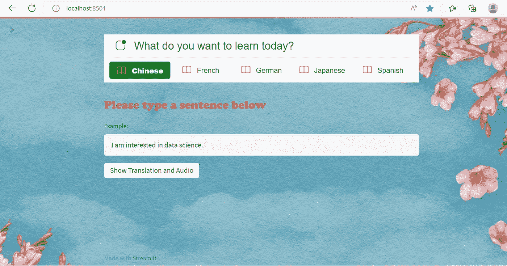
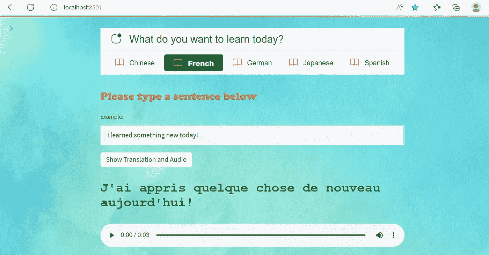

# 如何向您的 Streamlit 应用程序添加背景图像

> 原文：<https://levelup.gitconnected.com/how-to-add-a-background-image-to-your-streamlit-app-96001e0377b2>

## 从图像的 URL 或您的本地计算机——学习两种方法


图片来自 [Pixabay](https://pixabay.com/vectors/landscape-nature-mountain-field-1606431/) 的 [DavidRockDesign](https://pixabay.com/users/davidrockdesign-2595351/?utm_source=link-attribution&utm_medium=referral&utm_campaign=image&utm_content=1606431)

我喜欢在业余时间开发 Streamlit 应用程序，既是为了学习，也是为了娱乐。Streamlit 是一个趋势性的全 python 框架，它允许像我这样的数据科学家、程序员或任何知道如何用 python 编码的人快速轻松地构建漂亮的机器学习和数据应用程序。使用 Streamlit 构建 web 应用不需要有前端 web 开发经验。如果你对 python 相当精通，你就可以开始了！

在今天的帖子中，我将向您展示如何从 URL 或您的本地计算机向 Streamlit 应用程序添加背景图像。在下面的[文章](https://towardsdatascience.com/create-a-simple-language-learning-app-using-streamlit-21d6ce1b68c)中，我们将使用“语言学习应用程序”进行演示，并看看如何给它添加背景图片。如果你已经建立了一个应用程序，你只需要简单地将今天文章中的代码片段插入到你的应用程序的 python 文件中，你的背景图片就会立即添加到你的应用程序中。

[](https://towardsdatascience.com/create-a-simple-language-learning-app-using-streamlit-21d6ce1b68c) [## 使用 Streamlit 创建简单的语言学习应用程序

### 如何使用 Streamlit 和 Googletrans 构建自己的语言翻译和学习应用程序

towardsdatascience.com](https://towardsdatascience.com/create-a-simple-language-learning-app-using-streamlit-21d6ce1b68c) 

作者提供的图片(背景图片由 [Pixabay](https://pixabay.com/illustrations/flower-clouds-heaven-4151900/) 提供)

要将背景图像添加到您的 Streamlit 应用程序中，您需要将`st.markdown()`与 CSS 结合使用。好吧，我知道我之前说过，你不需要有任何前端 web 开发经验来构建一个 Streamlit 应用程序。在这个用例中，我们确实需要应用一点 HTML/CSS 知识来完成工作。

那么什么是 CSS 呢？CSS 是级联样式表的缩写，是一种样式表语言，用于控制以 HTML 或 XML 等标记语言编写的网页的布局和样式。使用 CSS，你可以定义各种各样的网页样式，比如颜色、字体、文本大小、不同的 HTML 元素如何布局、使用什么样的背景图片等等。

例如，我们可以用 CSS `background-image`属性指定`<style>`元素中的背景图像。这个 HTML 元素由开始标签<样式>和结束标签</样式>标记。代码如下所示:

```
<style>
p {
 background-image: url(‘img_file.jpg’);
}
</style>
```

然后，我们将 HTML 元素作为一个字符串放在`st.markdown(body, unsafe_allow_html=False)`中。默认情况下，在`body`中找到的任何 HTML 标签都将被转义，因此被视为纯文本。然而，我们可以通过将`unsafe_allow_html` 参数设置为`False`来关闭这种行为。所以代码看起来会像这样:

```
st.markdown( f””” <style>
   p {
   background-image: url(‘img_file.jpg’);
   }
   </style> ”””, unsafe_allow_html=True)
```

好的。我希望你现在明白了什么是 CSS，以及使用`st.markdown()`在 HTML 元素上指定背景图片的基本代码片段。让我们看看如何使用 CSS 将背景图片插入“语言学习”Streamlit 应用程序。

## 选项 1:从 URL 添加背景图像

从 URL 添加背景图片非常简单。让我们首先定义一个名为`add_bg_from_url()`的函数来指定`st.markdown()`内`style`元素中的背景图像。然后，我们只需调用函数`add_bg_from_url()`将背景图片添加到“语言学习”应用程序中。

注意，我们还将`background-size`属性设置为`cover`。这样，背景图像将覆盖整个元素。我们还将`background-attachment`属性设置为`fixed`，这样整个元素总是被覆盖，没有拉伸——这意味着图像将保持其原始比例。

## 选项 2:从您的计算机添加背景图像

从你的本地计算机添加背景图片有点棘手。首先，需要将图像文件与应用程序的 python 文件放在同一个文件夹中。接下来，您需要使用`b64.encode`(第 3–4 行)将图像文件转换成一个`base64`字符串。之后，您使用`.decode()`解码将在 HTML 元素中使用的`base64 string`(第 7 行),并将所有内容放入`background-image`属性中。

下面的代码也适用于其他图像文件类型，如 JPG 或 GIF。只需将第 9 行中的“png”改为“jpg”或“gif”就可以了！试试看！



作者提供的图片(背景图片由 [Pixabay](https://pixabay.com/illustrations/texture-background-soft-blue-light-1668079/) 提供)

这就对了。我们已经成功地将背景图片添加到“语言学习”Streamlit 应用程序中。感谢阅读。我希望你喜欢这篇关于 Streamlit 的短文，并且今天学到了一些新东西！要了解更多关于 Streamlit 的信息，请查看我的 [Medium 博客](https://medium.com/@insightsbees)，获取各种 Streamlit 应用示例的完整列表。

你可以通过这个[推荐链接](https://medium.com/@insightsbees/membership)注册 Medium 会员(每月 5 美元)来获得我的作品和 Medium 的其他内容。通过这个链接注册，我将收到你的会员费的一部分，不需要你额外付费。谢谢大家！

# 分级编码

感谢您成为我们社区的一员！更多内容请参见[升级编码出版物](https://levelup.gitconnected.com/)。
跟随:[推特](https://twitter.com/gitconnected)，[领英](https://www.linkedin.com/company/gitconnected)，[通迅](https://newsletter.levelup.dev/)
**升一级正在转型的理工大招聘➡️** [**加入我们的人才集体**](https://jobs.levelup.dev/talent/welcome?referral=true)